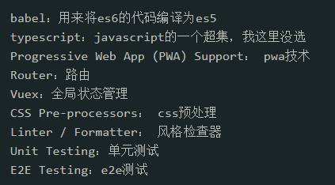
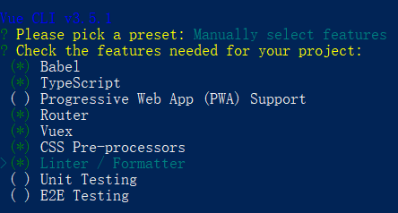
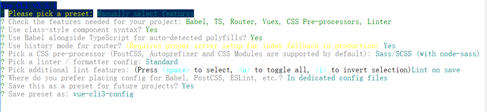
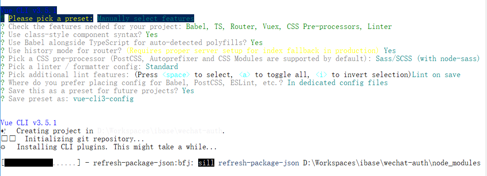
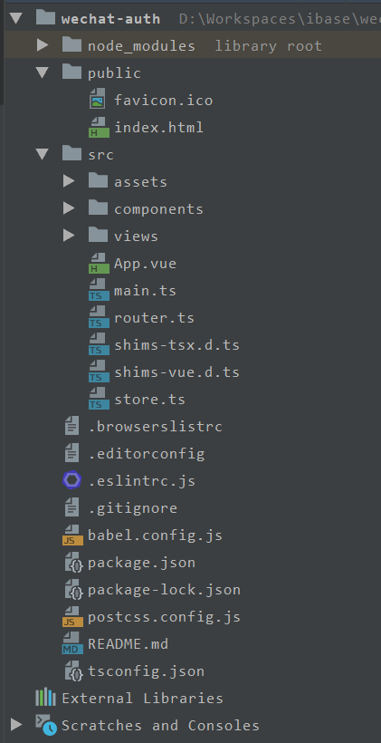

# vue-cli3项目重构

	将Vue项目使用vue - cli3脚手架重构

## 项目细节

* 技术栈

	Vue + Vue - Cli3 + Webpack + Vue - router + Vuex + Vant - UI

## Vue-Cli3.0创建项目

1. 安装完Vue-Cli3.0

	cnpm install - g @vue / cli

2. 开始安装项目

	vue create wechat - auth

3. 自定义配置， 根据项目选择配置

* 可选项



* 参考选择



* 二级选择



4. 选择完后就会安装项目及其依赖

* 等待完成



5. 安装完后， 就可以看到3.0的项目结构

* 不同于2.0的结构



6. 然后npm run serve运行查看

**安装成功表示**

```bash
# 浏览器打开
localhost:3000
# 默认端口：3000
```

> [参考安装1](https://www.cnblogs.com/qq1272850043/p/9812421.html) | [参考安装2](https://blog.csdn.net/qq_36407748/article/details/80739787)

## 安装完后配置vue.config.js

	这个是Vue - cli3的主要配置文件， 所有的webpack相关配置都在这里进行配置， 而且使用脚手架vue - cli3安装已经内置了部分webpack配置， 所以我们只需要配置部分细节问题就行

#### vue.config.js参考介绍

```js
module.exports = {
    // 基本路径
    baseUrl: '/',
    // 输出文件目录
    outputDir: 'dist',
    // eslint-loader 是否在保存的时候检查
    lintOnSave: true,
    // use the full build with in-browser compiler?
    // https://vuejs.org/v2/guide/installation.html#Runtime-Compiler-vs-Runtime-only
    compiler: false,
    // webpack配置
    // see https://github.com/vuejs/vue-cli/blob/dev/docs/webpack.md
    chainWebpack: () => {},
    configureWebpack: () => {},
    // vue-loader 配置项
    // https://vue-loader.vuejs.org/en/options.html
    vueLoader: {},
    // 生产环境是否生成 sourceMap 文件
    productionSourceMap: true,
    // css相关配置
    css: {
        // 是否使用css分离插件 ExtractTextPlugin
        extract: true,
        // 开启 CSS source maps?
        sourceMap: false,
        // css预设器配置项
        loaderOptions: {},
        // 启用 CSS modules for all css / pre-processor files.
        modules: false
    },
    // use thread-loader for babel & TS in production build
    // enabled by default if the machine has more than 1 cores
    parallel: require('os').cpus().length > 1,
    // 是否启用dll
    // See https://github.com/vuejs/vue-cli/blob/dev/docs/cli-service.md#dll-mode
    dll: false,
    // PWA 插件相关配置
    // see https://github.com/vuejs/vue-cli/tree/dev/packages/%40vue/cli-plugin-pwa
    pwa: {},
    // webpack-dev-server 相关配置
    devServer: {
        open: process.platform === 'darwin',
        host: '0.0.0.0',
        port: 8080,
        https: false,
        hotOnly: false,
        proxy: null, // 设置代理
        before: app => {}
    },
    // 第三方插件配置
    pluginOptions: {
        // ...
    }
}
```

> [参考配置](https://juejin.im/post/5bd02f98e51d457a944b634f)

## 移植项目

	将原有项目代码和静态资源全部粘贴过来，路径不变

#### 静态文件路径变更

	vue-cli3将所有静态资源都放在public中，原来是放在static的，所以需要更改下静态资源路径

> 这里基本不用改啥，正常都能运行

## 优化打包编译

	因为原先的webpack配置不能用了，所以要参考部分内容，将需要的配置在vue.config.js重新配起来，并且实现项目优化

#### 使用uglifyjs-webpack-plugin压缩js

* 作用分析

	* 压缩作用
		
		* 去除空格和注释，移除console和debugger

		```js
		// 压缩：去除空格注释
		new UglifyJSPlugin({
			uglifyOptions: {
				output: {
					comments: false
				},
				compress: {
					warnings: false,
					drop_debugger: true,
					drop_console: true,
					pure_funcs: ['console.log'] // 移除console
				}
			}
		}),
		```

	* 问题

		* 单线程压缩，需要一个一个js文件压缩
		
			所以说在正式环境打包压缩代码速度非常慢(因为压缩JS代码需要先把代码解析成用Object抽象表示的AST语法树，再去应用各种规则分析和处理AST，导致这个过程耗时非常大)。
	
	* 优化

		* ParallelUglifyPlugin优化压缩
		
			当webpack有多个JS文件需要输出和压缩时候，原来会使用UglifyJS去一个个压缩并且输出，但是ParallelUglifyPlugin插件则会开启多个子进程，把对多个文件压缩的工作分别给多个子进程去完成，但是每个子进程还是通过UglifyJS去压缩代码。无非就是变成了并行处理该压缩了，并行处理多个子任
			务，效率会更加的提高。

* 压缩分析

	使用chrome控制台比较可以看出，压缩大小不是很大，但是处理时间也是节省了一百多ms
	不过刷新过后发现这时间也是有时比较快，所以分析还得更多是数据，或者同等稳定的环境，本地分析会出现浏览器或内存存在区别的问题，这样两次运行的环境就不一样，得出结果也就不稳定了

#### 使用ParallelUglifyPlugin优化压缩

* 压缩分析

	使用chrome开发者工具测试后发现有压缩当然明显比没压缩快，但是使用这个优化总体跟uglifyjs差不多，看不出明显区别，获取js越多越能看出效果

**参考使用**

```js
// 使用 ParallelUglifyPlugin 并行压缩输出的 JS 代码
new ParallelUglifyPlugin({
	// 传递给 UglifyJS 的参数
	uglifyJS: {
		output: {
			// 最紧凑的输出
			beautify: false,
			// 删除所有的注释
			comments: false,
		},
		compress: {
			// 在UglifyJs删除没有用到的代码时不输出警告
			warnings: false,
			// 删除所有的 `console` 语句，可以兼容ie浏览器
			drop_console: true,
			// 内嵌定义了但是只用到一次的变量
			collapse_vars: true,
			// 提取出出现多次但是没有定义成变量去引用的静态值
			reduce_vars: true,
		}
	},
}),
```

* 在通过 new ParallelUglifyPlugin() 实例化时，支持以下参数：
test：使用正则去匹配哪些文件需要被 ParallelUglifyPlugin 压缩，默认是 /.js$/，也就是默认压缩所有的 .js 文件。
include：使用正则去命中需要被 ParallelUglifyPlugin 压缩的文件。默认为 []。
exclude：使用正则去命中不需要被 ParallelUglifyPlugin 压缩的文件。默认为 []。
cacheDir：缓存压缩后的结果，下次遇到一样的输入时直接从缓存中获取压缩后的结果并返回。cacheDir 用于配置缓存存放的目录路径。默认不会缓存，想开启缓存请设置一个目录路径。
workerCount：开启几个子进程去并发的执行压缩。默认是当前运行电脑的 CPU 核数减去1。
sourceMap：是否输出 Source Map，这会导致压缩过程变慢。
uglifyJS：用于压缩 ES5 代码时的配置，Object 类型，直接透传给 UglifyJS 的参数。
uglifyES：用于压缩 ES6 代码时的配置，Object 类型，直接透传给 UglifyES 的参数。
其中的 test、include、exclude 与配置 Loader 时的思想和用法一样。
UglifyES 是 UglifyJS 的变种，专门用于压缩 ES6 代码，它们两都出自于同一个项目，并且它们两不能同时使用。
UglifyES 一般用于给比较新的 JavaScript 运行环境压缩代码，例如用于 ReactNative 的代码运行在兼容性较好的 JavaScriptCore 引擎中，为了得到更好的性能和尺寸，采用 UglifyES 压缩效果会更好。
ParallelUglifyPlugin 同时内置了 UglifyJS 和 UglifyES，也就是说 ParallelUglifyPlugin 支持并行压缩 ES6 代码。
接入 ParallelUglifyPlugin 后，项目需要安装新的依赖：
npm i -D webpack-parallel-uglify-plugin
安装成功后，重新执行构建你会发现速度变快了许多。如果设置 cacheDir 开启了缓存，在之后的构建中会变的更快。
https://www.cnblogs.com/tugenhua0707/p/9569762.html


#### 将每个依赖包打包成单独的js文件

```js
let optimization = {
	runtimeChunk: 'single',
	splitChunks: {
		chunks: 'all',
		maxInitialRequests: Infinity,
		minSize: 20000,
		cacheGroups: {
			vendor: {
				test: /[\\/]node_modules[\\/]/,
				name (module) {
					// get the name. E.g. node_modules/packageName/not/this/part.js
					// or node_modules/packageName
					const packageName = module.context.match(/[\\/]node_modules[\\/](.*?)([\\/]|$)/)[1];
					// npm package names are URL-safe, but some servers don't like @ symbols
					return `npm.${packageName.replace('@', '')}`;
				}
			}
		}
	},
};
Object.assign(config, {
	optimization
});
```

#### 使用optimize-css-assets-webpack-plugin配合mini-css-extract-plugin压缩CSS

* 压缩前后分析

	使用chrome开发者工具查看总体明显快了几十ms，有比没有好

```js
// mini-css-extract-plugin 配置
new MiniCssExtractPlugin({
	filename: './css/[name].css',
	chunkFilename: './css/[id].css'
}),

new OptimizeCSSAssetsPlugin(),
```

**CSS相关配置**

```js
// css相关配置
css: {
	// 是否使用css分离插件 生产环境下是true，开发环境下是false，如果项目样式很小就无需开启
	extract: env_prod,
	// 开启 CSS source maps?
	sourceMap: false,
	// css预设器配置项
	loaderOptions: {
		less: {
			test: /\.less$/,
			loader: 'style-loader!css-loader!less-loader',
		},
	},
	// 启用 CSS modules for all css / pre-processor files.
	modules: false
},
```

#### cssnano：CSS压缩

	这个跟image打包差不多，还是要考虑项目样式大小，如果css样式比较大可以考虑使用

```js
configureWebpack: config => {
	new OptimizeCSSAssetsPlugin({
		cssProcessor: require('cssnano'),   // css 压缩优化器
		cssProcessorOptions: { discardComments: { removeAll: true } } // 去除所有注释
	}),
}
```

#### image压缩

	这个如需项目图片比较多可以选择配上去

```js
chainWebpack: config => {
	config.module
		.rule("image-webpack-loader")
		.test(/\.(gif|png|jpe?g|svg)$/i)
		.use("file-loader")
		.loader("image-webpack-loader")
		.tap(() => ({
			disable: !env_build
		}))
		.end();
}
```

#### 开启Gzip压缩

```js
configureWebpack: config => {
	// 开启Gzip压缩
	new CompressionWebpackPlugin({
		filename: '[path].gz[query]',
		algorithm: 'gzip',
		test: /\.(js|css|html)(\?.*)?$/i,
		threshold: 10240,
		minRatio: 0.8
	})
}
```

!> 正常cli3有默认Gzip压缩，所以无需特别配置

#### webpack打包分析

	这个研究项目优化和webpack打包的开发者正常都会选择使用，看看各个资源打包情况

```js
chainWebpack: config => {
	config.plugin('webpack-bundle-analyzer')
		.use(require('webpack-bundle-analyzer').BundleAnalyzerPlugin);
}
```

#### 总结

	像这样压缩还是1.5s以上，平均2分钟左右，甚至会出现3s的情况。所以还需要使用按需加载或懒加载等手段优化

## 项目优化

1. 按需加载

	这样将一些UI或特定文件才需要的资源，使用按需加载，即将main.js中一些全局安装的去掉，在需要使用的页面才进行加载，这样能提高首屏渲染时间

2. 路由懒加载

	这样也算是按需加载


## 具体配置参考

```js
// vue.config.ts 配置说明

const path = require('path');

const ParallelUglifyPlugin = require('webpack-parallel-uglify-plugin');
const MiniCssExtractPlugin = require('mini-css-extract-plugin');
const OptimizeCSSAssetsPlugin = require('optimize-css-assets-webpack-plugin');

function resolve (dir) {
	return path.join(__dirname, dir);
}

// const env_analyz = process.env.IS_ANALYZ === 'analyz';
const env_build = process.env.NODE_ENV === 'production';

module.exports = {
	publicPath: '/pubWeb/public/weChatPublic/',
	// 打包后输出路径
	outputDir: 'dist/pubWeb/public/weChatPublic/',
	assetsDir: 'weChatPublic',
	// 保存时是不是用esLint-loader 来lint 代码
	lintOnSave: true,

	chainWebpack: config => {

		if (process.env.IS_ANALYZ === 'analyz') {
			config.plugin('webpack-bundle-analyzer')
				.use(require('webpack-bundle-analyzer').BundleAnalyzerPlugin);
		}

		if (env_build) {

			config.module
				.rule("image-webpack-loader")
				.test(/\.(gif|png|jpe?g|svg)$/i)
				.use("file-loader")
				.loader("image-webpack-loader")
				.tap(() => ({
					disable: !env_build
				}))
				.end();
		}

		config.output.filename('./js/[name].[hash].js').end();
		// 添加别名
		config.resolve.alias
			.set('@', resolve('src'))
			.set('assets', resolve('src/assets'))
			.set('public', resolve('public'))
			.set('vue$', 'vue/dist/vue.esm.js')

	},

	configureWebpack: config => {

		if (env_build) {
			// 为生产环境修改配置...
			plugins: [
				new MiniCssExtractPlugin({
					filename: './css/[name].[hash].css',
					chunkFilename: './css/[id].[hash].css'
				}),

				new OptimizeCSSAssetsPlugin(),

				// 使用 ParallelUglifyPlugin 并行压缩输出的 JS 代码
				new ParallelUglifyPlugin({
					// 传递给 UglifyJS 的参数
					uglifyJS: {
						output: {
							// 最紧凑的输出
							beautify: false,
							// 删除所有的注释
							comments: false,
						},
						compress: {
							// 在UglifyJs删除没有用到的代码时不输出警告
							warnings: false,
							// 删除所有的 `console` 语句，可以兼容ie浏览器
							drop_console: true,
							// 内嵌定义了但是只用到一次的变量
							collapse_vars: true,
							// 提取出出现多次但是没有定义成变量去引用的静态值
							reduce_vars: true,
						}
					},
				}),

			];
			// 将每个依赖包打包成单独的js文件
			let optimization = {
				runtimeChunk: 'single',
				splitChunks: {
					chunks: 'all',
					maxInitialRequests: Infinity,
					minSize: 20000,
					cacheGroups: {
						vendor: {
							test: /[\\/]node_modules[\\/]/,
							name (module) {
								// get the name. E.g. node_modules/packageName/not/this/part.js
								// or node_modules/packageName
								const packageName = module.context.match(/[\\/]node_modules[\\/](.*?)([\\/]|$)/)[1];
								// npm package names are URL-safe, but some servers don't like @ symbols
								return `npm.${packageName.replace('@', '')}`;
							}
						}
					}
				},
			};
			Object.assign(config, {
				optimization
			});
		} else {
			// 为开发环境修改配置...
			plugins: [
				new MiniCssExtractPlugin({
					filename: './css/[name].css',
					chunkFilename: './css/[id].css'
				}),
			];
		}

	},
	productionSourceMap: false,
	// css相关配置
	css: {
		// 是否使用css分离插件 生产环境下是true,开发环境下是false
		extract: env_build,
		// 开启 CSS source maps?
		sourceMap: false,
		// css预设器配置项
		loaderOptions: {
			less: {
				test: /\.less$/,
				loader: 'style-loader!css-loader!less-loader',
			},
		},
		// 启用 CSS modules for all css / pre-processor files.
		modules: false
	},

	devServer: { // 配置服务器
		host: '0.0.0.0',
		port: 3000, // 端口号
		https: false,
		compress: true,
		open: true, // 配置自动启动浏览器
		hotOnly: true
	},
};
```
