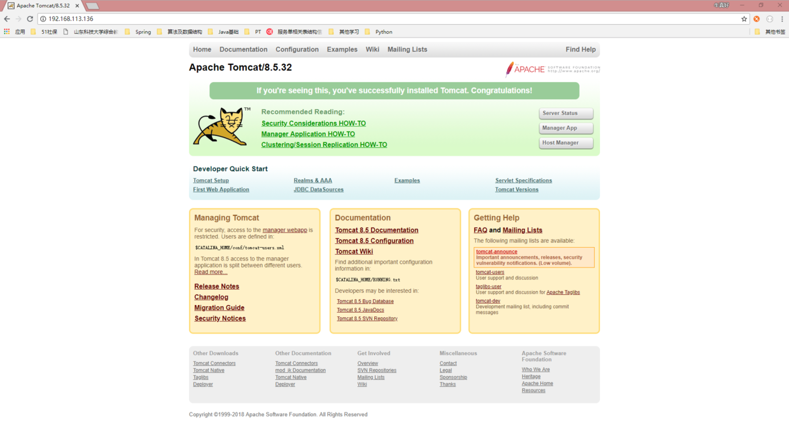
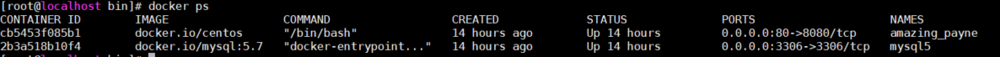
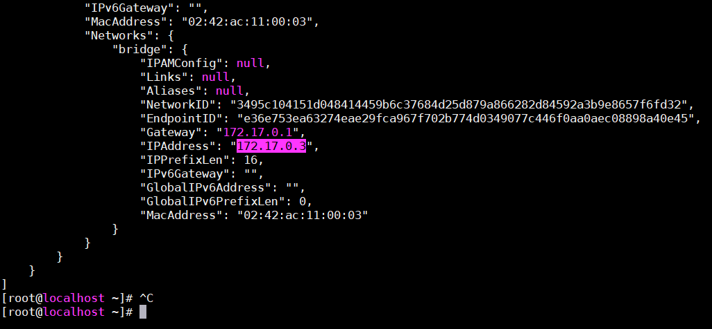

# 部署JavaWeb项目

> [docker基础](知识笔记/工具/虚拟机/docker/docker基础.md)

## 使用CentOS镜像安装tomcat，jdk1.8部署Java web项目

#### docker安装centOS镜像

1. docker pull centos获取centos镜像

2. 后台运行centos镜像并开放8080端口，window端可通过访问80端口访问到8080端口

```bash
docker run -itd -p 80:8080 docker.io/centos
```

3. 从宿主机拷贝文件到容器

*拷贝方式*

```bash
docker cp 宿主机中要拷贝的文件名及其路径 容器名：要拷贝到容器里面对应的路径
```

*例如*

```bash
1. 将宿主机中路径：/opt/test/下的文件：jdk
2. 拷贝到容器：mycontainer的：/niu
```

路径下，同样还是在宿主机中执行命令如下

```bash
docker cp /opt/doc mycontainer:/niu
```

#### 安装JDK

1. 解压jdk

```bash
tar -xzvf jdk1.8.tar.gz
```

2. 安装vim

```bash
yum -y install vim
```

3. 设置环境变量

```bash
vim ~/.bashrc

#set oracle jdk environment
export JAVA_HOME=/usr/lib/jvm/jdk1.8.0_121  ## 这里要注意目录要换成自己解压的jdk 目录
export JRE_HOME=${JAVA_HOME}/jre
export CLASSPATH=.:${JAVA_HOME}/lib:${JRE_HOME}/lib
export PATH=${JAVA_HOME}/bin:$PATH
```

4. 使环境变量生效

```bash
source ~/.bashrc
```

5. 验证jdk

```bash
java -version
```

6. 保存镜像

```bash
docker commit -m "tomcat & jdk" zwt
```

7. 开启tomcat，访问服务器IP:80如下便运行成功

/niu/tomcat/bin/startup.sh



#### 安装mysql

1. 查看正在运行的docker

docker ps



2. 安装mysql

> [mysql安装](开发积累/docker/mysql部署.md)

```bash
docker run --name mysql -p 3306:3306 -e MYSQL_ROOT_PASSWORD=123456 -d docker.io/mysql:5.7
```
*命令解析*

|参数|说明|
|:---:|:---:|
|--name|容器名|
|-p|端口设置 前面的是linux的端口，后面的是docker的端口|
|-e|设置数据库密码|
|-d|后台运行|

3. 必须修改%的root密码，要不然非localhost无法连接该数据库

```bash
ALTER USER 'root'@'%' IDENTIFIED WITH mysql_native_password BY 'newpassword'
```

4. 查看mysql镜像的ip

```bash
docker inspect  + 容器id
```

同时修改jdbc.properties


5. 然后将war包复制到tomcat的webapps下面

```bash
docker cp /root/SuperMarket.war cb5453f085b1:/niu/tomcat/webapps
```

6. 验证成功

	浏览器访问：服务器IP/SuperMarket
	显示java web项目首页
