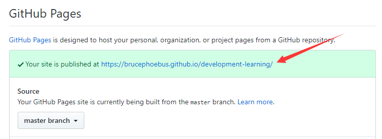

# github部署在线文档

	指将静态网页项目源码放到github中，然后使用github page功能，让我们可以通过github在线访问我们的项目，而不需要弄一个自己的服务器，这样弄自己的博客或docsify等静态项目非常方便，零成本

## 本项目部署到github

> [git基础和使用](知识笔记/工具/版本控制/Git/git基础和使用.md) | [docsify安装及基本使用](开发积累/docsify/docsify安装及基本使用.md)

#### 流程

> 进入项目页-->进入setting页-->下拉到GitHub Pages位置-->在Source处选中项目分支-->访问GitHub Pages位置给出的url地址，这就是所选项目分支的GitHub Pages在线地址

#### 具体

1. 在github中点进去我们的项目

> 建议使用docsify框架的项目，因为真的很简单

2. 进入setting，然后往下拉，找到GitHub Pages位置

3. 在Source处，下拉框中选择项目分支，这是展示指定分支的项目内容

4. 访问GitHub Pages位置给出的url地址，这就是所选项目分支的GitHub Pages在线地址

