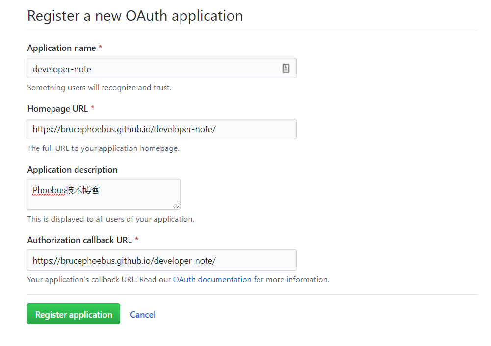
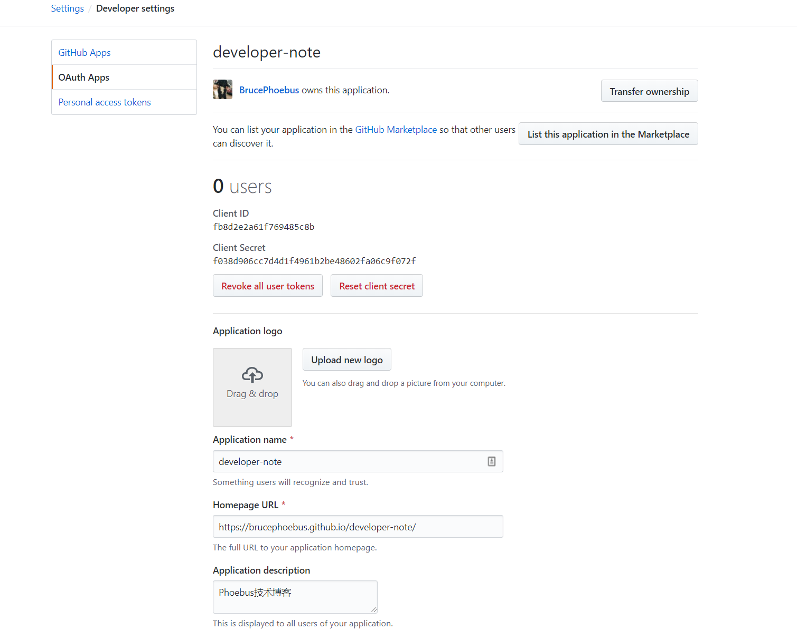
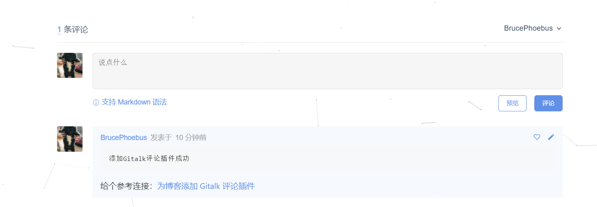

<!--
 * @Description: 为博客添加 Gitalk 评论插件
 * @Date: 2019-09-04 15:17:58
 * @LastEditors: phoebus
 * @LastEditTime: 2019-09-15 03:01:08
 -->
# 为博客添加 Gitalk 评论插件

> [Gitalk官网](https://gitalk.github.io) | [gitalk github说明](https://github.com/gitalk/gitalk/blob/master/readme-cn.md)

## 添加插件大致流程

1. 首先你要有个github项目，也就是你的博客项目(一般来说你已经挂在github page上火服务器)

2. 添加`Gitalk`插件配置

3. 补完配置信息。

	Gitalk插件配置中有github相关账户信息需要注册填写

## 具体操作

#### 1. 在项目中添加插件

* 我这里是`docsify`搭的博客，直接在`index.html`中添加配置代码即可、

	意思hexo等其他博客搭的应该也差不多，都是直接在首页入口处添加

``` html
<link rel="stylesheet" href="//unpkg.com/gitalk/dist/gitalk.css">
<script src="//unpkg.com/docsify/lib/plugins/gitalk.min.js"></script>
<script src="//unpkg.com/gitalk/dist/gitalk.min.js"></script>
<script>
	const gitalk = new Gitalk({
		// 这个需要在github上申请一个OAuth application
		clientID: 'fb8d2e2a61f769485c8b',	// GitHub Application Client ID
		clientSecret: 'f038d906cc7d4d1f4961b2be48602fa06c9f072f',	// GitHub Application Client Secret
		repo: 'developer-note',	// //存储你评论 issue 的 Github 仓库名
		owner: 'BrucePhoebus',
		admin: ['BrucePhoebus'],	// 这个仓库的管理员
		distractionFreeMode: true,	// 是否添加全屏遮罩
		id: window.location.pathname	// 页面的唯一标识，gitalk 会根据这个标识自动创建的issue的标签,我们使用页面的相对路径作为标识
	})
	gitalk.render('gitalk-container');    // 渲染Gitalk评论组件
</script>
```

#### 2. 申请一个OAuth application

	GitHub OAuth application允许程序来操作我们的github账户，可以对github中仓库读写

**申请GitHub OAuth application流程：**

1. 打开github网站登陆后，点击右上角的用户图标，选择Settings
2. 在Settings页面选择Developer settings选项。
3. 在Developer settings选择OAuth Apps,然后会在页面右边有一个New OAuth App按钮，点击这个按钮就进入到新建OAuth application页面
4. [快速通道](https://github.com/settings/applications/new)

**在注册OAuth应用页面需要填写的信息**

* Application name：必填，OAuth的名字

* Homepage URL：必填，我们应用的网址，哪个网站用了Gitalk组件，就填写这个网址(在线地址)

* Application description：选填，该OAuth的说明

* Authorization callback URL：必填，授权成功后回调网址，跟Homepage URL参数保持一致就好

> 注：这些参数在注册成功后是可以修改。



* 参数填好后，点Register application按钮即可完成注册

* 然后就调转到成功页面，直接复制页面的`Client ID`和`Client Secret`即可，有需要以后在来改



> 然后占到页面位置就能用了，我放到页面尾部，给个图看效果：



> [本项目中使用](https://github.com/BrucePhoebus/developer-note/blob/master/index.html)

**最后说明下`Gitalk配置`**

``` js
const gitalk = new Gitalk({
	// 这个需要在github上申请一个OAuth application
	clientID: 'fb8d2e2a61f769485c8b',	// GitHub Application Client ID
	clientSecret: 'f038d906cc7d4d1f4961b2be48602fa06c9f072f',	// GitHub Application Client Secret
	repo: 'developer-note',	// //存储你评论 issue 的 Github 仓库名
	owner: 'BrucePhoebus',
	admin: ['BrucePhoebus'],	// 这个仓库的管理员
	distractionFreeMode: true,	// 是否添加全屏遮罩
	id: window.location.pathname	// 页面的唯一标识，gitalk 会根据这个标识自动创建的issue的标签,我们使用页面的相对路径作为标识
})

// 监听URL中hash的变化，如果发现换了一个MD文件，那么刷新页面，解决整个网站使用一个gitalk评论issues的问题。
window.onhashchange = function (event) {
	if (event.newURL.split('?')[0] !== event.oldURL.split('?')[0]) {
		location.reload()
	}
}
```

* 有注释就很明显了，看主要参数说明：

	* clientID

		类型：字符串，必填，申请的OAuth App的Client ID
	
	* clientSecret

		类型：字符串，必填，申请的OAuth App的Client Secret
	
	* repo

		类型：字符串，必填，github上的仓库名字，用于存放Gitalk评论
	
	* owner

		类型：字符串，必填，github仓库的所有者的名字
	
	* admin

		类型：数组(元素是字符串)，必填，github仓库的所有者和合作者 (对这个 repository 有写权限的用户)
	
	* id

		类型：字符串，选填，页面的唯一标识。长度必须小于50。此参数用于评论和页面对应的标识，如果想让两个页面用一个评论，可设置两个页面的id一样。默认值：location.href(页面URL)
	
	* title

		类型：字符串，选填，GitHub issue 的标题，默认值：document.title(HTML中title标签中的值)

*其他参数*

``` bash
number: 类型：数字，选填，页面的 issue ID 标识，若未定义number属性则会使用id进行定位。默认值：-1

labels：类型：数组，选填，GitHub issue 的标签，默认值：['Gitalk']

body：类型：字符串，选填， GitHub issue 的内容，默认值：URL + HTML中meta标签中description的值

language：类型：字符串，选填，设置语言，支持 [en, zh-CN, zh-TW]。默认值：navigator.language 或者 navigator.userLanguage

perPage：类型：数字，选填，每次加载的数据大小，最多 100。默认值：10

distractionFreeMode：类型：布尔值，选填，类似Facebook评论框的全屏遮罩效果。默认值：false 

pagerDirection：类型：字符串，选填，评论排序方式，last为按评论创建时间倒叙，first为按创建时间正序。默认值：last

createIssueManually：类型：布尔值，选填，如果当前页面没有相应的 issue 且登录的用户属于 admin，则会自动创建 issue。如果设置为 true，则显示一个初始化页面，创建 issue 需要点击 init 按钮。 默认值：false

proxy：类型：字符串，选填，GitHub oauth 请求到反向代理，为了支持 CORS。默认值:https://cors-anywhere.herokuapp.com/https://github.com/login/oauth/access_token

flipMoveOptions：类型：对象，选填，评论列表的动画。

enableHotKey：类型：布尔值，选填，启用快捷键(cmd/ctrl + enter)提交评论。默认值：true
```

## 遇到的问题

#### gitalk is no defined

**问题分析**

* 这个意思是`gitalk`没声明，没找到这个对象，也就是加载顺序出了问题，还没实例化就调用了

* 看了下`gitalk`这个调用，是`docsify.gitalk`文件导致的，也就是它在gitalk对象实例化之前就调用了，或者说gitalk实例化失败导致调用失败

**问题解决**

* 首先我使用同步加载了`插件`js文件，但是没啥卵用

* 然后使用测了下就是docsify加载问题，所以使用`延迟加载`，将实例化部分延迟加载，没啥用，`docsify`调用不到gitalk实例，导致评论没加载到页面上去(有些插件不能使用异步加载，不然docsify无法加载到页面上去)

* 捣鼓了一阵，其中还发现`window.location.hash.match(/#(.*?)([?]|$)/)`报错，实例化失败。。。然后发现可能是`gitalk`实例化失败导致`docsify`调用失败

* 所以将可能实例化失败的地方做了下处理，之后`docsify`就调用成功了╮(╯▽╰)╭

``` html
<script type="text/javascript" src="public/plugins/components/gitalk.min.js"></script>
<script type="text/javascript">
	const urlParam = window.location.hash.match(/#(.*?)([?]|$)/) || [];
	const gitalk = new Gitalk({
		clientID: 'fb8d2e2a61f769485c8b',
		clientSecret: 'f038d906cc7d4d1f4961b2be48602fa06c9f072f',
		repo: 'developer-note',	// //存储你评论 issue 的 Github 仓库名
		owner: 'BrucePhoebus',
		admin: ['BrucePhoebus'],	// 这个仓库的管理员
		title: decodeURI(urlParam.length > 0 ? urlParam[1] : 'phoebus博客')
			+ '问题',
		distractionFreeMode: false,	// 是否添加全屏遮罩
		// id: decodeURI(window.location.hash.match(/#(.*?)([?]|$)/)[1]),	// 页面的唯一标识，gitalk 会根据这个标识自动创建的issue的标签,我们使用页面的相对路径作为标识
		id: decodeURI(urlParam.length > 0 ? urlParam[1] : 'phoebus博客')
			+ '问题',
		enableHotKey: true,	// 提交评论快捷键(cmd/ctrl + enter) 
	})

	window.onhashchange = function (event) {
		if (event.newURL.split('?')[0] !== event.oldURL.split('?')[0]) {
			window.reload;
		}
	}
</script>
<script type="text/javascript" src="public/plugins/components/docsify.gitalk.js"></script>
```

> 把这部分放到页面body最后面就行，重点就是确保gitalk实例化成功

#### 生成的issue混乱问题

**问题分析**

* 生成的issue的位置乱七八糟，预估的id绑定错误的问题，每次生成issue的时候都是根据传入的唯一ID判断的、

* 但是经过多次测试发现，docsify因为路由管理，切换页面的时候是页面局部刷新，所以无法重新实例化gitalk，并且ID不会自动更新，也就是即使重新实例化也只会对应一个issue

**问题解决**

* 监听路由，当如有切换时刷新页面，使gitalk实例重新实例化，并且设置动态ID，也就是指定页面的标题等内容作为ID

> 注：ID长度不能超过50，也就是如果选用中文文章标题的话我们可以考虑使用MD5等加密，使标题长度限定50以下；如果超过会导致实例化失败

* 问题1：我们如何监听路由变化？

	1. 可以直接`window.onhashchange`监听url变化，如果变化就刷新页面，让gitalk重新实例化

	2. `docsify`有提供插件钩子函数`hook.doneEach`(不止这个)，可以在`plugins`中监听路由变化，当页面数据加载完后判断

``` js
window.$docsify = {
	plugins: [
		function (hook, vm) {
			hook.doneEach(function () {
				if (window.title_id !== window.location.hash.match(/#(.*?)([?]|$)/)[1]) {
					window.reload;
				}
				window.title_id = window.location.hash.match(/#(.*?)([?]|$)/)[1];
			})
		}
	]
}
```

* 问题2：我们如何动态更新gitalk ID，使每一篇文章都有对应的ID生成issue

	1. 基本是文章不变的标识并且ID长度不大于50字符就行

	2. 所以我这里直接使用MD5加密转成低于一定程度的ID长度，如果是空ID就统一放置一个issue

``` js
// title_id需要初始化
window.title_id = window.location.hash.match(/#(.*?)([?]|$)/) ? window.location.hash.match(/#(.*?)([?]|$)/)[1] : '/';
const gitalk = new Gitalk({
	clientID: 'fb8d2e2a61f769485c8b',
	clientSecret: 'f038d906cc7d4d1f4961b2be48602fa06c9f072f',
	repo: 'developer-note',	// //存储你评论 issue 的 Github 仓库名
	owner: 'BrucePhoebus',
	admin: ['BrucePhoebus'],	// 这个仓库的管理员
	title: decodeURI(window.title_id),
	distractionFreeMode: false,	// 是否添加全屏遮罩
	id: md5(window.location.hash),	// 页面的唯一标识，gitalk 会根据这个标识自动创建的issue的标签,我们使用页面的相对路径作为标识
	enableHotKey: true,	// 提交评论快捷键(cmd/ctrl + enter) 
})
```

> 虽然有时不会刷新，但是总体上还是可以达到大致的效果，具体有些页面切换刷新但是ID不变的问题还需要重新理解

## 最后

> [我的博客在线地址](https://brucephoebus.github.io/developer-note/#/%E5%BC%80%E5%8F%91%E7%A7%AF%E7%B4%AF/%E9%A1%B9%E7%9B%AE%E7%BB%8F%E9%AA%8C/%E5%8D%9A%E5%AE%A2/%E4%B8%BA%E5%8D%9A%E5%AE%A2%E6%B7%BB%E5%8A%A0Gitalk%E8%AF%84%E8%AE%BA%E6%8F%92%E4%BB%B6)

> 给个[自动初始化 Gitalk 和 Gitment 评论](https://link.jianshu.com/?t=https%3A%2F%2Fdraveness.me%2Fgit-comments-initialize)解决点开页面才会创建对应isuue的问题

> 参考：[为博客添加 Gitalk 评论插件](https://www.jianshu.com/p/78c64d07124d) | [Gitalk评论插件使用教程](https://segmentfault.com/a/1190000018072952)
