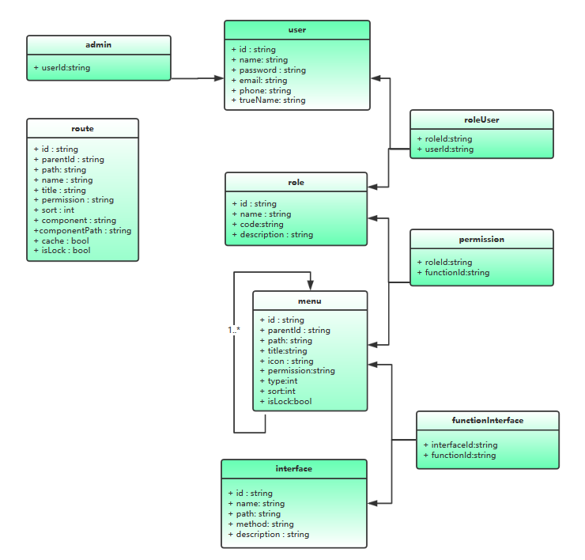

# D2Admin的RBAC权限管理

## 概述

#### 常用权限模型

* ACL(Access Control List)(访问控制列表)

* DAC(Discretionary Access Control)(自主访问控制)

* MAC(Mandatory Access Control)(强制访问控制)

* RBAC(Role-Based Access Control)(基于角色的访问控制)

* ABAC(Attribute-Based Access Control)(基于属性的访问控制)

#### 什么是RBAC权限管理？

	RBAC(Role-Based Access Control)(基于角色的访问控制)

> 参考：[常用权限模型](知识笔记/大前端/架构/权限模型/常用权限模型.md) | [深入浅出RBAC权限管理](知识笔记/大前端/架构/权限模型/深入浅出RBAC权限管理.md)

#### D2Admin的RBAC权限管理是这么样的？

**vuex实现数据持久化：permission模块权限管理**

	存储用户具备的功能权限码，角色编码，具备访问权限的接口以及是否管理员标识

``` js
export default {
    namespaced: true,
    state: {
        // 功能编码
        functions: [],
        // 角色编码
        roles: [],
        // 接口
        interfaces: {
            GET: [],
            POST: [],
            PUT: [],
            DELETE: []
        },
        // 是否管理员
        isAdmin: false
    },
    mutations: {
        set(state, data) {
            state.functions = data.functions;
            state.roles = data.roles;
            state.isAdmin = data.isAdmin;
            state.interfaces = data.interfaces;
        }
    }
}
```

> 实现数据持久化

``` js
// DB -> store 持久化数据加载上次退出时的多页列表
await dispatch('d2admin/page/openedLoad', null, { root: true })
```

**具体分析**

1. 权限管理模型图



* 实现了RBAC模型权限控制

* 菜单与路由独立管理，完全由后端返回

* user存储用户

* admin标识用户是否为系统管理员

* role存储角色信息

* roleUser存储用户与角色的关联关系

* menu存储菜单信息，类型分为菜单与功能，一个菜单下可以有多个功能，菜单类型的permission字段标识访问这个菜单需要的功能权限，功能类型的permission字段相当于此功能的别称，所以菜单类型的permission字段为其某个功能类型子节点的permission值

* permission存储角色与功能的关联关系

* interface存储接口信息

* functionInterface存储功能与接口关联关系，通过查找用户所属角色，再查找相关角色所具备的功能权限，再通过相关功能就可以查出用户所能访问的接口

* route存储前端路由信息，通过permission字段过滤出用户所能访问的路由

###### 流程

	使用D2Admin的原有登录逻辑：全局路由守卫中判断是否已经拉取权限信息，获取后标识为已获取

* 拉取权限信息逻辑

``` js
const token = util.cookies.get('token')
// 通过token验证用户是否已登陆
if (token && token !== 'undefined') {
    // 拉取权限信息
    if (!isFetchPermissionInfo) {
        await fetchPermissionInfo();
        isFetchPermissionInfo = true;
        next(to.path, true)
    } else {
        next()
    }
} else {
    // 将当前预计打开的页面完整地址临时存储 登录后继续跳转
    // 这个 cookie(redirect) 会在登录后自动删除
    util.cookies.set('redirect', to.fullPath)
    // 没有登录的时候跳转到登录界面
    next({
        name: 'login'
    })
}
```

> 这里验证用户已登陆并未拉取权限信息后，获取登陆用户的权限信息

* 拉取权限信息方法

``` js
// 标记是否已经拉取权限信息
let isFetchPermissionInfo = false

let fetchPermissionInfo = async () => {
    //处理动态添加的路由
    const formatRoutes = function(routes) {
        routes.forEach(route => {
            route.component = routerMapComponents[route.component]
            if (route.children) {
                formatRoutes(route.children)
            }
        })
    }
    try {
        let userPermissionInfo = await userService.getUserPermissionInfo()
        permissionMenu = userPermissionInfo.accessMenus
        permissionRouter = userPermissionInfo.accessRoutes
        permission.functions = userPermissionInfo.userPermissions
        permission.roles = userPermissionInfo.userRoles
        permission.interfaces = util.formatInterfaces(userPermissionInfo.accessInterfaces)
        permission.isAdmin = userPermissionInfo.isAdmin == 1
    } catch (ex) {
        console.log(ex)
    }
    formatRoutes(permissionRouter)
    let allMenuAside = [...menuAside, ...permissionMenu]
    let allMenuHeader = [...menuHeader, ...permissionMenu]
    // 动态添加路由
    router.addRoutes(permissionRouter);
    // 处理路由 得到每一级的路由设置
    store.commit('d2admin/page/init', [...frameInRoutes, ...permissionRouter])
    // 设置顶栏菜单
    store.commit('d2admin/menu/headerSet', allMenuHeader)
    // 设置侧边栏菜单
    store.commit('d2admin/menu/fullAsideSet', allMenuAside)
    // 初始化菜单搜索功能
    store.commit('d2admin/search/init', allMenuHeader)
    // 设置权限信息
    store.commit('d2admin/permission/set', permission)
    // 加载上次退出时的多页列表
    store.dispatch('d2admin/page/openedLoad')
    await Promise.resolve()
}
```

**后端需要返回的权限信息**

	包括权限过滤后的角色编码集合，功能编码集合，接口信息集合，菜单列表，路由列表，以及是否系统管理员标识

``` js
{
    "statusCode": 200,
    "msg": "",
    "data": {
        "userName": "MenuManager",
		// 用户角色
        "userRoles": [
            "R_MENUADMIN"
        ],
		// 用户权限
        "userPermissions": [
            "p_menu_view",
            "p_menu_edit",
            "p_menu_menu"
        ],
		// 权限菜单
        "accessMenus": [{
            "title": "系统",
            "path": "/system",
            "icon": "cogs",
            "children": [{
                    "title": "系统设置",
                    "icon": "cogs",
                    "children": [{
                        "title": "菜单管理",
                        "path": "/system/menu",
                        "icon": "th-list"
                    }]
                },
                {
                    "title": "组织架构",
                    "icon": "pie-chart",
                    "children": [{
                            "title": "部门管理",
                            "icon": "html5"
                        },
                        {
                            "title": "职位管理",
                            "icon": "opencart"
                        }
                    ]
                }
            ]
        }],
		// 路由列表
        "accessRoutes": [{
            "name": "System",
            "path": "/system",
            "component": "layoutHeaderAside",
            "componentPath": "layout/header-aside/layout",
            "meta": {
                "title": "系统设置",
                "cache": true
            },
            "children": [{
                    "name": "MenuPage",
                    "path": "/system/menu",
                    "component": "menu",
                    "componentPath": "pages/sys/menu/index",
                    "meta": {
                        "title": "菜单管理",
                        "cache": true
                    }
                },
                {
                    "name": "RoutePage",
                    "path": "/system/route",
                    "component": "route",
                    "componentPath": "pages/sys/route/index",
                    "meta": {
                        "title": "路由管理",
                        "cache": true
                    }
                },
                {
                    "name": "RolePage",
                    "path": "/system/role",
                    "component": "role",
                    "componentPath": "pages/sys/role/index",
                    "meta": {
                        "title": "角色管理",
                        "cache": true
                    }
                },
                {
                    "name": "UserPage",
                    "path": "/system/user",
                    "component": "user",
                    "componentPath": "pages/sys/user/index",
                    "meta": {
                        "title": "用户管理",
                        "cache": true
                    }
                },
                {
                    "name": "InterfacePage",
                    "path": "/system/interface",
                    "component": "interface",
                    "meta": {
                        "title": "接口管理"
                    }
                }
            ]
        }],
		// 接口信息
        "accessInterfaces": [{
                "path": "/menu/:id",
                "method": "get"
            },
            {
                "path": "/menu",
                "method": "get"
            },
            {
                "path": "/menu/save",
                "method": "post"
            },
            {
                "path": "/interface/paged",
                "method": "get"
            }
        ],
        "isAdmin": 0,
        "avatarUrl": "https://api.adorable.io/avatars/85/abott@adorable.png"
    }
}
```

* 设置菜单

	将固定菜单(/menu/header、/menu/aside)与后端返回的权限菜单(accessMenus)合并后，存入相应的 vuex store 模块中

``` js
// ...
let allMenuAside = [...menuAside, ...permissionMenu]
let allMenuHeader = [...menuHeader, ...permissionMenu]
// ...
// 设置顶栏菜单
store.commit('d2admin/menu/headerSet', allMenuHeader)
// 设置侧边栏菜单
store.commit('d2admin/menu/fullAsideSet', allMenuAside)
// 初始化菜单搜索功能
store.commit('d2admin/search/init', allMenuHeader)
```

* 处理路由

	默认使用 routerMapComponents 的方式处理后端返回的权限路由

``` js
//处理动态添加的路由
const formatRoutes = function (routes) {
    routes.forEach(route => {
        route.component = routerMapComponents[route.component]
        if (route.children) {
        	formatRoutes(route.children)
        }
    })
}
// ...
formatRoutes(permissionRouter)
//动态添加路由
router.addRoutes(permissionRouter);
// 处理路由 得到每一级的路由设置
store.commit('d2admin/page/init', [...frameInRoutes, ...permissionRouter])
```

* 设置权限信息

	将角色编码集合，功能编码集合，接口信息集合，以及是否系统管理员标识存入相应的vuex store模块中

``` js
// ...
permission.functions = userPermissionInfo.userPermissions
permission.roles = userPermissionInfo.userRoles
permission.interfaces = util.formatInterfaces(userPermissionInfo.accessInterfaces)
permission.isAdmin = userPermissionInfo.isAdmin == 1
// ...
// 设置权限信息
store.commit('d2admin/permission/set', permission)
```

* 接口权限控制以及loading配置

	可以使用角色编码，功能编码以及接口权限进行控制

``` js
export function getMenuList() {
    return request({
        url: '/menu',
        method: 'get',
		// true表示使用接口权限进行控制，如果vuex store中存储的接口信息与当前要请求的接口想匹配，则可发起请求，否则请求将被拦截
        interfaceCheck: true,
		// ["p_menu_view"]表示使用角色编码和功能编码进行权限校验，如果vuex store中存储的角色编码或功能编码与当前表示的编码相匹配，则可发起请求，否则请求将被拦截
        permission:["p_menu_view"],
        loading: {
            type: 'loading',
            options: {
                fullscreen: true,
                lock: true,
                text: '加载中...',
                spinner: 'el-icon-loading',
                background: 'rgba(0, 0, 0, 0.8)'
            }
        },
        success: {
            type: 'message',
            options: {
                message: '加载菜单成功',
                type: 'success'
            }
        }
    })
}
```

* 页面元素权限控制

*使用指令v-permission：*

	参数可为function、role，表明以功能编码或角色编码进行校验，为空则使用两者进行校验
	修饰符all，表示必须全部匹配指令值中所有的编码

``` js
 <el-button
    v-permission:function.all="['p_menu_edit']"
    type="primary"
    icon="el-icon-edit"
    size="mini"
    @click="batchEdit"
    >批量编辑</el-button>
```

*使用v-if+全局方法：*

	默认同时使用角色编码与功能编码进行校验，有一项匹配即可

``` js
<el-button
    v-if="canAdd"
    type="primary"
    icon="el-icon-circle-plus-outline"
    size="mini"
    @click="add"
    >添加</el-button>

data() {
	return {
		// 也可以直接在组件中从vuex store读取权限信息进行校验
		canAdd: this.hasPermissions(["p_menu_edit"])
	};
},
```

> 类似的方法：hasFunctions，hasRoles

#### 注意事项

* 页面级别的组件放到`pages/`目录下，并且在`routerMapComponents/index.js`中以`key-value`的形式导出

* 不需要权限控制的固定菜单放到`menu/aside.js`和`menu/header.js`中

* 不需要权限控制的路由放到`router/routes.js frameIn`内

* 需要权限控制的菜单与路由通过界面的管理功能进行添加，确保`菜单的path`与`路由的path`相对应，`路由的name`与`页面组件的name`一致才能使`keep-alive`生效，`路由的component`在`routerMapComponents/index.js`中能通过key匹配到

* 开发阶段菜单与路由的添加可由开发人员自行维护，并维护一份清单，上线后将清单交给相关的人去维护即可


参考：[企业管理系统前后端分离架构设计 系列一 权限模型篇](https://juejin.im/post/5b59c2956fb9a04faa79af6f) | [vue基于d2-admin的RBAC权限管理解决方案](https://www.jianshu.com/p/b1453aaa4294) | [Vue 前端应用实现RBAC权限控制的一种方式](https://juejin.im/post/5c19a282f265da61137f372c) | [前端如何配合后端完成RBAC权限控制](https://juejin.im/post/5c1f8d6c6fb9a049e06353aa)

