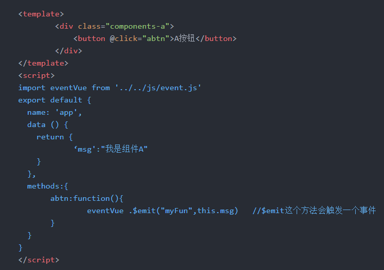

# Vue父子节点传值

## 简单父子组件传值

#### 父组件给子组件传值

###### 嵌入式子组件

	这种组件相当于父组件的一部分，这种组件我们可以在引用的时候进行传值，而子组件通过 props 属性接收

* 弹框组件示例

**引入组件**

```js
<create-tree-dialog :isShowDialog="isShowTreeDialog" :dialogTitle="'收件人列表'" :checkedNodeIdList="selectedList.selectedListId" 	
	:treeData="treeData" @confirmCallback="confirmCallback" @cancelCallback="cancelCallback"></create-tree-dialog>

import createTreeDialog from '../../util/createTreeDialog/createTreeDialog'

components: {
	createTreeDialog
},
```

> 这样就可以实现把`isShowTreeDialog`等一堆变量(数据)传递给子组件

**子组件接收**

```js
props:{
	treeData: {
		type: Array,
		default: () => []
	},
	dialogTitle: {
		type: String,
		default: ''
	},
	checkedNodeIdList: {
		type: Array,
		default: () => []
	},
	isShowDialog: {
		type: Boolean,
		default: false
	},
	isAppendToBody: {
		type: Boolean,
		default: false
	},
	modal: {
		type: Boolean,
		default: true
	},
	isShowCheckBox: {
		type: Boolean,
		default: true
	}
},
```

> 子组件通过`props`属性接收后就能直接使用，在方法中通过this引用，data属性中和template模版中则是直接使用

!> 当父组件的值发生改变，子组件的视图也会同步被更新。

> 当然，原则上不建议子组件直接修改父组件的值，但是可以通过[中转变量修改](开发积累/Vue/组件封装/树形弹框组件.md)，然后通过`$emit`通知父组件更改

###### 插件式子组件

	这种组件一般我们只能使用它暴露的方法，调用之后就只能修改子组件自己提供的功能，很难跟父组件形成交互，也就是子组件有什么功能就是啥功能，参考PDF预览插件

* pdf预览示例

```js
import pdf from '../../utils/pdf'
import Vue from 'vue'
Vue.use(pdf);

this.$showPDF({ data: 'data:application/pdf;base64,' + atob(response.cqxx) });	// 这里穿pdf或URL
```

> `$showPDF()`方法是pdf组件暴露出来的一个方法，让我们可以通过这个方法调用组件，但是执行调用之后，两个组件就没什么关系了，除非实现更多方法操作

> [参考：移动端pdf预览](开发积累/附件管理/pdf预览/移动端pdf预览.md)

## 兄弟组件传值

	原理是通过建立一个事件中转站eventVue，让兄弟组件使用同一个事件机制，当子组件A(数据传递方)通过eventVue.$emit()向外传递数据时，子组件B(数据接收方)通过eventVue.$on()接收兄弟组件传递过来的数据

#### 兄弟组件如何相互操作组件里面的函数？

1. 兄弟之间传递数据需要借助于事件车，通过事件车的方式传递数据
2. 创建一个Vue的实例，让各个兄弟共用同一个事件机制。
3. 传递数据方，通过一个事件触发bus.$emit(方法名，传递的数据)。
4. 接收数据方，通过mounted(){}触发bus.$on(方法名，function(接收数据的参数){用该组件的数据接收传递过来的数据})，此时函数中的this已经发生了改变，可以使用箭头函数。

#### 示例

**eventVue.js**

	创建一个单独的js文件eventVue.js，作为事件中转站存在

**父组件**

```js
<template>
	<a></a>
	<b></b>
</template>
```

**子组件A**

	子组件a通过eventVue.$emit()方法向其他兄弟传值




**子组件B**

	子组件b通过eventVue.$on()方法接收兄弟组件传过来的数据


#### 同样可以在main.js注册全局事件中转站

	这样就可以全局使用，当然大项目一般使用Vuex


