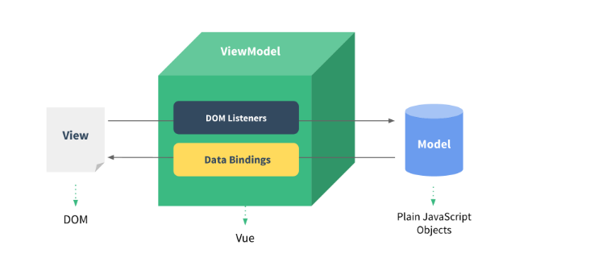

# Vue数据驱动

	一切变动的量都是变量，一切变量都以数据为驱动

	数据变则视图变，数据驱动视图

> 一般来说，Vue是作为展示数据的框架，也就是Vue一般会结合UI库将数据以一个交互比较好的形式展示处理，例如移动端有Vue+vant，PC端有Vue+Element-UI

> 所谓的数据驱动就是当数据发生变化的时候，用户界面发生相应的变化，开发者不需要手动的去修改DOM

## MVVM框架

	Vue的数据驱动是通过MVVM这种框架来实现的
	MVVM框架主要包含3个部分:Model、View和 ViewModel

* Model：指的是数据部分，对应到前端就是JavaScript对象

* View：指的是视图部分，对应前端就是DOM

* ViewModel：就是连接视图与数据的中间件

**分析**

	数据(Model)和视图(View)是不能直接通讯的，而是需要通过ViewModel来实现双方的通讯。

* 当数据变化的时候，ViewModel能够监听到这种变化，并及时的通知view做出修改。

* 同样的，当页面有事件触发时，ViewModel也能够监听到事件，并通知model进行响应。

> ViewModel就相当于一个观察者，监控着双方的动作，并及时通知对方进行相应的操作。

## Vue双向绑定原理

	1. Object.defineProperty实现数据劫持

	2. 观察者模式与发布/订阅模式

#### Object.defineProperty数据劫持

	这个相当于数据监听

* 对数据对象每个属性添加对应的`get`和`set`方法，对数据进行读取和赋值操作就分别调用`get`和`set`方法

#### Vue双向绑定原理图

1. `Object.defineProperty`数据劫持设置`get`和`set`方法用于监听数据

2. 为数据对象创建监听者，Watcher，当数据变更`set`时触发回调同步更新，更新绑定的数据，并更新视图

