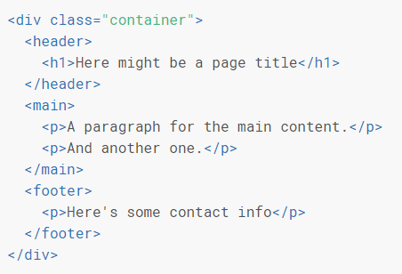
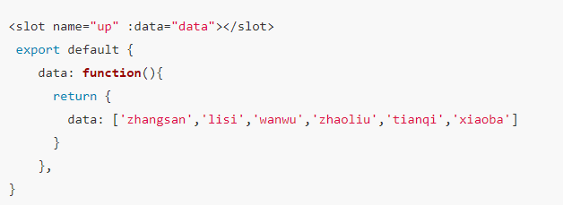

# slot使用场景和实现

## 概述

	插槽，也就是slot，是组件的一块HTML模板，这块模板显示不显示、以及怎样显示由父组件来决定。
	
	一个空壳子，一个坑

	我们可以让slot有一定默认值来显示，如果有传入数据，则根据传入的数据显示

#### 基础概念

	默认插槽与具名插槽
	插槽作用域

###### 默认插槽

	<slot />
	默认name=default（隐含的名字）

> 不写插槽名就是默认插槽，因为官方已经做了处理，默认存在一个name=default

###### 具名插槽

	<slot name="hello"/>
	用于区分多个插槽

> 写了name属性就是具名插槽，name的值会覆盖默认的default

* 使用方式一：<slot>

	<slot name="..."></slot>

```html
<div class="container">
	<header>
		<slot name="header"></slot>
	</header>
	<main>
		<slot></slot>
	</main>
	<footer>
		<slot name="footer"></slot>
	</footer>
</div>
```

> 这是留坑的方法，如果允许拓展，就可以这样留下slot插槽，在有需要的时候就可以控制显示隐藏一些DOM

* 使用方法二：v-slot

```html
<base-layout>
	<template v-slot:header>
		<h1>Here might be a page title</h1>
	</template>
	<p>A paragraph for the main content.</p>
	<p>And another one.</p>
	<template v-slot:footer>
		<p>Here's some contact info</p>
	</template>
</base-layout>
```

**渲染结果**



###### 插槽作用域

	插槽的编译作用域 | 作用域插槽 | 带数据的插槽 | slot-scope

	父级模板里的所有内容都是在父级作用域中编译的；子模板里的所有内容都是在子作用域中编译的

**表现**

	直接在slot上面绑定数据，由子组件编译，带着数据去父组件

> 子组件插槽绑定，带数据；父组件管理样式

**示例：子组件slot绑定数据**



> [参考示例](https://juejin.im/post/5a69ece0f265da3e5a5777ed?utm_source=gold_browser_extension)

**作用域插槽使用场景**

1. 别人写好了一个组件，该组件已经封装好了，但他觉得，数据的显示风格让用户自己定义。所以使用作用域插槽，这样显示的是处理后的数据

## slot使用场景

#### 第三方库使用插件

	我们经常会在第三方库中看到slot的使用，例如element-ui中弹框footer有slot，input控件有slot，基本多数控件都可以使用slot，因为人家在组件设计的时候就流了很多坑，专业点就叫插槽或接口，可以让我们自由组合一些控件


## 注意事项

1. 插槽不能嵌套

2. v-slot 只能添加在一个 <template> 上 (只有一种例外情况)

3. 只要出现多个插槽，始终为所有的插槽使用完整的基于 <template> 的语法
