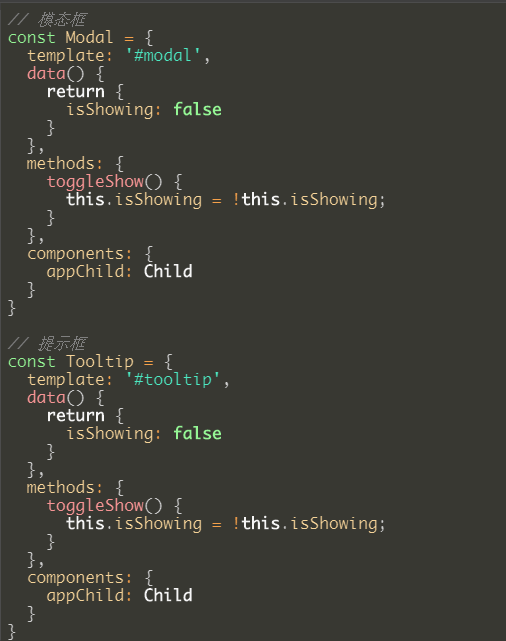
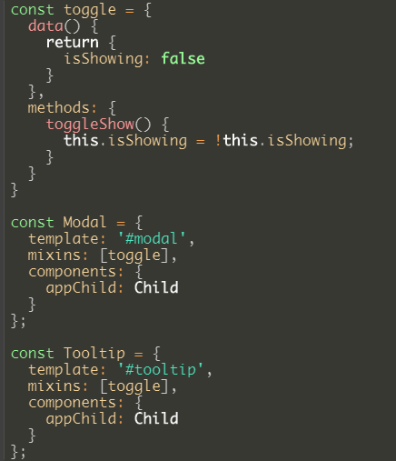
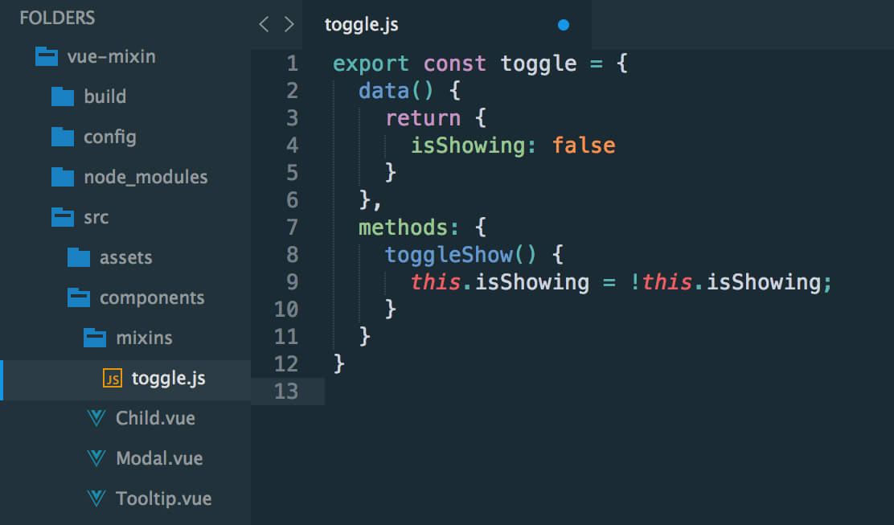
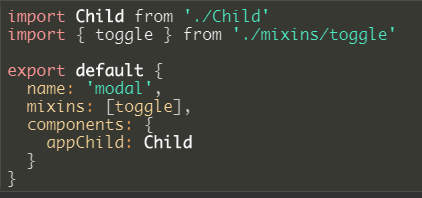

# mixin混入

## mixin基础

#### 概述

	混入 或 混合

* 这个库提供的装饰器，专门用于处理 vue 使用 mixin 的情况

* Mixin对于封装一小段想要复用的代码来讲是有用的。

**Mixin模式**

	mixin模式就是一些提供能够被一个或者一组子类简单继承功能的类，意在重用其功能

#### mixin的一些实现

**Less**

	允许我们将一个类嵌入到另一个类中，被嵌入的类也可以看作变量。换句话说，我们可以用一个类定义样式，然后把它当作变量，在另一个类中，只要引用变量的名字，就能使用它的所有属性

	Less把这种特性称作 mixin，中文把翻译为“混入”或“混合”，其目的就是从现有的样式中添加属性

## mixin常用场景和实现

用法1
普通实例

使用Mixin

用法2
创建个js（/ts）文件存放为使用Mixin我们需要输出的对象

然后在vue文件中这样引用

