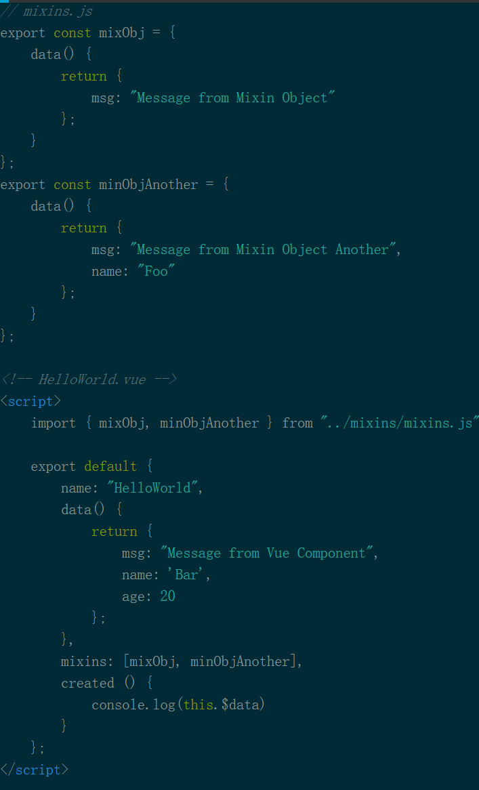

# mixin混入

## mixin基础

#### 概述

	混入 或 混合

* 这个库提供的装饰器，专门用于处理 vue 使用 mixin 的情况

* Mixin对于封装一小段想要复用的代码来讲是有用的。

**Mixin模式**

	mixin模式就是一些提供能够被一个或者一组子类简单继承功能的类，意在重用其功能

#### mixin的一些实现

**Less**

	允许我们将一个类嵌入到另一个类中，被嵌入的类也可以看作变量。换句话说，我们可以用一个类定义样式，然后把它当作变量，在另一个类中，只要引用变量的名字，就能使用它的所有属性

	Less把这种特性称作 mixin，中文把翻译为“混入”或“混合”，其目的就是从现有的样式中添加属性

## mixin常用场景和实现

#### 用法1：方法复用

**普通实例**

**使用Mixin**

#### 用法2：混入Vue

	创建个js（/ts）文件存放为使用Mixin我们需要输出的对象

**然后在vue文件中这样引用**

## mixin理解

1. 定义一部分公共的方法或者计算属性，然后混入到各个组件中使用，方便管理与统一修改

2. 即实现了继承方法，实现代码功能复用

3. 是对组件的补充，实现对功能函数的封装，可以当作一个子组件或插件使用

4. 他们不会改变函数作用域外部的任何东西，所以多次执行，只要是同样的输入，总是能得到一样的值。

5. 而且同样可以使用生命周期钩子函数

#### 合并选项和冲突

1. 当组件和混入对象含有同名选项时，这些选项将以恰当的方式混合

2. 先后顺序的问题

	默认是mixins上会首先被注册，组件上的接着注册！也就是组件优先级较高，可以实现重写

3. 混入时遇到同名方法却不知道哪个胜出时，怎么办？

	按传入顺序依次调用，mixins中的先执行，组件中的接着执行

#### 合并主要有三种情形

###### 数据data

	数据对象在内部分进行浅合并（一层属性深度），在和组件的数据发生冲突时，以组件数据优先。

> 最终的结果是：HelloWorld组件中的msg和name取替了mixin中的，另外age字段被合并进行。

###### 生命周期中的钩子函数

	当组件使用的mixins对象有相同的选项时，比如钩子函数，就会全部被合并到一个数组中，因此都会被执行，并且mixins`对象中的钩子会先被执行。

	也就是都会执行，只是按顺序优先级执行，mixins先执行

###### 值为对象的选项

	比如：methods、components和directives，将被混合为同一个对象。当两个对象键名冲突时，组件选项优先。
	
	也就是同名对象冲突时，mixins的会被组件重写

## 全局mixins

	通过mixins:[myMixin]访问组件上的混合对象。

> 全局混合被注册到了每个单一组件上。因此，它们的使用场景极其有限并且要非常的小心。一个我能想到的用途就是它像一个插件，你需要赋予它访问所有东西的权限。但即使在这种情况下，我也对你正在做的保持警惕，尤其是你在应用中扩展的函数，可能对你来说是不可知的

## 使用场景

#### 公共方法复用

	将多个组件的公共部分抽取成mixin，然后混入进各个组件中，混入之后就可以当成自己的部分使用
