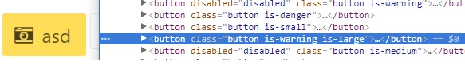
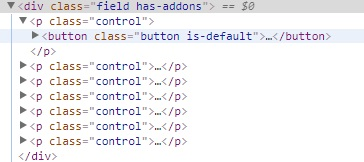
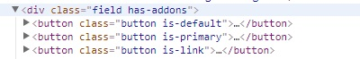

# Vue渲染函数render

## 简述

	Vue推荐使用template创建HTML， 但有些场景需要JavaScript完全编译的功能， 这个时候就可以使用render函数（ 它比template更接近编译器）

* 使用的原因是特殊情况下， 模版的写法无法满足需求， 或模版的写法比较繁琐， 需要用到js的编程能力， 这样就可以使用render来创建HTML

* 使用 JavaScript （也就是render函数实现）代替模板功能

* 实现自定义指令

* 是对template的优化实现

#### 官网深入渲染函数学习

> [官网](https://cn.vuejs.org/v2/guide/render-function.html)

## Vue渲染函数的应用

#### 简单示例

###### 将HTML使用render实现

**模版实现**

```html
<div id="container">
    <h1>
        <a href="#" rel="external nofollow" rel="external nofollow">
            Hello world!
        </a>
    </h1>
</div>
```

**render实现**

```html
<!DOCTYPE html>
<html>

<head>
    <title>演示Vue</title>
    <style>
    </style>
</head>

<body>
    <div id="container">
        <tb-heading :level="1">
            <a href="#" rel="external nofollow" rel="external nofollow">Hello world!</a>
        </tb-heading>
    </div>
</body>
<script src="./vue.js"></script>
<script type="text/x-template" id="templateId">
    <h1 v-if="level === 1">
<slot></slot>
</h1>
<h2 v-else-if="level === 2">
<slot></slot>
</h2>
</script>
<script>
    Vue.component('tb-heading', {
        template: '#templateId',
        props: {
            level: {
                type: Number,
                required: true
            }
        }
    });
    new Vue({
        el: '#container'
    });
</script>

</html>
```

###### v-if、 v-for替代实现

**模版写法**

```html
<ul v-if="items.length">
    <li v-for="item in items">{{ item.name }}</li>
</ul>
<p v-else>No items found.</p>
```

**render函数实现**

```js
props: ['items'],
    render: function(createElement) {
        if (this.items.length) {
            return createElement('ul', this.items.map(function(item) {
                return createElement('li', item.name)
            }))
        } else {
            return createElement('p', 'No items found.')
        }
    }
```

###### v-model替代实现

```js
props: ['value'],
    render: function(createElement) {
        var self = this
        return createElement('input', {
            domProps: {
                value: self.value
            },
            on: {
                input: function(event) {
                    self.$emit('input', event.target.value)
                }
            }
        })
    }
```

#### 现实需求

###### 生成多层次不同样式的button按钮组

1. 在工作中， 创建了一个button组件， 又创建了一个button-group组件

	button组件较为简单， 就是一个可以输入type/size/icon等属性的button

	    

2. 然后， 创建button-group组件， 目标结果为

	不仅要在最外层包裹一层div， 还要在每个button组件外层包裹一层p标签

	    

> 在此处， 就需要使用render函数优化了

> 注： 既然有了render函数， 就不再需要template标签了， vue文件中只需要script标签（该组件style是全局的）

**实现细节**

* button-group.vue

```js
< script >
    export default {
        name: "XButtonGroup",
        props: {
            compact: { //自定义的button-group属性，影响其classname
                type: Boolean,
                default: true
            }
        },
        render(createElement) {
            //此处创建element
        },
        computed: {
            groupClass() {
                const className = ["field"]; //通过计算属性监听compact属性传入className
                className.push(this.compact ? "has-addons" : "is-grouped");
                return className;
            }
        }
    }; <
/script>
```

其中render函数中的createElement方法有三个参数。 第一个参数为外层标签名， 第二个为外层标签的属性对象， 第三个为外层标签中的内容

* render方法

```js
render(createElement) {
    return createElement(
        'div', {
            class: this.groupClass
        },
        '内容',
    )
}
```


> render函数的第三个参数除了字符串， 还可以传入VNode的数组。 VNode就是vue中的节点

  * 通过this.$slots.default获取所有插入到button-group组件内默认slot的button节点

	

```js
	render(createElement) {
	    return createElement(
	        'div', {
	            class: this.groupClass
	        },
	        this.$slots.default,
	    )
	},
```



  * button已经正确渲染到了外层div中。 而createElement会创建新的VNode， 而render函数第三个参数需要VNode数组， 所以我们需要传入一个由createElement返回值组成的数组。 

	

```js
	render(createElement) {
	    //遍历每一个VNode,用createElement函数在外层包裹class为control的p标签，组成新的VNode数组
	    const arry = this.$slots.default.map(VNode => {
	        return createElement(
	            'p', {
	                class: 'control'
	            },
	            [VNode])
	    })
	    return createElement(
	        'div', {
	            class: this.groupClass
	        },
	        arry,
	    )
	},
```

  * 并且根据button-group的compact属性可以切换不同的class， 生成不同的效果

	```js
	<x-button-group :compact="true">
		<x-button v-for="(item,index) in buttonType" :key="index" :type="item">
			{{item}}
		</x-button>
	</x-button-group>
	<x-button-group :compact="false">
		<x-button v-for="(item,index) in buttonType" :key="index" :type="item">
			{{item}}
		</x-button>
	</x-button-group>
	```


