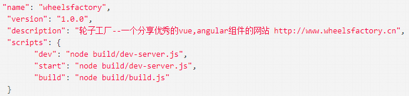

# npm入门

	NPM（Node Package Manager）前端包管理工具

## 概述

	`nodejs`預設的、以JavaScript編寫的軟體套件管理系統
	`npm`是随同nodejs一起安装的包管理工具（类似Maven），能解决NodeJS代码部署上的很多问题
	每个项目有各自的npm，都有各自面向项目的npm库
	一般项目创建的都是面向自己的库（或叫本地库（不完全））
	全局库类似npm，npm是`JavaScript`开发的库，又管理其他库，属于全局库，管理本地库

## 三个独立的部分组成

#### 网站

	开发者查找包（package）、设置参数以及管理 npm 使用体验的主要途径

#### 注册表（registry）

	一个巨大的数据库，保存了每个包（package）的信息

#### 命令行工具 (CLI)

	通过命令行或终端运行。开发者通过 CLI 与 npm 打交道

## 使用国内的淘宝镜像

#### `cnpm`(淘宝镜像)安装

	安装完成之后，我们可以选择使用淘宝镜像，下载速度快了一个量级

> 注：`npm`每次下载都是下载外国的包，速度有影响，甚至容易下着下着就报错挂了，原因是网络连接问题或下载超时，反正就是慢，当然优点是全，有些依赖包淘宝镜像可能下载不到，但是九成九淘宝镜像都有

1. 安装完`nodejs`后，默认附带会安装`npm`

	查看`npm`版本：`npm -v`

2. 打开`cmd`输入：`npm install -g cnpm --registry=https://registry.npm.taobao.org`

	这样就连上了淘宝镜像，之后使用淘宝镜像下载包都用`cnpm`命令

```bash
# 例如npm命令
npm install express
# 也可以写成
cnpm install express
```

> 只是引用的依赖库

3. 使用`cnpm`

```bash
cnpm install xxx
```

> 例：`cnpm install express`

4. 更新模块

	npm update express

5. 卸载模块
	
	npm uninstall express
	npm ls

6. 淘宝npm镜像

	·搜索地址：http://npm.taobao.org/
	·registry地址：http://registry.npm.taobao.org/

7. 使用场景

	允许用户从NPM服务器下载别人编写的第三方包到本地使用。
	允许用户从NPM服务器下载并安装别人编写的命令行程序到本地使用。
	允许用户将自己编写的包或命令行程序上传到NPM服务器供别人使用。

## npm配置

#### 通过命令配置

1. 命令

	npm config set registry https://registry.npm.taobao.org

2. 验证命令

	npm config get registry

3. npm命令升级

	npm install npm -g

4. 配置`npm`的全局模块的存放路径以及`cache`的路径

	设置全局安装目录，用于解决全局变量存储和缓存位置问题

*CMD中输入*

	npm config set prefix "D:\Develop\developTool\nodejs\node_global"
	npm config set cache "D:\Develop\developTool\nodejs\node_cache"

> 注：具体路径根据各自需求选择，一般都放在nodejs软件安装的路径下

## package.json

> [官网](https://docs.npmjs.com/files/package.json#directorieslib)

#### 概述

	定义了项目所需要的各种模块，以及项目的配置信息（比如名称、版本、许可证等元数据）
	npm install命令根据这个配置文件，自动下载所需的模块，也就是配置项目所需的运行和开发环境

	package.json 位于模块的目录下，用于定义包的属性
	express 包的 package.json 文件，位于 node_modules/express/package.json

#### Package.json 属性说明

	name - 包名。
	version - 包的版本号。
	description - 包的描述。
	homepage - 包的官网 url 。
	author - 包的作者姓名。
	contributors - 包的其他贡献者姓名。
	dependencies - 依赖包列表。如果依赖包没有安装，npm 会自动将依赖包安装在 node_module 目录下。
	repository - 包代码存放的地方的类型，可以是 git 或 svn，git 可在 Github 上。
	main - main 字段指定了程序的主入口文件，require('moduleName') 就会加载这个文件。这个字段的默认值是模块根目录下面的 index.js。
	keywords - 关键字

#### 最简单的package.json文件

	最简单的package.json文件，只定义两项元数据：项目名称和项目版本

```json
{ "name" : "xxx", "version" : "0.0.0", }
```

> name就是项目名称，version是版本（遵守“大版本.次要版本.小版本”的格式）

#### 生成package.json文件

	package.json文件可以手工编写

> 注:大项目一般都是手工编写，指定引用、加载和命名

###### 也可以使用npm init命令自动生成

```bash
npm init
```

```json
{
	"name": "demo",
	"version": "1.0.0",
	"description": "This is test project.",
	"main": "index.js",
	"scripts": {
	"test": "echo \"Error: no test specified\" && exit 1"
},
	"author": "",
	"license": "ISC"
}
```

> 注：这个命令采用互动方式，要求用户回答一些问题，然后在当前目录生成一个基本的package.json文件。所有问题之中，只有项目名称（name）和项目版本（version）是必填的，其他都是选填的

1.  有了package.json文件，直接使用npm install命令，就会在当前目录中安装所需要的模块

```bash
npm install	// 生成node_modules文件
```

> 注：这个生成node_modules文件存放项目的所有依赖包，项目所有的开发环境依赖和生产环境依赖都会下载到本地放入这个文件夹中，是根据package.json文件的配置执行的，仅存于开发本地，可以实现快速开发（开发人员把源代码拉下来，直接执行`npm install`后就可以运行项目进行开发了）

2. 如果一个模块不在package.json文件之中，可以单独安装这个模块，并使用相应的参数，将其写入package.json文件之中

*例如*

```bash
npm install express --save
npm install express --save-dev
```

> 注：上面代码表示单独安装express模块

	--save参数表示将该模块写入 dependencies 属性
	--save-dev表示将该模块写入 devDependencies 属性

#### Package.json结构说明

> 这是对项目的依赖管理文件，还有部分信息说明，包括项目简述、项目名、版本号、生成环境依赖、开发环境依赖、项目入口等等，npm可以通过这个文件方便对项目进行开发管理

###### scripts字段


1. 当我们执行npm run dev时，首选执行的是dev-server.js
2. 当我们执行npm run build时，首选执行的是build.js

###### dependencies字段

* 理解

	dependencies字段指定了项目运行所依赖的模块
	dependencies字段是一个对象，它指定了依赖的包名和其版本范围的映射
		版本范围是个有一个或多个空白分隔描述符的字符串
	dependencies字段还可以用tarball或者git URL

* 指定版本范围

	1. version 必须确切匹配这个version
	2. \>version 必须大于这个version
	3. \>=version 必须大于等于这个version
	4. < version 必须小于这个version
	5. <=version 必须小于等于这个version
	6. ~version 大约相当于version，参考[semver](https://docs.npmjs.com/misc/semver)
	7. ^version 与version兼容，参考[semver](https://docs.npmjs.com/misc/semver)
	8. 1.2.x 可以是1.2.0、1.2.1等，但不能是1.3.0
	9. http://... 参考下面的URL作为依赖项
	10. \* 匹配任何版本
	11. ""(空字符串) 匹配任何版本，和\*一样
	12. version1 - version2 相当于 >=version1 <=version2
	13. range1 || range2 range1或range2其中一个满足时采用该version
	14. git... 参考下面的Git URL作为依赖项
	15. user/repo 参考下面的GitHub URLs
	16. tag 一个以tag发布的指定版本，参考[npm-tag](https://docs.npmjs.com/cli/tag)
	17. path/path/path 参考下面的本地Paths

	*举例*

	```json
	{
		"dependencies": {
			"foo": "1.0.0 - 2.9999.9999",
			"bar": ">=1.0.2 <2.1.2",
			"baz": ">1.0.2 <=2.3.4",
			"boo": "2.0.1",
			"qux": "<1.0.0 || >=2.3.1 <2.4.5 || >=2.5.2 <3.0.0",
			"asd": "http://asdf.com/asdf.tar.gz",
			"til": "~1.2",
			"elf": "~1.2.3",
			"two": "2.x",
			"thr": "3.3.x",
			"lat": "latest",
			"dyl": "file:../dyl"
		}
	}
	```

* 其他

	*URLs作为依赖项*

		可以在version上指定一个压缩包的url。
		当执行npm install时这个压缩包会被下载并且安装到本地

	*Git URLs作为依赖项*

	1. Git URLs可以是如下几种形式之一
	```bash
	git://github.com/user/project.git#commit-ish
	git+ssh://user@hostname:project.git#commit-ish
	git+ssh://user@hostname/project.git#commit-ish
	git+http://user@hostname/project/blah.git#commit-ish
	git+https://user@hostname/project/blah.git#commit-ish
	```

	> 注commit-ish可以是任何tag、sha或者branch，并作为一个参数提供给git进行checkout，默认值是master

	*GitHub URLs*

	1. 从1.1.65版本开始，可以引用Github urls作为版本号，比如"foo": "user/foo-project"。也可以包含一个commit-ish后缀

	```json
	{
		"name": "foo",
		"version": "0.0.0",
		"dependencies": {
			"express": "visionmedia/express",
			"mocha": "visionmedia/mocha#4727d357ea"
		}
	}
	```

	*本地路径*
	
		从版本2.0.0开始可以提供一个包的本地路径。本地路径可以在我们使用npm install -S或npm install --save时被保存

	*具体*
	
	```bash
	../foo/bar
	~/foo/bar
	./foo/bar
	/foo/bar
	```

	举例
	在下面这种情况下它会被规范化成为一个相对路径并且加入到我们的package.json文件中
	```json
	{
		"name": "baz",
		"dependencies": {
			"bar": "file:../foo/bar"
		}
	}
	```

###### devDependencies字段

* 理解

	devDependencies指定项目开发所需要的模块
	这些项将会在根目录下执行npm link或npm install时被安装，并且可以像其他npm配置参数一样被管理

* 场景

	如果有人计划在他们的项目中下载和使用我们的模块，但他们可能并不想或并不需要我们开发所使用的外部测试和文档框架。在这种情况下，最好将这些附加的项放在devDependencies中

	对于那些非特定平台的构建步骤（一些跨平台的构建任务），比如编译CoffeeScript或把其他语言转换成JavaScript，可以（通过在package.json的script属性里边配置prepublish脚本）使用prepublish脚本来处理，并且把这个过程的依赖包放在devDependencies属性中

	* 举例

		prepublish脚本会在publishing前运行，这样用户就可以不用自己去require来编译就能使用。在开发模式下(比如本地运行npm install)，将会执行这个脚本，这样测试就非常方便了
		
		```json
		{
			"name": "ethopia-waza",
			"description": "a delightfully fruity coffee varietal",
			"version": "1.2.3",
			"devDependencies": {
				"coffee-script": "~1.6.3"
			},
			"scripts": {
				"prepublish": "coffee -o lib/ -c src/waza.coffee"
			},
			"main": "lib/waza.js"
		}
		```
	
* 例如

	```json
	{
		"devDependencies": {
		"browserify": "~13.0.0",
			"karma-browserify": "~5.0.1"
		}
	}
	```

###### 版本号

* 对应的版本可以加上各种限定

	1. 指定版本
		比如1.2.2，遵循“大版本.次要版本.小版本”的格式规定，安装时只安装指定版本。
	2. 波浪号（tilde）+指定版本
		比如~1.2.2，表示安装1.2.x的最新版本（不低于1.2.2），但是不安装1.3.x，也就是说安装时不改变大版本号和次要版本号。
	3. 插入号（caret）+指定版本
		比如ˆ1.2.2，表示安装1.x.x的最新版本（不低于1.2.2），但是不安装2.x.x，也就是说安装时不改变大版本号。需要注意的是，如果大版本号为0，则插入号的行为与波浪号相同，这是因为此时处于开发阶段，即使是次要版本号变动，也可能带来程序的不兼容。
	4. latest
		安装最新版本。

###### dependencies和devDependencies的区别

基本

	使用 --save-dev 安装的 插件，被写入到 devDependencies 域里面去
	使用 --save 安装的插件，则是被写入到 dependencies 区块里面去
	--save-dev 是你开发时候依赖的东西，--save 是你发布之后还依赖的东西。
	比如我们写一个项目要依赖于jQuery，没有这个包的依赖运行就会报错，这时候就把这个依赖写入dependencies
	而我们使用的一些构建工具比如glup、webpack这些只是在开发中使用的包，上线以后就和他们没关系了，所以将它写入devDependencies

* 大部分观点：

	dependencies
		需要发布到生产环境的
		用户发布环境，所以，不会包含本地开发任何的包,比如：react、react-redux、react-router-dom等
	devDependencies
		用于本地环境开发时候，所以，所有的不会在发布时候打包进线上代码的npm包都放在这里，命令是：npm i -D ***。比如像这些包：babel-core、babel-eslint、等babel系列，autoprefixer、webpack、webpack-dev-server、koa、*-loaderloader系列等等
		只用于开发环境，不用于生产环境

###### 参考：较为完整的package.json

```json
{
	"name": "Hello World",
	"version": "0.0.1",
	"author": "张三",
	"description": "第一个node.js程序",
	"keywords":["node.js","javascript"],
	"repository": {
		"type": "git",
		"url": "https://path/to/url"
	},
	"license":"MIT",
	"engines": {"node": "0.10.x"},
	"bugs":{"url":"http://path/to/bug","email":"bug@example.com"},
	"contributors":[{"name":"李四","email":"lisi@example.com"}],
	"scripts": {
		"start": "node index.js"
	},
	"dependencies": {
		"express": "latest",
		"mongoose": "~3.8.3",
		"handlebars-runtime": "~1.0.12",
		"express3-handlebars": "~0.5.0",
		"MD5": "~1.2.0"
	},
	"devDependencies": {
		"bower": "~1.2.8",
		"grunt": "~0.4.1",
		"grunt-contrib-concat": "~0.3.0",
		"grunt-contrib-jshint": "~0.7.2",
		"grunt-contrib-uglify": "~0.2.7",
		"grunt-contrib-clean": "~0.5.0",
		"browserify": "2.36.1",
		"grunt-browserify": "~1.3.0",
	}
}
```
