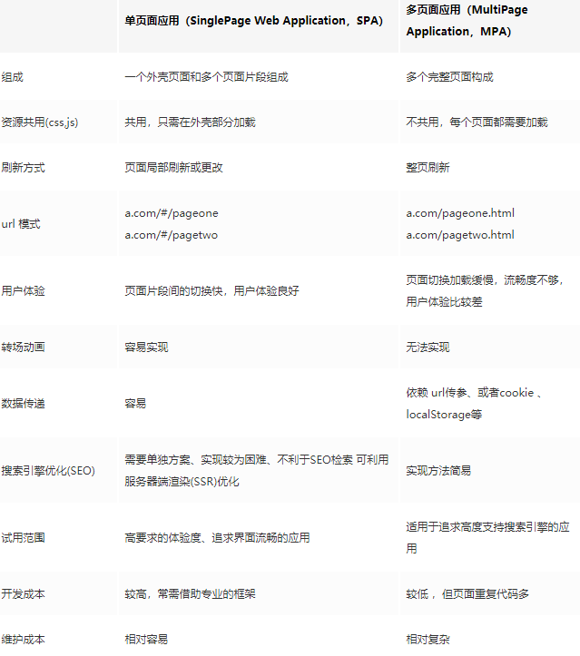

<!--
 * @Description: SPA单页面方面问题
 * @Date: 2019-08-21 09:05:09
 * @LastEditors: phoebus
 * @LastEditTime: 2019-08-21 09:27:53
 -->
# SPA单页面方面问题

## 单页面与多页面间的区别及优缺点

#### 简述

* 单页面应用（SPA）：通俗一点说就是指只有一个主页面的应用，浏览器一开始要加载所有必须的 html, js, css。所有的页面内容都包含在这个所谓的主页面中。但在写的时候，还是会分开写（页面片段），然后在交互的时候由路由程序动态载入，单页面的页面跳转，仅刷新局部资源。多应用于pc端。

* 多页面（MPA），就是指一个应用中有多个页面，页面跳转时是整页刷新

#### 优缺点

**单页面的优点：**

1. 用户体验好
	
	* 因为内容的改变不需要重新加载整个页面，避免了不必要的跳转和重复渲染，所以页面切换很快，基于这一点SPA对服务器压力较小

2. 前后端分离

	* 职责分离，架构清晰，前端进行交互逻辑，数据展示，后端负责数据处理

3. 页面效果会比较炫酷

	* 比如切换页面内容时的专场动画

**单页面缺点：**

1. 不利于SEO

	* 由于所有的内容都在一个页面中动态替换显示，html文件只有模板，没有内容，所以SEO爬虫很麻烦(大部分内容爬不到)
	* 但是可以使用服务端渲染解决

2. 需要自行实现路由导航

	* 由于单页应用在一个页面中显示所有的内容，所以不能使用浏览器的前进后退功能，需要自己建立堆栈管理实现页面切换

3. 初次加载时耗时多

	* 为实现单页 Web 应用功能及显示效果，需要在加载页面的时候将 JavaScript、CSS 统一加载，部分页面按需加载
	* 所以首页加载需要进行相应的优化

## 单页面和多页面应用场景

* 大部分后台系统，TOB系统，等对数据操作，页面切换频繁，比较注重的是操作的流畅性，SPA来做当然会更合适。

* 而很多TOC项目，追求的是首屏的展现速度，注重的是观看体验，操作较少，就比较适合多页面，配合服务端渲染
