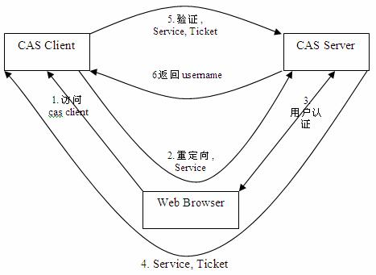
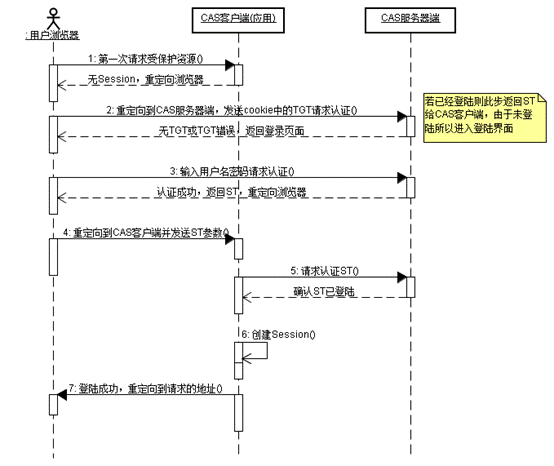
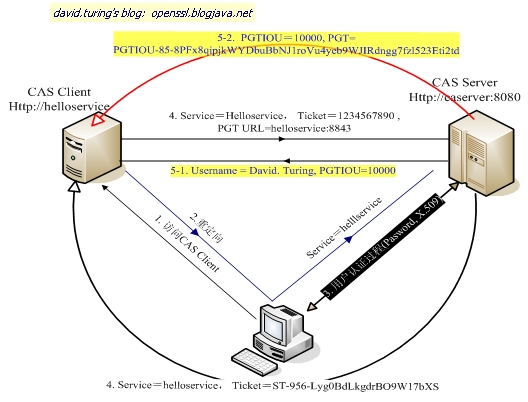
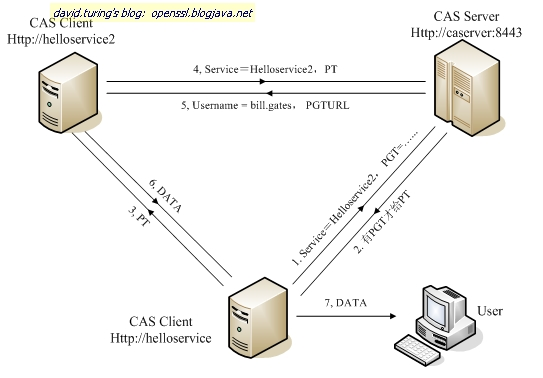

<!--
 * @Description: CAS实现单点登录
 * @Date: 2019-08-14 11:03:01
 * @LastEditors: phoebus
 * @LastEditTime: 2019-08-14 12:12:57
 -->
# CAS实现单点登录

## 概述

#### 什么是单点登录？

	单点登录(Single Sign-On , 简称 SSO)是目前比较流行的服务于企业业务整合的解决方案之一， SSO 使得在多个应用系统中，用户只需要 登录一次 就可以访问所有相互信任的应用系统

* 在SSO 的体系中，会有三种角色

	* User			(多个)
	* Web应用		(多个)
	* SSO认证中心	(1个)

> 虽然实现SSO模式有多种，但是原理就那样，万变不离其宗

* Web 应用不处理 User 的登录，否则就是多点登录了，所有的登录都在 SSO 认证中心进行。

* SSO 认证中心通过一些方法来告诉 Web 应用当前访问用户究竟是不是张三 / 李四。

* SSO 认证中心和所有的 Web 应用建立一种信任关系，SSO 认证中心对用户身份正确性的判断会通过某种方法告之 Web 应用，而且判断结果必须被 Web 应用信任

> 具体：[深入浅出单点登录](知识笔记/大前端/前端安全/登录认证/深入浅出单点登录.md)

#### CAS简述

	CAS(Central Authentication Service) 是 Yale 大学发起的一个企业级的、开源的项目，旨在为 Web 应用系统提供一种可靠的单点登录解决方法（属于 Web SSO)

1. 开源的、多协议的 SSO 解决方案； Protocols ： Custom Protocol 、 CAS 、 OAuth 、 OpenID 、 RESTful API 、 SAML1.1 、 SAML2.0 等。

2. 支持多种认证机制： Active Directory 、 JAAS 、 JDBC 、 LDAP 、 X.509 Certificates 等；

3. 安全策略：使用票据(Ticket)来实现支持的认证协议；

4. 支持授权：可以决定哪些服务可以请求和验证服务票据(Service Ticket)；

5. 提 供高可用性：通过把认证过的状态数据存储在 TicketRegistry 组件中，这些组件有很多支持分布式环境的实现， 如： BerkleyDB 、 Default 、 EhcacheTicketRegistry 、 JDBCTicketRegistry 、 JBOSS TreeCache 、 JpaTicketRegistry 、 MemcacheTicketRegistry 等；

6. 支持多种客户端： Java 、 .Net 、 PHP 、 Perl 、 Apache, uPortal 等

#### CAS结构

	CAS 包括两部分：CAS Server 和 CAS Client 

###### CAS Server

	CAS Server 负责完成对用户的认证工作, 需要独立部署, CAS Server 会处理用户名 / 密码等凭证(Credentials)

###### CAS Client

	负责处理对客户端受保护资源的访问请求，需要对请求方进行身份认证时，重定向到 CAS Server 进行认证。（原则上，客户端应用不再接受任何的用户名密码等 (Credentials)。

	CAS Client 与受保护的客户端应用部署在一起，以 Filter 方式保护受保护的资源

#### CAS 安全性

	CAS 的安全性仅仅依赖于 SSL，使用的是 secure cookie 

###### TGC/PGT 安全性

* 对于一个 CAS 用户来说，最重要是要保护它的 TGC ，如果 TGC 不慎被 CAS Server 以外的实体获得， Hacker 能够找到该 TGC ，然后冒充 CAS 用户访问 所有 授权资源。 PGT 的角色跟 TGC 是一样的

* 但是TGC 是 CAS Server 通过 SSL 方式发送给终端用户，因此，要截取 TGC 难度非常大，从而确保 CAS 的安全性

> TGT 的存活周期默认为 120 分钟

###### ST/PT 安全性

	ST(Service Ticket)是通过 Http 传送的，因此网络中的其他人可以 Sniffer 到其他人的 Ticket

**CAS 通过以下几方面来使 ST 变得更加安全（事实上都是可以配置的）**

1. ST 只能使用一次

	CAS 协议规定，无论 Service Ticket 验证是否成功， CAS Server 都会清除服务端缓存中的该Ticket ，从而可以确保一个 Service Ticket 不被使用两次。

2. ST 在一段时间内失效

	CAS 规定 ST 只能存活一定的时间，然后 CAS Server 会让它失效。默认有效时间为 5 分钟。

3. ST 是基于随机数生成的

	ST 必须足够随机，如果 ST 生成规则被猜出，Hacker 就等于绕过 CAS 认证，直接访问对应的服务

## CAS 原理和协议

#### 基础模式

###### 基础模式 SSO 访问流程

1. 访问服务： SSO 客户端发送请求访问应用系统提供的服务资源；

2. 定向认证： SSO 客户端会重定向用户请求到 SSO 服务器；

3. 用户认证：用户身份认证；

4. 发放票据： SSO 服务器会产生一个随机的 Service Ticket；

5. 验证票据： SSO 服务器验证票据 Service Ticket 的合法性，验证通过后，允许客户端访问服务；

6. 传输用户信息： SSO 服务器验证票据通过后，传输用户认证结果信息给客户端。

**流程说明**

* CAS Client 与受保护的客户端应用部署在一起，以 Filter 方式保护 Web 应用的受保护资源，过滤从客户端过来的每一个 Web 请求

* 同时， CAS Client 会分析 HTTP 请求中是否包含请求 Service Ticket( ST 上图中的 Ticket) 

* 如果没有，则说明该用户是没有经过认证的；于是 CAS Client 会重定向用户请求到 CAS Server(Step 2)，并传递 Service（要访问的目的资源地址）

* Step 3 是用户认证过程，如果用户提供了正确的 Credentials ， CAS Server 随机产生一个相当长度、唯一、不可伪造的 Service Ticket，首先缓存以待将来验证，然后重定向用户到 Service 所在地址（附带刚才产生的 Service Ticket), 最后为客户端浏览器设置一个 Ticket Granted Cookie(TGC) ；

* CAS Client 在拿到 Service 和新产生的 Ticket 过后，在 Step 5 和 Step6 中与 CAS Server 进行身份核实，以确保 Service Ticket 的合法性

###### CAS 如何实现 SSO

* 当用户访问另一个应用的服务再次被重定向到 CAS Server 的时候， CAS Server 会主动获到这个 TGC cookie，然后执行操作：

	* 如果 User 持有 TGC 且其还没失效，那么就走基础协议图的 Step4 ，达到了 SSO 的效果；
	* 如果 TGC 失效，那么用户还是要重新认证(走基础协议图的 Step3)

#### CAS 代理模式

	该模式形式为用户访问 App1，App1 又依赖于 App2 来获取一些信息，如：User --> App1 --> App2

* 这种情况下，假设 App2 也是需要对 User 进行身份验证才能访问。那么，为了不影响用户体验（过多的重定向导致 User 的 IE 窗口不停地`闪动`) ， CAS 引入了一种 Proxy 认证机制，即 CAS Client 可以代理用户去访问其它 Web 应用

> 代理的前提是需要 CAS Client 拥有用户的身份信息 ( 类似凭据 )

* 普通模式下，TGC 是用户持有对自己身份信息的一种凭据，而代理模式的 PGT 就是 CAS Client 端持有的对用户身份信息的一种凭据。凭借TGC， User 可以免去输入密码以获取访问其它服务的 Service Ticket，所以，这里凭借 PGT，Web应用可以代理用户去实现后端的认证，而无需前端用户的参与

> 注：`PGT URL`用于表示一个 Proxy 服务，是一个回调链接；PGT 相当于代理证；`PGTIOU`为取代理证的钥匙，用来与 PGT 做关联关系

* 如上面的 CAS Proxy 图所示，CAS Client 在基础协议之上，在验证 ST 时提供了一个额外的PGT URL( 而且是 SSL 的入口) 给CAS Server，使得 CAS Server 可以通过 `PGT URL` 提供一个 PGT 给 CAS Client

* CAS Client 拿到了 PGT(PGTIOU-85 … ..ti2td) ，就可以通过 PGT 向后端 Web 应用进行认证

!> Proxy 认证与普通的认证其实差别不大，Step1、2 与基础模式的 Step1、2 几乎一样，唯一不同的 是，Proxy 模式用的是 PGT 而不是 TGC，是 Proxy Ticket(PT)而不是 Service Ticket

###### 代理模式应用场景

* 有两个应用App1和App2，它们都是受CAS服务器保护的，即请求它们时都需要通过CAS 服务器的认证。现在需要在App1中通过Http请求访问App2，显然该请求将会被App2配置的CAS的AuthenticationFilter拦截并转向CAS 服务器，CAS 服务器将引导用户进行登录认证，这样我们也就访问不到App2的资源了。针对这种应用场景，CAS也提供了CAS Proxy 轻松的解决了这个问题

#### 总结

* CAS 的 SSO 实现方式可简化理解为： 1 个 Cookie 和 N 个 Session 。 CAS Server 创建 cookie，在所有应用认证时使用，各应用通过创建各自的 Session 来标识用户是否已登录。

* 用 户在一个应用验证通过后，以后用户在同一浏览器里访问此应用时，客户端应用中的过滤器会在 session 里读取到用户信息，所以就不会去 CAS Server 认证。如果在此浏览器里访问别的 web 应用时，客户端应用中的过滤器在 session 里读取不到用户信息，就会去 CAS Server 的 login 接口认证，但这时CAS Server 会读取到浏览器传来的 cookie （ TGC ），所以 CAS Server 不会要求用户去登录页面登录，只是会根据 service 参数生成一个 Ticket ，然后再和 web 应用做一个验 证 ticket 的交互而已

## CAS登录流程与实现

#### 登入登出流程

###### 1. CAS登录时处理

* 第一步

	* CAS往浏览器增加cookie（TGC）
	* CAS向浏览器送回一个所谓的"内存cookie"。这种cookie并不是真的保存在内存中，而只是浏览器一关闭，cookie就自动过期。这个cookie称为"ticket-granting cookie"，用来表明用户已经成功地登录。

	> 这个Cookie是一个加密的Cookie，其中保存了用户登录的信息。用于以后其它应用客户端登录

* 第二步

	* CAS同时创建一个ticket重定向到原来的CAS客户端
	* 认证成功后，CAS服务器创建一个很长的、随机生成的字符串，称为`Ticket`。随后CAS将这个ticket和成功登录的用户，以及服务联系在一起。
	
	> 这个ticket是一次性使用的一种凭证，它只对登录成功的用户及其服务使用一次，使用过以后立刻失效

###### 2. CAS 客户端应用Ａ的处理

* 第一步：

	* 收到ticket后，向CAS提交验证ticket
	* CAS客户端收到ticket之后，应用程序需要验证ticket。这是通过将ticket传递给一个校验URL来实现的。校验URL也是CAS服务器提供的。CAS通过校验路径获得了ticket之后，通过内部的数据库对其进行判断。如果判断是有效性，则返回一个NetID给应用程序。随后CAS将ticket作废，并且在客户端留下一个cookie。

* 第二步

	* ticket验证后创建session以后登录此应用时，没有ticket，但IE能提供session，从session中取得CASReceipt，并验证如果有效说明已经在此应用认证过，允许访问此应用，到此为止，CAS会记录用户已在应用Ａ已经登录

###### 3. 用户登录到应用Ｂ是如何处理？

* 用户进入应用Ｂ时，首先仍然会重定向到CAS服务器。不过此时CAS服务器`不再要求用户输入用户名和密码`，而是首先自动寻找Cookie，根据Cookie中保存的信息，进行登录。

* 然后，CAS同样给出新的ticket重定向应用Ｂ给cas验证（流程同应用Ａ验证方式），如果验证成功则应用Ｂ创建session记录CASReceipt信息到session中，以后凭此session登录应用Ｂ

* 到此为止，ＣＡＳ会记录用户已在应用A和应用B进行登录

> 问题：但是当用户在应用B退出cas登录时，要通知应用Ａ进行退出，如何通知应用Ａ呢？

###### 登出

* CAS server接受请求后，会检测用户的TCG Cookie，把对应的session清除，同时会找到所有通过该TGC sso登录的应用服务器URL提交请求，所有收到请求的应用服务器application会解析这个参数，取得sessionId，根据这个Id取得session后，把session删除

#### 客户端消息流程

1. 第一次访问：`http://localhost:8080/A`

	* CLIENT：没票据且SESSION中没有消息所以跳转至CAS

	* CAS：拿不到TGC故要求用户登录

2. 认证成功后回跳

	* CAS：通过TGT生成ST发给客户端，客户端保存TGC，并重定向到`http://localhost:8080/A`

	* CLIENT：带有票据所以不跳转只是后台发给CAS验证票据（浏览器中无法看到这一过程）

3. 第一次访问：`http://localhost:8080/B`

	* CLIENT：没票据且SESSION中没有消息所以跳转至CAS

	* CAS：从客户端取出TGC，如果TGC有效则给用户ST并后台验证ST，从而SSO。

	> `TicketGrantingTicketImpl`类`grantServiceTicket()`方法里`this.services.put(id,service)`可见CAS端已经记录了当前登录的子系统；如果失效重登录或注销时，可以通知其它系统更新SESSION信息

4. 再次访问：`http://localhost:8080/A`

	* CLIENT：没票据但是SESSION中有消息故不跳转也不用发CAS验证票据，允许用户访问

> [CAS实现SSO单点登录原理](https://www.cnblogs.com/gy19920604/p/6029210.html)
