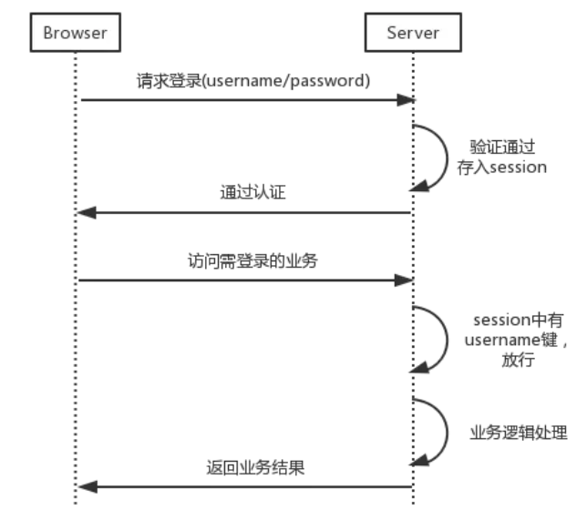

<!--
 * @Description: 认识和比较常见登陆认证方式
 * @Date: 2019-08-12 14:11:34
 * @LastEditors: phoebus
 * @LastEditTime: 2019-08-12 15:23:21
 -->
# 常见登陆认证方式

## 概述

#### 常见有哪些登陆认证方式

* Basic Auth

* Cookie-Session Auth

* Token Auth

* OAuth 第三方授权

## 登陆方式比较

#### Basic Auth

	这种认证直接顺应HTTP协议的无状态性，每次执行业务的时候，都暴力地附带username与password参数，并将其发送给服务器进行认证

* 虽然有了AOP技术（如拦截器或动态代理）进行接口前置认证，代码不复杂，但是这种方法除了安全性问题外，还存在比较大的性能问题：

	* 每次都需要创建数据库连接并进行数据库查询操作，这明显是对服务器的性能消耗

	> 而这种解决数据库查询消耗的方案是：服务器记忆存储登录状态(有状态性)

> 这种方式其实不能说常见了，它是古老的产物，很久之前不买考虑安全认证的时候我们就是这样用的，当然不排除一些内网系统是这样的，但现在应该是被弃用了

#### Cookie-Session Auth

	这种方式在早期的时候是比较常见的方式，但在现在因为安全性问题已经在很多场景不适应了，当然还有一部分网站依然使用着

* 认证过程

	1. 用户输入用户名、密码或者用短信认证码方式登录系统；
	2. 服务端认证后，创建一个 Session 信息，并且将 SessionID 存到 cookie，发送回浏览器；
	3. 下次客户端再发起请求，自动带上 cookie 信息，服务端通过 cookie 获取 Session 信息进行校验。

* 存在的明显问题

	* 只能在 web 场景下使用，如果是 APP 中，不能使用 cookie 的情况下就不能用了；
	* 即使能在 web 场景下使用，也要考虑跨域问题，因为 cookie 不能跨域；
	* cookie 存在 CSRF（跨站请求伪造）的风险；
	* 如果是分布式服务，需要考虑 Session 同步问题

> 虽然这样认证方式存在安全性等问题，但在一些场景中依旧是适用的(内网环境、简单业务)，具体还是要考虑业务需求。并且在解决上述问题，我们其实可以针对性提出优化解决方案。

###### Cookie-Session 优化版

* 优化细节

	* 不用 cookie 做客户端存储，改用其他方式，web 下使用 local storage，APP 中使用客户端数据库，这样就实现了跨域，并且避免了 CSRF ;
	* 服务端也不存 Session 了，把 Session 信息拿出来存到 Redis 等内存数据库中，这样即提高了速度，又避免了 Session 同步问题；

* 优化后的认证流程

	1. 用户输入用户名、密码或者用短信认证码方式登录系统；
	2. 服务端经过认证，将认证信息构造好的数据结构存储到 Redis 中，并将 key 值返回给客户端；
	3. 客户端拿到返回的 key，存储到 local storage 或本地数据库；
	4. 下次客户端再次请求，把 key 值附加到 header 或者 请求体中；
	5. 服务端根据获取的 key，到 Redis 中获取认证信息。

> 虽然说经过优化了，上述问题得到了解决，但是依然处在些问题：

	需要客户端和服务器端维持一个状态信息，比如用 cookie 换 session，或者用 key 换 Redis 的 value 信息

#### Token Auth

	Token Auth 全称应该叫 基于JWT的Token认证
	JSON Web Token（JWT）是一个非常轻巧的规范。这个规范允许我们使用JWT在用户和服务器之间传递安全可靠的信息。

> `token认证`是为解决上述`Cookie-Session`存在的"需要客户端和服务器端维持一个状态信息"的问题，基于 JWT 的 Token 认证方案可以省去这个过程

* 认证过程

	1. 依然是用户登录系统；
	2. 服务端验证，将认证信息通过指定的算法（例如HS256）进行加密，例如对用户名和用户所属角色进行加密，加密私钥是保存在服务器端的，将加密后的结果发送给客户端，加密的字符串格式为三个"." 分隔的字符串 Token，分别对应头部、载荷与签名，头部和载荷都可以通过 base64 解码出来，签名部分不可以；
	3. 客户端拿到返回的 Token，存储到 local storage 或本地数据库；
	4. 下次客户端再次发起请求，将 Token 附加到 header 中；
	5. 服务端获取 header 中的 Token ，通过相同的算法对 Token 中的用户名和所属角色进行相同的加密验证，如果验证结果相同，则说明这个请求是正常的，没有被篡改。这个过程可以完全不涉及到查询 Redis 或其他存储。

* 优点

	* 使用 json 作为数据传输，有广泛的通用型，并且体积小，便于传输；
	* 不需要在服务器端保存相关信息；
	* jwt 载荷部分可以存储业务相关的信息（非敏感的），例如用户信息、角色等；

> JWT Token认证基本是现在大部分系统应用支持的认证登录方式，属于主流解决方案，基本可以解决大部分需求场景(意思是还有场景是不满足的)

	涉及到信息安全的要结合更多的保障方案，例如使用HTTPS协议等

#### OAuth 第三方授权认证

	这个验证方式算是到处都是了：微信登录、微博登录、qq登录等，简单来说就是利用这些比较权威的网站或应用开放的 API 来实现用户登录，用户可以不用在我们的网站或应用上注册账号，直接用已有的微信、微博、qq 等账号登录

> 这个方案存在的意义当然是节省用户时间啦！一些小型网站甚至可以直接省了账号体系，直接使用第三方授权的用户信息，并且安全是有保障的

* 维基百科解释

	* OAuth允许用户提供一个令牌，而不是用户名和密码来访问他们存放在特定服务提供者的数据。每一个令牌授权一个特定的网站（例如，视频编辑网站)在特定的时段（例如，接下来的2小时内）内访问特定的资源（例如仅仅是某一相册中的视频）。这样，OAuth让用户可以授权第三方网站访问他们存储在另外服务提供者的某些特定信息，而非所有内容。

**示例说明：电商平台web端实现微信登录流程**

	微信网页授权是授权码模式（authorization code）的 OAuth 授权模式

* 涉及角色

	* 用户：即使用我们平台的用户
	* 用户终端：即最终用户使用的 APP 端或 web 端
	* 应用服务器端：即我们的服务器端
	* 授权服务器端：这里就是微信处理授权请求的服务器

* 流程

	* 我们电商平台的用户过来登录，常用场景是点击"微信登录"按钮；
	* 接下来，用户终端将用户引导到微信授权页面；
	* 用户同意授权，应用服务器重定向到之前设置好的 redirect_uri （应用服务器所在的地址），并附带上授权码（code）;
	* 应用服务器用上一步获取的 code 向微信授权服务器发送请求，获取 access_token，也就是上面说的令牌；
	* 之后应用服务器用上一步获取的 access_token 去请求微信授权服务器获取用户的基本信息，例如头像、昵称等。
	
#### 总结

* 首先，一般网站/系统/应用其实应该都要支持token登录功能，因为这样的用户才是长期用户，有稳定的用户基础对公司的发展才更好，也就是要拥有用户；

* 但是也要支持主流第三方登录，这样能争取更多的流量，一些小型网站或小程序等使用第三方登录能明显提高用户访问量，现在万千网站，如果都需要注册，真的很头皮发麻，肯定一大堆用户名密码一样的信息，很容易就被窃取，进而个人隐私很容易被进一步泄露，所以能第三方登录明显等减少我们注册新账号的几率

* 所以，现在主流基本上都是`token认证 + 第三方认证`的模式，安全度还是可以的，当然像银行/支付等肯定是要更高级的安全方式，或加上HTTPS协议等组合

> 参考：[Web应用的认证机制](https://www.jianshu.com/p/88b7be4657a3) | [说一说几种常用的登录认证方式，你用的哪种](cnblogs.com/fengzheng/p/8416393.html)
