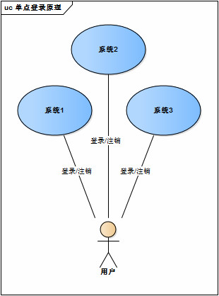
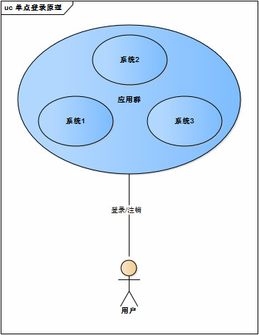
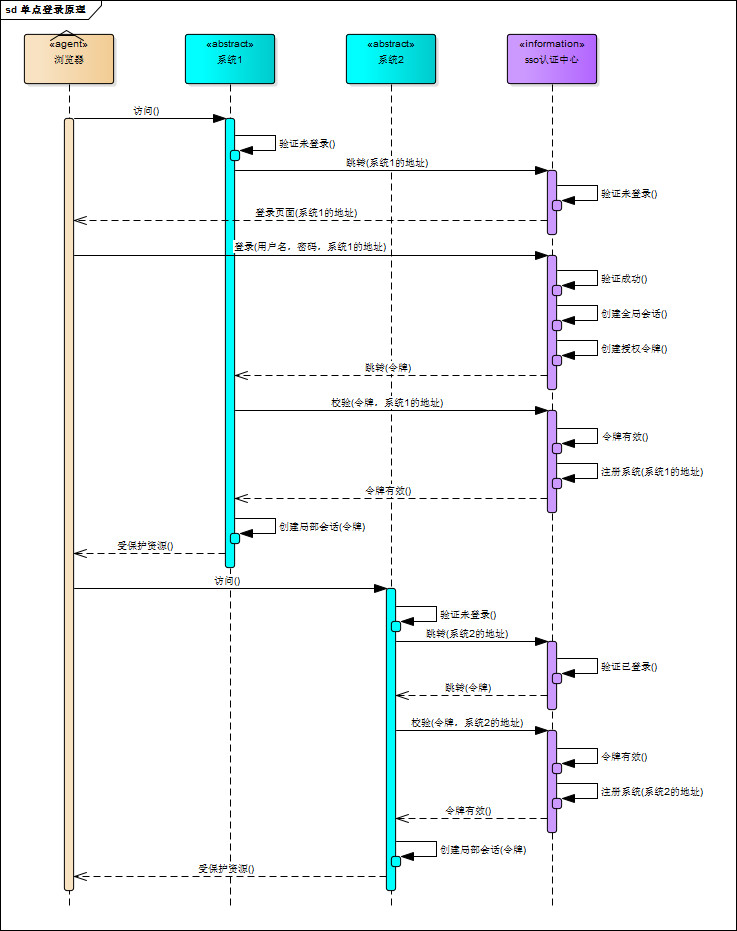
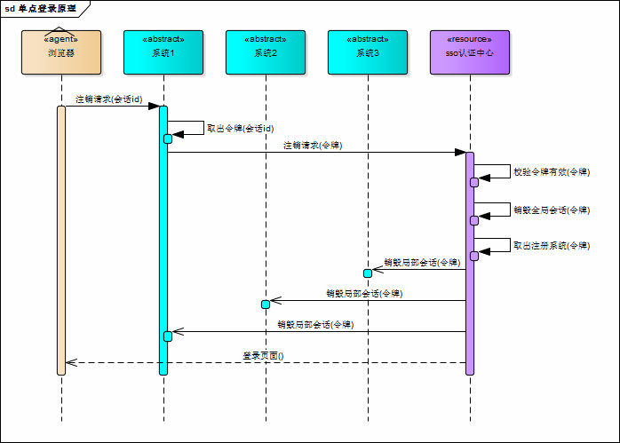
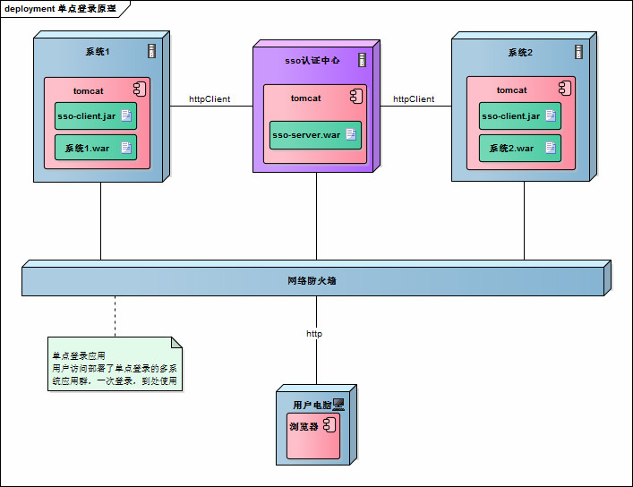
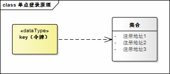

<!--
 * @Description: 深入浅出单点登录
 * @Date: 2019-08-10 01:46:28
 * @LastEditors: phoebus
 * @LastEditTime: 2019-08-14 11:16:20
 -->
# 深入浅出单点登录

## 概述

#### 简述单点登陆(Single Sign On, SSO)

	在多系统应用群中登录一个系统，便可在其他所有系统中得到授权而无需再次登录，包括单点登录与单点注销两部分

#### 单点登陆解决什么问题？

	现在应用服务越来越多(原来是单系统)，很多公司都是一个账号关联多个应用多个服务(现在是多系统多系统)
	这个时候如果每个应用每个服务都要登陆未免太繁琐，单点登陆的作用就是一次登陆，当前浏览器所有相关联的应用/服务都不用再登陆了，简单来说登陆/注销都一次就行

> 当然也有个问题，例如我百度账号和百度云盘是关联的，一旦我想使用两个账号登陆就比较麻烦




#### 单点登陆原理

* SSO需要一个独立的认证中心，只有认证中心能接受用户的用户名密码等安全信息，其他系统不提供登录入口，只接受认证中心的间接授权。间接授权通过令牌实现，SSO认证中心验证用户的用户名密码没问题，创建授权令牌，在接下来的跳转过程中，授权令牌作为参数发送给各个子系统，子系统拿到令牌，即得到了授权，可以借此创建局部会话，局部会话登录方式与单系统的登录方式相同



###### 单点登陆登陆流程

1. 用户访问系统1的受保护资源，系统1发现用户未登录，跳转至SSO认证中心，并将自己的地址作为参数；

2. SSO认证中心发现用户未登录，将用户引导至登录页面；

3. 用户输入用户名密码提交登录申请；

4. SSO认证中心校验用户信息，创建用户与SSO认证中心之间的会话，称为全局会话，同时创建授权令牌；

5. SSO认证中心带着令牌跳转会最初的请求地址（系统1）；

6. 系统1拿到令牌，去SSO认证中心校验令牌是否有效；

7. SSO认证中心校验令牌，返回有效，注册系统1；

8. 系统1使用该令牌创建与用户的会话，称为局部会话，返回受保护资源；

9. 用户访问系统2的受保护资源；

10. 系统2发现用户未登录，跳转至SSO认证中心，并将自己的地址作为参数；

11. SSO认证中心发现用户已登录，跳转回系统2的地址，并附上令牌；

12. 系统2拿到令牌，去SSO认证中心校验令牌是否有效；

13. SSO认证中心校验令牌，返回有效，注册系统2；

14. 系统2使用该令牌创建与用户的局部会话，返回受保护资源。

> 用户登录成功之后，会与SSO认证中心及各个子系统建立会话，用户与SSO认证中心建立的会话称为全局会话，用户与各个子系统建立的会话称为局部会话；局部会话建立之后，用户访问子系统受保护资源将不再通过SSO认证中心

* 全局会话与局部会话约束关系

	* 局部会话存在，全局会话一定存在
	* 全局会话存在，局部会话不一定存在
	* 全局会话销毁，局部会话必须销毁

###### 单点登陆注销流程

	单点登陆的注销原理很简单，在一个子系统中注销，所有子系统的会话都将被销毁



> SSO认证中心一直监听全局会话的状态，一旦全局会话销毁，监听器将通知所有注册系统执行注销操作

1. 用户向系统1发起注销请求；

2. 系统1根据用户与系统1建立的会话id拿到令牌，向SSO认证中心发起注销请求；

3. SSO认证中心校验令牌有效，销毁全局会话，同时取出所有用此令牌注册的系统地址；

4. SSO认证中心向所有注册系统发起注销请求；

5. 各注册系统接收SSO认证中心的注销请求，销毁局部会话；

6. SSO认证中心引导用户至登录页面。

#### 单点登陆系统的部署

* 单点登录涉及SSO认证中心与众子系统，子系统与SSO认证中心需要通信以交换令牌、校验令牌及发起注销请求，因而子系统必须集成SSO的客户端，SSO认证中心则是SSO服务端，整个单点登录过程实质是SSO客户端与服务端通信的过程



> SSO认证中心与SSO客户端通信方式有多种，简单的httpClient为例：web service、rpc、restful api...

#### SSO主要实现方式

1. 共享 cookies

	* 基于共享同域的 cookie 是 Web 刚开始阶段时使用的一种方式，它利用浏览同域名之间自动传递 cookies 机制，实现两个域名之间系统令牌传递问题；
	* 另外，关于跨域问题，虽然 cookies本身不跨域，但可以利用它实现跨域的 SSO 。如：代理、暴露 SSO 令牌值等。

> `缺点`：不灵活而且有不少安全隐患，已经被抛弃。

2. Broker-based( 基于经纪人 )

	* 这种技术的特点就是，有一个集中的认证和用户帐号管理的服务器，经纪人给被用于进一步请求的电子身份存取，中央数据库的使用减少了管理的代价，并为认证提供 `一个公共和独立的 "第三方"` 。
	* 例如 Kerberos 、 Sesame 、 IBM KryptoKnight （凭证库思想 ) 等。 
	
	> Kerberos是由麻省理工大学发明的安全认证服务，已经被 UNIX 和 Windows 作为 默认的安全认证服务集成进操作系统。

3. Agent-based （基于代理人）

	* 在这种解决方案中，有一个自动地为不同的应用程序认证用户身份的代理程序，这个代理程序需要设计有不同的功能。比如，它可以使用口令表或加密密钥来自动地将认证的负担从用户移开。
	* 代理人被放在服务器上面，在服务器的认证系统和客户端认证方法之间充当一个"`翻译`"。例如 SSH 等。

4. Token-based

	* 例如 SecureID、WebID，现在被广泛使用的口令认证，比如 FTP 、邮件服务器的登录认证，这是一种简单易用的方式，实现一个口令在多种应用当中使用

5. 基于网关

6. 基于 SAML

	* SAML(Security Assertion Markup Language ，安全断言标记语言）的出现大大简化了 SSO ，并被 OASIS 批准为 SSO 的执行标准 。
	
	> 开源组织 OpenSAML 实现了 SAML 规范

## java实现

#### 实现思路

	SSO采用客户端/服务端架构

###### sso-client(子系统)

1. 拦截子系统未登录用户请求，跳转至SSO认证中心；

2. 接收并存储SSO认证中心发送的令牌；

3. 与sso-server通信，校验令牌的有效性；

4. 建立局部会话；

5. 拦截用户注销请求，向SSO认证中心发送注销请求；

6. 接收SSO认证中心发出的注销请求，销毁局部会话.
　　
###### sso-server(SSO认证中心)

1. 验证用户的登录信息；

2. 创建全局会话；

3. 创建授权令牌；

4. 与sso-client通信发送令牌；

5. 校验sso-client令牌有效性；

6. 系统注册；

7. 接收sso-client注销请求，注销所有会话.

#### 原理实现

###### 1. sso-client拦截未登录请求

* java拦截请求的方式有`servlet、filter、listener`三种方式，我们采用filter。在sso-client中新建LoginFilter.java类并实现Filter接口，在`doFilter()`方法中加入对未登录用户的拦截

``` java
public void doFilter(ServletRequest request, ServletResponse response, FilterChain chain) throws IOException, ServletException {
    HttpServletRequest req = (HttpServletRequest) request;
    HttpServletResponse res = (HttpServletResponse) response;
    HttpSession session = req.getSession();

    if (session.getAttribute("isLogin")) {
        chain.doFilter(request, response);
        return;
    }
    //跳转至SSO认证中心
    res.sendRedirect("sso-server-url-with-system-url");
}
```

###### 2. sso-server拦截未登录请求

	拦截从sso-client跳转至SSO认证中心的未登录请求，跳转至登录页面，这个过程与sso-client完全一样

###### 3. sso-server验证用户登录信息

* 用户在登录页面输入用户名密码，请求登录，SSO认证中心校验用户信息，校验成功，将会话状态标记为"`已登录`"

``` java
@RequestMapping("/login")
public String login(String username, String password, HttpServletRequest req) {
    this.checkLoginInfo(username, password);
    req.getSession().setAttribute("isLogin", true);
    return "success";
}
```

###### 4. sso-server创建授权令牌

	`授权令牌`是一串`随机字符串`，以什么样的方式生成都没有关系，只要不重复、不易伪造即可

``` java
String token = UUID.randomUUID().toString();
```

###### 5. sso-client取得令牌并校验

* SSO认证中心登录后，跳转回子系统并附上令牌，子系统（sso-client）取得令牌，然后去SSO认证中心校验，在`LoginFilter.java`的`doFilter()`中添加校验

``` java
// ...
// 请求附带token参数
String token = req.getParameter("token");
if (token != null) {
    // 去SSO认证中心校验token
    boolean verifyResult = this.verify("sso-server-verify-url", token);
    if (!verifyResult) {
        res.sendRedirect("sso-server-url");
        return;
    }
    chain.doFilter(request, response);
}
```

* verify()方法使用httpClient实现

``` java
HttpPost httpPost = new HttpPost("sso-server-verify-url-with-token");
HttpResponse httpResponse = httpClient.execute(httpPost);
```

###### 6. sso-server接收并处理校验令牌请求

* 用户在SSO认证中心登录成功后，sso-server创建授权令牌并存储该令牌，所以，sso-server对令牌的校验就是去查找这个令牌是否存在以及是否过期，令牌校验成功后sso-server将发送校验请求的系统注册到SSO认证中心（简单理解就是存起来）

* 令牌与注册系统地址通常存储在key-value数据库（如redis）中，redis可以为key设置有效时间也就是令牌的有效期。redis运行在内存中，速度非常快，正好sso-server不需要持久化任何数据

* 令牌与注册系统地址可以用下图描述的结构存储在redis中，方便查找校验和注销等操作



###### 7. sso-client校验令牌成功创建局部会话

* 令牌校验成功后，sso-client将当前局部会话标记为`已登录`，修改`LoginFilter.java`

``` java
// ...
if (verifyResult) {
    session.setAttribute("isLogin", true);
}
```

* sso-client还需将当前会话id与令牌绑定，表示这个会话的登录状态与令牌相关，此关系可以用java的`hashmap`保存，保存的数据用来处理SSO认证中心发来的注销请求

###### 8. 注销过程

1. 用户向子系统发送带有"logout"参数的请求（注销请求），sso-client拦截器拦截该请求，向SSO认证中心发起注销请求

``` java
String logout = req.getParameter("logout");
if (logout != null) {
    this.ssoServer.logout(token);
}
```

2. SSO认证中心也用同样的方式识别出sso-client的请求是注销请求（带有“logout”参数），SSO认证中心注销全局会话

``` java
@RequestMapping("/logout")
public String logout(HttpServletRequest req) {
    HttpSession session = req.getSession();
    if (session != null) {
		// 触发LogoutListener
        session.invalidate();
    }
    return "redirect:/";
}
```

3. SSO认证中心有一个全局会话的监听器，一旦全局会话注销，将通知所有注册系统注销

``` java
public class LogoutListener implements HttpSessionListener {
    @Override
    public void sessionCreated(HttpSessionEvent event) {}

    @Override
    public void sessionDestroyed(HttpSessionEvent event) {
        // 通过httpClient向所有注册系统发送注销请求
    }
}
```

> 参考：[单点登录（SSO）看这一篇就够了](https://yq.aliyun.com/articles/636281) | [单点登录原理与简单实现](https://4spaces.org/single-sign-on-principle-of-realization/) | [CAS实现SSO单点登录原理](https://www.cnblogs.com/gy19920604/p/6029210.html)
