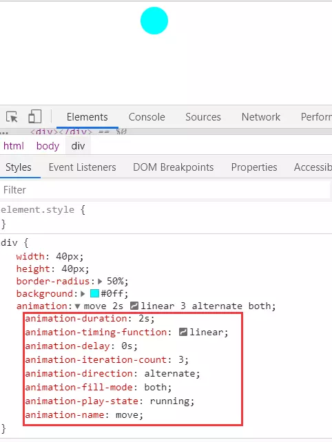

# 认识animation动画

## 概述

#### animation 属性

* animation-name

	指定 @keyframes 动画的名称，也就是绑定具体的运动动画效果

* animation-duration

	指定动画完成一个周期所需要时间，单位秒（s）或毫秒（ms），默认是 0
	当我们指定动画时间，则这个动画便会在这个时间完成，至于动画速度便是这个跟动画的运动距离有关

* animation-timing-function

	指定动画计时函数，即动画的速度曲线，默认是 "ease"
	效果就是指定运动曲线，是曲的还是线性的

* animation-delay(动画延迟)

	指定动画延迟时间，即动画何时开始，默认是 0

* animation-iteration-count

	指定动画播放的次数，默认是 1
	我们可以通过设置这个值来做到循环运动动画效果

* animation-direction

	指定动画播放的方向。默认是 normal
	可以设置单向，或来回循环等

* animation-play-state

	指定动画播放状态，正在运行或暂停。默认是 running
	我们可以通过这个设置进度条效果

* animation-fill-mode

	指定动画填充模式。默认是 none
	即规定动画在播放之前或之后，其动画效果是否可见

## 应用

#### 基础示例

###### 小球移动动画

	一个小球从向右匀速移动 200px，然后向左移动回来，再向右移动过去，最后停留在右侧 200px 处

``` css
div {
    width: 40px;
    height: 40px;
    border-radius: 50%;
    background: #0ff;
    animation: move 2s linear 3 alternate both;
}

@keyframes move {
    0% {
        transform: translate(0, 0);
    }

    100% {
        transform: translate(200px, 0);
    }
}
```

**分析**

* animation是animation8个属性的缩写，具体顺序是

	1. animation-name指定keyframes绑定的动画效果(这里是transform左右移动200px过渡动画)
	2. animation-duration表示移动的时间，这里是2秒
	3. animation-timing-function表示移动曲线，这里是线性移动
	4. animation-iteration-count动画播放次数，这里3次，也就最后移动到右边200px处
	5. animation-direction表示动画播放的方向，这里是表示来回交替运动
	6. animation-fill-mode设置动画填充模式为both

	7. 其实还有animation-delay和animation-play-state，前者动画延迟使用默认0，也就是不延迟；后者使用默认running，它可以控制动画运行或暂停，可以做进度条效果

* keyframes绑定动画效果，这里使用过渡属性transform，translate表示平移动画，从0到100%，从0移动到200px，然后又根据animation来回移动3次共2秒，最后实现右左右移动而停留在右侧200px处



> 参考：[2019年了，你还不会CSS动画？](https://juejin.im/post/5cdd178ee51d456e811d279b)
