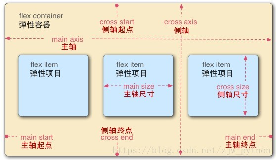
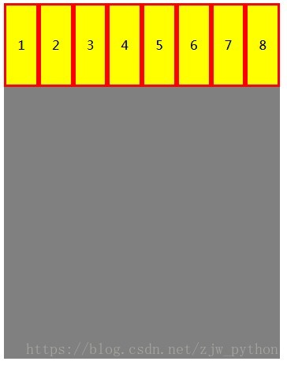
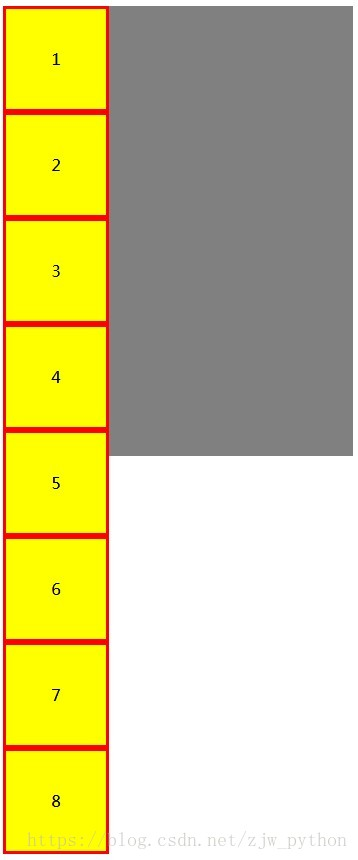
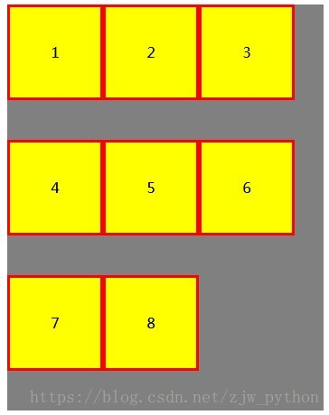
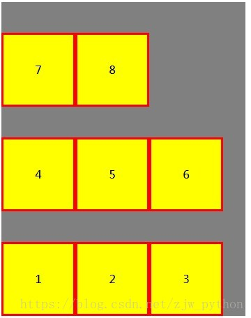

# 认识弹性布局

## 概述

#### 什么是弹性布局？

* 弹性布局，又称"Flex布局"，也可以说弹性盒子布局(Flexbox),可以简便、完整、响应式地实现各种页面布局

* 是一种用于在页面上布置元素的布局模式，使得当页面布局必须适应不同的屏幕尺寸和不同的显示设备时，元素可预测地运行。

* 它不使用浮动，flex容器的边缘也不会与其内容的边缘折叠

#### 弹性布局(盒子)基本概念

* 采用Flex布局的元素，称为Flex容器（container），简称"容器"

	它的所有子元素自动成为容器成员，称为Flex项目（item），简称"项目"

* 每个弹性框布局包含两个轴，弹性项目沿其依次排列的那根轴称为主轴(main axis)。垂直于主轴的那根轴称为侧轴(crossaxis)

* 弹性容器的主轴起点(main start)/主轴终点(main end)和侧轴起点(crossstart)/侧轴终点(cross end)描述了弹性项目排布的起点与终点。它们具体取决于弹性容器的主轴与侧轴中，由writing-mode 确立的方向（从左到右、从右到左，等等）

* 根据弹性容器的主轴与侧轴，弹性项目的宽和高中，对应主轴的称为主轴尺寸(main size)，对应侧轴的称为侧轴尺寸(cross size)

#### 还有哪些布局？

* 固定布局

	总体宽度及其中所有栏的值都以像素单位编写。布局位于用户浏览器的中心

* 流体布局

	总体宽度及其中所有栏的值都以百分比编写。 百分比通过用户浏览器窗口的大小计算

* 混合布局

	混合布局组合两种其他类型的布局 - 弹性和流体。 页面的总宽度为 100%, 但侧栏值设置为 em 单位

* 绝对定位布局

	所有前述布局的外栏使用浮动内容。 而绝对定位布局完全如其名所示 - 有绝对定位的外栏

#### 弹性布局的使用方法

1. 给父元素添加`display: flex/inline-flex;`属性

	即可使容器内容采用弹性布局显示，而不遵循常规文档流的显示方式
	
	设置容器为`display:flex;`添加弹性布局后，显示为块级元素；设置为`display:inline-flex;`，显示为行内元素

2. 容器添加弹性布局后，仅仅是容器内容采用弹性布局，而容器自身在文档流中的定位方式依然遵循常规文档流

3. 设为 Flex布局后，子元素的float、clear和vertical-align属性将失效。但是position属性，依然生效

**示例**

``` html
<div id="div">
	<div class="div1">1</div>
	<div class="div2">2</div>
	<div class="div3">3</div>
	<div class="div4">4</div>
</div>
```

``` css
#div{
	width: 400px;
	height: 400px;
	background-color: yellow;
	/* 父级元素(容器)设置flex弹性布局 */
	display: flex;
}

/* 
	子元素(容器内部)因为父元素设置了flex表现为弹性布局，打破原有文档流
	每个子元素都被当作flex项，将会从左到右依次排列在一行
*/
#div div{
	width: 100px;
	height: 100px;
	background-color: blue;
	color: white;
	font-size: 30px;
	
}
```

> 注：如果`flex`项的宽度总和大于容器，那么 flex 项将按比例缩小，直到它们适应 flex 容器宽度

* 默认水平弹性布局，但是如果给父元素添加属性`flex-direction: column;`，则将会在容器中垂直布局

	* 也可以通过设置 flex-direction: column-reverse; 或 flex-direction: row-reverse; 来使 flex 项以相反的顺序排列
	* 设置`justify-content: center;`可以实现居中对齐的 flex 项
	* 而也可以实现`flex项`在交叉轴上对齐：`justify-content: center;align-items: center;`
	* 设置`flex-grow: 1;`这个属性可以实现`flex项`按比例拉伸(重要)

``` css
#div{
	width: 400px;
	height: 400px;
	background-color: yellow;
	/* 父级元素(容器)设置flex弹性布局 */
	display: flex;
	flex-direction: column;
}
```



#### 容器属性

	看过上面我们可以知道各种属性设置可以实现各种弹性布局的效果，并且可以搭配使用

**父元素属性**

* display：`flex` | `inline-flex`

	将元素定义为弹性容器，其子元素则成为弹性项目

	* 值 flex 使弹性容器成为块级元素。
	* 值 inline-flex 使弹性容器成为单个不可分的行内级元素。

* flex-direction： `row` | `row-reverse` | `column` | `column-reverse` 

	该属性指定了内部元素是如何在 flex 容器中布局的，定义了主轴的方向(正方向或反方向)

	* row和row-reverse表示主轴的方向为水平轴，其轴方向受容器文本方向影响。当direction属性为ltr时，row表示从左到右定向的水平轴，而 row-reverse 表示从右到左; 如果 direction 属性是 rtl，row表示从右到左定向的轴，而 row-reverse 表示从左到右。 
	* column表示主轴方向为垂直轴

* flex-wrap：`nowrap` | `wrap` | `wrap-reverse`

	用于指定Flex子项是否换行

	* nowrap：表示元素被放在一行，不换行，这可能导致溢出 flex 容器，为默认值。
	* wrap：表示换行。
	* wrap-reverse：表示垂向上行排列的方向反转

* flex-flow：`<'flex-direction'>` || `<'flex-wrap'> `

	其是flex-direction 和 flex-wrap 的简写

``` css
element {
	/* 组合效果 */
	flex-flow: column-reverse wrap;
}
```

* justify-content：`flex-start` | `flex-end` | `center` | `space-between` | `space-around`

	用于指定主轴(水平方向)上Flex子项的对齐方式

	* flex-start：表示与行的起始位置对齐；
	* flex-end：表示与行的结束位置对齐；
	* center：表示与行中间对齐；
	* space-between：表示两端对齐，中间间距相等。(要注意特殊情况，当剩余空间为负数或者只有一个项时，效果等同于flex-start；)
	* space-around：表示间距相等，中间间距是两端间距的2倍。(要注意特殊情况，当剩余空间为负数或者只有一个项时，效果等同于center。)

* align-items：`stretch` | `flex-start` | `flex-end` | `center` | `baseline` 

	用于指定侧轴(垂直方向)上Flex子项的对齐方式

	* stretch：表示弹性元素被在侧轴方向被拉伸到与容器相同的高度或宽度（默认值，当项目未设置高度或为auto时被拉伸）；
	* flex-start：表示与侧轴开始位置对齐；
	* flex-end：表示与侧轴的结束位置对齐；
	* center：表示与侧轴中间对齐；
	* baseline：表示基线对齐，当行内轴与侧轴在同一线上，即所有Flex子项的基线在同一线上时，效果等同于flex-start

* align-content：`flex-start` | `flex-end` | `center` | `space-between` | `space-around` | `stretch` 

	该属性只作用于多行的情况下，用于多行的对齐方式

	* stretch：表示拉伸所有行来填满剩余空间。剩余空间平均的分配给每一行；
	* flex-start：表示各行与侧轴开始位置对齐，第一行紧靠侧轴开始边界，之后的每一行都紧靠前面一行；
	* flex-end：表示各行与侧轴的结束位置对齐，最后一行紧靠侧轴结束边界，之后的每一行都紧靠前面一行；
	* center：表示各行与侧轴中间对其；
	* space-between：表示两端对齐，中间间距相等。(要注意特殊情况，当剩余空间为负数时，效果等同于flex-start；)
	* space-around：表示各行之间间距相等，中间间距是两端间距的2倍。(要注意特殊情况，当剩余空间为负数时，效果等同于center；)

**子元素(项目)属性**

* order：数字 

	该属性用来指定Flex子项的排列顺序，数值越小，越靠前，可以为负数，默认为0，数值相同时按照源码中的顺序排列

* flex-grow：数字 

	项目的拉伸因子，当有剩余空间时，项目会根据各自的拉伸因子进行拉伸。默认为0（不拉伸），负值无效。

	> 例如，当项目拉伸因子都为1时，表示他们等分剩余空间，如果此时某一项的拉伸因子为2，那么它占据的剩余空间将比其他项多一倍，按1:2三等分拉伸填充

* flex-shrink：数字 

	项目的缩小比例，默认为1，负值无效。flex 元素仅在默认宽度之和大于容器的时候才会发生收缩，其收缩的大小是依据 flex-shrink 的值。

	> 例如，如果所有项目的flex-shrink属性都为1，当空间不足时，都将等比例缩小。如果一个项目的flex-shrink属性为0，其他项目都为1，则空间不足时，前者不缩小。

* flex-basis：`auto` | `content` | `宽度` 

	指定了 flex 元素在主轴方向上的初始大小，默认为auto。

	* content表示自动调整项目宽度；
	* 宽度表示设置宽度（可以使用px，百分比等）；
	* auto表示如果项目没有设置宽度，则使用content。

* flex：`none` | `[ <'flex-grow'> <'flex-shrink'>? || <'flex-basis'> ]` 

	是flex-grow、flex-shrink 和 flex-basis的简写，默认值为0 1 auto。后两个属性可选。该属性有两个快捷值：auto (1 1 auto) 和 none (0 0 auto)

* align-self：`auto` | `flex-start` | `flex-end` | `center` | `baseline` | `stretch` 

	用来单独指定某Flex子项的对齐方式 

	* auto表示默认值，查找父元素的align-items值，如果没有父元素则取值为stretch；其他值同align-items属性


#### 为什么要使用弹性布局？


## 应用

#### 弹性布局的使用场景

* 垂直居中对齐场景

	很多场景垂直居中实现起来其实是很麻烦的，但是使用弹性布局却是很简单可以实现

	* display:flex; justify-content: center; align-items: center;

#### 示例

###### 水平弹性布局

	flex-direction:row 

``` html
<!DOCTYPE html>
<html>
    <head>
        <meta charset="utf-8" />
        <title>测试</title>
        <style type="text/css">
            #container{
                background-color:gray;
                width:350px;
                height:450px;
                display:flex;
                flex-direction:row;
            }

            .item{
                background:yellow;
                width:100px;
                height:100px;
                border:3px solid red;
                text-align:center;
                line-height:100px;
            }
        </style>
    </head>
    <body>
        <div id="container">
            <div class="item" id="item_1">1</div>
            <div class="item" id="item_2">2</div>
            <div class="item" id="item_3">3</div>
            <div class="item" id="item_4">4</div>
            <div class="item" id="item_5">5</div>
            <div class="item" id="item_6">6</div>
            <div class="item" id="item_7">7</div>
            <div class="item" id="item_8">8</div>
        </div>
    </body>
</html>
```



###### 子项倒序布局

	使用 flex-direction:row-reverse 替换 flex-direction:row 


###### 垂直布局

	使用 flex-direction:column 替换 flex-direction:row 



> 注，这里可以看出子项布局超出了容器(父元素大小)，我们可以设定换行或设定比例

###### 子项自动换行布局

	使用 flex-wrap:wrap



> 这个允许子项进行换行布局，是一个比较常见的弹性布局效果，可以实现PC端显示直接转为移动端屏幕显示

###### 子项自动换行布局的翻转

	使用 flex-wrap:wrap-reverse，实现flex-wrap:wrap换行布局翻转的效果



> [其他效果图看这里](https://blog.csdn.net/zjw_python/article/details/80532823)

> 参考：[弹性布局详解——5个div让你学会弹性布局](https://www.cnblogs.com/jerehedu/p/7358329.html) | [什么是弹性（Flex）布局 ？15分钟弄懂Flex布局](https://www.php.cn/css-tutorial-410706.html) | [Flex 弹性盒子布局](https://blog.csdn.net/zjw_python/article/details/80532823) | [Flex 布局教程：语法篇](http://www.ruanyifeng.com/blog/2015/07/flex-grammar.html) | [Flex 布局教程：实例篇](http://www.ruanyifeng.com/blog/2015/07/flex-examples.html)
