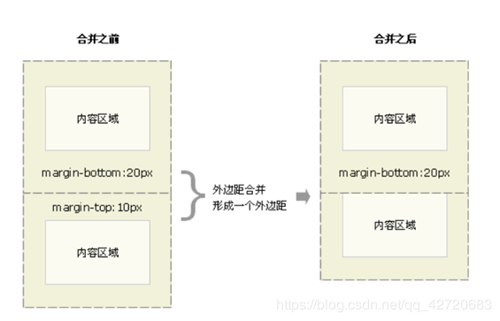

# 认识CSS盒模型

## 概述

#### 简介

	CSS盒模型分为：标准盒模型和IE盒模型
	概念理解就是浏览器(渲染)将所有元素都表示为一个个矩形盒子，而CSS样式就决定这个盒子的大小、位置、颜色等属性

* 一般盒模型有几个基础的参数，但不同盒模型的范围大小归类有点小区别(意思是标准不同)

	* width和height：内容的宽度、高度（不是盒子的宽度、高度）。

	* padding：内边距。

	* border：边框。

	* margin：外边距。

* 也就是：内容区域 content area、内边距区域 padding area、边框区域 border area、外边距区域 margin area

> 来个不错的盒子模型说明图


#### 标准盒模型

	标准W3C盒子模型，也叫内容盒子：是指块元素box-sizing属性为content-box的盒模型

* 来张图说明


> 从上图可以看出，标准盒模型的width和height的大小是不包括其他(margin、border、padding)，就是content(内容区域)的大小，而margin、border、padding是我们比较常用的盒子样式，即增加内边距、边框和外边距不会影响内容区域的尺寸，但是会增加元素框的总尺寸

!> 也就是盒子的大小是这样计算的：

* 盒子总宽度 = margin + border + padding + width

#### IE盒模型

	也叫怪异盒模型（边框盒子）：是指块元素box-sizing属性为border-box的盒模型

* 来张图说明


> 从图中可以看出，IE盒模型的`width和height的大小` = `内容区域content` + `border` + `padding` 的宽高

!> 也就是盒子的大小是这样计算的：

* 盒子总宽 = margin + width

#### 二者的区别

* 看盒子模型的说明就知道，盒子的width和高包不包含border和padding就是区别两个盒子模型的方式，而我们一般都是使用不包含border和padding的方式(Chrome)，然后根据IE做兼容处理

**兼容实现**

	假设在IE的width是250px，非IE是300px，那么我们可以通过使用!important区分两者

``` css
width：250px !important；	// 非IE识别使用
width：300px;	// IE识别使用
```

> 由于IE会忽略!important，所以他会使用后面的300px；非IE浏览器的!important优先级高于后面的，此时会使用width：250px。

#### 面试该怎么说？

	说说CSS盒模型

* 首先盒子模型就是浏览器(渲染)将所有元素都表示为一个个矩形盒子，而CSS样式就决定这个盒子的大小、位置、颜色等属性

* 而因为不同浏览器发展存在差异的问题，现在存在两种盒子模型：标准盒子模型(W3C标准)和IE盒子模型

* 两者的结构是一样的：content内容区域 + padding内边距区域 + border边框区域 + margin外边距区域，这些属性就组成了一个元素的盒子模型，而一个个的盒子模型就构成了我们所看到的页面

* 最后就是两个盒子模型的区别了：盒子的宽度是否包含元素的边框(border)和内边距(padding)，标准盒子模型是包不包括的，而IE盒子模型是包括的

## 应用

#### 基础语法

``` css
/* padding、border、margin写法基本一样 */
.padding-demo {
	Padding：10px； // 四个内边距都为10px
	Padding：10px 20px;   // 上下内边距为10px，左右内边距为20px
	Padding：10px 20px 30px；// 上10px,左右20px，下30px
	Padding：10px 20px 30px 40px;	// 上右下左分别为10 20 30 40
}
```

!> 注意：是 `上 右 下 左`

#### 特别说明

###### margin的重叠也叫margin塌陷

	标准文档流中，两个盒子，分别有上下外边距，竖直方向的margin不叠加，只取较大的值作为margin(水平方向的margin是可以叠加的)

**示例分析**

``` html
<!DOCTYPE html>
<html lang="en">
<head>
	<meta charset="UTF-8">
	<title>margin叠加</title>
	<style>
		*{
			padding: 0;
			margin: 0;
		}
		.a{
			width: 100px;
			height: 100px;
			border:1px solid;
			background-color: teal;
			margin-bottom: 10px;
		}
		.b{
			width: 100px;
			height: 100px;
			border:1px solid;
			background-color: red;
			margin-top: 20px;
		}
 
	</style>
</head>
<body>
	<div class="a"></div>
	<div class="b"></div>
</body>
</html>
```



* 看这张图就懂了，竖直方向的时候，两个盒子的margin会取大的作为两者的margin

> 注：margin这个属性，本质上描述的是兄弟和兄弟之间的距离；而如果要设置父子之间的距离，我们最好使用父元素的padding

> 参考：[前端面试题—css盒子模型](https://blog.csdn.net/qq_42720683/article/details/83584970)
