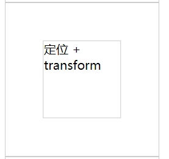

# 水平垂直居中效果

## 常用效果

#### 定位 + margin负值

```html
<style>
	.out{
      width: 200px;
      height:200px;
      border:1px solid #ccc;
    }
	.in{
      border: 1px solid #ccc;
    }
	.out-4{
      position: relative;
    }
    .in-4{
      position: absolute;
      top:50%;
      left:50%;
      width:100px;
      height:100px;
      margin-left:-50px;
      margin-top: -50px;
    }
</style>

<div class="out out-4">
	<div class="in in-4">定位 + margin负值</div>
</div>
```

**效果**


#### 定位 + transform

```html
<style>
	.out{
      width: 200px;
      height:200px;
      border:1px solid #ccc;
    }
	.in{
      border: 1px solid #ccc;
    }
	.out-3{
      position: relative;
    }
    .in-3{
      position: absolute;
      top:50%;
      left:50%;
      width:100px;
      height:100px;
      transform: translate(-50%, -50%);
    }
</style>
<div class="out out-3">
    <div class="in in-3">定位 + transform</div>
</div>
```

**效果**



#### flex方式

```html
<style>
	.out{
      width: 200px;
      height:200px;
      border:1px solid #ccc;
    }
	.in{
      border: 1px solid #ccc;
    }
	.out-1{
      display:flex;
      justify-content: center;
      align-items: center;
    }
</style>
<div class="out out-1">
    <div class="in in-1">flex方式</div>
</div>
```

**实现效果**


#### display:table-cell方式

```html
<style>
	.out{
      width: 200px;
      height:200px;
      border:1px solid #ccc;
    }
	.in{
      border: 1px solid #ccc;
    }
	.out-2{
      display: table-cell;
      vertical-align: middle;
      text-align: center;
    }
    .in-2{
      display: inline-block;
    }
</style>
<div class="out out-2">
    <div class="in in-2">display:table-cell方式</div>
</div>
```

**居中效果**


> [参考](https://github.com/BrucePhoebus/developer-note/tree/master/知识笔记/大前端/基础/HTML+CSS/CSS/布局/居中效果/index.html) | [CSS实现元素居中](知识笔记/大前端/基础/HTML+CSS/CSS/布局/居中效果/CSS实现元素居中.md)


