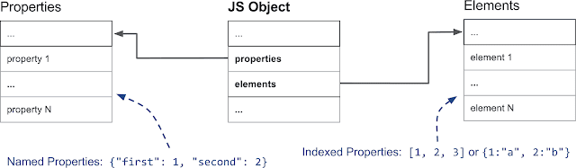
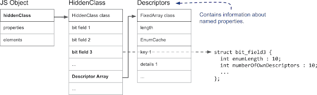
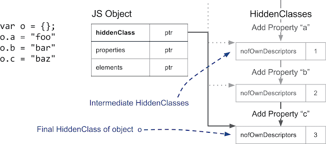
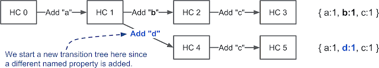
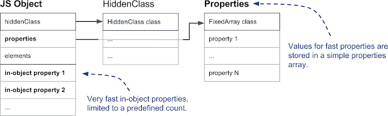
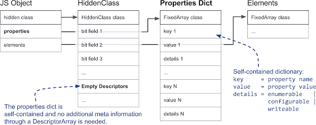

# JavaScript对象属性底层原理

> [参考](https://www.cnblogs.com/full-stack-engineer/p/9684072.html)

## 对象属性类型

#### 数据属性

* [[Configurable]]

	表示能否通过delete删除属性从而重新定义属性，能否修改属性的特性，或者能否把属性修改为访问器属性，特性默认值为true

* [[Enumberable]]

	表示能否通过for-in循环返回属性，特性默认值为true

* [[Wtiteable]]

	表示能否修改属性的值，特性默认值为true

* [[Value]]

	包含这个属性的数据值，读取属性值/写入属性值，从这个位置读/把新值保存在这个位置，这个特性的默认值为undefined

#### 访问器属性

* [[configurable]]

	表示能否通过delete删除属性从而重新定义属性，能否修改属性的特性，或者能否把属性修改为访问器属性，特性默认值为true

* [[Enumberable]]

	表示能否通过for-in循环返回属性，特性默认值为true

* [[Get]]

	在读取属性时调用的函数，默认值为undefined

* [[Set]]

	在写入属性时调用的函数，默认值为undefined

#### 定义对象的访问器属性 - Object.defineProperty

**示例**

```js
var book = {
    _year: 2004,
    edition: 1
};

Object.defineProperty(book, "year", {
    get: function(){
        return 2018;
    },
    set: function(newValue){
        if (newValue > 2004) {
			this._year = newValue;
			this.edition += newValue - 2004;
        }
    }
});
console.log(book.year);	// 2018
book.year = 2005;
console.log(book.year);	// 2018
```

> 对象是通过Object.defineProperty的get和set操作

## 对象创建底层分析

#### 对象创建

**示例**

	为什么下面第一种方式会报错而第二种不会？

```js
//构造函数创建
var object=new Object();
object.x=1;
object.2=1; // Unexpected number
// 字面量创建
var object = {
  x: 1,
  2: 2
};//不报错
```

**分析问题**

```js
window.2=2; // 假设不会出错
2==2;	// 这个地方应该怎么处理？--没法处理
```

**那么字面量为什么不会出错？**

	当启用慢模式时以Hash作为底层存储结构，key为字符串，字面量方式会存在类型转换。

#### 对象属性详解 Chrome(V8)

###### V8中的快速属性

	对象大多数时候表现为Dictionary：以字符串为key，任意object为值。

**命名属性**

	* 存储结构可以是数组也可以是HashMap
	* 具有额外的辅助信息(存储在描述符数组中)

*示例*

```js
{a：'foo'，b：'bar'}
```

**数组索引属性(元素)**

	* 存储结构通常为简单的数组结构。但某些情况下也会切换到Hash结构以节省内存。
	* 可以使用键来推断它们在属性数组中的位置

*示例*

```js
数组['foo'，'bar']有两个数组索引属性：0，值为'foo'; 1，值为'bar'
```

* 数组索引属性和命名属性存储在两个单独的数据结构中



###### 隐藏类和描述符数组

	每个JS对象都有一个隐藏类与之关联。
	隐藏类存储有对象结构信息(属性数和对对象原型的引用)，以及从属性名称到属性的索引映射。
	隐藏类是动态创建的，并随着对象的变化而动态更新。



* 在V8中，位于堆内存并由GC管理的所有JS对象的第一个字段都指向隐藏类。

	隐藏类存储中包含属性的数量，和一个指向描述符数组的指针。
	在这个描述符数组中包含有命名属性的信息，例如命名属性的名称和存储属性值的位置。

> 注：具有相同结构的JS对象(相同顺序和相同命名的属性)，他们的隐藏类会指向同一个，以此达到复用的目的。对于不同结构的JS对象将使用不同的HiddenClass。



* 每次添加新属性时，都会更改对象的HiddenClass。V8维护了一个把HiddenClasses链接在一起的转换树。按相同属性添加顺序将得到一样的隐藏类。


* 如果我们创建一个添加了不同属性的新对象('d')，则会创建一个单独的隐藏类分支



**结论**

	具有相同结构的对象（相同属性的相同顺序）具有相同的HiddenClass
	默认情况下，每个添加的新命名属性都会导致创建一个新的HiddenClass。
	添加数组索引属性不会创建新的HiddenClasses。

###### 三种不同的命名属性

* 内嵌属性与普通属性

	V8支持对象内属性，存储在对象本身，可以直接访问，速度最快。
	内嵌属性的数量由对象的初始大小预先确定。
	如果添加的属性多于对象中的空间，则它们将存储在隐藏类链上，由隐藏类指向的一个属性数组。



1. (普通属性中的)快属性与慢属性

	直接存储在属性数组(如上图中的Properties结构)中的属性为'快属性'。可通过属性数组中的索引访问，若要从属性名称获取属性数组中的实际位置，必须查看HiddenClass上的描述符数组才能知道(如上)。
	
	慢属性使用HashMap作为属性存储，所有属性元信息不再存储在HiddenClass上的描述符数组中，而是直接存储在属性Hash中(没有缓存，所以叫慢属性)。



> 注：过多的添加或删除属性，会从快属性模式切换为慢属性模式。

**结论**

	三种不同的命名属性类型：in-object，fast和slow(dictionary)。

	内嵌属性直接存储在对象本身上，并提供最快的访问。

	快速属性存在于属性存储中，所有元信息都存储在HiddenClass上的描述符数组中。
	慢属性存在于自包含的属性字典中，不再通过HiddenClass共享元信息。
	慢属性提供有效的属性删除和添加，但访问速度比其他两种类型慢。

###### 数组索引属性

* 连续和有缺口的数组索引属性

	如果删除索引元素，或者例如没有定义它，则会在连续存储中出现漏洞。一个简单的例子是[1，，3]，其中第二个项是一个缺口。

**示例**

```js
const o = ["a", "b", "c"];
console.log(o[1]);          // Prints "b".

delete o[1];                // Introduces a hole in the elements store.
console.log(o[1]);          // Prints "undefined"; property 1 does not exist.
o.\_\_proto\_\_ = {1: "B"};     // Define property 1 on the prototype.

console.log(o[0]);          // Prints "a".
console.log(o[1]);          // Prints "B".
console.log(o[2]);          // Prints "c".
console.log(o[3]);          // Prints undefined
```


> 当有缺口的时候会在该位置打上the_hole标记表示不存在的属性，可以大大提高数组操作效率

* 快速数组索引属性或Hash数组索引属性

	快速数组索引属性是简单的VM内部数组，其中属性索引映射到数组索引属性存储中的索引。但是，该结构对于较大的数组但占用元素较少的情况相当浪费内存，这种情况会使用HashMap来节省内存，但代价是访问速度稍慢。

```js
const sparseArray = [];
sparseArray [9999] ='foo'; //创建一个包含字典元素的数组。
```

> 注：只要使用自定义描述符定义索引属性，V8就会转向慢数组索引属性：

```js
const array = [];
Object.defineProperty(array, 0, {value: "fixed", configurable: false});
console.log(array[0]);      // Prints "fixed".
array[0] = "other value";   // Cannot override index 0.
console.log(array[0]);      // Still prints "fixed".
```