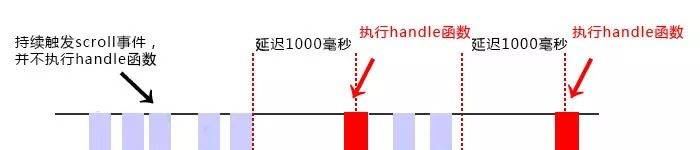
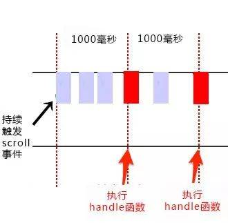

# 防抖节流原理与实现

## 概述

#### 什么是防抖节流？

	在前端开发的过程中，我们经常会需要绑定一些持续触发的事件，如 resize、scroll、mousemove 等等，但有些时候我们并不希望在事件持续触发的过程中那么频繁地去执行函数
	防抖和节流的目的都是为了减少不必要的计算，不浪费资源，只在适合的时候再进行触发计算

* 防抖（debounce）

	所谓防抖，就是指触发事件后在 n 秒内函数只能执行一次，如果在 n 秒内又触发了事件，则会重新计算函数执行时间

**例如**

	持续触发scroll事件时，并不执行handle函数，当1000毫秒内没有触发scroll事件时，才会延时触发scroll事件



``` js
// 防抖
function debounce(fn, wait) {    
    var timeout = null;    
    return function() {        
        if(timeout !== null)   clearTimeout(timeout);        
        timeout = setTimeout(fn, wait);    
    }
}
// 处理函数
function handle() {    
    console.log(Math.random()); 
}
// 滚动事件
window.addEventListener('scroll', debounce(handle, 1000));
```

> 上述简单实现中可以看出，当持续触发scroll事件时，事件处理函数handle只在停止滚动1000毫秒之后才会调用一次，也就是说在持续触发scroll事件的过程中，事件处理函数handle一直没有执行

* 节流（throttle）

	所谓节流，就是指连续触发事件但是在 n 秒中只执行一次函数。节流会稀释函数的执行频率

**示例**

	持续触发scroll事件时，并不立即执行handle函数，每隔1000毫秒才会执行一次handle函数



> 函数节流主要有两种实现方法：时间戳和定时器

``` js
// 时间戳实现
var throttle = function(func, delay) {            
　　var prev = Date.now();            
　　return function() {                
　　　　var context = this;                
　　　　var args = arguments;                
　　　　var now = Date.now();                
　　　　if (now - prev >= delay) {                    
　　　　　　func.apply(context, args);                    
　　　　　　prev = Date.now();                
　　　　}            
　　}        
}        
function handle() {            
　　console.log(Math.random());        
}        
window.addEventListener('scroll', throttle(handle, 1000));

/* 
	时间戳实现分析
	
		当高频事件触发时，第一次会立即执行，而后再怎么频繁地触发事件，也都是每delay时间才执行一次。而当最后一次事件触发完毕后，事件也不会再被执行了 
 */

// 定时器实现
var throttle = function(func, delay) {            
    var timer = null;            
    return function() {                
        var context = this;               
        var args = arguments;                
        if (!timer) {                    
            timer = setTimeout(function() {                        
                func.apply(context, args);                        
                timer = null;                    
            }, delay);                
        }            
    }        
}        
function handle() {            
    console.log(Math.random());        
}        
window.addEventListener('scroll', throttle(handle, 1000));
/* 
	定时器实现分析

		当触发事件的时候，我们设置一个定时器，再次触发事件的时候，如果定时器存在，就不执行，直到delay时间后，定时器执行执行函数，并且清空定时器，这样就可以设置下个定时器。

		当第一次触发事件时，不会立即执行函数，而是在delay秒后才执行。而后再怎么频繁触发事件，也都是每delay时间才执行一次。当最后一次停止触发后，由于定时器的delay延迟，可能还会执行一次函数。
 */
```

> 如果精确点，我们可以用时间戳 + 定时器实现节流，当第一次触发事件时马上执行事件处理函数，最后一次触发事件后也还会执行一次事件处理函数。

``` js
// 时间戳 + 定时器实现节流
var throttle = function(func, delay) {     
    var timer = null;     
    var startTime = Date.now();     
    return function() {             
        var curTime = Date.now();             
        var remaining = delay - (curTime - startTime);             
        var context = this;             
        var args = arguments;             
        clearTimeout(timer);              
        if (remaining <= 0) {                    
            func.apply(context, args);        
            startTime = Date.now();
        } else {                    
            timer = setTimeout(func, remaining);              
        }      
    }
}
function handle() {      
    console.log(Math.random());
} 
window.addEventListener('scroll', throttle(handle, 1000));
```

> 在节流函数内部使用开始时间startTime、当前时间curTime与delay来计算剩余时间remaining，当remaining<=0时表示该执行事件处理函数了，如果还没到时间的话就设定在remaining时间后再触发，当然在remaining这段时间中如果又一次触发事件，那么会取消当前的计时器，并重新计算一个remaining来判断当前状态。

!> 函数节流不管事件触发有多频繁，都会保证在规定时间内一定会执行一次真正的事件处理函数，而函数防抖只是在最后一次事件后才触发一次函数


## 应用

#### 适用场景

###### 使用防抖的场景

* search搜索联想，用户在不断输入值时，用防抖来节约请求资源

* window触发resize的时候，不断的调整浏览器窗口大小会不断的触发这个事件，用防抖来让其只触发一次

* 在用户输入停止一段时间过后再去获取数据，而不是每次输入都去获取

	实现原理：判断是否到达等待时间，如果没到达的话就继续加入任务队列等待执行

``` js
  function debounce<Return>(
    fn: (...params: any[]) => Return, 
    wait: number, /** 等待时间 */
    immediate: boolean /** 是否立刻执行一次 */
  ): Executor<Return> {
    const now: () => number = Date.now.bind(Date);
    let lastTime: number = 0;
    let timer: number = null;
    let params: IArguments = null;
    let _this: Function | null = null;
 
    function later(): void {
      const nowTime: number = now();
 
      if (nowTime - lastTime < wait) {
        // 如果还不够等待时间则继续等待
        const remainTime = wait - (nowTime - lastTime);
 
        timer = setTimeout(later, remainTime);
      } else {
        // 已到等待时间，执行回调
        debouncer.result = fn.apply(_this, params);
 
        timer = null;
        _this = null;
        params = null;
      }
    }
 
    function execute(): (Return | null) {
      lastTime = now();
      _this = this;
      params = arguments;
 
      try {
        if (immediate && timer === null) {
          // 立刻执行一次
          debouncer.result = fn.apply(_this, params);
        }
 
        return debouncer.result;
      } finally {
        if (timer === null) {
          // 加入时间队列，等待执行
          timer = setTimeout(later, wait);
        }
      }
    }
 
    // 创建执行器
    const debouncer: Executor<Return> = {
      execute,
      result: null,
    };
 
    return debouncer;
  };
```

**使用**

``` js
import utils from '../index';
 
const input = document.querySelector('input');
const executor = utils.fn.debounce(function(value) {
	console.log('fetch');
	
	return value;
}, 300);
 
let value = null;
 
input.addEventListener('input', function(e) {
	executor.execute(e.target.value);
	value = executor.result;
});
```

###### 使用节流的场景

* 在页面的无限加载场景下，我们需要用户在滚动页面时，每隔一段时间发一次 Ajax 请求，而不是在用户停下滚动页面操作时才去请求数据

* 懒加载时要监听计算滚动条的位置，但不必每次滑动都触发，可以降低计算的频率，而不必去浪费资源

* 鼠标不断点击触发，mousedown(单位时间内只触发一次)

* 监听滚动事件，比如是否滑到底部自动加载更多，用throttle来判断

* 做商品预览图的放大镜效果时，不必每次鼠标移动都计算位置

``` js
throttle: function <Return>(
    fn: (...params: any[]) => Return,
    wait: number,
    {
      isExecuteAtStart = true,
      isExecuteAtEnd = true,
    }: ThrottleOptions = {
      isExecuteAtStart: true,
      isExecuteAtEnd: true,
    }
  ): Executor<Return> {
    let timer: number = null;
    let _this: Function = null;
    let params: IArguments = null;
 
    function execute(): (Return | null) {
      _this = this;
      params = arguments;
 
      if (isExecuteAtStart && timer === null) {
        // 如果需要开始的时候执行且没有计时器
        executor.result = fn.apply(_this, params);
        _this = null;
        params = null;
      }
 
      if (isExecuteAtEnd) {
        // 如果结束的时候需要执行
        if (timer === null) {
          timer = setTimeout(function () {
            executor.result = fn.apply(_this, params);
            _this = null;
            params = null;
            timer = null;
          }, wait);
        }
      }
 
      return executor.result;
    }
 
    const executor: Executor<Return> = {
      execute,
      result: null
    };
 
    return executor;
}
```

#### js原生实现防抖节流

###### 实现防抖

``` js
/**
 * @desc 函数防抖
 * @param fn 函数
 * @param waitTime 延迟执行毫秒数
 * @param immediate true 表立即执行，false 表非立即执行
 */
function debounce(fn, waitTime, immediate) {
	let timeout;
	return () {
		let context = this;	// 确保函数返回的this指向不变
		let args = arguments;	// 确保依旧能接受参数

		if (timeout) {
			clearTimeout(timeout);
		}

		if (immediate) {
            let callNow = !timeout;
            timeout = setTimeout(() => {
                timeout = null;
            }, wait);
            if (callNow) {
				fn.apply(context, args);
			}
        } else {
            timeout = setTimeout(function(){
                fn.apply(context, args);
            }, wait);
        }
	}
}

content.onmousemove = debounce(count, 1000, true);
```

###### 实现节流

``` js
/**
 * @desc 函数节流
 * @param func 函数
 * @param wait 延迟执行毫秒数
 * @param type 1 表时间戳版，2 表定时器版
 */
function throttle(func, wait, type) {
    if(type===1){
        let previous = 0;
    }else if(type===2){
        let timeout;
    }
    return function() {
        let context = this;
        let args = arguments;
        if(type === 1){
            let now = Date.now();

            if (now - previous > wait) {
                func.apply(context, args);
                previous = now;
            }
        }else if(type === 2){
            if (!timeout) {
                timeout = setTimeout(() => {
                    timeout = null;
                    func.apply(context, args)
                }, wait)
            }
        }
    }
}
```

#### Vue实现防抖节流

	封装utils工具、封装组件

###### 封装utils工具

**封装防抖工具**

``` js
let timeout = null;
function debounce(fn, wait) {
	if(timeout !== null) {
		clearTimeout(timeout);
	}
  	timeout = setTimeout(fn, wait);
}
export default debounce
```

*使用*

``` js
<input type="text" @input="debounceInput($event)">

import debounce from './utils'
export default {
  methods: {
    debounceInput(E){
      debounce(() => {
        console.log(E.target.value)
      }, 1000)
    }
  }
}
```

> 这里是封装成延迟实现，也可以封装第一次理解绑定现实

###### 封装成组件

	input双向绑定防抖节流组件封装

**防抖组件实现**

``` html
<template>
  	<el-input v-bind="$attrs" @input="debounceInput"/>
</template>

<script>
export default {
  data() {
    return {
      timeout: null
    }
  },
  methods: {
    debounceInput(value){
      if(this.timeout !== null) {
		  clearTimeout(this.timeout);
	  }
      this.timeout = setTimeout(() => {
        this.$emit('input', value);
      }, 1000)
    }
  }
}
</script>
```

*组件使用*

``` html
<template>
  	<debounce-input placeholder="防抖" prefix-icon="el-icon-search" @input="inputEve"></debounce-input>
</template>

<script>
import debounceInput from './debounce-input'
export default {
  methods: {
    inputEve(value){
      console.log(value)
    }
  },
  components: {
    debounceInput
  }
}
</script>
```

###### Vue函数式组件实现防抖

	原理：在vNode中拦截on下面的click、input事件做防抖处理

``` js
const debounce = (fun, delay = 500, before) => {
  let timer = null
  return (params) => {
    timer && window.clearTimeout(timer)
    before && before(params)
    timer = window.setTimeout(() => {
       // click事件fun是Function  input事件fun是Array
      if (!Array.isArray(fun)) {
        fun = [fun]
      }
      for (let i in fun) {
        fun[i](params)
      }
      timer = null
    }, parseInt(delay))
  }
}
export default {
  name: 'Debounce',
  functional: true, // 静态组件 当不声明functional时该组件同样拥有上下文以及生命周期函数
  render(createElement, context) {
    const before = context.props.before
    const time = context.props.time
    const vnodeList = context.slots().default
    if (vnodeList === undefined){
      console.warn('<debounce> 组件必须要有子元素')
      return null
    }
    const vnode = vnodeList[0] || null // 获取子元素虚拟dom
    if (vnode.tag === 'input') {
      const defaultFun = vnode.data.on.input
      const debounceFun = debounce(defaultFun, time, before) // 获取节流函数
      vnode.data.on.input = debounceFun
    } else if (vnode.tag === 'button') {
      const defaultFun = vnode.data.on.click
      const debounceFun = debounce(defaultFun, time, before) // 获取节流函数
      vnode.data.on.click = debounceFun
    } else if (vnode.componentOptions && vnode.componentOptions.tag === 'el-input') {
      const defaultFun = vnode.componentOptions.listeners.input
      const debounceFun = debounce(defaultFun, time, before) // 获取节流函数
      vnode.componentOptions.listeners.input = debounceFun
    } else if (vnode.componentOptions && vnode.componentOptions.tag === 'el-button') {
      const defaultFun = vnode.componentOptions.listeners.click
      const debounceFun = debounce(defaultFun, time, before) // 获取节流函数
      vnode.componentOptions.listeners.click = debounceFun
    } else {
      console.warn('<debounce> 组件内只能出现下面组件的任意一个且唯一 el-button、el-input、button、input')
      return vnode
    }
    return vnode
  }
}
```

**使用**

``` html
<template>
	<debounce time="300" :before="beforeFun">
		<input type="text" v-model="inpModel" @input="inputChange"/>
	</debounce>
</template>

<script>
import debounce from './debounce'
export default {
  data() {
    return {
      inpModel: 1
    }
  },
  methods: {
    inputChange(e){
      console.log(e.target.value, '防抖')
    },
    beforeFun(e){
      console.log(e.target.value, '不防抖')
    }
  },
  components: {
    debounce
  }
}
</script>
```

> 参考：[js防抖和节流](https://www.cnblogs.com/momo798/p/9177767.html) | [函数防抖和节流](https://www.jianshu.com/p/c8b86b09daf0) | [【进阶 6-6 期】深入篇 | 阿里 P6 必会 Lodash 防抖节流函数实现原理](https://juejin.im/post/5d1bf9edf265da1b7004c3e1) | [VUE防抖与节流的最佳解决方案——函数式组件](https://juejin.im/post/5ce3e400f265da1bab298359) | [防抖和节流的应用场景和实现](https://blog.csdn.net/weixin_33724059/article/details/88012566)
