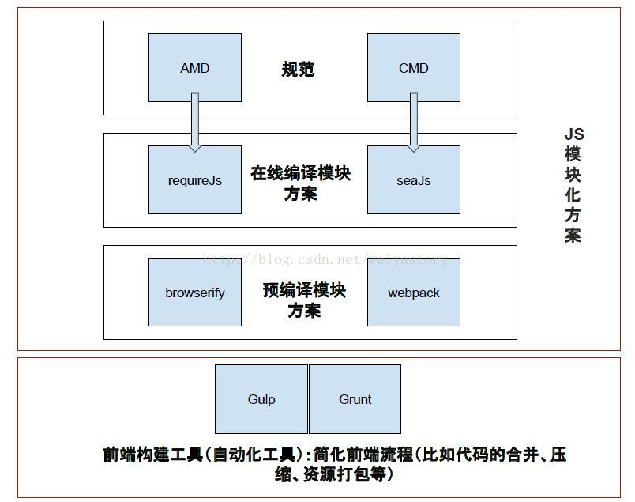

# 前端模块化方案

	前端模块化方案有很多，但是主要这里有：webpack、requireJS、seaJS、browserify

## 解决JS不支持模块化问题

	js语言本身并不支持模块化，同时浏览器中js和服务端nodejs中的js运行环境是不同的

#### 如何实现浏览器中js模块化主流有两种方案

1. requireJS/seaJS

	是一种在线“编译”模块的方案，相当于在页面上加载一个 CommonJS/AMD 模块格式解释器。这样浏览器就认识了define、exports、module这些东西，也就实现了模块化。

2. browserify/webpack

	是一个预编译模块打包的方案，相比于第一种方案，这个方案更加智能。由于是预编译的，不需要在浏览器中加载解释器。我们在本地直接写JS，不管是AMD/CMD/ES6风格的模块化，它都能认识，并且编译成浏览器认识的JS。

> 注：`browserify打包器`本身只支持`Commonjs模块`，如果要打包AMD模块，则需要另外的plugin来实现AMD到CMD的转换！！

> 参考：[前端的四种模块化方案](https://blog.csdn.net/weiyastory/article/details/54344936)
