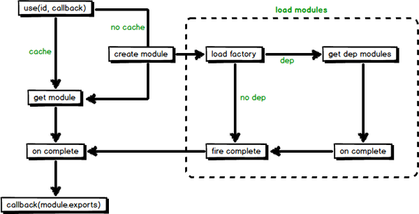

# 认识seaJS

## 概述

#### seaJS简介

	SeaJS 是一个模块加载器， 而模块加载器需要实现两个基本功能

		1. 实现模块定义规范，这是模块系统的基础。
		2. 模块系统的启动与运行。

#### 相关规范

	SeaJS遵循CMD规范实现一个模块就是一个文件， 遵循Modules - Transport规范实现JS(模块) 合并

###### CMD 规范

	一个模块就是一个文件

> [CMD规范](知识笔记/规范标准/模块化规范/CMD规范.md)

###### Modules-Transport规范

	SeaJS 只支持 CMD 模块的话， 没法实现 JS 文件的合并了， 所以SeaJS 还支持一种 Transport 格式

> [Modules-Transport规范](知识笔记/规范标准/模块化规范/Modules-Transport规范.md)

**问题：为啥SeaJS 只支持 CMD 模块的话，没法实现 JS 文件的合并了？**

	没有id的两个模块JS文件a.js和b.js合并成一个文件index.js如下

``` js
// a.js
define(function(require, exports) {
    exports.add = function(a, b) {
        return a + b;
    };
});

// b.js
define(function(require) {
    var a = require('./a');
    var c = a.add(1, 2);
    alert(c);
});
```

**分析**

1. 首先，CMD 规范 中一个模块就是一个文件，这里一个文件里面定义了两个，所以会异常

2. 另外，CMD 模块没有显式地指定该`模块的id`，同时SeaJS 会用这个 JS 文件的 URL 作为它的 id ，并缓存 id 与 模块之间的关系，因此只有最后一个定义的 CMD 模块会被识别，因为前面定义的模块都被它覆盖了。

#### 语法格式

###### factory参数分析

``` js
// 所有模块都通过 define 来定义
define(function(require, exports, module) {
	// 通过 require 引入依赖，获取模块 a 的接口
	var a = require('./a');
	// 调用模块 a 的方法
	a.doSomething();
	// 通过 exports 对外提供接口foo 属性
	exports.foo = 'bar';
	// 对外提供 doSomething 方法
	exports.doSomething = function() {};

	// 错误用法！！!
	exports = {
		foo: 'bar',
		doSomething: function() {}
	};
	// 正确写法，通过module.exports提供整个接口
	module.exports = {
		foo: 'bar',
		doSomething: function() {}
	};
});
```

> 注：所有模块都通过 define 来定义

**require:Function**

* require是一个函数方法，用来获取其他模块提供的接口，而且是同步往下执行。require的模块不能被返回时，应该返回null。

* require.async(id, callback?)：用来在模块内部异步加载模块，并在加载完成后执行指定回调。require的模块不能被返回时，callback应该返回null。callback接受返回的模块作为它的参数。

* require.resolve(id)：不会加载模块，只返回解析后的绝对路径。

!> 注意实现

	* factory第一个参数必须命名为 require 。
		
		例外：在保证 id 和 dependencies 的预先提取下，可以调用任何普通 JS 压缩工具来进行压缩，require 参数可以被压缩成任意字符，或者在工具中定义不要压缩 require 参数；建议采用配套的构建工具spm来压缩、合并代码。
	* 不要重命名 require 函数，或在任何作用域中给 require 重新赋值。
	* require 的参数值必须是字符串直接量。

**exports：Object**

	用来在模块内部对外提供接口

> exports 仅仅是 module.exports 的一个引用。在 factory 内部给 exports 重新赋值时，并不会改变 module.exports 的值。因此给 exports 赋值是无效的，不能用来更改模块接口。

**module：Object**

* module.uri：解析后的绝对路径

* module.dependencies：模块依赖

* module.exports：暴露模块接口数据，也可以通过 return 直接提供接口，看个人习惯使用。

> 对 module.exports 的赋值需要同步执行，慎重放在回调函数里，因为无法立刻得到模块接口数据。

###### 模块标识id

	模块标识id尽量遵循路径即 ID原则，减轻记忆模块 ID 的负担
	模块标识id会用在 require、require.async 等加载函数中的第一个参数

**三种类型标识**

* 相对标识

	以 . 开头（包括.和..），相对标识永远相对当前模块的 URI 来解析

* 顶级标识

	不以点（.）或斜线（/）开始， 会相对模块系统的基础路径（即 SeaJS配置 的 base 路径）来解析

* 普通路径

	除了相对和顶级标识之外的标识都是普通路径，相对当前页面解析。绝对路径和根路径也是普通路径。绝对路径比较容易理解。根路径是以“/”开头的，取当前页面的 域名+根路径

**示例**

``` js
seajs.config({
	base: 'http://code.jquery.com/'
});
// 在模块代码里：这里默认文件后缀为.js
require.resolve('jquery');
// 解析为 http://code.jquery.com/jquery.js

// 假设当前页面是 http://example.com/path/to/page/index.html
require.resolve('/js/b');
// 解析为 http://example.com/js/b.js
```

> SeaJS 在解析模块标识时，除非在路径中有问号（?）或最后一个字符是井号（#），否则都会自动添加 JS 扩展名（.js）

#### 模块加载启动运行

	通过define定义许多模块后，需要启动运行，理论上是使用seajs.use()启动指定模块，但是实际上并非如此

``` js
<script type="text/javascript" src="../gb/sea.js"></script>
<script>
	seajs.use('./index.js');
</script>
```

> 直接使用 script 标签同步引入sea.js文件后，就可以使用seajs.use(id, callback?)在页面中加载模块了。当然，一般不会直接这么用

**最佳实践**

* seajs.use 理论上只用于加载启动，不应该出现在 define 中的模块代码里。

* 为了让 sea.js 内部能快速获取到自身路径，一般都是手动加上 id 属性

> 也就是直接加载运行

``` js
<script src="../gb/sea.js" id="seajsNode"></script>
```

###### 模块加载大体流程



**简单说明**

1. 通过 use 方法来加载入口模块，并接收一个回调函数，当模块加载完成，会调用回调函数，并传入对应的模块作为参数。

2. 从缓存或创建并加载来获取到模块后，等待模块（包括模块依赖的模块）加载完成会调用回调函数。

3. 在图片虚线部分中，加载factory及分析出模块的依赖，按依赖关系递归执行 document.createElement('script') 。

> 参考：[SeaJS从入门到原理](https://blog.csdn.net/sinat_17775997/article/details/52522767)
