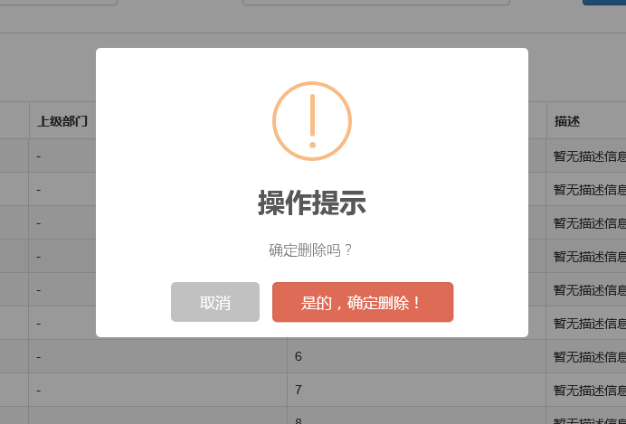

# sweetalert提示框插件

## 概述

> [github源码](https://github.com/t4t5/sweetalert) | [sweetalert Api](http://t4t5.github.io/sweetalert/)

#### sweetalert简介


#### sweetalert使用

###### Vue项目中使用

**npm安装**

``` bash
npm install --save sweetalert
```

**Vue页面中使用**

``` js
import swal from 'sweetalert';

swal("Hello world!");
```

> 当然，也可以全局安装

###### 直接HTML页面中导入

* 在html页面引入js和css

``` html
<link href="/css/sweetalert.css" rel="stylesheet" />
<script src="/js/sweetalert.min.js"></script>
```

* js中使用

``` js
swal({
	title: "操作提示",      //弹出框的title
	text: "确定删除吗？",   //弹出框里面的提示文本
	type: "warning",        //弹出框类型
	showCancelButton: true, //是否显示取消按钮
	confirmButtonColor: "#DD6B55",//确定按钮颜色
	cancelButtonText: "取消",//取消按钮文本
	confirmButtonText: "是的，确定删除！",//确定按钮上面的文档
	closeOnConfirm: true
}, function () {
	// 点击确定后进入回调函数
	$.ajax({
		type: "post",
		url: "/Home/Delete",
		data: { "": JSON.stringify(arrSelections) },
		success: function (data, status) {
			if (status == "success") {
				toastr.success('提交数据成功');
				$("#tb_departments").bootstrapTable('refresh');
			}
		},
		error: function () {
			toastr.error('Error');
		},
		complete: function () {

		}

	});
});
```



> 参考：[js组件-弹出框确认框](https://blog.csdn.net/TSAPR/article/details/80680899)
