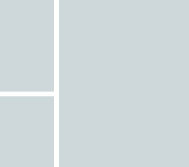
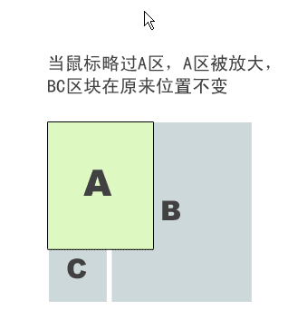

# JS控制鼠标悬浮时放大元素

## 示例参考

#### 第一部分：CSS实现布局

**要求效果图**



**实现代码**

``` css
div {
    background-color: grey;
    position: absolute;
}

#main {
    margin-left: 210px;
    height: 500px;
    width: 300px;

}

#left1 {
    width: 200px;
    height: 245px;
}

#left2 {
    width: 200px;
    height: 245px;
    top: 255px;
    margin-top: 10px;
}
```

> 这里实现比较简单，一个父级div使用 `absolute` 将整个布局悬浮起来，然后直接使用三个 `div` ，强行硬撑起这个布局

#### 第二部分：用javascript优化布局

	鼠标滑过时，将zIndex设为100，不影响其他元素布局，离开时恢复 使用事件代理，直接通过document监听鼠标 鼠标滑过时，宽高变为120%，将margin-top和margin-left减小20px； 如果图片大小都差不多大话，可以将边距减少10%，效果还比较好

**注意事项**

* 考虑浏览器兼容问题

    + IE8及以下添加监听使用的是attachEvent，并且响应函数里this的值是window对象而不是触发事件的元素
    + 获取元素之前的宽高时，用先获取到元素的宽高：IE用 `element.currentStyle` , 其他用 `window.getComputedStyle(element,[, pseudoElt])` 

* 利用parseInt转化类型时，如果在字符串开始处无法获得任何数字，会返回NaN，IE中用currentStyle获取样式表的话，如果margin未定义的话，值是auto

**最终兼容优化实现**

``` js
/**
 * attachEvent响应函数中this的值会变成window对象而不是触发事件的元素
 */
function returnEvent(e) {
    if (e.target) {
        return e.target;
    } else if (e.srcElement) {
        return e.srcElement;
    };
}；
/**
 * 针对IE中currentStyle获取到的属性值可能是auto，导致转化成int时出现NaN的情况
 * 使用 parseInt() 方法解决
 * **/
function parseToInt(attr) {
    if (parseInt(attr)) {
        return parseInt(attr);
    } else {
        return 0;
    };
}
/**
 * div变大
 * ***/
function bigger(e) {
    var node = returnEvent(e);
    if (!!node && node.nodeName.toUpperCase() == "DIV") {
        node.style.zIndex = 100;
        var style = (node.currentStyle || window.getComputedStyle(node)); // 非IE和IE
        node.style.width = 1.2 * parseToInt(style.width) + "px"; // 宽度放大1.2倍
        node.style.height = 1.2 * parseToInt(style.height) + "px"; // 高度放大1.2倍
        node.style.marginTop = (parseToInt(style.marginTop) - 20) + "px";
        node.style.marginLeft = (parseToInt(style.marginLeft) - 20) + "px";
        node.style.backgroundColor = "red";
    };
}
/**
 * 鼠标离开时，图片恢复原样
 * **/
function smaller(e) {
    var node = returnEvent(e);
    console.log("returnEvent(e)" + returnEvent(e));
    if (!!node && node.nodeName.toUpperCase() == "DIV") {
        node.style.zIndex = 0;
        var style = node.currentStyle || window.getComputedStyle(node); // 非IE和IE
        node.style.width = parseToInt(style.width) / 1.2 + "px";
        node.style.height = parseToInt(style.height) / 1.2 + "px"; // 高度缩减1.2倍
        node.style.marginTop = (parseToInt(style.marginTop) + 20) + "px";
        node.style.marginLeft = (parseToInt(style.marginLeft) + 20) + "px";
        node.style.backgroundColor = "grey";
    };
}

// 在document上监听鼠标事件
if (document.addEventListener) { // 其他浏览器和IE8以上都支持
    document.addEventListener('mouseover', bigger, false);
    document.addEventListener('mouseout', smaller, false);
} else if (document.attachEvent) { // IE8及以下下事件监听使用的是attachEvent
    document.attachEvent('onmouseover', bigger);
    document.attachEvent('onmouseout', smaller);
};
```



> 参考：[JS控制鼠标悬浮时放大元素，不影响其他元素布局](https://hyq9508.github.io/javascript/2015/06/29/jschangewidth.html)

