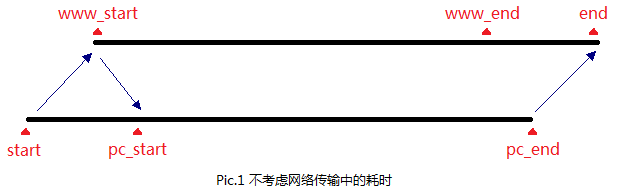
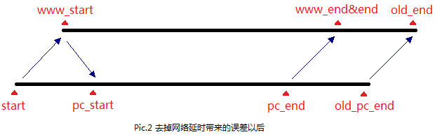

# 验证码倒计时功能

## 简单实现

#### 简单绑定倒计时到元素上

```html
<p class="count"></p>
```

**补零**

```js
function addZero(i) {
	return i < 10 ? "0" + i: i + "";
}
```

**js实现倒计时**

```js
function countDown(endTime) {
	var nowTime = new Date();
	endTime = new Date(endTime);
	var leftTime = parseInt((endTime.getTime() - nowTime.getTime()) / 1000);
	var d = parseInt(leftTime / (24*60*60))
	var h = parseInt(leftTime / (60 * 60) % 24);
	var m = parseInt(leftTime / 60 % 60);
	var s = parseInt(leftTime % 60);
	d = addZero(d)
	h = addZero(h);
	m = addZero(m);
	s = addZero(s);
	document.querySelector(".count").innerHTML = `活动倒计时  ${d}天 ${h} 时 ${m} 分 ${s} 秒`;
	if (leftTime <= 0) {
		document.querySelector(".count").innerHTML = "活动已结束";
		return;
	}
	setTimeout(countDown, 1000);
}
countDown("2055/03/16,17:57:00");
```

> 这主要是传入一个倒计时终止时间，然后根据当前时间一直轮询，间隔1秒重新计算一次时间

> [js简单倒计时实现](https://github.com/BrucePhoebus/developer-note/tree/master/%E7%9F%A5%E8%AF%86%E7%AC%94%E8%AE%B0/大前端/基础/JavaScript/小功能/倒计时实现/js实现简单倒计时.html)

> [同步倒计时实现](https://github.com/BrucePhoebus/developer-note/tree/master/%E7%9F%A5%E8%AF%86%E7%AC%94%E8%AE%B0/大前端/基础/JavaScript/小功能/倒计时实现/同步倒计时实现.html)

> [使用js封装的倒计时](https://github.com/BrucePhoebus/developer-note/tree/master/%E7%9F%A5%E8%AF%86%E7%AC%94%E8%AE%B0/大前端/基础/JavaScript/小功能/倒计时实现/使用js封装的倒计时.html)


## 优化实现

#### 优化时效性

	很多时候如果我们定时1秒，也就是1000毫秒进行 -1，这样会出现细微的误差，那么我们怎么优化？

###### Javascript实现商品秒杀倒计时（时间与服务器时间同步）

	现在有很多网站都在做秒杀商品，而这其中有一个很重要的环节就是倒计时
	而关于这个倒计时，有几个比较重要的注意点：

		1. 应该使用服务器时间而不是本地时间（本地时间存在时区不同、用户自行设置等问题）。

		2. 要考虑网络传输的耗时。

		3. 获取时间时可直接从AJAX的响应头中读取（通过getResponseHeader('Date')来获得），服务器端不需要专门写时间生成脚本

**过程分析**

1. 从服务器读到一个时间戳之后便开始计时，不考虑网络传输的耗时



	start——页面项服务器发起AJAX请求时的时间。

	www_start——服务器响应页面的请求并返回时间戳给页面的时间。

	pc_start——页面接受到服务器返回的时间戳并开始计时的时间。

	www_end——服务器倒计时结束的时间。

	pc_end——页面倒计时结束的时间，同时也是用户在倒计时结束那一刻点击按钮的时间。

	end——服务器接收到用户点击信息的时间

> 可以看出，即使在倒计时结束的那一刻（也就是秒杀开始那一刻）用户就立即点击鼠标，也会比实际开始抢拍的时间（www_end，即服务器倒计时结束的时间）晚一些（可以很容易的看出，这个时间差正好等于pc_start - start，也就是AJAX从开始发送到接收到响应信息的耗时）。如果有些内行在页面倒计时结束前用脚本发送请求，那么其他用户可就亏大了。所以，我们要解决掉这个时间误差的问题

2. 为了解决时间误差的问题，我们将把页面倒计时的时间缩短一小截（由上面的分析可以得出，这一小截正好等于pc_start - start），使得用户在倒计时结束时发送给服务器的抢拍信息正好在服务器倒计时结束时被接收到



	old_pc_end——在未对网络传输耗时进行处理的情况下pc_end的时间。

	old_end——在未对网络传输耗时进行处理的情况下end的时间。

> 这时网络传输耗时造成的时间误差已经完全被弥补了，弥补的方法是“将倒计时结束的时间提前pc_start - start”。但是解决了网络传输耗时造成的误差问题，还有用户电脑时间和服务器时间不相同的问题，继续

3. 用户的电脑时间和服务器时间一定是有差异的，甚至差几个时区，怎么解决这个问题呢？

	1、 当页面接收到服务器返回的时间戳www_t时，立即开始计时

	2、 当页面接收到服务器返回的时间戳www_t时，立即计算本地时间和服务器返回的时间戳的`时间差`t=new Date().getTime() - www_t*1000

	3、 仍然使用new Date().getTime()来计时，而不是使用setInterval()函数（计时器很不稳定，误差也很大），但时间的显示与程序的逻辑必须基于本地时间和上一步（B中）求得的时间偏差t

**总结**

	页面从接收到服务器响应的时间戳开始计时，计时的时长应减掉AJAX从发送到接收整个过程的耗时，计时过程则使用本地时间来实现（本地时间+时间偏差）

> <a href="#知识笔记/大前端/基础/JavaScript/问题驱动/js解决服务器和客户端存在时间差的问题?id=同步服务器时间、同步倒计时">解决同步服务器时间、同步倒计时问题</a>

> 参考：[Javascript实现商品秒杀倒计时（时间与服务器时间同步）](https://www.jb51.net/article/72305.htm)

###### 个人想法实现


#### 页面刷新实时倒计时优化

	现在访问一个注册页面，页面有一个填写手机号，获取验证码的按钮，点击获取验证码按钮之后，按钮变成灰色，然后是60倒计时效果。 在60S内我无法再次点击获取验证码按钮。 因为按钮是灰色的，不可点击状态。 这个是常规实现

	但是如果我们刷新按钮，如果按照常规实现，倒计时效果会失效，也就是归零，这样倒计时在一定程度上是没用的，不符合逻辑的，

	那么我们要怎么优化，保证页面刷新也能继续倒计时？

###### 参考实现1

**解决思路**

1. 点击获取验证码按钮，改变按钮为不可点击状态，进行倒计时计时器，并且实时记录倒计时秒数，以及当前时间time1； 

2. 页面刷新的时候监听倒计时按钮，获取倒计时秒数，以及页面关闭的时的时间time1，和当前时间time2； 

3. 如果当前时间与关闭页面的时间的差小于关闭页面的倒计时秒数，倒计时任然再进行，修改按钮为倒计时样式。 

**代码实现**

```js
// 防止页面刷新倒计时失效
/**
 * 
 * @param {Object} obj  获取验证码按钮
 */
function monitor(obj) {
    var LocalDelay = getLocalDelay();
    var timeLine = parseInt((new Date().getTime() - LocalDelay.time) / 1000);
    if (timeLine > LocalDelay.delay) {
        console.log("过期");
    } else {
        _delay = LocalDelay.delay - timeLine;
        obj.text(_delay).addClass("btn-disabled");
        var timer = setInterval(function() {
            if (_delay > 1) {
                _delay--;
                obj.text(_delay);
                setLocalDelay(_delay);
            } else {
                clearInterval(timer);
                obj.text("获取验证码").removeClass("btn-disabled");
            }
        }, 1000);
    }
};

// 倒计时效果
/**
 * 
 * @param {Object} obj 获取验证码按钮
 * @param {Function} callback  获取验证码接口函数
 */
function countDown(obj, callback) {
    if (obj.text() == "获取验证码") {
        var _delay = 60;
        var delay = _delay;
        obj.text(_delay).addClass("btn-disabled");
        var timer = setInterval(function() {
            if (delay > 1) {
                delay--;
                obj.text(delay);
                setLocalDelay(delay);
            } else {
                clearInterval(timer);
                obj.text("获取验证码").removeClass("btn-disabled");
            }
        }, 1000);

        callback();
    } else {
        return false;
    }
}

// 设置setLocalDelay
function setLocalDelay(delay) {
    // location.href作为页面的唯一标识，可能一个项目中会有很多页面需要获取验证码。
    localStorage.setItem("delay_" + location.href, delay);
    localStorage.setItem("time_" + location.href, new Date().getTime());
}

// getLocalDelay()
function getLocalDelay() {
    var LocalDelay = {};
    LocalDelay.delay = localStorage.getItem("delay_" + location.href);
    LocalDelay.time = localStorage.getItem("time_" + location.href);
    return LocalDelay;
}
```

> 这里使用localStorage本地保存，保证能在页面刷新后上个倒计时时间不丢失，每次进入页面都先判断是否存在本地存储，如果过期就重新开始

**页面中使用**

```html
<script type="text/javascript" src="js/jquery-2.1.0.js"></script>
<script type="text/javascript" src="js/getcode.js"></script>
<script>
	$(function() {
		var btn = document.getElementById("btn-get-code");
		// 调用监听
		monitor($(btn));
		// 点击click
		btn.onclick = function() {
			// 倒计时效果  getCode回调函数  获取验证码api
			countDown($(this), getCode);
		};

		function getCode() {
			$.get("http://192.168.50.242:8080/demo/js/json.json", {}, function(res) {
				if (res.code == 000) {
					console.log("验证码将发送到你手机");
				} else {
					alert(res.message);
				}
			});
		}
	});
</script>
```


> 参考： [获取验证码倒计时优化 页面刷新实时倒计时](https://www.cnblogs.com/HDou/p/5553424.html)

