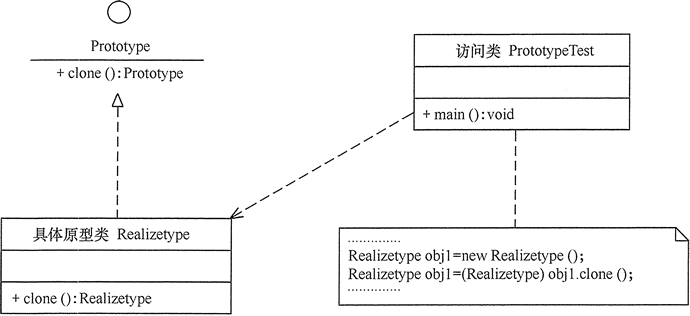

# 原型设计模式

	用一个已经创建的实例作为原型， 通过复制该原型对象来创建一个和原型相同或相似的新对象。 在这里， 原型实例指定了要创建的对象的种类。 用这种方式创建对象非常高效， 根本无须知道对象创建的细节。

	这种模式是实现了一个原型接口， 该接口用于创建当前对象的克隆。 当直接创建对象的代价比较大时， 则采用这种模式。

> 用于创建重复的对象， 同时又能保证性能。 这种类型的设计模式属于创建型模式， 它提供了一种创建对象的最佳方式。 

**实例**

	一个对象需要在一个高代价的数据库操作之后被创建。 我们可以缓存该对象， 在下一个请求时返回它的克隆， 在需要的时候更新数据库， 以此来减少数据库调用。

## 原型模式的结构与实现

	原型模式已经与 Java 融为浑然一体， 直接使用对象的 clone() 方法即可

#### 模式结构

* 原型模式角色

	1. 抽象原型类： 规定了具体原型对象必须实现的接口。 

	2. 具体原型类： 实现抽象原型类的 clone() 方法， 它是可被复制的对象。 

	3. 访问类： 使用具体原型类中的 clone() 方法来复制新的对象。 

* 原型结构图



#### 模式实现

	原型模式的克隆分为浅克隆和深克隆， Java 中的 Object 类提供了浅克隆的 clone() 方法， 具体原型类只要实现 Cloneable 接口就可实现对象的浅克隆， 这里的 Cloneable 接口就是抽象原型类。

###### 实现原型克隆1

**实现代码**

```java
// 具体原型类
class Realizetype implements Cloneable {
    Realizetype() {
        System.out.println("具体原型创建成功！");
    }
    public Object clone() throws CloneNotSupportedException {
        System.out.println("具体原型复制成功！");
        return (Realizetype) super.clone();
    }
}

// 原型模式的测试类
public class PrototypeTest {
    public static void main(String[] args) throws CloneNotSupportedException {
        Realizetype obj1 = new Realizetype();
        Realizetype obj2 = (Realizetype) obj1.clone();
        System.out.println("obj1==obj2?" + (obj1 == obj2));
    }
}
```

**运行结果**

	具体原型创建成功！
	具体原型复制成功！
	obj1 == obj2 ? false

###### 实现原型克隆2

	将创建一个抽象类 Shape 和扩展了 Shape 类的实体类。 下一步是定义类 ShapeCache， 该类把 shape 对象存储在一个 Hashtable 中， 并在请求的时候返回它们的克隆。

	PrototypePatternDemo， 演示类使用 ShapeCache 类来获取 Shape 对象。

**实现代码**

```java
/* 
	步骤 1：创建一个实现了 Cloneable 接口的抽象类 
	
	Shape.java
*/
public abstract class Shape implements Cloneable {
   
   private String id;
   protected String type;
   
   abstract void draw();
   
   public String getType(){
      return type;
   }
   
   public String getId() {
      return id;
   }
   
   public void setId(String id) {
      this.id = id;
   }
   
   public Object clone() {
      Object clone = null;
      try {
         clone = super.clone();
      } catch (CloneNotSupportedException e) {
         e.printStackTrace();
      }
      return clone;
   }
}

/* 
	步骤 2：创建扩展了上面抽象类的实体类

	Rectangle.java
*/
public class Rectangle extends Shape {
 
   public Rectangle(){
     type = "Rectangle";
   }
 
   @Override
   public void draw() {
      System.out.println("Inside Rectangle::draw() method.");
   }
}

// Square.java
public class Square extends Shape {
 
   public Square(){
     type = "Square";
   }
 
   @Override
   public void draw() {
      System.out.println("Inside Square::draw() method.");
   }
}

// Circle.java
public class Circle extends Shape {
 
   public Circle(){
     type = "Circle";
   }
 
   @Override
   public void draw() {
      System.out.println("Inside Circle::draw() method.");
   }
}

/* 
	步骤 3：创建一个类，从数据库获取实体类，并把它们存储在一个 Hashtable 中

	ShapeCache.java	
*/
import java.util.Hashtable;
 
public class ShapeCache {
    
   private static Hashtable<String, Shape> shapeMap 
      = new Hashtable<String, Shape>();
 
   public static Shape getShape(String shapeId) {
      Shape cachedShape = shapeMap.get(shapeId);
      return (Shape) cachedShape.clone();
   }
 
   // 对每种形状都运行数据库查询，并创建该形状
   // shapeMap.put(shapeKey, shape);
   // 例如，我们要添加三种形状
   public static void loadCache() {
      Circle circle = new Circle();
      circle.setId("1");
      shapeMap.put(circle.getId(),circle);
 
      Square square = new Square();
      square.setId("2");
      shapeMap.put(square.getId(),square);
 
      Rectangle rectangle = new Rectangle();
      rectangle.setId("3");
      shapeMap.put(rectangle.getId(),rectangle);
   }
}

/* 
	步骤 4：PrototypePatternDemo 使用 ShapeCache 类来获取存储在 Hashtable 中的形状的克隆

	4：PrototypePatternDemo.java
*/
public class PrototypePatternDemo {
   public static void main(String[] args) {
      ShapeCache.loadCache();
 
      Shape clonedShape = (Shape) ShapeCache.getShape("1");
      System.out.println("Shape : " + clonedShape.getType());        
 
      Shape clonedShape2 = (Shape) ShapeCache.getShape("2");
      System.out.println("Shape : " + clonedShape2.getType());        
 
      Shape clonedShape3 = (Shape) ShapeCache.getShape("3");
      System.out.println("Shape : " + clonedShape3.getType());        
   }
}
```

**运行结果**

	Shape: Circle
	Shape: Square
	Shape: Rectangle

!> Java实现果然天坑， 这么复杂， 果然项目没到规模， 使用都是浪费

## JavaScript原型规则

**new创建对象**

```js
function Foo(name, age) {
    this.name = name;
    this.age = age;
    this.class = "class-1";

    return this; // 默认有这一行
}

var f = new Foo("zyk", 22); // 实例化对象
```

**引用类型**

* var a = {} 其实是 var a = new Object(); 

* var a = [] 其实是 var a = new Array(); 

* function Foo(){} 其实是 var Foo = new Function(); 

* 使用instanceof 判断函数是否是一个变量的构造函数 

	如何判断一个变量是不是数组： 用instanceof Array

#### 原型规则

1. 所有的引用类型（数组、 对象、 函数）， 都具有对象特征， 即可自由扩展属性

	var arr = [];
	arr.a = 1;

2. 所有的引用类型， 都有一个_proto_ 属性（隐式原型）， 属性值是一个普通对象

```js
console.log(Object.__proto__); // ƒ () { [native code] }
console.log(Array.__proto__); // ƒ () { [native code] } 
console.log(Function.__proto__); // ƒ () { [native code] }
```

3. 所有函数， 都具有一个prototype（显示原型）， 属性值也是一个普通原型

```js
console.log(Function.prototype); // ƒ () { [native code] }
```

4. 所有的引用类型（数组、 对象、 函数）， 其隐式原型指向其构造函数的显式原型； （obj.proto === Object.prototype）

```js
function Foo(name, age) {
    this.name = name;
}

Foo.prototype.alertName = function() {
    alert(this.name);
}

var f = new Foo("zyk");

f.printName = function() {
    console.log(this.name);
}

f.printName();
f.alertName();

/* 
输出：
	ƒ (){
		alert(this.name);
	}

	ƒ (){
        console.log(this.name);
    }
	zyk

弹框：
	zyk
 */
```

5. 当试图得到一个对象的某个属性时， 如果这个对象本身没有这个属性， 那么会去它的_proto_（即它的构造函数的prototype）中去寻找

**原型对象**

	prototype 在js中， 函数对象其中一个属性： 原型对象prototype。 普通对象没有prototype属性， 但有_proto_属性。 原型的作用就是给这个类的每一个对象都添加一个统一的方法， 在原型中定义的方法和属性都是被所以实例对象所共享

```js
var person = function(name) {
    this.name = name
};
person.prototype.getName = function() { //通过person.prototype设置函数对象属性
    return this.name;
}
var crazy = new person('crazyLee');
crazy.getName(); // crazy继承父类属性 输出：crazyLee
```

**原型链**

	当试图得到一个对象f的某个属性时， 如果这个对象本身没有这个属性， 那么会去它的_proto_（ 即它的构造函数的prototype） obj._proto_中去寻找； 当obj._proto_也没有时， 便会在obj._proto_.proto（ 即obj的构造函数的prototype的构造函数的prototype） 中寻找， 构成一条原型链， 一直找到Object， Object的_proto_为null

#### JavaScript原型模式实现

**实例1**

	函数中不对属性进行定义， 利用prototype属性对属性进行定义， 可以让所有对象实例共享它所包含的属性及方法

```js
function Parent() {
    Parent.prototype.name = 'crazy';
    Parent.prototype.age = '24';

    Parent.prototype.sex = function() {
        var s = "女";
        console.log(s);
    }
}

var x = new Parent();
console.log(x.name); // crazy
console.log(x.sex()); //女
```

**实例2**

```js
function Employee() {};
Employee.prototype.Name = "Jim";
Employee.prototype.Age = 28;
Employee.prototype.Job = "SoftWare Engineer";
Employee.prototype.SayName = function() {
    console.log(this.Name);
};
var employee1 = new Employee();
employee1.SayName(); // Jim 
var employee2 = new Employee();
employee2.SayName(); //Jim 
console.log(employee1.SayName === employee2.SayName); // true
```

> 与构造函数模式不同的是，新对象的这些属性和方法是由所有实例共享的

## 使用场景

1. 资源优化场景。 

2. 类初始化需要消化非常多的资源， 这个资源包括数据. 硬件资源等。 

3. 性能和安全要求的场景。 

4. 通过 new 产生一个对象需要非常繁琐的数据准备或访问权限， 则可以使用原型模式。 

5. 一个对象多个修改者的场景。 

6. 一个对象需要提供给其他对象访问， 而且各个调用者可能都需要修改其值时， 可以考虑使用原型模式拷贝多个对象供调用者使用。 

7. 在实际项目中， 原型模式很少单独出现， 一般是和工厂方法模式一起出现， 通过 clone 的方法创建一个对象， 然后由工厂方法提供给调用者。 

