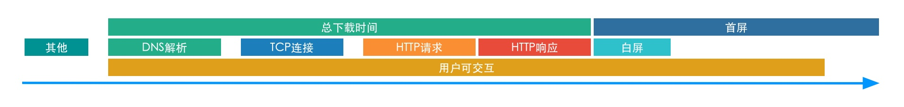

# 性能优化指标

## 性能指标

	白屏时间
	首屏时间
	用户可交互时间
	总下载时间
	DNS解析时间
	TCP连接时间
	HTTP请求时间
	HTTP响应时间

## 科普

* PV = page view 	// 页面浏览数

* TPS = transactions per second 	// 每秒事务数

* QPS = queries per second 	// 每秒请求数

* RPS = requests per second 	// 平均并发数

* RPS = 	 // 并发数/平均响应时间

#### 响应时间

	指的是从客户端发起一个请求开始，到客户端接收到从服务器端返回的响应结束，这个过程所耗费的时间。响应时间通常用时间单位来衡量（一般为秒）

* 响应时间 = N1+A1+N2+A2+N3+A3+N4

* 网络传输时间：N1 + N2 + N3 + N4

* 应用服务器处理时间：A1 + A3

* 数据库服务器处理时间：A2

#### 并发用户数

	系统用户数：系统额定的用户数量，如一个OA系统，可能使用该系统的用户总数是2000个，那么这个数量，就是系统用户数

	同时在线用户数：在一定的时间范围内，最大的同时在线用户数量

* 平均并发用户数的计算：C = nL /T

> 参数说明：C是平均的并发用户数，n是平均每天访问用户数，L是一天内用户从登录到退出的平均时间（操作平均时间），T是考察时间长度（一天内多长时间有用户使用系统）

#### 吞吐量

	吞吐量指的是单位时间内处理的客户端请求数量

* 从业务角度看，吞吐量可以用：请求数/秒、页面数/秒、人数/天或处理业务数/小时等单位来衡量

* 从网络角度看，吞吐量可以用：字节/秒来衡量

* 对于交互式应用来说，吞吐量指标反映的是`服务器承受的压力`，这能够说明系统的负载能力

###### 以不同方式表达的吞吐量可以说明不同层次的问题

* 以字节数/秒方式

	可以表示数要受网络基础设施、服务器架构、应用服务器制约等方面的瓶颈

* 以已请求数/秒方式

	表示主要是受应用服务器和应用代码的制约体现出的瓶颈

!> 当没有遇到性能瓶颈的时候，吞吐量与虚拟用户数之间存在一定的联系

	可以采用公式计算：F=VU * R / T

> 其中，F为吞吐量，VU表示虚拟用户个数，R表示每个虚拟用户发出的请求数，T表示性能测试所用的时间

#### 资源利用率

	资源利用率指的是对不同系统资源的使用程度

	例如服务器的CPU（s），内存，网络带宽等

> 资源利用率通常以占用最大值的百分比n来衡量

!> 当某个资源利用率随着负载的增加最终在`100%`居高不下时，就可能意味着这个资源变成了系统的`性能瓶颈`所在，提高这个资源的量，将会提高系统的吞吐量，同时降低交易的响应时间，即改进了系统的性能

> 参考：[风流三月1-性能优化-指标](https://blog.csdn.net/u012869196/article/details/80015643)
