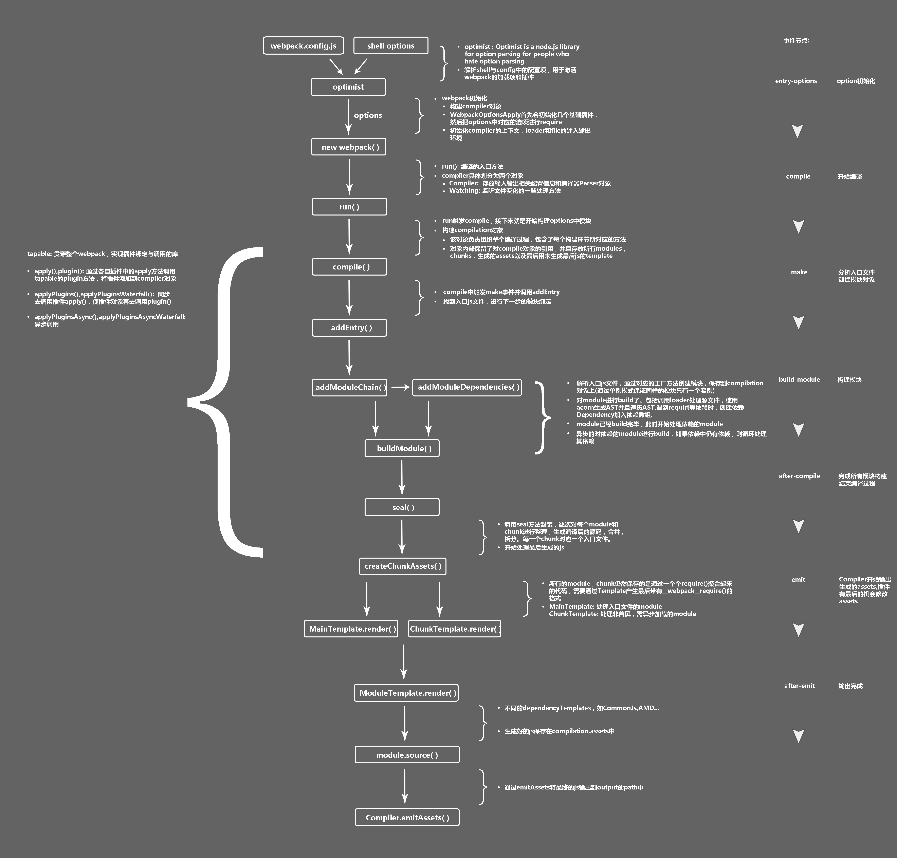

# 深入理解webpack打包机制

## webpack打包流程

#### 来张详细的webpack打包流程图



#### 全流程分析

###### 1、webpack.config.js 配置

``` js
var path = require('path');
var node_modules = path.resolve(__dirname, 'node_modules');
var pathToReact = path.resolve(node_modules, 'react/dist/react.min.js');
 
module.exports = {
    // 入口文件，是模块构建的起点，同时每一个入口文件对应最后生成的一个 chunk。
    entry: {
        bundle: [
            'webpack/hot/dev-server',
            'webpack-dev-server/client?http://localhost:8080',
            path.resolve(__dirname, 'app/app.js')
        ],
    },
    // 文件路径指向(可加快打包过程)。
    resolve: {
        alias: {
            'react': pathToReact
        }
    },
    // 生成文件，是模块构建的终点，包括输出文件与输出路径。
    output: {
        path: path.resolve(__dirname, 'build'),
        filename: '[name].js',
    },
    // 这里配置了处理各模块的 loader ，包括 css 预处理 loader ，es6 编译 loader，图片处理 loader。
    module: {
        loaders: [
            {
                test: /\.js$/,
                loader: 'babel',
                query: {
                    presets: ['es2015', 'react']
                }  
            }
        ],
        noParse: [pathToReact]
    },
    // webpack 各插件对象，在 webpack 的事件流中执行对应的方法。
    plugins: [
        new webpack.HotModuleReplacementPlugin();
    ]
};
```

**核心概念解说**

* loader

	loader能转换各类资源，并处理成对应模块的加载器。loader 间可以串行使用

* chunk

	code splitting后的产物，也就是按需加载的分块，装载了不同的module

* plugin

	webpack 的插件实体

*例如：UglifyJsPlugin*

``` js
function UglifyJsPlugin(options) {
this.options = options;
}
module.exports = UglifyJsPlugin;
UglifyJsPlugin.prototype.apply = function(compiler) {
	compiler.plugin("compilation", function(compilation) {
		compilation.plugin("build-module", function(module) {
		});
		compilation.plugin("optimize-chunk-assets", function(chunks, callback) {
			// Uglify 逻辑
		});
		compilation.plugin("normal-module-loader", function(context) {
		});
	});
};
```

> 类似`compilation.plugin('xxx', callback)`可以看作一种事件绑定，当webpack执行到制定地方的时候会触发事件并执行某些回调


> 参考：[深入理解webpack打包机制](https://www.cnblogs.com/xuepei/p/8892724.html) | [细说webpack之流程篇](https://www.cnblogs.com/yxy99/p/5852987.html)
