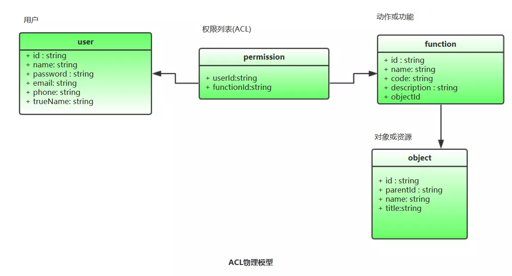
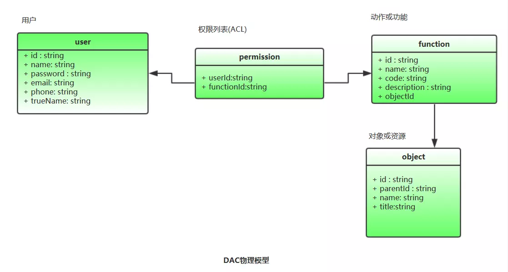
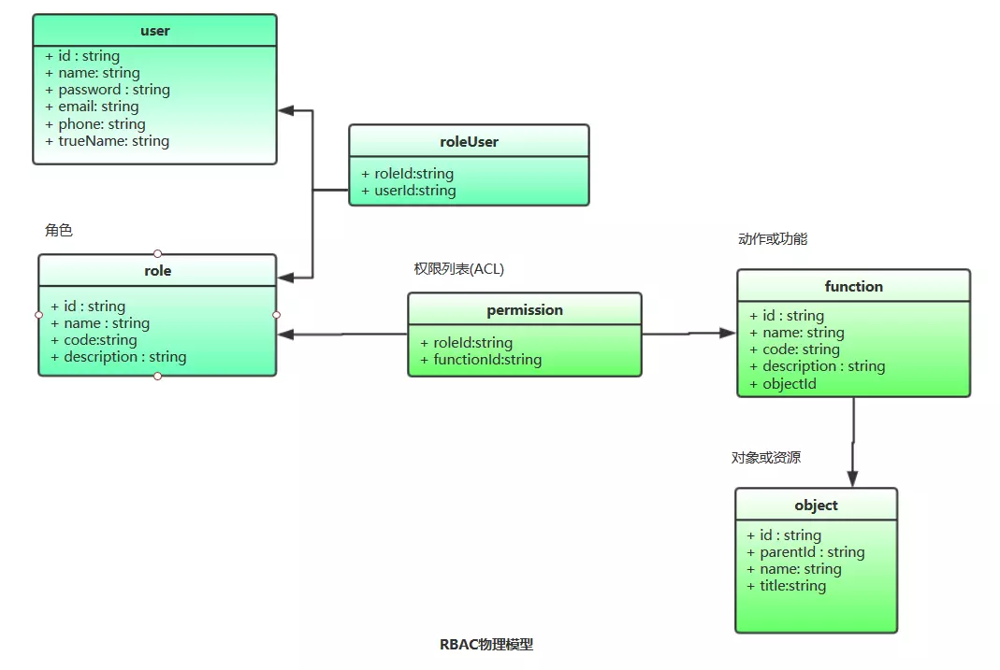

# 常用权限模型

## 概述

#### 术语描述

|名词|含义|
|:---:|:---:|
|用户(Subject)|发起操作的主体|
|对象(Object)|指操作所针对的客体对象，比如文章或评论|
|权限(Permission)|用来指代对某种对象的某一种操作，例如"添加文章的操作"|
|权限码|权限的代号，例如用"ARTICLE_ADD"来指代"添加文章的操作"权限|

> 权限有时候也可以称为动作或者功能。比如"添加文章"，既可以认为它是一个动作，也可以认为它是一个功能。对象也可以称为资源

#### 常见有哪些权限模型？

* ACL(Access Control List)(访问控制列表)

* DAC(Discretionary Access Control)(自主访问控制)

* MAC(Mandatory Access Control)(强制访问控制)

* RBAC(Role-Based Access Control)(基于角色的访问控制)

* ABAC(Attribute-Based Access Control)(基于属性的访问控制)

#### ACL(Access Control List)(访问控制列表)

	ACL是最早也是最基本的一种访问控制机制，它是用来描述用户和权限之间关系的数据列表
	原理：
		每一项资源，都配有一个列表，这个列表记录的就是哪些用户可以对这项资源执行CRUD等操作。当试图访问这项资源时，会首先检查这个列表中是否有关于当前用户的访问权限，从而确定当前用户可否执行相应的操作

* 例如一个文件对象的 ACL 为 Alice: read,write; Bob: read，这代表 Alice 对该文件既能读又能写，而 Bob 只能读取

**优点**

* ACL很简单，它几乎不需要任何基础设施就可以完成访问控制

**缺点**

* 由于需要维护大量的访问权限列表，ACL在性能上有明显的缺陷

* 对于拥有大量用户与众多资源的应用，管理访问控制列表本身就变成非常繁重的工作



* 最开始的ACL定义中，用户直接和权限挂钩，数据存储的是用户与权限的关联关系

	如果两个用户的权限是一样的，那么就需要分别存储这两个用户与权限的关联关系，也是上面所提到的ACL的缺陷

> 为了解决这些问题，便有了对ACL设计的改进，相同权限的用户放到同一个分组里，`分组与权限挂钩`，不再是用户直接与权限挂钩

	后来出现的RBAC(基于角色的访问控制)，角色与分组也是差不多的概念，角色直接与权限挂钩，用户再与角色进行关联

**总结**

* 所以，现在一般说ACL，不再是用户直接和权限挂钩的一种权限控制模型，把它看做一个单纯的访问控制列表即可。列表里维护的可能是用户与权限的关系，也可以是用户组与权限的关系，也可以是角色与权限的关系，甚至是部门，职位等等于权限的关系

> ACL是权限体系中的业务规则。RBAC等权限模型要用到ACL才能工作，ACL服务于RBAC等权限模型，其它权限控制体系里的权限规则也叫ACL

#### DAC(Discretionary Access Control)(自主访问控制)

	系统会识别用户，然后根据被操作对象（Subject）的权限控制列表（ACL: Access Control List）或者权限控制矩阵（ACL: Access Control Matrix）的信息来决定用户的是否能对其进行哪些操作
	而拥有对象权限的用户，又可以将该对象的权限分配给其他用户，所以称之为"自主(Discretionary)"控制

* 因为用户能自主地将自己拥有的权限授予其他用户，所以DAC模型可以任意传递权限，用户能间接获得本不具有的访问权限，因此DAC模型的安全性较低，不能给系统充分的数据保护



* 如图，DAC可以直接使用ACL的物理模型，但区别在于：DAC模型中用户可以将自己具备的权限分配给其它用户(程序里的操作就是根据用户ID筛选出权限列表，根据列表为要分配权限的用户构造出新的权限列表并保存)

> DAC是传统的UNIX访问控制模型，也是Windows文件系统的访问控制模型

#### MAC(Mandatory Access Control)(强制访问控制)

	MAC是为了弥补DAC权限控制过于分散的问题而诞生的

	在MAC的设计中，每一个对象都有一些权限标识，每个用户同样也会有一些权限标识，而用户能否对该对象进行操作取决于双方的权限标识的关系，这个限制判断通常是由系统硬性限制的

* 访问时，系统先对用户的访问许可级别和资源对象的密级进行比较，再决定用户是否可以访问资源对象

* 其中，用户不能改变自身和资源对象的安全级别，只有系统管理员或管理程序才能控制资源对象和用户的级别

> 这也就是有非常强的权限管理，我们经常会在影视剧中看到间谍查机密文件时会弹出需要什么什么级别的安全许可的权限标识，也就是权限等级之分

**总结**

* MAC非常适合机密机构或者其他等级观念强烈的行业，但对于类似商业服务系统，则因为不够灵活而不能适用

* MAC可以继续使用DAC的模型，但是要对用户进行等级划分，比如一级，二级，三级。。。，对对象资源也要做划分，比如机密，秘密和最高机密

	用户访问的资源的时候，根据用户等级与资源访问级别来做判断，比如一级用户只能访问机密文件，如果访问的是最高机密文件，系统就会拒绝。这一系列规则是优先于DAC的，如果MAC与DAC混用，要先校验MAC再校验DAC

#### RBAC(Role-Based Access Control)(基于角色的访问控制)

* 基于ACL的改进

	ACL的访问控制机制中，直接维护的是用户与功能的关系，这一系列的关系就是一个权限列表。当很多的用户具有相同功能权限的时候，就要进行繁琐的关联操作

> RBAC就是在用户与权限之间引入了`角色`的概念。`用户`与`角色`之间做关联，权限列表维护的是`角色与功能的关系`



* RBAC是目前使用最普遍的权限控制模型

* 当某些用户具备相同的权限的时候，只需要为这些用户建一个角色，把相应的功能关联到这个角色上，生成角色的权限列表；当有新的用户需要相同权限的时候，把用户关联到这个角色上即可；而当用检查或校验用户的操作权限的时候，查询用户所属角色的权限列表即可。

**RBAC的问题**

* 比如想要为某个用户单独设置某个功能权限，可能需要为这个功能权限单独创建一个角色，然后把特定的用户关联到这个角色上。

	当想要移除某个用户的特定功能权限的时候，可能需要重新设置角色的功能权限，把特定功能权限从当前角色中移除，建立新的角色并关联特定的功能权限，然后再把新角色与相关的用户做关联(也可以直接在特定功能的程序里校验操作用户)

**常见的RBAC的错误的用法**

* 直接使用角色做权限判断

	* 比如只有角色A才能做文章的删除操作

	``` js
	function delPost(postId){
		if(!isRole('A')){
			return false;
		}
	}
	```
	
	> 如果这样实现会有个很大的问题：如果需求该为角色B也可以删除文章，那就必须修改代码

	``` js
	function delPost(postId){
		if(!isRole('A') && !isRole('B')){
			return false;
		}
	}
	```

	**正解：**

	``` js
	function delPost(postId){
		if(!hasPermission('POST_DEL')){
			return false;
		}
	}
	```

	> 将判断是否有权限功能抽取出来，如果需要添加用户B的话，那就直接把对应权限添加到对应用户上去，这里是B用户

> 在RBAC的核心基础上，还可以做相应的扩展，比如角色继承，角色分组之类的，这些扩展都是为了在一定程度简化权限管理工作

> [深入浅出RBAC权限管理](知识笔记/大前端/架构/权限模型/深入浅出RBAC权限管理.md)

#### ABAC(Attribute-Based Access Control)(基于属性的权限控制)

* RBAC虽然是目前最普遍的权限控制模型。但是某些情况下，RBAC是无法满足并且也实现不了的，这也就拓展出了新的模型解决一些特殊的问题

	* 比如业务员1和业务员2都属于业务员角色，都有查看客户订单的权限。当有一个需求，要求业务员1只能查看北京地区的客户的订单，业务员2只能查看上海的客户的订单。这单单使用RBAC权限控制是无法实现。

	* 借助RBAC，可行的做法是，分地区创建角色，然后程序中根据角色做数据的过滤，这种做法缺点之前也提到过，需求变更的时候可能需要每次都修改代码

> 上面业务员查看订单的例子，地区是订单的一个属性，需求就是针对这个地区属性来做订单的查询范围的权限控制。这种权限控制方式就是`ABAC(Attribute-Based Access Control)(基于属性的权限控制)`

* 不同于常见的将用户通过某种方式关联到权限的方式，ABAC则是通过`动态计算`一个或一组属性是否满足某种条件来进行授权判断的（可以编写简单的逻辑）

**属性通常来说分为四类**

	理论上能够实现非常灵活的权限控制，几乎能满足所有类型的需求

* 用户属性（如用户年龄）

* 环境属性（如当前时间）

* 操作属性（如读取）

* 对象属性（如一篇文章，又称资源属性）

> 例如：`允许所有班主任在上课时间自由进出校门`这条规则，其中，`班主任`是用户的角色属性，`上课时间`是环境属性，`进出`是操作属性，而`校门`就是对象属性了

**ABAC实现**

* ABAC非常灵活，但实现也是非常的难，因为这其中涉及到逻辑的动态执行，数据动态过滤等。。。更加具体就是动态拼接SQL语句(使用ORM的话就是动态组装对应ORM的查询语句)

* 以上述业务员的例子来实现

	* 在RBAC的基础上，扩展一个实体规则，订单就是实体，也就是针对订单设置一系列的规则

	``` js
	// 北京地区规则
	{
		"regionId":1
	}

	// 上海地区规则
	{
		"regionId":3
	}
	```
	
	> regionId 就是系统里对应区域的Id，也是订单或订单相关表的某个字段

	* 创建好实体的规则，将规则与角色做关联，也就是将北京地区的规则关联到北京地区角色上，上海地区的规则关联到上海地区角色上

	* 后端做权限校验的时候，还是先按RBAC模型的控制方式进行校验(是否具备订单查看权限)，然后根据当前操作对象(也就是实体)，取出用户所属角色关联的对应实体的规则。然后解析规则，动态拼接Sql或者ORM语句。

	> 规则前后

	``` bash
	# 没做地区限制(或没配置规则)的时候，Sql可能是
	select userId,orderNo,createdDate from T_Order

	# 配置了规则，解析拼接后
	select userId,orderNo,createdDate from T_Order where regionId=1
	```
	
> 这里是针对地区这个属性实现了动态的权限控制。实际开发过程中，要控制的东西是非常多了，查看字段的控制，数据范围的控制。要满足这些复杂的控制，需要制定一套完整的规则，以及针对规则编写相应的解析程序

	比如根据配置的规则，最后解析出来可能是各种Sql语句:<,>,=,like,in,not in等等

#### 总结

* 多研究`RBAC权限管理`基本够了：可以看出`ABAC权限管理`是非常复杂的，但是又能符合几乎所有场景，所以大公司大型项目可能会考虑使用这个，当然一般我们使用`RBAC权限管理`基本就够了

* 此ACL并非彼ACL：现在说的ACL，一般就是指这个权限列表或访问控制列表，但是里面维护的关系不一定是用户与功能的关系，在RBAC中维护的就是角色与功能的关系

* RBAC是ACL的继承与发展：RBAC在ACL的基础上加入了角色的概念，权限列表或访问控制列表里维护的不再是用户与功能的关系，而是角色与功能的关系

* 组合使用：ACL可以和RBAC混着用，既可以在角色上设置权限，也可以直接给用户设置权限，更加灵活。借助角色的思想，可以在用户组，组织，职位等等上设置权限，以便更好的做好权限管理，也就是将权限设置从单一个体转移到某一类组合上

> 参考：[企业管理系统前后端分离架构设计 系列一 权限模型篇](https://juejin.im/post/5b59c2956fb9a04faa79af6f)
