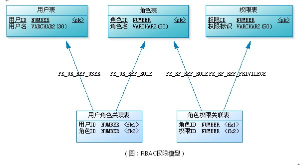
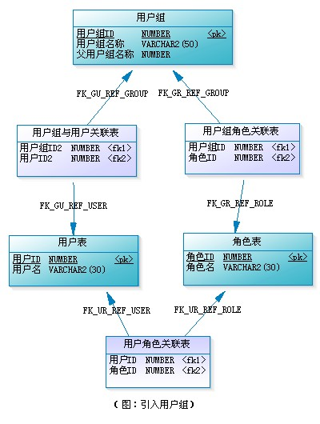
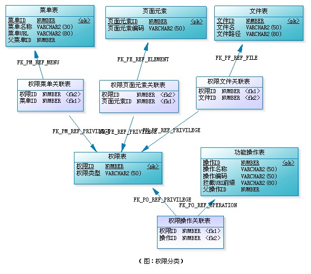
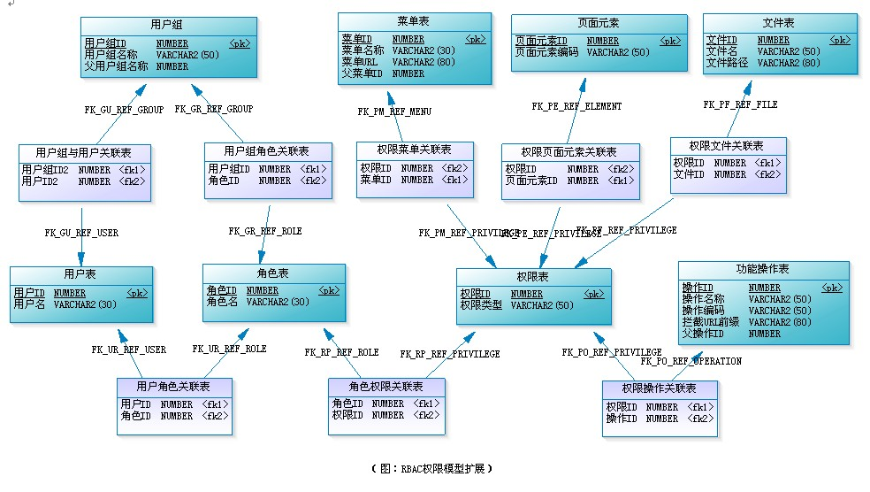
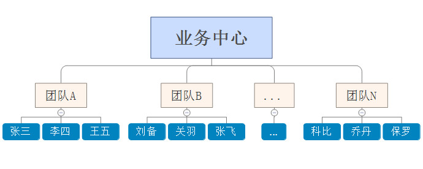
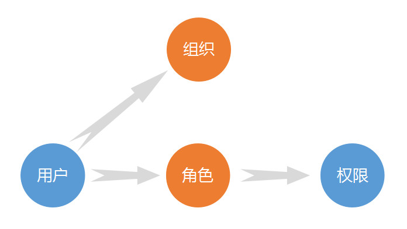

<!--
 * @Description: 深入浅出RBAC权限管理
 * @Date: 2019-08-06 14:50:40
 * @LastEditors: phoebus
 * @LastEditTime: 2019-08-09 15:54:53
 -->
# 深入浅出RBAC权限管理

## 概述

#### 首先理解什么是RBAC权限模型

	RBAC：Role-Based Access Control(基于角色的访问控制)

> [常用权限模型](知识笔记/大前端/架构/权限模型/常用权限模型.md)

* 了解了常见的权限管理模型后，我们知道RBAC是当前使用最广泛(最流程)的权限模型，而`RBAC权限模型`的核心就是：用户通过角色与权限进行关联

* 简单地说，一个用户拥有若干角色，每一个角色拥有若干权限

**那么角色是什么？**

	用户就是我们这样人，那么角色是什么？可以理解为一定数量的权限的集合，权限的载体，权限的进一步抽象

> 例如：一个论坛系统，`超级管理员`、`版主`都是角色

	版主可管理版内的帖子、可管理版内的用户等，这些是权限。
	要给某个用户授予这些权限，不需要直接将权限授予用户，可将"版主"这个角色赋予该用户；同样的，当某个用户不在是某种角色时，我们就可以直接删掉该用户与指定角色的关联

**角色的进一步抽象是：组**

	当用户的数量非常大时，要给系统每个用户逐一授权（授角色），是件非常烦琐的事情。这时，就需要给用户分组，每个用户组内有多个用户

> 除了可给用户授权外，还可以给用户组授权。这样一来：用户拥有的所有权限 = 用户个人拥有的权限与该用户所在用户组拥有的权限之和

> 从上图可以看出：角色和用户组成用户组，它们之间的关联关系形成了又一级的权限抽象，这样我们维护的权限关系将会更加简洁

**最后我们来看看权限是什么？**

	在应用系统中，权限表现成什么？

* 对功能模块的操作，对上传文件的删改，菜单的访问，甚至页面上某个按钮、某个图片的可见性控制，都可属于权限的范畴

> 几乎什么都可以理解为权限

	当然，有些权限设计，会把功能操作作为一类，而把文件、菜单、页面元素等作为另一类，这样构成`用户-角色-权限-资源`的授权模型

> 其中，有个权限类型，我们根据它的取值来区分是哪类权限：`MENU`表示菜单的访问权限、`OPERATION`表示功能模块的操作权限、`FILE`表示文件的修改权限、`ELEMENT`表示页面元素的可见性控制

**这样设计明显有些好处：**

1. 我们不需要区分哪些是权限操作，哪些是资源

2. 很方便拓展，当系统要对新的东西进行权限控制时，我们只需要建立一个新的关联表`权限XX关联表`，并确定这类权限的权限类型就可以用了

**RBAC权限模型的扩展模型的完整设计**

#### RBAC权限管理的好处

* 职能划分更谨慎。对于角色的权限调整不仅仅只影响单个用户，而是会影响关联此角色的所有用户，管理员下发/回收权限会更为谨慎

* 便于权限管理。对于批量的用户权限调整，只需调整用户关联的角色权限即可，无需对每一个用户都进行权限调整，既大幅提升权限调整的效率，又降低漏调权限的概率

#### 基于RBAC的几种权限体系设计

###### RBAC0、RBAC1、RBAC2、RBAC3模式

* RBAC0：是RBAC的核心思想。

* RBAC1：是把RBAC的角色分层模型。

* RBAC2：增加了RBAC的约束模型。

* RBAC3：其实是RBAC2 + RBAC1

###### 用户-角色-权限(RBAC0模式)

	这是最普通的场景，映射正常社会关系，但是往往现实场景更加复杂

* 这又分为：

	* 用户和角色是多对一关系，即：一个用户只充当一种角色，一种角色可以有多个用户担当；

	* 用户和角色是多对多关系，即：一个用户可同时充当好几种角色，一种角色可以有多个用户担当

> 但是一般我们间的比较多的是：`用户和角色是多对多关系`

	直接例子是：一个人可以同时是是公司的经理、老板、财务这些角色，而销售这个角色又可以是多个人

###### 用户-组织-角色-权限(RBAC1模式)

	这个模型对RBAC0的简单模型有进行了进一步的划分

**实例分析**

	在一家企业中，往往会存在组织等级，不同等级的人享受不同的权限，又有上下级和角色之分，这样就实现了进一步的数据安全性

* 上图就是将组织进行了上级级分层，`张三`、`李四`属于同级，只能看到自己的权限的数据，看不到别人的东西，但是团队A领导却能看到真个团队的数据，在这里：`组织决定了用户的数据可视权限`

* 所以我们基于`RBAC模式`还需要拓展组织分层(添加用户组织关系)：

	* 组织层级划分：分为多级层次，每个级别都有对应的权限
	* 数据可视权限规则制定：例如可以设为上级组织可以看到下级的所有数据，而同级组织(成员)无法看到对方及对方下级的数据

###### 用户-组织-岗位-角色-权限(RBAC3模式)

	同上理，这里是基于RBAC1模式添加了岗位关系：添加了用户-岗位关系、岗位-组织关系，而用户与角色脱离，由岗位进一步抽象角色，也就是岗位算是多个角色的集合

**添加岗位的好处**

* 识别用户的主要身份

* 通过“组织-岗位”关联，快速甄别用户岗位

> 这是现实社会最常见的权限关系图了

> 参考：[基于RBAC模型的权限设计：如何设计系统权限体系？](http://www.woshipm.com/pd/872372.html) | [vue中如何实现后台管理系统的权限控制](https://www.cnblogs.com/qixidi/p/10137973.html)
