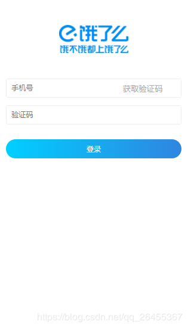

# Vue实现封装input

## 示例

#### 饿了么WebApp的登录页input组件封装



**input组件实现**

``` html
<template>
  <div>
    <div class="input-item" :class="{'is-invalid':error}">
      <input
        :type="type"
        :name="name"
        :value="value"
        :placeholder="placeholder"
        @input="$emit('input', $event.target.value)"
      >
      <button v-if="btnText" :disabled="disabled" @click="$emit('handleClick')">{{ btnText }}</button>
    </div>
    <div v-if="error" class="invalid-feedback">{{error}}</div>
  </div>
</template>

<script>
export default {
  props: {
    type: {
      type: String,
      default: "text"
    },
    name: String, //输入框框名字
    error: String, //错误信息提示
    value: String, //输入框的直
    btnText: String, //是否显示按钮
    disabled: Boolean, //禁用输入框
    placeholder: String //输入框提示文字
  }
};
</script>

<style lang="less" scoped>
.input-item {
  display: flex;
  flex-direction: row;
  border: 1px solid #eee;
  border-radius: 0.08rem;
  justify-content: space-between;
  margin-bottom: .3rem;
}
.input-item input {
  flex: 1;
  height: 0.7rem;
  outline: none;
  text-indent: 0.2rem;
}
.input-item button {
  width: 3rem;
  border: none;
  outline: none;
  background: #fff;
}
.input-item button[disabled] {
  color: #aaa;
}
.is-invalid {
  border: 1px solid red;
}
.invalid-feedback {
  color: red;
  padding-top: 5px;
}
</style>
```

> `template`主要是做input输入框显示逻辑；`script`接收参数注入到模板中；最后重点是`style`，这种组件最重要的就是样式了

**组件使用**

1. 引入组件

``` js
import InputGroup from "components/input-group/InputGroup"
```

2. 注册组件

``` js
components: {
   InputGroup
}
```

3. 在父组件模版中使用组件

``` html
<section>
      <InputGroup 
        type="tel" 
        name="tel" 
        placeholder="手机号" 
        disabled="disabled"
        btnText="获取验证码"
        v-model="phone"/>
      <InputGroup 
        type="tel" name="code" 
        placeholder="验证码" 
        v-model="code" />
</section>
```

> 参考：[Vue实现封装input(干货)](https://blog.csdn.net/qq_26455367/article/details/89351262)
