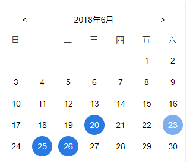

# Vue封装日历控件

## 参考实现

#### 实现1

**效果图**

	点击头部年月部分可以选择日期。左右按钮可以切换月份



**组件实现**

``` html
<template>
    <div class="date-tools">
        <div class="date-years">
            <button class="date-btn date-left" @click="subMonth()"><</button>
            <button class="date-middle" @click="selectYM()">{{panelYear}}年{{panelMonth+1}}月</button>
            <button class="date-btn date-right" @click="addMonth()">></button>
        </div>
        <div class="date-weeks">
            <span>日</span>
            <span>一</span>
            <span>二</span>
            <span>三</span>
            <span>四</span>
            <span>五</span>
            <span>六</span>
        </div>
        <div class="date-days">
            <template v-for="(day,index) in dayFullList">
            <button v-if="day!=0">
                <a href="javascript:void(0);" v-if="(trainDateFullList.includes(day))" class="active" @click="getCurrentDay(day)">{{day | filterDay}} </a>
                <a href="javascript:void(0);" v-else>{{day | filterDay}} </a>
            </button>
            <button v-else>
                <a href="javascript:void(0);" style="opacity:0;">{{day}} </a>
            </button>
            </template>
        </div>
        <!-- 年月下拉框 -->
        <div class="drop-down-ym" v-if="showDropDownYM">
            <div class="drop-down-y">
                <a href="javascript:void(0);" v-for="(item,index) in yearList" @click="selectY(item)">{{item}}</a>
            </div>
            <div class="drop-down-m">
                <a href="javascript:void(0);" v-for="(item,index) in monthList" @click="selectM(item-1)">{{item}}</a>
            </div>
        </div>
    </div>
</template>

<script>
    export default ({
        props: ['dateToolsKey','trainDateList','trainDateFullList'],
        data(){
            return {
                yearList:[2001,2002,2003,2004,2005,2006,2007,2008,2009,2010,2011,2012,2013,2014,2015,2016,2017,2018,2019,2020,2021,2022],
                monthList:[1,2,3,4,5,6,7,8,9,10,11,12],
                weekList:[],
                dayList:[],//所有的天数列表，前面空位补0
                dayFullList:[],//所有的天数列表，前面空位补0
                panelYear:'',//仪表盘显示的年
                panelMonth:'',//仪表盘显示的月（从0开始）
                panelDay:'',//仪表盘显示的天（从1开始）
                firstDay:'',//每月第一天
                lastDay:'',//每月最后一天也即每月多少天
                firstDayIsWhat:'',//第一天星期几0-6（星期日到星期六）
                showDropDownYM:false,
            }
        },
        filters:{
            filterDay(value){
                return parseInt(value.slice(-2));
            }
        },
        methods:{
            dateInit(year=(new Date()).getFullYear(),month=(new Date()).getMonth()){
                let self = this;
                let y = year;
                let m = month;
                self.panelYear = year;
                self.panelMonth = month;
                self.firstDay = (new Date(y,m,1)).getDate();//每月第一天
                self.lastDay = (new Date(y,m+1,0)).getDate();//每月最后一天也即每月多少天
                self.firstDayIsWhat = (new Date(y,m,1)).getDay();//第一天星期几0-6（星期日到星期六）
                let beginTmp = new Array(self.firstDayIsWhat).fill(0);//初始化长度为3的数组并填充0
                let lastTmp = [];//初始化长度为当月天数的数组并填充为0-30或0-31
                let lastFullTmp = [];//初始化完整的月的每天格式为年月日20180627
                for (let i=1;i<=self.lastDay;i++){
                    lastTmp.push(i);
                    lastFullTmp.push(''+self.panelYear+self.addPreZero(self.panelMonth+1)+self.addPreZero(i));
                }
                self.dayList=[...beginTmp,...lastTmp];//用结构的方式生成新日期数组
                self.dayFullList = [...beginTmp,...lastFullTmp];//用结构的方式生成年月日完整的新日期数组
            },
            subMonth(){
                let self = this;
                if(self.panelMonth>0){
                    self.panelMonth--;
                }
            },
            addMonth(){
                let self = this;
                if(self.panelMonth<11){
                    self.panelMonth++;
                }
            },
            getCurrentDay(currentDay){
                this.panelDay = currentDay;
            },
            selectYM(){
                let self = this;
                self.showDropDownYM = true;
            },
            selectY(year){
                let self = this;
                self.panelYear = year;
            },
            selectM(month){
                let self = this;
                self.panelMonth = month;
                self.showDropDownYM=false;
            },
            addPreZero(num){//小于9的需要添加0前缀
                return (num>9) ? num:('0'+num);
            },
            removePreZero(num){//小于9的需要去除0前缀
                return parseInt(num);
            }
        },
        watch: {
			// 检测月份变化
            panelMonth(newVal, oldVal){
                this.dateInit(this.panelYear,this.panelMonth);
            },
			// 检测年份变化
            panelYear(newVal, oldVal){
                this.dateInit(this.panelYear,this.panelMonth);
            },
			// 检测具体日期变化
            panelDay(newVal, oldVal){
                this.$emit('topDateEvent'+this.dateToolsKey,newVal);
            }
        },
        mounted(){
			// 初始化日历
            this.dateInit();
        }
    })
</script>

<style scoped>
button{
    background-color:#fff;
    cursor:pointer;
}
.date-btn,.date-middle{
    color:#333!important;
}
.date-tools{
    position:relative;
    /* margin-top:80px; */
    display:inline-block;
    width:310px;
    height:272px;
    overflow: hidden;
    border:1px solid #eee;
}
.date-btn{
    width:34px;
    height:34px;
    border-radius:50%;
}
.date-btn:hover{
    color:#fff;
    background-color:#0A81E5;
    opacity:0.6;
}
.date-years{
    margin:14px 20px 0 20px;
    display:flex;
    justify-content:space-between;
}
.date-weeks{
    display: flex;
    justify-content:space-between;
}
.date-weeks span{
    display:inline-block;
    width:44px;
    height:34px;
    line-height:34px;
    text-align:center;
}
.date-days{
    /* margin-top:14px; */
}
.date-days button{
    display: inline-block;
    width:44px;
    height:36px;
    background-color:#fff;
}
.date-days a{
    color:#000;
    display:inline-block;
    width:34px;
    height:34px;
    line-height:34px;
    border-radius:50%;
    text-align:center;
}
.date-days a.active{
    cursor:pointer;
    color:#fff;
    background-color:#0A81E5;
}
.date-days a:hover{
    color:#fff;
    background-color:#0A81E5;
    opacity:0.6;
}

.drop-down-ym{
    position:absolute;
    top:0;
    left:0;
    width:310px;
    height:272px;
    background-color:rgba(255,255,255,0.9);
    display: flex;
    justify-content:space-between;
}
.drop-down-y,.drop-down-m{
    width:155px;
    height:272px;
    overflow:auto;
    padding:5px;
}
.drop-down-y::-webkit-scrollbar,.drop-down-m::-webkit-scrollbar{
    display: none;
}
.drop-down-y a,.drop-down-m a{
    color:#000;
    text-align:center;
    display: inline-block;
    width:100%;
    height:30px;
    line-height:30px;
    font-size:18px;
    margin:0 0 5px 0;
}
.drop-down-y a:hover,.drop-down-m a:hover{
    color:#fff;
    background-color:rgba(10, 130, 229, 0.774);
    border-radius:5px;
}
.drop-down-y a.active,.drop-down-m a.active{
    color:#fff;
    background-color:#0A81E5;
    border-radius:5px;
}
</style>
```

**组件使用**

	首先当然是import引入父组件，然后在父组件components属性中注册该日历控件dateTools

``` html
<dateTools
	:dateToolsKey="2"　　// 每个日历控件特定的key值，如果key值一样，易发生css的样式冲突
	:trainDateList="trainDateList2"　　// 需要特定操作的日期部分，可以直接传日期数组（1-30）例如[12,17,30]
	:trainDateFullList="trainDateFullList"　　// 需要特定操作的完整日期部分，可以直接传日期数组（1-30）例如['20180102','20120312']
	ref="topDateTools2"　　　　　　// refs名(跟ID名差不多)
	@topDateEvent2="topDateFun2"　　// 子组件可以操作父组件的方法‘topDateFun2’，组件传值
></dateTools>
```

> 参考：[vue自己封装日历控件](https://www.cnblogs.com/sdorm/p/9238353.html)
