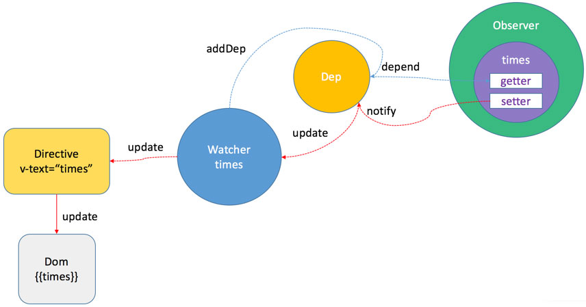

<!--
 * @Description: Vue响应式原理
 * @Date: 2019-08-10 01:46:28
 * @LastEditors: phoebus
 * @LastEditTime: 2019-08-15 15:17:23
 -->
# Vue响应式原理

## 前言：响应式关键知识点基础

	Object.defineProperty，发布订阅模式，Watcher，Dep 以及 Observer 类

#### Object.defineProperty

	Object.defineProperty是Vue实现响应式的关键，作用是数据劫持，将Vue data选项中的对象属性全部转为 getter/setter 
	是MVVM方式的实现，区别于脏检查

**官网描述**

> 把一个普通 `Javascript 对象` 传给 Vue 实例的 `data 选项` ，Vue 将遍历此对象所有的属性，并使用 `Object.defineProperty` 把这些属性全部转为 `getter/setter` 。 `Object.defineProperty` 是仅 `ES5` 支持，且 `无法 shim` 的特性，这也就是为什么 Vue `不支持 IE8` 以及更低版本浏览器的原因

**简单示例**

``` js
var obj = {};
var a;
Object.defineProperty(obj, 'a', {
    get: function() {
        console.log('get val');
        return a;
    },
    set: function(newVal) {
        console.log('set val:' + newVal);
        a = newVal;
        // 还会触发通知所有订阅者(与之绑定的对象)
    }
});
obj.a; // get val 
obj.a = '111'; // set val: 111
```

> Object.defineProperty 把 obj 的 a 属性转化为 getter 和 setter，可以实现 obj.a 的数据监控

##### 发布订阅模式

	发布订阅模式涉及三个对象：发布者、主题对象、订阅者，三个对象间的是一对多的关系，每当主题对象状态发生改变时，其相关依赖对象都会得到通知，并被自动更新

``` js
var x = 0;

// 创建主题对象
function Dep() {
    // 订阅者列表
    this.subs = [];
}

// 主题对象通知订阅者
Dep.prototype.notify = function() {
    // 遍历所有的订阅者，执行订阅者提供的更新方法
    this.subs.forEach(function(sub) {
        sub.update();
    });
}

// 订阅者
function Sub(x) {
    this.x = x;
}

// 订阅者更新
Sub.prototype.update = function() {
    this.x += 1;
    console.log(this.x);
}

// 发布者
var pub = {
    publish: function() {
        dep.notify();
    }
}

// 创建主题对象实例
var dep = new Dep();
// 新增 3 个订阅者
Array.prototype.push.call(dep.subs, new Sub(1), new Sub(2), new Sub(4))
// 发布者发布更新
pub.publish();
/* 
	输出：
		2
		3
		5
 */
```

> 发布者（pub）发出通知（notify），主题对象（Dep）收到通知并推送给订阅者（Sub），订阅者执行相应操作（update）；而Vue的数据驱动就是基于这个模式思想的

#### 关键对象：Observer、Watcher、Dep

###### Observer：数组/对象响应化

	Vue 中的数据对象都会在初始化过程中转化为 Observer 对象，Observer对象是响应式的

**源码学习：Observer 对象的 constructor 函数**

> [array.js源码](https://github.com/vuejs/vue/blob/v2.1.10/src/core/observer/array.js)

``` js
constructor(value: any) {
    this.value = value
    this.dep = new Dep() // 一个 Dep对象实例，Watcher 和 Observer 之间的纽带
    this.vmCount = 0
    def(value, '__ob__', this) // 把自身 this 添加到 value 的 __ob__ 属性上
    if (Array.isArray(value)) { // 对 value 的类型进行判断
        const augment = hasProto ?
            protoAugment :
            copyAugment
        augment(value, arrayMethods, arrayKeys) // 数组增强方法
        this.observeArray(value) // 如果是数组则观察数组
    } else {
        this.walk(value) // 否则观察单个元素。
    }
}
```

* `Observer` 对象的标志就是 `__ob__` 这个属性，这个属性保存了 `Observer` 对象自己本身

	对象在转化为 Observer 对象的过程中是一个递归的过程，对象的子元素如果是对象或数组的话，也会转化为 Observer 对象

> 由于 JavaScript 的限制， Vue 不能检测数组的变化，于是作者在数组增强方法中对 Array 的 `push` , `pop` , `shift` , `unshift` , `splice` , `sort` , `reverse` 方法做了增强实现

###### Watcher

	Watcher 是将模板和 Observer 对象结合在一起的纽带。Watcher 是发布订阅模式中的订阅者

**源码学习：Watcher 的 constructor 函数**

> [watcher.js源码](https://github.com/vuejs/vue/blob/v2.1.10/src/core/observer/watcher.js#L39-L85)

``` js
constructor(
    vm: Component,
    expOrFn: string | Function, // expOrFn 最终会被转换为 getter 函数
    cb: Function, // cb 更新时执行的回调
    options ? : Object
) {
    this.vm = vm
    // 将当前 Watcher 类推送到对应的 Vue 实例中
    vm._watchers.push(this)
    //   ......
    // parse expression for getter
    if (typeof expOrFn === 'function') {
        // 如果是函数，相当于指定了当前订阅者获取数据的方法，每次订阅者通过这个方法获取数据然后与之前的值进行对比
        this.getter = expOrFn
    } else {
        // 否则的话将表达式解析为可执行的函数
        this.getter = parsePath(expOrFn)
        // ......
    }
    this.value = this.lazy ?
        undefined :
        this.get() //如果 lazy 不为 true，则执行 get 函数进行依赖收集；get()是依赖收集的入口
}
```

**源码学习：Watcher 的 get 函数**

``` js
/**
 * Evaluate the getter, and re-collect dependencies.
 */
get() {
    // 设置全局变量 Dep.target，将 Watcher 保存在这个全局变量中，2.0 变成了 pushTarget
    pushTarget(this)
    // 调用 getter 函数，进入 get 方法进行依赖收集操作
    const value = this.getter.call(this.vm, this.vm)
    // "touch" every property so they are all tracked as
    // dependencies for deep watching
    if (this.deep) {
        traverse(value)
    }
    popTarget() // 将全局变量 Dep.target 置为 null
    this.cleanupDeps()
    return value
}
```

> getter 函数是用来连接监控属性与 Watcher 的关键

* `const value = this.getter.call(this.vm, this.vm)` 这一行就是去 `touch Watcher` 初始化时传入的参数 `expOrFn` 中涉及到的每一项数据，然后触发该数据项的 getter 函数

* 设置 `Dep.target` 是个依赖收集过程中的重要一步，getter 函数中就是通过判断 Dep.target 的 `有无` 来判断是 Watcher 初始化时调用的还是普通数据读取，如果有则进行依赖收集

###### Dep

	Dep 类是 Watcher 和 Observer 之间的纽带。每一个 Observer 都有一个 Dep 实例，用来存储订阅者 Watcher

**源码学习：Dep 类的 constructor 函数**

> [dep.js源码](https://github.com/vuejs/vue/blob/v2.1.10/src/core/observer/dep.js#L17-L20)

``` js
constructor() {
    this.id = uid++
    //存储 Watcher 实例的数组
    this.subs = []
}
```

> 内容很简单，就一个 id 和一个数组 subs

**源码学习：Dep 类的 notify 函数**

> [dep.js源码](https://github.com/vuejs/vue/blob/v2.1.10/src/core/observer/dep.js#L36-L42)

``` js
notify() {
    // stablize the subscriber list first
    const subs = this.subs.slice()
    // 遍历 Watcher 列表，调用 update 方法进行更新操作
    for (let i = 0, l = subs.length; i < l; i++) {
        subs[i].update()
    }
}
```

> 这个方法是在响应式的过程中调用的，用户修改数据触发 setter 函数，函数的最后一行就是调用 dep.notify 去通知订阅者更新视图

## 源码解析

#### 源码目录结构

``` bash
src
|— compile 			# 模板编译的代码，1.0 和 2.0 版本在模板编译这一块改动非常大
|— core/instance 	# 生命周期，初始化入口
|— core/observer 	# 响应式
|— core/vdom 		# 虚拟DOM
|— entries 			# 编译入口文件
```

#### 生命周期

* ( `new Vue` )初始化入口文件：[src/core/instance/index.js](https://github.com/vuejs/vue/blob/v2.1.10/src/core/instance/index.js)

* 使用 `new Vue()` (强调要用 `new` )就能调用 `this._init` 方法开始 Vue 的 `生命周期` 


**源码学习：生命周期init**

> [生命周期init.js源码](https://github.com/vuejs/vue/blob/v2.1.10/src/core/instance/init.js#L40-L48)

``` js
initLifecycle(vm) // vm 的生命周期相关变量初始化
initEvents(vm) // vm 的事件监控初始化
initRender(vm) // 模板解析变量初始化
callHook(vm, 'beforeCreate')
initState(vm) // vm 的状态初始化，prop/data/computed/method/watch 都在这里完成初始化，是响应式的关键步！
callHook(vm, 'created')
if (vm.$options.el) {
    vm.$mount(vm.$options.el) // 模板编译入口
}
```

* initLifecycle 主要是初始化 vm 实例上的一些参数

* initEvents 是事件监控的初始化

* initRender 是模板解析

> 注：2.0 的版本中这一块有很大的改动，1.0 的版本中 Vue 使用的是 DocumentFragment 来进行模板解析，而 2.0 中作者采用的 John Resig 的 HTML Parser 将模板解析成可直接执行的 render 函数，这是 `模板预编译` 和 `服务端渲染（SSR）` 的前提

* callHook(vm, 'beforeCreate')是执行钩子函数，就是在 ` new Vue` 实例的时候写的 `beforeCreate` 方法，表示初始化之前

* initState是重点，整个实例状态初始化的地方

* callHook(vm, 'created')也是执行钩子函数，这里是表示已初始化完成

* 最后是是执行 mount 函数，实例挂载

###### initState

> [initState源码state.js](https://github.com/vuejs/vue/blob/v2.1.10/src/core/instance/state.js#L24-L36)

``` js
export function initState(vm: Component) {
    vm._watchers = [] //新建一个订阅者列表
    const opts = vm.$options
    if (opts.props) initProps(vm, opts.props) // 初始化 Props，与 initData 差不多
    if (opts.methods) initMethods(vm, opts.methods) // 初始化 Methods，Methods 的初始化比较简单，就是作用域的重新绑定。
    if (opts.data) {
        initData(vm) // 初始化 Data，响应式关键步
    } else {
        observe(vm._data = {}, true /* asRootData */ ) //如果没有 data，则观察一个空对象
    }
    if (opts.computed) initComputed(vm, opts.computed) // 初始化 computed，这部分会涉及 Watcher 类以及依赖收集，computed 其实本身也是一种特殊的 Watcher
    if (opts.watch) initWatch(vm, opts.watch) // 初始化 watch，这部分会涉及 Watcher 类以及依赖收集
}
```

> 这些初始化都涉及到 `数据转化` 为 `Observer` 对象的过程

###### initData

> [initData源码state.js](https://github.com/vuejs/vue/blob/v2.1.10/src/core/instance/state.js#L74-L104)

``` js
function initData(vm: Component) {
    let data = vm.$options.data
    data = vm._data = typeof data === 'function' ?
        data.call(vm) :
        data || {}
    if (!isPlainObject(data)) { // 保证data必须为纯对象
        // ......
    }
    // proxy data on instance
    const keys = Object.keys(data)
    const props = vm.$options.props
    let i = keys.length
    while (i--) {
        if (props && hasOwn(props, keys[i])) { // 是props，则不代理
            // ...... // 如果和 props 里面的变量重了，则抛出 Warning
        } else { // 否则将属性代理的 vm 上，这样就可以通过 vm.xx 访问到 vm._data.xx
            proxy(vm, keys[i]) //proxy方法遍历 data 的 key，把 data 上的属性代理到 vm 实例上
        }
    }
    // observe data
    observe(data, true /* asRootData */ ) // 关键步！observe(data, this)方法来对 data 做监控
}
```

**这一步的功能**

* 保证 data 为纯对象

* 判断与 props 里的属性是否有重复，有就报错

* 进行数据代理，方便数据读取，代理后我们可以直接使用 vm.key，而不需要 vm._data.key

* 调用 observe 方法，这是响应式的关键步！

###### observe

	observe 方法会为传进来的 value 值创建一个 Observer 对象，创建之前会做一些判断

> [observe源码：src/core/observer/index.js](https://github.com/vuejs/vue/blob/v2.1.10/src/core/observer/index.js#L101-L126)

``` js
/**
 * Attempt to create an observer instance for a value,
 * returns the new observer if successfully observed,
 * or the existing observer if the value already has one.
 * 返回一个 Observer 对象
 */
export function observe (value: any, asRootData: ?boolean): Observer | void {
  if (!isObject(value)) {  //如果不是对象和数组则不监控，直接返回
    return
  }
  let ob: Observer | void
  // 判断 value 是否已经添加了 __ob__ 属性，并且属性值是 Observer 对象的实例。避免重复引用导致的死循环
  if (hasOwn(value, '__ob__') && value.__ob__ instanceof Observer) {    // 如果是就直接用
    ob = value.__ob__
  } else if (
    observerState.shouldConvert && // 只有 root instance props 需要创建 Observer 对象
    !isServerRendering() && // 不是服务端渲染
    (Array.isArray(value) || isPlainObject(value)) && // 数组或者普通对象
    Object.isExtensible(value) && // 可扩展对象
    !value._isVue // 非  Vue 组件
  ) {
    ob = new Observer(value)  // 关键步！在 value 满足上述条件的情况下创建一个 Observer 对象
  }
  if (asRootData && ob) {
    ob.vmCount++
  }
  return ob // 返回一个 Observer 对象
}
```

#### Observer 类

> [observe源码：src/core/observer/index.js](https://github.com/vuejs/vue/blob/v2.1.10/src/core/observer/index.js#L67-L75)

**Observer类构造函数主要功能**

1 首先创建了一个 Dep 对象实例；

2. 然后把自身 this 添加到 value 的 `__ob__` 属性上；

3. 最后对 value 的类型进行判断，如果是数组则观察数组，否则观察单个元素（要理解这一步是个递归过程，即 value 的元素如果符合条件也需要转化为 Observer 对象）

> 其中`observeArray` 方法就是对数组进行遍历，递归调用 observe 方法，最终都会走入 walk 方法监控单个元素。而 walk 方法就是遍历对象，结合 defineReactive 方法递归将属性转化为 getter 和 settle

#### defineReactive

	最终响应式实现的方法

> [源码：src/core/observer/index.js](https://github.com/vuejs/vue/blob/v2.1.10/src/core/observer/index.js#L67-L75)

``` js
/**
 * Define a reactive property on an Object.
 */
export function defineReactive (
  obj: Object,
  key: string,
  val: any,
  customSetter?: Function
) {
  const dep = new Dep()  //每个对象都会有一个 Dep 实例，用来保存依赖 (Watcher 对象)
//   ......
  let childOb = observe(val)   //结合 observe 函数进行将对象的对象也变成监控对象
  // 最重点、基石、核心的部分：通过调用 Object.defineProperty 给 data 的每个属性添加 getter 和 setter 方法。
  Object.defineProperty(obj, key, {
    enumerable: true,
    configurable: true,
    get: function reactiveGetter () {
      const value = getter ? getter.call(obj) : val
      // 依赖收集的重要步骤
      if (Dep.target) {	// 如果存在 Dep.target 这个全局变量不为空，表示是在新建 Watcher 的时候调用的，代码已经保证
        dep.depend()    // 依赖收集
        if (childOb) {
          childOb.dep.depend() // 处理好子元素的依赖 watcher
        }
        if (Array.isArray(value)) { // 如果是数组，进一步处理
          dependArray(value)
        }
      }
      return value
    },
    set: function reactiveSetter (newVal) {
      const value = getter ? getter.call(obj) : val
    //   ......
      childOb = observe(newVal)    // 对新数据重新 observe，更新数据的依赖关系
      dep.notify()   // 通知 dep 进行数据更新，这个方法在前面的 Dep 类中讲过
    }
  })
}
```

> `defineReactive` 是对 `Object.defineProperty` 方法的包装，结合 observe 方法对数据项进行深入遍历，最终将所有的属性就转化为 getter 和 setter。至此，所有的数据都已经转换为 Observer 对象。即数据的`读操作`都会触发 `getter` 函数，`写操作`都会触发 `setter` 函数。

#### 依赖收集

	依赖收集是通过属性的 getter 函数完成的，文章一开始讲到的 Observer、Watcher、Dep 都与依赖收集相关。
	其中 Observer 与 Dep 是一对一的关系、Dep 与 Watcher 是多对多的关系、Dep 则是 Observer 和 Watcher 之间的纽带

* 依赖收集完成后，当属性变化会执行主题对象（Observer）的 `dep.notify` 方法，这个方法会遍历订阅者（Watcher）列表向其发送消息，Watcher 会执行 run 方法去更新视图



###### 总结依赖关系建立的步骤

1. 模板编译过程中的指令和数据绑定都会生成 Watcher 实例，`watch 函数`中的对象也会生成 `Watcher 实例`，在实例化的过程中，会调用 watcher.js 中的 get 函数 touch 这个 Watcher 的表达式或函数涉及的所有属性；

2. touch 开始之前，Watcher 会设置 Dep 的静态属性 `Dep.target` 指向其自身，然后开始依赖收集；

3. touch 属性的过程中，属性的 getter 函数会被访问；

4. 属性 getter 函数中会判断 Dep.target（target 中保存的是第 2 步中设置的 Watcher 实例）是否存在，若存在则将 getter 函数所在的 Observer 实例的 Dep 实例保存到 Watcher 的列表中，并在此 Dep 实例中添加 Watcher 为订阅者；

5. 重复上述过程直至 Watcher 的表达式或函数涉及的所有属性均 touch 结束（即表达式或函数中所有的数据的 getter 函数都已被触发），Dep.target 被置为 null，依赖收集完成

> 当数据发生改变后，相应的 setter 函数被触发，然后执行 notify 函数通知订阅者（Watcher）去更新相关视图，也会对新的数据重新 observe，更新相关的依赖关系

#### 总结

1. 在生命周期的 initState 方法中将 `data`、`prop`、`method`、`computed`、`watch` 中的数据劫持，通过 `observe 方法`与 `defineReactive 方法`将相关对象转换为 Observer 对象

2. 然后在 initRender 方法中解析模板，通过 Watcher 对象、Dep 对象与观察者模式将模板中的指令与对应的数据建立依赖关系，在这个依赖收集的过程中，使用了全局对象 Dep.target

3. 最后，当数据发生改变时，触发 `Object.defineProperty` 方法中的 `dep.notify` 方法，遍历该数据的依赖列表，执行其 update 方法通知 Watcher 进行视图更新

> 参考：[Vue2.0 源码阅读：响应式原理](https://zhouweicsu.github.io/blog/2017/03/07/vue-2-0-reactivity/) | [深入响应式原理](https://cn.vuejs.org/v2/guide/reactivity.html)

