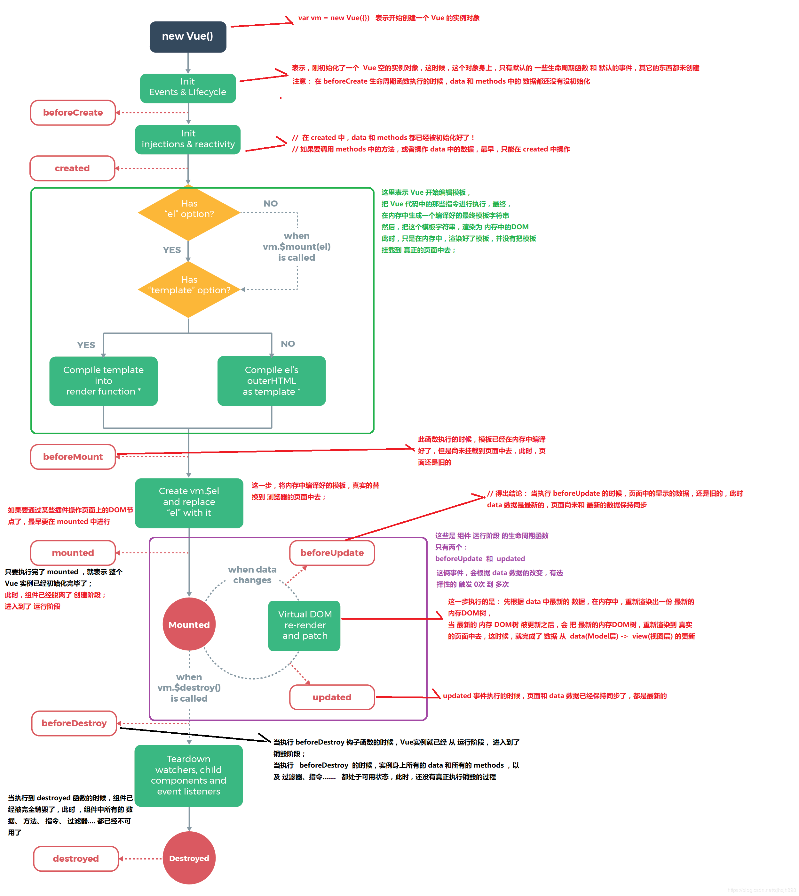

<!--
 * @Description: 
 * @Date: 2019-08-10 01:46:28
 * @LastEditors: phoebus
 * @LastEditTime: 2019-08-21 18:09:25
 -->
# Vue生命周期理解

## 概述

#### 什么是Vue生命周期？

* 从Vue实例`开始创建`、`初始化数据`、`编译模版`、`挂载 Dom` -> `渲染`、`更新` -> `渲染、卸载`等的一系列过程就叫做`生命周期`

* 这每个生命周期对应的函数也被称作`钩子函数`

#### 生命周期有哪些？

* beforeCreate

	组件实例被创建之初，组件的属性生效之前

* created

	组件实例已经完全创建，属性也绑定，但真实 dom 还没有生成，$el 还不可用

* beforeMount

	在挂载开始之前被调用：相关的 render 函数首次被调用

* mounted

	el 被新创建的 vm.$el 替换，并挂载到实例上去之后调用该钩子

* beforeUpdate

	组件数据更新之前调用，发生在虚拟 DOM 打补丁之前

* update

	组件数据更新之后

* activated

	keep-alive 专属，组件被激活时调用

* deadActivated

	keep-alive 专属，组件被销毁时调用

* beforeDestroy

	组件销毁前调用

* destroyed

	组件销毁后调用

## Vue生命周期具体流程

1. 创建Vue实例，初始化开始

``` bash
new Vue() --> init()
```

2. 实例创建前：`beforeCreated`阶段

	* 在阶段是在Vue实例创建之前，在数据观测 (data observer) 和 event/watcher 事件配置之前

> 可以在这个钩子函数加个loading事件，在加载实例时触发

3. 实例创建完成：`created`阶段

	* 该阶段Vue实例已经创建完，各项基本工作已经初始化完成
	* 数据观测 (data observer) 和 event/watcher 事件配置已经完成

		* 主要就是props 、methods 、data 、computed 和 watch 的初始化处理

	* 但是该阶段尚未将实例挂载到页面，也就是`$el属性`不可见

> 可以在这个钩子函数中结束loading事件，可以执行异步操作，数据初始化或预处理等

4. 实例挂载前：`beforeMount`阶段

	* 该阶段是页面尚未进行DOM的渲染，是在进行预渲染阶段，环境判断
	* 属于挂载前，即将进行render函数进行页面渲染

> 此阶段(包括之前)`vm.$el`、`data` 的值都为`undefined`，意思是尚未挂载到页面(文档)上去

5. 实例挂载完成：`mounted`阶段

	* `旧的el`已经被更新，被新的`vm.$el`替换
	* 这个阶段DOM已经渲染完成了(虚拟DOM渲染到了页面成为真实DOM)，并且挂载到了页面上去了，也就是我们已经可以看见`$el属性`，并可以操作DOM了

> 该阶段表示整个Vue实例已经创建完成，组件进入运行阶段，可以进行任何操作

6. 数据更新前：`beforeUpdate`阶段

	* 数据出现变更，但虚拟DOM重构建和页面重渲染尚未开始

> 可以在此阶段做拦截，数据统一处理等，可以直接更改状态而不会触发附加的重渲染

7. 数据更新完成：`updated`阶段

	* 该阶段数据已经完成更新，也就是页面已经渲染完成

> 可以在这里数据更新已经完成，可以执行某些回调操作，或判断某些状态是否已完成

8. 实例销毁前：`beforeDestroy`阶段

	* 该阶段出于实例销毁之前，实例、数据、状态等都还存在

> 可以添加个弹窗确认退出等操作，也可以对一些持久化数据进行操作处理

9. 实例销毁完成：`destroyed`阶段

	* 该阶段实例已经被销毁，所有页面数据、事件等都被销毁(持久化数据除外)

> 在该阶段可以进行一些持久化数据的手动销毁操作，或更改某些持久化数据，甚至清楚自己可能留下来的痕迹，都可以处理掉



> 参考：[vue生命周期的理解](https://blog.csdn.net/haochangdi123/article/details/78358895)
