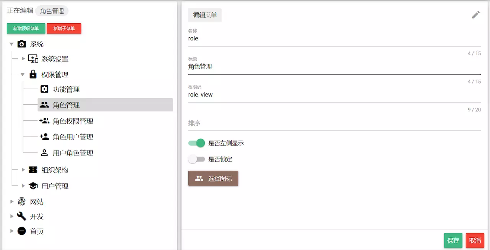

# Vue权限路由方案

## 概述

#### Vue有哪些权限控制方法

* 直接全局路由守卫判断控制

	最简单也最死板，不够灵活，小项目可以直接用

* 动态路由实现权限控制

	可以实现路由按需加载，实现真正的权限控制，但是对于比较复杂的场景还不够，因为存在菜单等问题

* 菜单与路由分离，菜单由后端返回

	这样实现主要是解决菜单与路由的偶合问题，其中路由即可以直接使用全局路由守卫判断，也可以实现动态路由控制，一般复杂的场景都能解决，当然，最灵活的还是菜单和路由都由后端返回，真正实现权限控制

* 菜单和路由都由后端返回，真正实现权限控制

	这个可以真正实现完美权限控制，只要做好数据处理和前后端配合，当然最终这个方案是最复杂的，也能应对所有的场景


## Vue权限路由实现和优化

#### 使用全局路由守卫

	直接在路由meta上标记好路由权限

``` js
const routerMap = [{
    path: '/permission',
    component: Layout,
    redirect: '/permission/index',
    alwaysShow: true, // will always show the root menu
    meta: {
        title: 'permission',
        icon: 'lock',
        roles: ['admin', 'editor'] // you can set roles in root nav
    },
    children: [{
        path: 'page',
        component: () => import('@/views/permission/page'),
        name: 'pagePermission',
        meta: {
            title: 'pagePermission',
            roles: ['admin'] // or you can only set roles in sub nav
        }
    }, {
        path: 'directive',
        component: () => import('@/views/permission/directive'),
        name: 'directivePermission',
        meta: {
            title: 'directivePermission'
            // if do not set roles, means: this page does not require permission
        }
    }]
}]
```

* 全局路由守卫每次都判断用户是否已经登录，没有登录则跳到登录页

* 已经登录(已经取得后台返回的用户的权限信息(角色之类的))，则判断当前要跳转的路由，用户是否有权限访问(根据路由名称到全部路由里找到对应的路由，判断用户是否具备路由上标注的权限信息( `roles: ['admin', 'editor']` )，没有权限则跳到事先定义好的界面(403/404之类的)

> 这种方式，菜单可以直接用路由生成(用户没有权限的菜单也会显示，点击跳转的时候才做权限判断)，也可以在用户登录后根据用户权限把路由过滤一遍生成菜单(菜单需要保存在vuex里)

> 应用实例：[iview-admin](https://github.com/iview/iview-admin/blob/dev/src/router/index.js)

**存在的问题**

* 加载所有的路由，如果路由很多，而用户并不是所有的路由都有权限访问，对性能会有影响

* 全局路由守卫里，每次路由跳转都要做权限判断

* 菜单信息写死在前端，要改个显示文字或权限信息，需要重新编译

* 菜单跟路由耦合在一起，定义路由的时候还有添加菜单显示标题，图标之类的信息，而且路由不一定作为菜单显示，还要多加字段进行标识

**解决方案：登录页与主应用分离**

	针对上述问题，我们可以将登录页与主应用放到不同的页面(不在同一个vue应用实例里)

> 流程：登录成功后，进行页面跳转(真正的页面跳转，不是路由跳转)，并将用户权限传递到主应用所在页面，主应用初始化之前，根据用户权限筛选路由，筛选后的路由作为vue的实例化参数，而不是像前一种方式所有的路由都传递进去，也不需要在全局路由守卫里做权限判断了

**还存在的问题**

* 需要做页面跳转，不是纯粹的单页应用

* 菜单信息写死在前端，要改个显示文字或权限信息，需要重新编译

* 菜单跟路由耦合在一起，定义路由的时候还有添加菜单显示标题，图标之类的信息，而且路由不一定作为菜单显示，还要多加字段进行标识

> 虽然小项目没问题，但是很多复杂灵活的场景就有问题了

#### 使用addRoutes动态挂载路由

	addRoutes允许在应用初始化之后，动态的挂载路由

> 有了这个之后，我们就不需要再应用初识化之前进行路由删选了，我们完全可以在应用初始化之后，根据权限动态加载需要的路由

* 首先，应用初始化的时候先挂载不需要权限控制的路由，比如登录页，404等错误页

**引导问题：addRoutes应该何时调用，在哪里调用？**

	虽然登录后，获取用户的权限信息，然后筛选有权限访问的路由，再调用addRoutes添加路由，这个方法是可行的。但是不可能每次进入应用都需要登录，用户刷新浏览器又要登陆一次

> 所以addRoutes还是要在全局路由守卫里进行调用

``` js
if (store.getters.roles.length === 0) { // 判断当前用户是否已拉取完user_info信息
    store.dispatch('GetUserInfo').then(res => { // 拉取user_info
        const roles = res.data.roles // note: roles must be a array! such as: ['editor','develop']
        store.dispatch('GenerateRoutes', {
            roles
        }).then(() => { // 根据roles权限生成可访问的路由表
            router.addRoutes(store.getters.addRouters) // 动态添加可访问路由表
            next({ ...to,
                replace: true
            }) // hack方法 确保addRoutes已完成，set the replace: true so the navigation will not leave a history record
        })
    }).catch((err) => {
        store.dispatch('FedLogOut').then(() => {
            Message.error(err || 'Verification failed, please login again')
            next({
                path: '/'
            })
        })
    })
}
```

> 应用实例：[vue-element-admin](https://link.juejin.im/?target=https%3A%2F%2Fgithub.com%2FPanJiaChen%2Fvue-element-admin)

**存在的问题**

* 全局路由守卫里，每次路由跳转都要做判断

* 菜单信息写死在前端，要改个显示文字或权限信息，需要重新编译

* 菜单跟路由耦合在一起，定义路由的时候还有添加菜单显示标题，图标之类的信息，而且路由不一定作为菜单显示，还要多加字段进行标识

#### 菜单与路由分离，菜单由后端返回

	上述通过动态路由解决了主要路由加载的问题，但是明显还存在一些问题，我们可以继续优化：解决菜单与路由偶合的问题
	菜单的显示标题、图片等需要随时更改，要对菜单做管理功能：后端直接根据用户权限返回可访问的菜单

* 前端路由使用标准路由定义，不加其它表示字段

``` js
{
    name: "login", // 需要根据 name字段 与后端返回菜单做关联
    path: "/login",
    component: () => import("@/pages/Login.vue")
}
```

> 做菜单管理功能的时候，一定要有个字段与前端的路由的name字段对应上(也可以是其他字段，只要菜单能找到对应的路由或者路由能找到对应的菜单就行)，并且做唯一性校验。菜单上还需要定义权限字段，可以是一个或多个。其他信息，比如显示标题，图标，排序，锁定之类的，可以根据实际需求进行设计。

* 参考菜单管理页面



* 依旧是在全局路由守卫中进行判断

> 参考应用实例：[vue-quasar-admin](https://link.juejin.im/?target=https%3A%2F%2Fgithub.com%2Fwjkang%2Fvue-quasar-admin)

``` js
function hasPermission(router, accessMenu) {
    if (whiteList.indexOf(router.path) !== -1) {
        return true;
    }
	// 工具：https://github.com/wjkang/vue-quasar-admin/blob/dev/src/libs/util.js
    let menu = Util.getMenuByName(router.name, accessMenu);
    if (menu.name) {
        return true;
    }
    return false;

}

Router.beforeEach(async (to, from, next) => {
    if (getToken()) {
        let userInfo = store.state.user.userInfo;
        if (!userInfo.name) {
            try {
                await store.dispatch("GetUserInfo")
                await store.dispatch('updateAccessMenu')
                if (to.path === '/login') {
                    next({
                        name: 'home_index'
                    })
                } else {
                    // Util.toDefaultPage([...routers], to.name, router, next);
                    next({ ...to,
                        replace: true
                    }) // 菜单权限更新完成,重新进一次当前路由
                }
            } catch (e) {
                if (whiteList.indexOf(to.path) !== -1) { // 在免登录白名单，直接进入
                    next()
                } else {
                    next('/login')
                }
            }
        } else {
            if (to.path === '/login') {
                next({
                    name: 'home_index'
                })
            } else {
                if (hasPermission(to, store.getters.accessMenu)) {
                    Util.toDefaultPage(store.getters.accessMenu, to, routes, next);
                } else {
                    next({
                        path: '/403',
                        replace: true
                    })
                }
            }
        }
    } else {
        if (whiteList.indexOf(to.path) !== -1) { // 在免登录白名单，直接进入
            next()
        } else {
            next('/login')
        }
    }
    let menu = Util.getMenuByName(to.name, store.getters.accessMenu);
    Util.title(menu.title);
});

Router.afterEach((to) => {
    window.scrollTo(0, 0);
});
```

> 这里因为没有使用 `addRoutes`，每次路由跳转的时候都要判断权限，当然这里的判断也很简单，因为菜单的name与路由的name是一一对应的，而后端返回的菜单就已经是经过权限过滤的，所以如果根据路由name找不到对应的菜单，就表示用户有没权限访问

* 如果路由很多，可以在应用初始化的时候，只挂载不需要权限控制的路由。取得后端返回的菜单后，根据菜单与路由的对应关系，筛选出可访问的路由，通过addRoutes动态挂载

**存在的问题**

* 菜单需要与路由做一一对应，前端添加了新功能，需要通过菜单管理功能添加新的菜单，如果菜单配置的不对会导致应用不能正常使用

* 全局路由守卫里，每次路由跳转都要做判断

> [不在前端处理菜单跟路由方案实现](https://link.juejin.im/?target=https%3A%2F%2Fjuejin.im%2Fpost%2F5c30c666518825261c1b7191)

#### 菜单与路由完全由后端返回

	这是最灵活的解决方案，可以实现真正的权限控制，当然也最复杂，因为既要处理好数据，也要前后端配合好

* 菜单由后端返回的方法跟上一个方案一样，但是路由由后端返回的方案我们需要注意下，因为我们需要webpack识别打包

``` js
// 这样肯定是不能直接这样返回的：webpack压根识别不了，就没办法打包处理了
{
	"name": "login",
	"path": "/login",
	"component": "() => import('@/pages/Login.vue')"
}

// 正解：使用 key-value 的方式传值到前端
[
      {
        name: "home",
        path: "/",
        component: "home"
      },
      {
        name: "home",
        path: "/userInfo",
        component: "userInfo"
      }
]
// 前端统一路由组件
const Home = () => import("../pages/Home.vue");
const UserInfo = () => import("../pages/UserInfo.vue");
export default {
  home: Home,
  userInfo: UserInfo
};
```

> 后端返回路由数据后，在通过addRoutes动态挂载之前需要将数据处理一下，将component字段换为真正的组件地址

	至于菜单与路由是否还要分离，就看需求定了，因为都行
	还有如果有嵌套路由，后端功能设计的时候需要注意添加相应的字段。前端拿到数据也要做相应的处理。

**存在的问题**

* 全局路由守卫里，每次路由跳转都要做判断

* 前后端的配合要求更高

#### 不使用全局路由守卫

* 首先，在应用初始化的时候只挂载不需要权限控制的路由

``` js
// routers.js
const constRouterMap = [
  {
    name: "login",
    path: "/login",
    component: () => import("@/pages/Login.vue")
  },
  {
    path: "/404",
    component: () => import("@/pages/Page404.vue")
  },
  {
    path: "/init",
    component: () => import("@/pages/Init.vue")
  },
  {
    path: "*",
    redirect: "/404"
  }
];
export default constRouterMap;

// index.js
import Vue from "vue";
import Router from "vue-router";
import ConstantRouterMap from "./routers";

Vue.use(Router);

export default new Router({
  // mode: 'history', // require service support
  scrollBehavior: () => ({ y: 0 }),
  routes: ConstantRouterMap
});
```

* 登录成功后跳到`/`路由，但是因为当前没有`/`路由，会跳到`/404`

``` js
submitForm(formName) {
	let _this=this;
	this.$refs[formName].validate(valid => {
		if (valid) {
			_this.$store.dispatch("loginByUserName",{
				name:_this.ruleForm2.name,
				pass:_this.ruleForm2.pass
			}).then(()=>{
				// 登陆成功后会跳转至路由：/
				_this.$router.push({
					path:'/'
				})
			})
		} else {
			
			return false;
		}
	});
}

// 因为没有路由：/，所有会重定向到 404页面
<template>
  <h1>404</h1>
</template>
<script>
export default {
  name:'page404',
  mounted(){
    if(!this.$store.state.isLogin){
      this.$router.replace({ path: '/login' });
      return;
    }
    if(!this.$store.state.initedApp){
		// 如果判断已经登陆，但是路由尚未初始化，就重定向到初始化页面
       this.$router.replace({ path: '/init' });
       return
    }
  }
}
</script>
```

* 404组件里判断已经登录，接着判断应用是否已经初始化(用户权限信息，可访问菜单，路由等是否已经从后端取得)，如果没有初始化则跳转到`/init`路由

``` js
<template>
  <div></div>
</template>
<script>

import { getAccessMenuList } from "../mock/menus";
import components from "../router/routerComponents.js";

export default {
	async mounted() {
			if (!this.$store.state.isLogin) {
			this.$router.push({ path: "/login" });
				return;
			}
			// 判断是否已初始化，避免用户直接通过地址栏进入当前组件
			if (!this.$store.state.initedApp) {
				const loading = this.$loading({
					lock: true,
					text: "初始化中",
					spinner: "el-icon-loading",
					background: "rgba(0, 0, 0, 0.7)"
				});
				let menus = await getAccessMenuList(); // 模拟从后端获取
				var routers = [...menus];
				// 处理后端返回的路由数据，转为符合前端的数据格式
				for (let router of routers) {
					let component = components[router.component];
					router.component = component;
				}
				// 动态添加路由
				this.$router.addRoutes(routers);
				this.$store.dispatch("setAccessMenuList", menus).then(() => {
					// 路由挂载成功，回到首页
					loading.close();
					this.$router.replace({
						path: "/"
					});
				});
				return;
			} else {
				// 如果已经初始化，就重定向到`/`根页面
				this.$router.replace({
					path: "/"
				});
			}
	}
};
</script>
```

* init组件里判断应用是否已经初始化(避免初始化后，直接从地址栏输入地址再次进入当前组件)；如果已经初始化，跳转/路由(如果后端返回的路由里没有定义次路由，则会跳转404)；没有初始化，则调用远程接口获取菜单和路由等，然后处理后端返回的路由，将component赋值为真正的组件，接着调用addRoutes挂载新路由，最后跳转/路由即可，菜单处理方式同理

> [参考demo](https://codesandbox.io/s/r02zvvlpno)

**存在的问题**

* 在404页面做了判断，感觉比较怪异

* 多引入了一个init页面组件

#### 总结

* 具体的还是要看项目场景和需求，但是只要项目稍微有点需求，就时候后端返回菜单和路由的方式做权限控制比较好，也就是后两种方案

* 如果担心全局路由守卫每次调整路由都要判断的话，可以直接使用最后一种方法，只是在页面首次加载的时候需要做下判断处理而已，虽然在404页面写哪些东西比较奇怪，但是无疑是比较好的解决方案了

> 参考：[vue权限路由实现方式总结](https://juejin.im/post/5b5bfd5b6fb9a04fdd7d687a)
