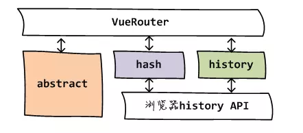
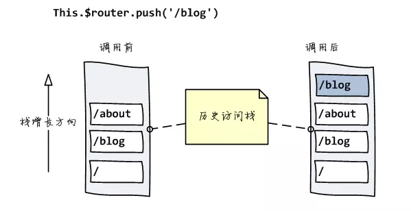

<!--
 * @Description: 深入浅出vue-router原理
 * @Date: 2019-08-12 10:40:54
 * @LastEditors: phoebus
 * @LastEditTime: 2019-08-12 13:56:34
 -->
# vue-router原理

## 概述

#### vue-router简述

	vue-router是Vue官方提供的路由管理方案(路由管理器)
	可以轻松的实现页面(路由)管理，让单页面更加灵活

> [官方文档](https://router.vuejs.org/zh/)

#### 一般router文件

``` js
// router／routes.js
const routes = [{
        path: '/',
        redirect: '/recommend'
    },
    {
        path: '/recommend',
        component: () => import('../components/recommend/view.vue')
    },
    {
        path: '/singer',
        component: () => import('../components/singer/view.vue')
    },
    {
        path: '/rank',
        component: () => import('../components/rank/view.vue')
    },
    {
        path: '/search',
        component: () => import('../components/search/view.vue')
    }
]
export default routes
```

#### vue-router核心

* 路由跳转不需要重新加载整个页面

  + 意思URL变化了，这个URL的部分只是模拟的，在浏览器看来并没有变(浏览器忽略的部分URL)，所以一切改变都是有 `vue-router` 驱动的，所以无需加载整个页面，它会选择性的更新视图

## 原理

#### 从两种路由模式看vue-router

	vue-router通过hash与History interface两种方式实现前端路由

* hash模式(默认)

  + 利用URL中的hash("#")，在该模式下，URL会多一个 `#` 作为分割，而浏览器会自动忽略 `#` 号后面的部分

``` bash
http://localhost:8080/#/recommend
```

* history模式

  + History interface在 HTML5中新增的方法
  + 该模式下没有 `#` 号，但是效果是一样的

	> 如果浏览器不支持使用 `history模式` ，则自动切换使用 `hash模式` 

``` bash
http://localhost:8080/recommend
```

* abstract

  + 这是为 `node环境` 提供的专有模式，当不在浏览器环境时会自动切换到该模式
  + 原理是用一个数组stack模拟出浏览器历史记录栈的功能



**模式切换源码分析**

``` js
// 根据mode确定history实际的类并实例化
switch (mode) {
    case 'history':
        this.history = new HTML5History(this, options.base)
        break
    case 'hash':
        this.history = new HashHistory(this, options.base, this.fallback)
        break
    case 'abstract':
        this.history = new AbstractHistory(this, options.base)
        break
    default:
        if (process.env.NODE_ENV !== 'production') {
            assert(false, `invalid mode: ${mode}` )
        }
}
```

> 这里重点看 `history模式` 和 `hash模式` 的区别，对应源码就是 `HTML5History对象` 和 `HashHistory对象` 分别表示什么？

###### HashHistory

	hashHistory可以很方便的替换路由

* HashHistory.push()

	push表示入栈定：将新路由添加到浏览器访问历史的栈顶

**从设置路由改变到视图更新的流程**

	$router.push() --> HashHistory.push() --> History.transitionTo() --> History.updateRoute() --> {app._route = route} --> vm.render()

1. $router.push() // 调用方法

2. HashHistory.push() // 根据hash模式调用，设置hash并添加到浏览器历史记录（添加到栈顶）（window.location.hash= XXX）

3. History.transitionTo() // 监测更新，更新则调用History.updateRoute()

4. History.updateRoute() // 更新路由

5. {app._route= route} // 替换当前app路由

6. vm.render() // 更新视图

> 注：这个方法是直接在浏览器历史栈中增加一条记录，是可以追踪的



* HashHistory.replace()

	这个方法的重点不是将新路由添加到浏览器访问历史的栈顶，而是替换掉当前路由：也就是原来浏览器有几个历史站点，之后还是几个，只是当前路由被替换了

``` js
replace(location: RawLocation, onComplete ? : Function, onAbort ? : Function) {
    this.transitionTo(location, route => {
        replaceHash(route.fullPath)
        onComplete && onComplete(route)
    }, onAbort)
}

function replaceHash(path) {
    const i = window.location.href.indexOf('#')
    window.location.replace(
        window.location.href.slice(0, i >= 0 ? i : 0) + '#' + path
    )
}
```

> 注：这个方法是直接在浏览器历史栈中替换当前路由，也就是上一个栈是什么，我们无法追踪了


* 监听地址栏

  + 处理我们代码逻辑调用路由外，还要考虑用户自行URL输入，所以 `VueRouter` 还需要监听URL路由地址的变化

  > 在 `HashHistory` 中这一功能通过 `setupListeners` 实现

``` js
// 该方法设置监听了浏览器事件hashchange，调用的函数为replaceHash，即在浏览器地址栏中直接输入路由相当于代码调用了replace()方法
setupListeners() {
    window.addEventListener('hashchange', () => {
        if (!ensureSlash()) {
            return
        }
        this.transitionTo(getHash(), route => {
            replaceHash(route.fullPath)
        })
    })
}
```

###### HTML5History

	History interface是浏览器历史记录栈提供的接口
	通过back(), forward(), go()等方法，我们可以读取浏览器历史记录栈的信息，进行各种跳转操作

> 在HTML5后，新增了对浏览器历史记录栈进行修改操作

``` js
/* 
	stateObject: 当浏览器跳转到新的状态时，将触发popState事件，该事件将携带这个stateObject参数的副本
	title: 所添加记录的标题
	URL: 所添加记录的URL
 */
window.history.pushState(stateObject, title, URL); // 与hash模式类似，只是将window.hash改为history.pushState
window.history.replaceState(stateObject, title, URL); // 与hash模式类似，只是将window.replace改为history.replaceState
```

* 还有一个监听地址变化的功能

  + 在HTML5History中添加对修改浏览器地址栏URL的监听是直接在构造函数中执行的

  

``` js
constructor(router: Router, base: ? string) {

    window.addEventListener('popstate', e => {
        const current = this.current
        this.transitionTo(getLocation(this.base), route => {
            if (expectScroll) {
                handleScroll(router, route, current, true)
            }
        })
    })
}
```

* 另因为HTML5History用到了HTML5的新特特性，所以我们我们要判断浏览器支持情况

	使用supportsPushState变量判断浏览器支持情况

``` js
// src/util/push-state.js
export const supportsPushState = inBrowser && (function() {
    const ua = window.navigator.userAgent

    if (
        (ua.indexOf('Android 2.') !== -1 || ua.indexOf('Android 4.0') !== -1) &&
        ua.indexOf('Mobile Safari') !== -1 &&
        ua.indexOf('Chrome') === -1 &&
        ua.indexOf('Windows Phone') === -1
    ) {
        return false
    }

    return window.history && 'pushState' in window.history
})()
```

###### HTML5History VS hashHistory

	虽然两者模式功能基本差不多，表明是一个"#"号的区别，但细节上还是有点不同的

* pushState设置的新URL可以是与当前URL同源的任意URL；而hash只可修改#后面的部分，故只可设置与当前同文档的URL

* pushState通过stateObject可以添加任意类型的数据到记录中；而hash只可添加短字符串

* pushState可额外设置title属性供后续使用

* history模式则会将URL修改得就和正常请求后端的URL一样，如后端没有配置对应/user/id的路由处理，则会返回404错误

* HTML5History部分浏览器可能不支持，但是大部分主流浏览器已支持，也就是具体还是要看业务需求

> 现在貌似一般都使用 `history模型` ，但具体需要看项目吧，一般 `history模式` 感觉更全面些，优先选择

## 问题驱动

#### 视图的更新是怎么实现的？

``` js
transitionTo(location: RawLocation, onComplete ? : Function, onAbort ? : Function) {
    const route = this.router.match(location, this.current)
    this.confirmTransition(route, () => {
        this.updateRoute(route)
        // ...
    })
}

updateRoute(route: Route) {
    this.cb && this.cb(route)
}

listen(cb: Function) {
    this.cb = cb
}
```

> 可以看到，当路由变化时，调用了 `History` 中的 `this.cb` 方法，而 `this.cb` 方法是通过 `History.listen(cb)` 进行设置的

* 而在 `VueRouter类` 定义中，找到了在 `init()方法` 中对其进行了设置

``` js
init(app: any /* Vue component instance */ ) {

    this.apps.push(app)

    history.listen(route => {
        this.apps.forEach((app) => {
            app._route = route
        })
    })
}
```

> 根据注释，app为Vue组件实例，但我们知道Vue作为渐进式的前端框架，本身的组件定义中应该是没有有关路由内置属性_route，如果组件中要有这个属性，应该是在插件加载的地方，即VueRouter的install()方法中混合入Vue对象的

* 查看install.js源码，可以看到 `_route` 属性的设置

``` js
export function install(Vue) {

    Vue.mixin({
        beforeCreate() {
            if (isDef(this.$options.router)) {
                this._router = this.$options.router
                this._router.init(this)
                Vue.util.defineReactive(this, '_route', this._router.history.current)
            }
            registerInstance(this, this)
        },
    })
}
```

> 通过Vue.mixin()方法，全局注册一个混合，影响注册之后所有创建的每个 Vue 实例，该混合在beforeCreate钩子中通过Vue.util.defineReactive()定义了响应式的_route属性(所谓响应式属性，即当_route值改变时，会自动调用Vue实例的render()方法，更新视图)

**从设置路由改变到视图更新的流程**

!> `$router.push()` --> `HashHistory.push()` --> `History.transitionTo()` --> `History.updateRoute()` --> `{app._route = route}` --> `vm.render()` 

> 参考：[浅谈vue-router原理](https://www.jianshu.com/p/4295aec31302) | [【源码拾遗】从vue-router看前端路由的两种实现](https://zhuanlan.zhihu.com/p/27588422) | [vue-router 源码分析-history](https://zhuanlan.zhihu.com/p/24574970) | [vue：路由实现原理](https://segmentfault.com/a/1190000014822765#articleHeader5)

