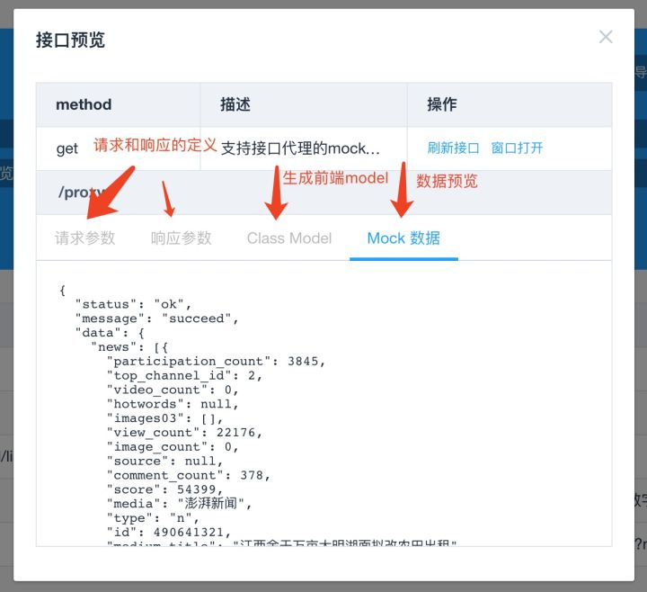

# mock测试

	一般我们前端因为前后端分离开发以及日常接口不到位， 经常没有真实接口可用， 但是我们依旧需要快速完成前端需求， 这个时候使用mock测试假数据， 就能一定程度的解决我们的问题， 使上述问题尽量不影响前端开发， 真正实现前后端分离。

	一般mock假数据测试有本地和远程两种， 本地就是直接在本地写个假数据啦！ 但是这样一般比较lol， 而且这样写要改的东西也比较多， 所以一般我们都会使用远程的mock进行接口测试， 而且可提供的功能变换也比较多。

> 一般这是基于有测试接口的情况下， 也就是我们会写个mock测试的假接口， 用于返回指定假数据

## 简述

#### 官方

	Mocking isprimarily used in unit testing.An object under test may have dependencies onother(complex) objects.To isolate the behaviour of the object you want totest you replace the other objects by mocks that simulate the behavior of thereal objects.This is useful
	if the real objects are impractical to incorporateinto the unit test.

> 翻译： MOCK主要被用于在单测中， 某个对象在测试过程中有可能依赖于其他的复杂对象， 通过mocks去模拟真实的其他对象（模块）去代替你想要去测试的其他的对象（模块）, 如果其他对象（模块）是很难从单元测试中剥离开来的话， 这是非常有用的

#### 作用

1. Mock可以用来解除测试对象对外部服务的依赖（比如数据库， 第三方接口等）， 使得测试用例可以独立运行

	不管是传统的单体应用， 还是现在流行的微服务， 这点都特别重要， 因为任何外部依赖的存在都会极大的限制测试用例的可迁移性和稳定性。 可迁移性是指， 如果要在一个新的测试环境中运行相同的测试用例， 那么除了要保证测试对象自身能够正常运行， 还要保证所有依赖的外部服务也能够被正常调用。 稳定性是指， 如果外部服务不可用， 那么测试用例也可能会失败。 通过Mock去除外部依赖之后， 不管是测试用例的可迁移性还是稳定性， 都能够上一个台阶。

2. 替换外部服务调用， 提升测试用例的运行速度

	任何外部服务调用至少是跨进程级别的消耗， 甚至是跨系统、 跨网络的消耗， 而Mock可以把消耗降低到进程内。 比如原来一次秒级的网络请求， 通过Mock可以降至毫秒级， 整整3个数量级的差别。

3. 提升测试效率

	这里说的测试效率有两层含义：

	

	* 第一层含义是单位时间运行的测试用例数， 这是运行速度提升带来的直接好处。 
	* 而第二层含义是一个测试人员单位时间创建的测试用例数。 如何理解这第二层含义呢？ 以单体应用为例， 随着业务复杂度的上升， 为了运行一个测试用例可能需要准备很多测试数据， 与此同时还要尽量保证多个测试用例之间的测试数据互不干扰。 为了做到这一点， 测试人员往往需要花费大量的时间来维护一套可运行的测试数据。 有了Mock之后， 由于去除了测试用例之间共享的数据库依赖， 测试人员就可以针对每一个或者每一组测试用例设计一套独立的测试数据， 从而很容易的做到不同测试用例之间的数据隔离性。 而对于微服务， 由于一个微服务可能级联依赖很多其他的微服务， 运行一个测试用例甚至需要跨系统准备一套测试数据， 如果没有Mock， 基本上可以说是不可能的。 因此， 不管是单体应用还是微服务， 有了Mock之后， QE就可以省去大量的准备测试数据的时间， 专注于测试用例本身， 自然也就提升了单人的测试效率。 

#### 如何Mock

	先来个声明， 作为一个前端人员， 因为只是常规开发， 所以用Easy Mock比较多

###### EasyMock

> [Easy Mock](https://www.easy-mock.com)

**描述**

	EasyMock 是一套通过简单的方法对于指定的接口或类生成 Mock 对象的类库， 它能利用对接口或类的模拟来辅助单元测试。

* [参考](https://blog.csdn.net/legend_x/article/details/12280517)

	Mock 方法是单元测试中常见的一种技术， 它的主要作用是模拟一些在应用中不容易构造或者比较复杂的对象， 从而把测试与测试边界以外的对象隔离开。

	

	编写自定义的 Mock 对象需要额外的编码工作， 同时也可能引入错误。 EasyMock 提供了根据指定接口动态构建 Mock 对象的方法， 避免了手工编写 Mock 对象

* Easy Mock 是一个极其简单、 高效、 可视化、 并且能快速生成模拟数据的在线 mock 服务。 

**单元测试与 Mock 方法**

	单元测试是对应用中的某一个模块的功能进行验证。 在单元测试中， 我们常遇到的问题是应用中其它的协同模块尚未开发完成， 或者被测试模块需要和一些不容易构造、 比较复杂的对象进行交互。 另外， 由于不能肯定其它模块的正确性， 我们也无法确定测试中发现的问题是由哪个模块引起的。

	Mock 对象能够模拟其它协同模块的行为， 被测试模块通过与 Mock 对象协作， 可以获得一个孤立的测试环境。 此外， 使用 Mock 对象还可以模拟在应用中不容易构造（ 如 HttpServletRequest 必须在 Servlet 容器中才能构造出来） 和比较复杂的对象（ 如 JDBC 中的 ResultSet 对象）， 从而使测试顺利进行。

**数据伪造**

1. 将 Mock 数据写在代码里

2. 利用请求拦截

3. 利用 Charles 等代理工具， 将 URL Map 到本地文件

4. 本地 Mock Server

5. 存在问题

	脏代码
	依赖特定的框架
	增加切换成本
	接口数据结构重构需要手动更新
	效率低下
	无法优雅的进行协同编辑
	无法持久化

6. 解决

	Easy Mock

**响应数据**

* request对象属性

	

	header
	method
	url
	querystring
	host
	hostname
	query
	cookies



**接口代理

	代码调试
	跨域请求

**常见的 Mock 方式**

* 将模拟数据直接写在代码里

* 利用 JavaScript 拦截请求

* 利用 Charles、 Fiddler 等代理工具拦截请求

**基础语法**

	支持生成随机的文本、 数字、 布尔值、 日期、 邮箱、 链接、 图片、 颜色等
	支持扩展更多数据类型， 支持自定义函数和正则

* 代码

```json
{ 
	"string|1-10": "★", 
	"string2|3": "★★", 
	"number|+1": 202, 
	"number2|1-100.1-10": 1, 
	"boolean|1": true, 
	"regexp": /[a-z][A-Z][0-9]/, 
	"absolutePath": "@/string @/user/name", 
	"user": { "name": "demo" }, 
	"object|2": { "310000": "上海市", "320000": "江苏省" }, 
	"array|1": [ "AMD" ] 
}
```

* 数据占位符

**demo1**

```json
{
  "string|1-2": "@string",
  "integer": "@integer(10, 30)",
  "float": "@float(60, 100, 2, 2)",
  "boolean": "@boolean",
  "date": "@date(yyyy-MM-dd)",
  "datetime": "@datetime",
  "now": "@now",
  "url": "@url",
  "email": "@email",
  "region": "@region",
  "city": "@city",
  "province": "@province",
  "county": "@county",
  "upper": "@upper(@title)",
  "guid": "@guid",
  "id": "@id",
  "image": "@image(200x200)",
  "title": "@title",
  "cparagraph": "@cparagraph",
  "csentence": "@csentence",
  "range": "@range(2, 10)"
}
```

**demo2**

```json
{
  "string": "&b(V",
  "integer": 29,
  "float": 65.93,
  "boolean": true,
  "date": "2013-02-05",
  "datetime": "1983-09-13 16:25:29",
  "now": "2017-08-12 01:16:03",
  "url": "cid://vqdwk.nc/iqffqrjzqa",
  "email": "u.ianef@hcmc.bv",
  "region": "华南",
  "city": "通化市",
  "province": "陕西省",
  "county": "嵊州市",
  "upper": "DGWVCCRR TLGZN XSFVHZPF TUJ",
  "guid": "c09c7F2b-0AEF-B2E8-74ba-E1efC0FecEeA",
  "id": "650000201405028485",
  "image": "http://dummyimage.com/200x200",
  "title": "Orjac Kwovfiq Axtwjlop Xoggxbxbw",
  "cparagraph": "他明林决每别精与界受部因第方。 习压直型示多性子主求求际后世。 严比加指安思研计被来交达技天段光。 全千设步影身据当条查需府有志。 斗中维位转展新斯克何类及拉件科引解。 主料内被生今法听或见京情准调就品。 同六通目自观照干意音期根几形。 ",
  "csentence": "命己结最方心人车据称温增划眼难。 ",
  "range": [2, 3, 4, 5, 6, 7, 8, 9]
}
```

#### Mockito
	
	如果测试对象是一个方法，尤其是涉及数据库操作的方法，那么Mockito可能是最好的选择
* 作为使用最广泛的Mock框架，Mockito出于EasyMock而胜于EasyMock，乃至被默认集成进Spring Testing。其实现原理是，通过CGLib在运行时为每一个被Mock的类或者对象动态生成一个代理对象，返回预先设计的结果。集成Mockito的基本步骤是：

1.   标记被Mock的类或者对象，生成代理对象
2.   通过Mockito API定制代理对象的行为
3.   调用代理对象的方法，获得预先设计的结果

#### WireMock
	
	如果说Mocketo是瑞士军刀，可以Mock Everything，那么WireMock就是为微服务而生的倚天剑
	和处在对象层的Mockito不同，WireMock针对的是API。假设有两个微服务，Service-A和Service-B，Service-A里的一个API（姑且称为API-1），依赖于Service-B，那么使用传统的测试方法，测试API-1时必然需要同时启动Service-B。如果使用WireMock，那么就可以在Service-A端Mock所有依赖的Service-B的API，从而去掉Service-B这个外部依赖。

* 和Mockito类似，在测试用例中集成WireMock的基本步骤是：

1.   声明代理服务，以替代被Mock的微服务
2.   通过WireMock API定制代理服务的返回结果
3.   调用代理服务，获得预先设计的结果

## 实例

#### 无参请求

**请求方式**： `post` 

**返回数据**： 

```json
{
	"success": true,
	"data": {
		"zz": {
			"zz1": "aaaaaaaaaaaaaaaa1",
			"zz2": "aaaaaaaaaaaaaaaaaaa2"
		}
	}
}
```

> 这是mock端代码， 也就是返回数据。 

!> 注： mock返回数据一定是json格式数据

**前端请求**

```html
<script src="../../js/jquery.js"></script>
```

```js
< script >
    $.ajax({
        type: 'post',
        url: 'https://easy-mock.com/mock/5b8ddf9c877c2567398cae3c/u/z/returnData#!method=post',
        success: function(res) {
            console.info(res.success);
            console.info(res.data.zz);
        }
    }) <
    /script>
```

**请求方式**： `get` 

**返回数据**： 

```json
{
	"success": true,
	"data": {
		"Date": "@Date()"
	}
}
```

> 这是mock端代码， 也就是返回数据。 

!> 注： mock返回数据一定是json格式数据

**前端请求**

```html
<script src="../js/jquery.js"></script>
```

```js
// ajax默认是get请求
$.ajax({
    url: 'https://easy-mock.com/mock/5b8ddf9c877c2567398cae3c/u/z/success#!method=get',
    success: function(res) {
        console.info(res.success);
        console.info(res.data.Date);
    }
})
```

#### 带参请求响应

**前端请求代码**

```html
<!DOCTYPE html>
<html>
<head>
<meta charset="utf-8">
<title>mock带参请求响应</title>
</head>
<script src="https://apps.bdimg.com/libs/jquery/2.1.4/jquery.min.js"></script>
<body>
<script>
	// get带参请求
	/*$.ajax({
		url:'https://www.easy-mock.com/mock/5b8ddf9c877c2567398cae3c/u/z/demo01?name=1',
		success: function(res) {
			console.info(res.data.success);
			console.info(res.data.mark);
			console.info(res.data.randomData);
		}
	})*/
	//post带参请求
	$.ajax({
		type: 'post',
		url:'https://www.easy-mock.com/mock/5b8f4cd1830bb75e3ad4c51e/pubWeb/public/doIntranetRequest/GetFaceConfigInfo?username=WSYYUSER&password=b7OmrnAjfyi42sOKCi3jtw1I1mw',
		success: function(res) {
			console.info(res.data.success);
			console.info(res.data.mark.resultcode);
			console.info(res.data.mark.resultmsg);
			console.info(res.data.mark.mark);
		}
	})
</script>
</body>
</html>
```

**easy-mock代码(返回数据)**

```json
{
	"code": "1",
	"msg": "",
	"mark": "hello word！！！"
}
```

## 关于Easy Mock

	Easy Mock是一个免费的开源项目， 而且有很多种源码， 也就是我们已可轻易获取到这个项目， 部署到自己的服务器上， 用作自己的项目开发使用

> [Easy Mock网站](https://www.easy-mock.com/)

#### Easy Mock语法

**数据模板定义**

	String
	Number
	Boolean
	Object
	Array
	Function
	RegExp
	Path

**数据占位符定义**

	Basic
	boolean
	natural
	integer
	float
	character
	string
	range
	Date
	date
	time
	datetime
	now
	Image
	image
	dataImage
	Color
	color
	hex
	rgb
	rgba
	hsl
	Text
	paragraph
	sentence
	word
	title
	cparagraph
	csentence
	cword
	ctitle
	Name
	first
	last
	name
	cfirst
	clast
	cname
	Web
	url
	domain
	protocol
	tld
	email
	ip
	Address
	region
	province
	city
	county
	zip
	Helper
	capitalize
	upper
	lower
	pick
	shuffle
	Miscellaneous
	guid
	id
	increment

## 创建自己的Easy Mock

	因为Easy Mock这个是一个开源项目， 也就是只有我们有服务器(本机也可以)，就可以将Easy Mock项目部署上去， 然后就可以写模拟测试接口


