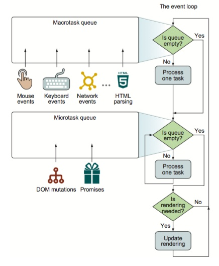

# 浏览器事件循环机制

## 概述

#### 什么是浏览器事件循环机制？

* 以前浏览器只有一类事件循环，都是基于当前执行环境上下文, 官方用语叫 browsing-context

	我们可以理解为一个window就是一个执行环境上下文，如果有iframe, 那么iframe内就是另一个执行环境了

> 2017年新版的HTML规范新增了一个事件循环，就是web workers

* 事件循环机制涉及到两个知识点 macroTask队列 和 microTask队列，一般我们会称之为宏任务和微任务。不管是macroTask还是microTask，他们都是以一种任务队列的形式存在

**macroTask**

	包含：生成dom对象、解析HTML、执行主线程js代码、更改当前URL还有其他的一些事件如页面加载、输入、网络事件和定时器事件

> 从浏览器的角度来看，macroTask代表一些离散的独立的工作。当执行完一个task后，浏览器可以继续其他的工作如页面重渲染和垃圾回收

**microTask**

	包含：完成一些更新应用程序状态的较小任务，如处理promise的回调和DOM的修改
	这些任务在浏览器重渲染前执行

* microTask应该以异步的方式尽快执行，其开销比执行一个新的macroTask要小

> microTask使得我们可以在UI重渲染之前执行某些任务，从而避免了不必要的UI渲染，这些渲染可能导致显示的应用程序状态不一致

* Event loop原则上至少使用一个队列用于处理macroTasks，至少一个队列处理microTasks

	* 而实际上通常分配几个队列用于处理不同类型的macroTasks和microTasks，这使得可以对不同的任务类型进行优先级排序

		* 例如优先考虑一些性能敏感的任务：如用户输入
	
	* 以及实际上存在很多JavaScript宿主环境，所以有的event loop使用一个队列处理这两种任务



#### Event loop原则和过程

	1. 同一时间只能执行一个任务。
	2. 任务一直执行到完成，不能被其他任务抢断。

1. 如上图所示，在单次的迭代中，event loop首先检查macroTask队列，如果有一个macroTask等待执行，那么执行该任务

2. 当该任务执行完毕后（或者macroTask队列为空），event loop继续执行microTask队列

3. 如果microTask队列有等待执行的任务，那么event loop就一直取出任务执行知道microTask为空

> 注：(处理microTask和macroTask的不同之处)在单次循环中，一次最多处理一个macroTask（其他的仍然驻留在队列中），然而却可以处理完所有的microTask

* 当microTask队列为空时，event loop检查是否需要执行UI重渲染，如果需要则重渲染UI。这样就结束了当次循环，继续从头开始检查macroTask队列

!> 这就是事件循环的大致过程

#### 事件循环异步机制

**示例说明**

``` js
console.log('aa');
setTimeout(() => { 
    console.log('bb')}, 
0);
Promise.resolve().then(() => console.log('cc'));
console.log('dd');
/* 输出结果：
	aa
	dd
	cc
	bb
 */
```

> 从上述可以看出，同步代码最先执行完，然后执行异步promise.then()代码，最后是setTimeout，从这里看出，同样是异步执行，也是有先后之分的

**使用事件机制分析过程**

1. 浏览器加载整体代码并执行一个macroTask

2. 在执行这段代码的过程中，解析到`setTimeout`时，会将`setTimeout内的代码`添加到 `macroTask队列`中

3. 接下来，又解析到Promise, 于是将`Promise.then()内的代码` 添加到`microTask队列`中。

4. 代码执行完毕，也就是第一个 macroTask 完成后，去 microTask 任务队列中，找出所有任务并执行, 此时执行了 console.log('cc');

5. microTask 任务队列执行完毕后，又取出下一个 macroTask 任务并执行，也就是执行setTimeout内的代码console.log('bb')

> 参考：[浏览器事件循环机制与Vue nextTick的实现](https://juejin.im/post/5c022f676fb9a049c9656a4d) | [HTML系列：macroTask和microTask](https://zhuanlan.zhihu.com/p/24460769) | [深入浏览器的事件循环 (GDD@2018)](https://zhuanlan.zhihu.com/p/45111890)
