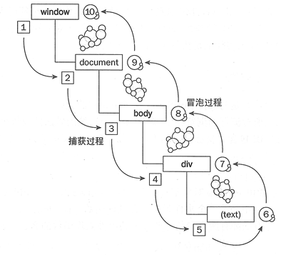

# 浏览器事件机制

## 概述

#### 简述浏览器事件机制

	浏览器事件机制说的是对各种事件(点击、双击...)的捕获和冒泡，即事件流

**基础知识：**

* 操作系统最先知道用户点击了鼠标，浏览器次之

* child 被点击了，意味着 parent 也被点击了

**问题：如果我们同时监听了 child 和 parent，那么谁先通知我？**

* 在事件捕获阶段：parent 先通知，child 后通知
* 在事件冒泡阶段：child 先通知，parent 后通知(onclick 就是在冒泡阶段被通知)

#### 浏览器事件传播过程

	三个阶段：捕获 --> 目标对象 --> 冒泡
	W3C事件模型：既支持捕获又支持冒泡(先捕获后冒泡)

1. 事件捕获阶段(Capture)：是事件对象(event object)从 window 派发到目标对象父级的过程。
2. 事件目标阶段(Target)：是事件对象派发到目标元素时的阶段，如果事件类型指示其不冒泡，那事件传播将在此阶段终止。
3. 事件冒泡阶段(Bubbling)：和捕获相反，是以目标对象父级到 window 的过程(默认冒泡)

> 注：在任一阶段调用`stopPropagation()`方法都将终止本次事件的传播



#### 细说原理：DOM0级事件和DOM2级事件

	早起未形成标准的试验性质的初级阶段的DOM，即DOM0级；
	W3C结合各大浏览器厂商的优点推出了一个标准化的DOM，并于1998年10月完成了第一级 DOM，即：DOM1；

###### DOM事件发展

* DOM0级：早期未成熟的DOM操作(没有统一标准)

* DOM1级：主要定义了HTML和XML文档的底层结构；与平台和编程语言无关的接口，通过这个接口程序和脚本可以动态的访问和修改文档的内容、结构和样式

* DOM2级：在原来DOM的基础上又扩充了鼠标、用户界面事件、范围、遍历等细分模块，而且通过对象接口增加了对CSS的支持(交互能力)

**DOM2级引入模块**

* DOM视图（DOM Views）：定义了跟踪不同文档视图的接口
* DOM事件（DOM Events）：定义了事件和事件处理的接口
* DOM样式（DOM Style）：定义了基于CSS为元素应用样式的接口
* DOM遍历和范围（DOM Traversal and Range）：定义了遍历和操作文档树的接口

**DOM3级引入模块**

* DOM加载和保存模块（DOM Load and Save）：引入了以统一方式加载和保存文档的方法
* DOM验证模块（DOM Validation）：定义了验证文档的方法
* DOM核心的扩展（DOM Style）：支持XML 1.0规范，涉及XML Infoset、XPath和XML Base

###### DOM0级和DOM2级的区别

**DOM0级事件处理程序（属性绑定，兼容性好：基本都支持）**

	实现方法一：标签内写onclick事件
	实现方法而：在JS写onclick=function(){}函数

``` html
<input id="myButton" type="button" value="Press Me" οnclick="alert('thanks');" >
```

``` js
var btn = document.getElementById("btn");
// 直接通过 onclick写在html里面的事件
btn.onclick = function(){
	alert('click');
}
btn.onclick = null;  // 删除事件处理程序
```

> DOM0级方法制定的事件处理程序被认为是元素的方法，因此这个时候事件处理程序是在元素的作用域中运行，this指向当前元素

**DOM2级事件处理程序（函数绑定，低版本浏览器兼容性不好）**

	DOM2级属于W3C事件模型，先捕获后冒泡，属于一种符合逻辑规范的事件规范，属于当前主流的事件规范，DOM3属于进一步强化拓展的
	IE9，Firefox，Opera，Safari，Chrome全部已经实现了"DOM2级事件"模块的核心部分，但IE8是最后一个仍然使用其专有事件系统的主要浏览器
	实现方法为：JS监听方法，JS调用addEventListener()方法进行事件方便

* 事件绑定：`addEventListener()`

	参数1. 要绑定的事件名 
	参数2. 作为事件处理的函数
	参数3. 布尔值：true在捕获阶段调用事件处理程序；false在冒泡阶段调用(默认false)

* 事件删除：`removeEventListener()`

	参数1. 要删除的事件名
	参数2. 作为事件处理的函数
	参数3. 布尔值：true在捕获阶段调用事件处理程序；false在冒泡阶段调用(默认false)

*示例*

``` js
// 事件绑定
var btn = document.getElementById("btn");
btn.addEventListener("click", function(){
	// 该函数在其依附的元素的作用域中运行。
	alert(this.id);
}, false);

// 事件移除
var btn = document.getElementById("btn");
var handler = function(){
	alert(this.id);
}
btn.addEventListener("click", handler, false);
btn.removeEventListener("click", handler, false);//移除
```

*特殊的IE*

	低版本IE有区别与W3C规范的事件机制，事件处理程序会在全局作用域中运行，因此this指向window对象。为一个对象添加两个相同的事件，事件处理程序的顺序是按照添加相反顺序进行处理
	IE事件流是冒泡机制，直接从目标元素往window冒

* 事件绑定：`attachEvent()`

	参数1. 事件处理程序名称
	参数2. 事件处理函数

* 事件删除：`detachEvent()`

	参数1. 事件处理程序名称
	参数2. 事件处理函数

>  可以添加多个事件处理程序，并且按照添加它们的顺序触发。移除事件传入的参数与添加处理程序时使用的参数相同，添加事件时如果使用匿名函数将无法删除

* 简单实现测试事件捕获和冒泡过程

**总结**

* 如果定义了两个dom0级事件，dom0级事件会覆盖

* dom2不会覆盖，会依次执行

* dom0和dom2可以共存，不互相覆盖，但是dom0之间依然会覆盖

###### 跨浏览器兼容实现

**原生封装实现**

``` js
var eventUtil = {
	/**
		@param src事件源，type事件类型，fn事件处理函数
	*/
	bind:function(src, type, fn){
		if(src.addEventListener){
			// W3C事件规范：事件绑定
			src.addEventListener(type, fn, false);
		}else if(src.attachEvent){
			// IE事件绑定
			src.attachEvent("on" + type, fn);
		}else{
			// DOM0级事件绑定
			src["on" + type] = fn;
		}
	},
	unbind:function(src, type, fn){
		if(src.removeEventListener){
			src.removeEventListener(type, fn, false);
		}else if(src.detachEvent){
			src.detachEvent("on" + type, fn);
		}else {
			src["on" + type] = null;
		}
	}
};
```

> 这样是直接判断浏览器支持的事件机制，有哪种就绑定哪种，当然这是实现原生兼容的bind()方法，现实场景中还存在很多问题，尤其是性能问题，当然这里只解决兼容问题

**示例**

``` js
var outer = document.getElementById("outer");
var center = document.getElementById("center");
var inner = document.getElementById("inner");
 
function handler(){
    alert(this.id);
}
		
// 事件绑定  兼容IE/firefox浏览器
eventUtil.bind(inner, "click", handler);
 
// 事件解绑
eventUtil.unbind(inner, "click", handler);
```

``` html
<html>
<head>
	<title></title>
	<meta charset="utf-8" />
	<style type="text/css">
		#p { width: 300px; height: 300px; padding: 10px;  border: 1px solid black; }
		#c { width: 100px; height: 100px; border: 1px solid red; }
	</style>
</head>
<body>
<div id="p">
	parent
	<div id="c">
		child
	</div>
</div>
<script type="text/javascript">
	var p = document.getElementById('p'),
		c = document.getElementById('c');
	
	eventUtil.bind(c, function () {
		alert('子节点捕获')
	}, true);

	eventUtil.bind(c, function (e) {
		alert('子节点冒泡')
	}, false);

	eventUtil.bind(p, function () {
		alert('父节点捕获')
	}, true);

	eventUtil.bind(p, function () {
		alert('父节点冒泡')
	}, false);
</script>
</body>
</html>
```

###### 附录：事件对象event下的属性和方法

**常用主流的事件对象属性和方法**

|属性|说明|
|:---:|:---:|
|bubble|表明事件是否冒泡|
|cancelable|表明是否可以取消冒泡|
|currentTarget|当前时间程序正在处理的元素, 和this一样的|
|defaultPrevented|false，如果调用了preventDefault这个就为真了|
|detail|与事件有关的信息(滚动事件等等)|
|eventPhase|如果值为1表示处于捕获阶段，值为2表示处于目标阶段，值为三表示在冒泡阶段|
|target || srcElement|事件的目标|
|trusted|为true是浏览器生成的，为false是开发人员创建的（DOM3）|
|type|事件的类型|
|view|与元素关联的window，我们可能跨iframe|
|preventDefault()|取消默认事件|
|stopPropagation()|取消冒泡或者捕获|
|stopImmediatePropagation()|(DOM3)阻止任何事件的运行|

**IE特色**

* cancelBubble 默认为false, 如果为true就是取消事件冒泡;

* returnValue 默认是true，如果为false就取消默认事件;

* srcElement, 这个指的是target, Firefox下的也是srcElement;

> 参考：[前端重新学习（5）DOM与DOM2、DOM3区别以及DOM2新特性](https://blog.csdn.net/qq_16546829/article/details/81289055) | [原生事件绑定（跨浏览器），dom0和dom2的区别？](https://blog.csdn.net/weixin_40387601/article/details/80572184)
