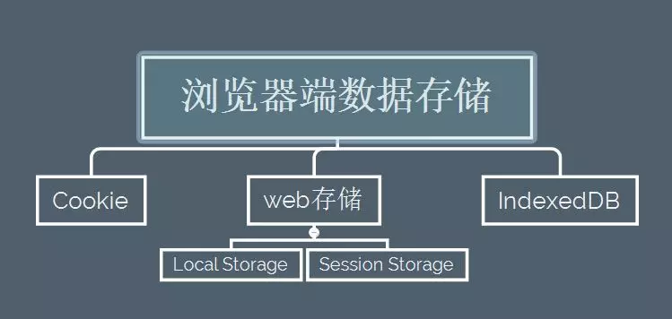
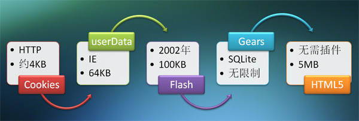

# 浏览器存储

> 

## 概述

	在浏览器端进行存储对于我们来说已经算是正常项目都会用到的操作了，也算是项目体验环节中一大功能，赋予浏览器记忆的功能，让我们更方便的进行一系列骚操作
	普通理解可以说纪录用户的所有状态信息，增强用户体验；近一步说可以实现本地大量数据存储，数据缓存，大大优化用户体验，解决服务端N多问题

## Cookie

#### 简述

	Cookie的又称是HTTP Cookie

* 最初是在客户端用于存储会话信息，从底层来看，它作为HTTP协议的一种扩展实现，Cookie数据会自动在web浏览器和web服务器之间传输，因此在服务器端脚本就可以读写存储的cookie的值，因此Cookie通常用于存储一些通用的数据，比如用户的登陆状态，首选项等。

> 当然，现在HTML5提供的Web存储机制已经很大程度上代替了Cookie的工作，但是很多浏览器还是不兼容HTML5，也就是我们一般要考虑各种浏览器兼容性问题，一般我们都需要会这些有点小落后的技术；当然，其实我们经常还会用Cookie来实现一些比较方便的功能，例如登陆验证功能等。。。

#### Cookie的优劣

###### 优点

* Cookie的API很早就已经实现，基本现在算是`大圆满`状态，具有比其他存储方式更好的兼容性

	现在来说，是个可以用的浏览器都支持Cookie存储，用它就不用考虑什么低版本浏览器兼容的问题了

* 只在设置的Cookie过期时间之前一直有效

	这是为什么现在还用Cookie存储的一个最大的原因了，因为即使页面/浏览器关闭，只要Cookie不过期他就一直存在，这样我们就有很大的操作空间，尤其是在安全验证等方面，在用户体验上能一定程度的实现优化

###### 缺点

* 存储量小

	虽不同浏览器的存储量不同，但基本上都是在4kb左右。
	因为每个请求都会带上Cookie作为头信息的，所以一般Cookie存储都不能太大，否则用户体验可想而知，这样就知道Cookie存储没啥搞头了，所以才会出现新的替代方案

* 影响性能

	由于Cookie会由浏览器作为请求头发送，因此当Cookie存储信息过多时，会影响特定域的资源获取的效率，增加文档传输的负载
	一般使用Cookie都是存很少量的用户状态数据

* 只能储存字符串

	现在需求千奇百怪，互联网世界，什么数据都有，只能说Cookie是旧时代的产物

* 安全问题

	存储在Cookie的任何数据可以被他人访问，因此不能在Cookie中储存重要的信息

> 需要强调一点：由于第三方Cookie的滥用，所以很多老司机在浏览网页时会禁用Cookie，所以我们不得不测试用户是否支持Cookie，这也是很麻烦的一件事

> 看着就知道，优点不错，缺点一堆，实在是能少用则少用，反正功能又一般，替代方案一堆

#### Cookie的使用

	基本Cookie的操作就是：读取，写入和删除，一般我们前端都是使用JavaScript对Cookie进行操作，虽然麻烦，但也不难

**为什么说JavaScript处理cookie是一件很繁琐的事情？**

	因为Cookie中的所有的名字和值都是经过URI编码的，所以当我们必须使用decodeURIComponent来进行解码才能得到cookie的值。

**直接实例看Cookie的操作**

``` js
var CookieUtil = {

    // get可根据cookie的名字获取相应的值
    get: function() {
        const cookieName = decodeURIComponent(name) + "=",
               cookieStart = document.cookie.indexOf(cookieName),
               cookieValue = null;
        if(cookieStart > -1) {
            const cookieEnd = document.cookie.indexOf(";", cookieStart);
            if(cookieEnd == -1) {
                cookieEnd = document.cookie.length;
            }
            cookieValue = decodeURIComponent(document.cookie.substring(cookieStart + cookieName.length, cookieEnd));
        }
        return cookieValue;
    }

    // set设置一个cookie
    set: function(name, value, expires, path, domain, secure) {
        var cookieText = encodeURIComponent(name) + "=" + encodeURIComponent(value);
        if(expires instanceof Date) {
            cookieText += "; expires=" + expires.toGMTString();
        }
        if(path) {
            cookieText += ";path=" + path;
        }
        if(domain) {
            cookieText += "; domain" + domain;
        }
        if(secure) {
            cookieText += "; secure";
        }
        document.cookie = cookieText;
    }

    // 删除已有的cookie
    unset: function(name, path, domain, secure) {
        this.set(name, "", new Date(0), path, domain, secure);
    }
}
```

> 一般我们项目使用这些都会近一步实现封装，也就是封装一个Cookie的工具类来使用；不过看上面操作也是挺麻烦的。。。

## web存储

	web存储机制最初作为HTML5的一部分被定义成API的形式，但又由于其本身的独特性与其他的一些原因而剥离了出来，成为独立的一个标准。
	web存储标准的API包括localStorage对象和sessionStorage对象，并且这两个对象都是window对象的属性形式存在
	都存储在浏览器客户端，并遵守同源策略

> 至于这个存储方式产生的原因大概有几个吧：

1. 互联网的发展，新的场景需求，用户对体验的要求越来越高，而Cookie的缺陷明显太多，越来越多的场景无法满足，总之就是有需求就有满足需求的产品被实现

2. 技术上说就是Cookie存储量太小，而且不支持跨会话存在，所以就需要一种新技术解决这些问题

!> 当然，其实这个存储规范的实现也不是一蹴而就的，它的出现也是很崎岖的，看一张本地存储发展史图：

> 强调一下：Web Storage 支持事件通知机制，可以将数据更新的通知发送给监听者，这是个大优势



#### localStorage

	是HTML5规范中作为持久保存客户端数据的方案
	localStorage以window属性存在，当然，这个操作还是读取、写、删除操作，以键值对的方式进行存储，当然这个只能进行字符串存储

> 重点是看名字，本地存储，人家就是直接存储在本地的，窗口、页面关闭都会存在

###### localStorage存储的优劣

**优点**

* 永久存储

	localStorage生命周期是永久，这意味着除非用户显示在浏览器提供的UI上清除localStorage信息，否则这些信息将永远存在

* 相同浏览器的不同页面间可以共享相同的 localStorage（页面属于相同域名和端口）

* 可以存储5MB数据

	这个主要是跟Cookie等存储对比的，虽然可以进行浏览器存储设置，但是基本所有浏览器默认存储都是5MB，一般我们也没有必要改

**缺点**

* 只能存储字符串类型的对象

	当然也有办法解决这个问题，例如存储JSON数据可以先存为字符串，然后使用JSON.parse()方法将字符串转为JSON对象数据

* 不同浏览器无法共享localStorage中的信息

	这个问题如果需要解决只能存储在用户磁盘了，这属于另一种存储方式了

* 需要手动清除或用户清除

	这个问题看场景需求，有利必有弊，可以在浏览器关闭之前进行手动清除，说看场景使用sessionStorage存储

``` js
window.onbeforeunload=function(){
  // 你想干的事,比如删localStorage

  // return "真的要关掉页面吗"; 
  // 这一句如果写了，会弹窗提示是否要关掉页面，如果没这个需求，可以不写
};
```

###### localStorage操作方法

1. 设置缓存数据:localStorage.setItem(key,value);

2. 获取缓存数据：localStorage.getItem(key)；

3. 获取全部缓存数据：localStorage.valueOf();

4. 获取指定下标的key键值：localStorage.key(N)；

5. 删除缓存数据：localStorage.removeItem(key) ；

6. 清空缓存数据：localStorage.clear();

> localStorage和sessionStorage具有相同的方法

###### localStorage的使用


**首先window.localStorage可以检测当前浏览器支不支持**

``` js
if(window.localStorage){
 	alert('This browser supports localStorage');
}else{
 	alert('This browser does NOT support localStorage');
}
```

**来个简单读、写、删除操作**

``` js
window.localStorage.a = 3;	// 设置a为"3"
window.localStorage["a"] = "zyk";	// 设置a为"zyk"，覆盖上面的值
window.localStorage.setItem("b","isaac");// 设置b为"isaac"
var a1 = window.localStorage["a"];	// 获取a的值
var a2 = window.localStorage.a;	// 获取a的值
var b = window.localStorage.getItem("b");	// 获取b的值
window.localStorage.removeItem("c");	// 清除c的值

// key()方法查看有哪些 键
var storage = window.localStorage;
function showStorage(){
	for(var i=0; i < storage.length; i++){
		// key(i)获得相应的键，再用getItem()方法获得对应的值
		document.write(storage.key(i)+ " : " + storage.getItem(storage.key(i)) + "<br>");
	}
}
```

> 一般我们都是推荐使用getItem()、setItem()和removeItem()方式进行的操作的，正式而方便维护

**实例：页面访问计数器**

``` js
var storage = window.localStorage;
if (!storage.getItem("pageLoadCount")) {
	storage.setItem("pageLoadCount",0);
}
storage.pageLoadCount = parseInt(storage.getItem("pageLoadCount")) + 1;	// 必须格式转换
document.getElementByIdx_x("count").innerHTML = storage.pageLoadCount;
showStorage();
```

**实例：json存储**

	现在很多数据都是用JSON数据格式存储，而这个localStorage只能存储字符串，不过我们可以使用JSON.parse()方法将字符串转为JSON数据，这样就挺方便的

``` js
var details = {author:"isaac","description":"phoebus","rating":100};
storage.setItem("details",JSON.stringify(details));
details = JSON.parse(storage.getItem("details"));
```

!> 目前很多浏览器的支持还不一致，所以很多操作要注意使用兼容操作

#### sessionStorage

	sessionStorage是web存储机制的另一大对象，sessionStorage 属性允许我们去访问一个 session Storage 对象。
	它与 localStorage 相似，不同之处在于 localStorage里面存储的数据没有过期时间设置，而Session Storage只存储当前会话页的数据，且只有当用户关闭当前会话页或浏览器时，数据才会被清除。

###### sessionStorage的优劣

**优点**

* sessionStorage生命周期为当前窗口或标签页

	一旦窗口或标签页被永久关闭了，那么所有通过sessionStorage存储的数据也就被清空了。
	这即使优点也是缺点，跟localStorage算是互补的存在，因为很多场景我们需要关闭页面的时候就清除数据，一方面是没有必要存储，另一方面主要也是安全性问题

* 可以存储5MB数据

	跟localStorage存储一样，这个主要是跟Cookie等存储对比的，虽然可以进行浏览器存储设置，但是基本所有浏览器默认存储都是5MB，一般我们也没有必要改

* 页面标签页间传值

	很多时候我们需要进行标签页间的传值，而又不需要长期存储，这个时候sessionStorage存储传值就是个不错的选择了，虽然window存储也能传值，但是sessionStorage能解决浏览器刷新问题，而且我们需要的只是暂时存储，页面关闭就没了，不需要像localStorage手动清除

> sessionStorage 非常适合SPA(单页应用程序)，可以方便在各业务模块进行传值

**缺点**

* 只能存储字符串类型的对象

	跟localStorage存储缺点一样，对应有各种解决办法，例如存储JSON数据可以先存为字符串，然后使用JSON.parse()方法将字符串转为JSON对象数据

* 不同浏览器无法共享sessionStorage中的信息

	跟localStorage存储缺点一样，如果要解决这个问题还是要存到磁盘中

* 不同页面或标签页间无法共享sessionStorage的信息

	这既是优点也是缺点，算是安全性的保障吧，如果需要跨页面访问可以使用localStorage存储

!> 基本上localStorage和sessionStorage基本差不多，只不过存储域和作用有些差别而已，操作更是基本差不多了

###### sessionStorage操作方法

1. 设置缓存数据:sessionStorage.setItem(key, value);

2. 获取缓存数据：sessionStorage.getItem(key)；

3. 获取全部缓存数据：sessionStorage.valueOf();

4. 获取指定下标的key键值：sessionStorage.key(N)；

5. 删除缓存数据：sessionStorage.removeItem(key) ；

6. 清空缓存数据：sessionStorage.clear();

> localStorage和sessionStorage具有相同的方法

###### sessionStorage的使用

**简单操作**

``` js
// 保存数据到sessionStorage
sessionStorage.setItem('name', 'phoebus');

// 从sessionStorage获取数据
var data = sessionStorage.getItem('name');
console.log(data);	// phoebus

// 从sessionStorage删除保存的数据
sessionStorage.removeItem('name');
data = sessionStorage.getItem('name');
console.log(data);	// null

// 从sessionStorage删除所有保存的数据
sessionStorage.clear();
```

**实例：自动保存一个文本输入框的内容**

	自动保存一个文本输入框的内容，如果浏览器因偶然因素被刷新了，文本输入框里面的内容会被恢复，写入的内容不会丢失

``` js
// 获取文本输入框
var field = document.getElementById("field")

// 检测是否存在 autoSave 键值
// (这个会在页面偶然被刷新的情况下存在)
if (sessionStorage.getItem("autoSave")) {
  // 恢复文本输入框的内容
  field.value = sessionStorage.getItem("autoSave")
}
// 监听文本输入框的 change 事件
field.addEventListener("change", function() {
  // 保存结果到 sessionStorage 对象中
  sessionStorage.setItem("autoSave", field.value)
})
```

#### localStorage和sessionStorage的区别

> 基本就是作用域不同，也就区别于使用场景不同，应该算是互补的存在，包括Cookie存储，也有它的作用，都是存在互补

## IndexedDB

	虽然Web存储可以解决N多场景的存储问题，但是对于更大数据量的结构化数据存储就需要新的存储方式了，而IndexedDB就是为了解决大数据量存储的问题产生的
#### IndexedDB存储特点

* 它是由HTML5所提供的一种本地存储，用于在浏览器中储存较大数据结构的 Web API，并提供索引功能以实现高性能查找

* 它一般用于保存大量用户数据并要求数据之间有搜索需要的场景，当网络断开时，用户就可以做一些离线的操作

* 它较之SQL更为方便，不需要写一些特定的语法对数据进行操作，数据格式是JSON。

#### IndexedDB的优劣

###### 优点

* 拥有更大的储存空间

* 能够处理更为复杂和结构化的数据

* 拥有更多的交互控制

* 每个'database'中可以拥有多个'database'和'table'

###### 缺点

* 存储空间限制

	一个单独的数据库项目的大小没有限制。然而可能会限制每个 IndexedDB 数据库的大小。这个限制（以及用户界面对它进行断言的方式）在各个浏览器上也可能有所不同

* 兼容性问题

	一方面是因为HTML5的原因，其实IndexedDB比Web存储的兼容性更差，也就是浏览器一般都是比较新的版本才支持，当然我们使用这个一般都是需要看用户群体，可以强制要求指定某个版本或某种浏览器使用，所以我都没用过这个东东

* indexedDB受同源策略的限制

	indexedDB使用同源原则，这意味着它把存储空间绑定到了创建它的站点的源（典型情况下，就是站点的域或是子域），所以它不能被任何其他源访问
	也就是IndexedDB 不适用于从另一个站点加载进框架的内容(不管是 `<frame>` 还是 `<iframe>`)这是一项安全措施。

#### IndexedDB使用

	使用IndexedDB在浏览器端存储数据会相比其他存储复杂

###### 使用步骤

1. 首先，我们需要创建数据库，并指定这个数据库的版本号

``` js
// 注意数据库的版本号只能是整数
const request = IndexedDB.open(databaseName, version)
```

2. 然后，我们需要生成处理函数

	需要注意的是 `onupgradeneeded` 是我们唯一可以修改数据库结构的地方
	在这里面，我们可以创建和删除对象存储空间以及构建和删除索引

``` js
request.onerror = function() {
    // 创建数据库失败时的回调函数
}
request.onsuccess = function() {
    // 创建数据库成功时的回调函数
}
request.onupgradeneededd = function(e) {
     // 当数据库改变时的回调函数
}
```

3. 最后我们就可以建立对象存储空间，进行一系列需要的存储操作

	对象存储空间仅调用createObjectStore()就可以创建

``` js
request.onupgradeneeded = function(event) {
    const db = event.target.result
    const objectStore = db.createObjectStore('name', { keyPath:'id' })
}
```

4. 最后当然是使用这个对象空间进行一系列的操作：

**添加数据**

``` js
addData: function(db, storeName, data) {
    const store = store = db.transaction(storeName, 'readWrite').objectStore(storeName);
    for(let i = 0; i < data.length; i++) {
        const request = store.add(data[i]);
        request.onerror = function() {
            console.error('添加数据失败');
        }
        request.onsuccess = function() {
            console.log('添加数据成功');
        }
    }
}
```

**修改数据**

``` js
putData: function(db, storeName, data) {
    const store = store = db.transaction(storeName, 'readWrite').objectStore(storeName)
    for(let i = 0; i < data.length; i++) {
        const request = store.put(data[i])
        request.onerror = function() {
            console.error('修改数据失败')
        }
        request.onsuccess = function() {
            console.log('修改数据成功')
        }
    }
}
```

**获取数据**

``` js
getDataByKey: function(db, storeName, key) {
    const store = store = db.transaction(storeName, 'readWrite').objectStore(storeName)
    const request = store.get(key)
    request.onerror = function() {
        console.error('获取数据失败')
    }
    request.onsuccess = function(e) {
        const result = e.target.result
        console.log(result)
    }
}
```

**删除数据**

``` js
deleteDate: function(db, storeName, key) {
    const store = store = db.transaction(storeName, 'readWrite').objectStore(storeName)
    store.delete(key)
    console.log('已删除存储空间' + storeName + '中的' + key + '纪录')
}
```

**关闭数据库**

``` js
db.close
```

> 就是一波小型数据库操作，而且简单的一匹

#### IndexedDB的应用

> 参考：[聊一聊常见的浏览器端数据存储方案](https://www.jianshu.com/p/072e17112759)
