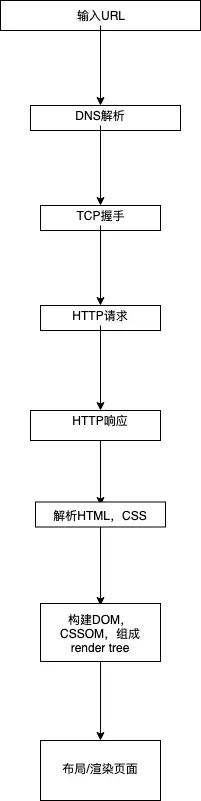
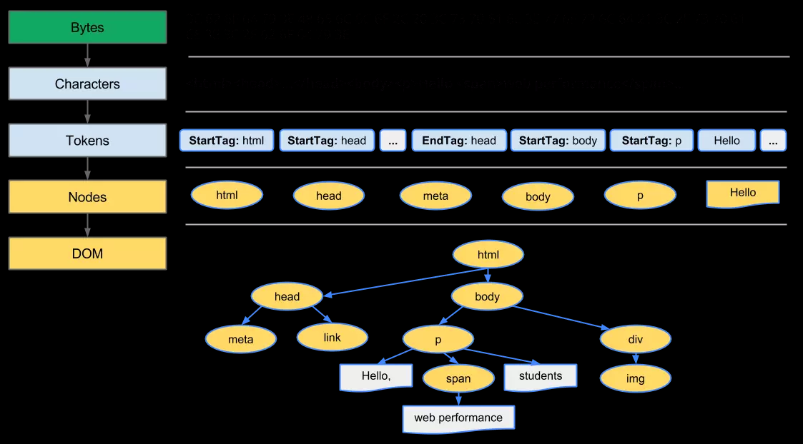

# 一次完整的 Web 请求和渲染过程

## 一个完成的Web请求

1. 打开浏览器，输入URL
   
2. DNS解析
   
3. 完成TCP握手
   
4. 发送HTTP请求
   
5. 接收HTTP响应结果
   
6.  浏览器解析HTML，CSS
   
7.  构建对象模型，DOM tree 和 CSSOM tree，组成render tree
   
8.  浏览器渲染页面(布局)

> [HTTP1.x和HTTP2](知识笔记/大前端/HTTP/HTTP1.x和HTTP2.md)

## 那么，浏览器是如何构建对象模型的？

	字节 → 字符 → 令牌 → 节点 → 对象模型

* HTML标记与CSS标记都会经历上述过程，HTML变为DOM，CSS变为CSSOM

> 参考：[浏览器渲染机制](知识笔记/大前端/浏览器/浏览器渲染机制/浏览器渲染机制.md)

## render tree构建，布局以及绘制

	构建好render tree之后，会过滤掉display:none 这种无需渲染的节点。将tree渲染到页面。

> 值得注意的是，每一次的DOM或者造成布局影响的变动，都会触发 reflow(回流/重排)，会消耗很大的页面资源。

  * reflow是由于DOM或者布局的变动而触发，如修改了DOM位置，或是宽高，margin, padding等。
  * repaint是样式风格修改，不影响布局时触发，如改了颜色之类的

* 提高网页渲染速度，主要可以减少DOM, CSSOM处理， 合并render tree，以及[减少reflow的次数](知识笔记/大前端/性能优化/前端页面优化.md)

> 参考：[一次完整的 Web 请求和渲染过程](https://juejin.im/post/5d0f3a726fb9a07ea4208766)
