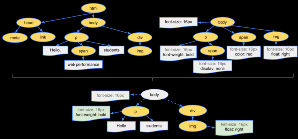
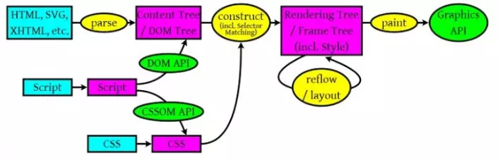
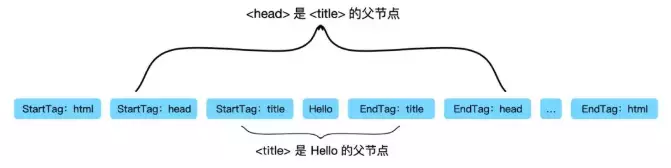
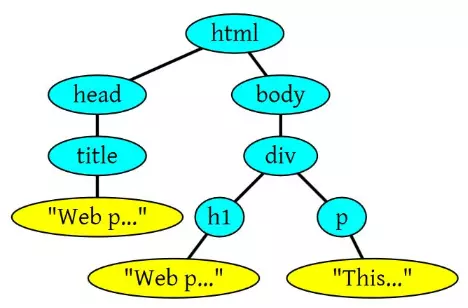

# 浏览器渲染机制

## 1. 浏览器请求URL到页面展示

	1. 浏览器根据 DNS 服务器得到域名的 IP 地址
	2. 向这个 IP 的机器发送 HTTP 请求
	3. 服务器收到、处理并返回 HTTP 请求
	4. 浏览器得到返回内容

#### 一、根据URL生成请求报文

	* 请求行 包含请求方式(get/post)、资源标识符(url)、协议版本(http 1.1/http 2.0)

	* 请求头 就是一些请求参数,常见的有Accept/Host/Content-Type/Referer

	* 消息体 请求内容(可有可无)

> 这一步是浏览器解析URL，生成请求报文

#### 二、域名解析

1. 查找浏览器的DNS缓存

2. 查找本地hosts是否有映射关系

3. 查找本地DNS服务器

4. 递归查询域名服务器

> 在这一步通过域名拿到服务器的ip地址，对请求进行域名分析

#### 三、建立TCP连接（TCP的三次握手）并发起http请求

	仅第一次请求需要三次握手，再次请求同域名下的资源就不需要这个开销了

#### 四、服务器处理并返回信息，浏览器接收信息并渲染页面

	服务器处理逻辑，完成后返回信息，即响应报文

**返回的响应报文**

* 状态行

	包括http协议版本(http 1.1)、状态码(200)、状态说明(ok)

* 响应头
	
	一些相应参数，常见的有Content-Type/Access-Control-Allow-Origin/Set-Cookie

* 消息体

	返回的信息(例如html文档/json数据块)

> 浏览器接到响应报文后，解析并渲染，会先解析渲染html页面，随后里面的静态资源，例如img和script会再次发http请求

#### 五、TCP四次挥手，关闭连接

	到了这一步说明请求结束，客户端与服务端的http连接结束

## 2. 输入url到页面返回的全过程

1. 我们输入一个域名：www.baidu.com  

2. 浏览器查找浏览器缓存，如果有域名的IP地址则返回，如果没有继续查找；

3. 系统查找系统缓存，如果有域名的IP地址则返回，如果没有继续查找；

4. 路由器查找路由器缓存，如果有域名的IP地址则返回，如果没有继续查找；

5. 本地域名服务器采用迭代查询，它先向一个根域名服务器查询；

6. 根域名服务器告诉本地域名服务器，下一次应查询的顶级域名服务器dns.com的IP地址；

7. 本地域名服务器向顶级域名服务器dns.com进行查询；

8. 顶级域名服务器dns.com告诉本地域名服务器，下一次应查询的权限域名服务器dns.baidu.com的IP地址；

9. 本地域名服务器向权限域名服务器dns.baidu.com进行查询；

10.  权限域名服务器dns.baidu.com告诉本地域名服务器，所查询的主机www.baidu.com的IP地址；

11.  本地域名服务器最后把查询结果告诉主机；

12.  主机浏览器获取到Web服务器的IP地址后，与服务器建立TCP连接；

13.  浏览器所在的客户机向服务器发出连接请求报文；

14.  服务器接收报文后，同意建立连接，向客户机发出确认报文；

15.  客户机接收到确认报文后，再次向服务器发出报文，确认已接收到确认报文；

16.  此处客户机与服务器之间的TCP连接建立完成，开始通信；

17.  浏览器发出取文件命令：GET；

18.  服务器给出响应，将指定文件发送给浏览器；

19.  浏览器释放TCP连接；

20.  浏览器所在主机向服务器发出连接释放报文，然后停止发送数据；

21.  服务器接收到释放报文后发出确认报文，然后将服务器上未传送完的数据发送完；

22.  服务器数据传输完毕后，向客户机发送连接释放报文；

23.  客户机接收到报文后，发出确认，然后等待一段时间后，释放TCP连接；

24.  浏览器显示页面中所有文本。

> [参考：](https://blog.csdn.net/mevicky/article/details/46789381)

## 浏览器的渲染机制

#### 概念

* DOM：Document Object Model，浏览器将HTML解析成树形的数据结构，简称DOM。 
* CSSOM：CSS Object Model，浏览器将CSS解析成树形的数据结构，简称CSSOM。 
* Render Tree: DOM和CSSOM合并后生成Render Tree，如图



* Layout: 计算出Render Tree每个节点的具体位置。 
* Painting：通过显卡，将Layout后的节点内容分别呈现到屏幕上。

#### 具体渲染流程

#### 渲染前

	这个是浏览器获取HTML页面的解析过程

1. 当我们的浏览器获得html文件后，会自上而下的加载，并在加载过程中进行解析和渲染

2. 加载说的就是获取资源文件的过程，如果在加载的过程中，遇到外部css文件和图片，浏览器会另外发出一个请求，来获取css文件和相应的图片，这个请求是异步的，并不会影响html文件

3. 但是如果遇到javascript文件，html文件会挂起渲染的线程，等待javascript加载完毕后，html文件再继续渲染。

?> 为什么html需要等待javascript呢？

	因为javascript可能会修改DOM，导致后续的html资源白白加载，所以html必须等待javascript文件加载完毕后，再继续渲染。这也就是为什么javascript文件要写在底部body标签前的原因

#### 大致渲染过程

	html的渲染过程就是将html代码按照深度优先遍历来生成DOM树

1. css文件下载完后会进行渲染，生成相应的`CSSOM`

2. 当所有的css文件下载完且所有的`CSSOM构建结束后`，就会`和DOM一起生成Render Tree`

4. 接下来，浏览器就会进入Layout环节，将所有的节点位置计算出来

5. 最后，通过Painting环节将所有的节点内容呈现到屏幕上

> 注：`重排`和`重绘`也就是分别触发了Layout环节和Painting环节

> 注：每个浏览器对于渲染的实现机制都不相同，比如说chrome会在一开始就将不影响DOM结构的javascript也异步加载从而进一步提高性能等

#### 参考

> [简述浏览器的渲染机制](https://blog.csdn.net/mevicky/article/details/50510824 ) | [你不知道的浏览器页面渲染机制](https://juejin.im/post/5ca0c0abe51d4553a942c17d)

## 详细渲染过程



###### 浏览器渲染过程大体分为如下三部分

* 一是HTML/SVG/XHTML，HTML字符串描述了一个页面的结构，浏览器会把HTML结构字符串解析转换DOM树形结构

* 二是CSS，解析CSS会产生CSS规则树，它和DOM结构比较像。

* 三是Javascript脚本，等到Javascript 脚本文件加载后， 通过 DOM API 和 CSSOM API 来操作 DOM Tree 和 CSS Rule Tree 

###### 最后通过调用操作系统Native GUI的API绘制

###### 解析完成后

	浏览器引擎会通过DOM Tree 和 CSS Rule Tree 来构造 Rendering Tree

* Rendering Tree 渲染树并不等同于DOM树，渲染树只会包括需要显示的节点和这些节点的样式信息。

* CSS 的 Rule Tree主要是为了完成匹配并把CSS Rule附加上Rendering Tree上的每个Element（也就是每个Frame）。

* 然后，计算每个Frame 的位置，这又叫layout和reflow过程。

#### 构建DOM

	浏览器会遵守一套步骤将HTML 文件转换为 DOM 树。


1. 浏览器从磁盘或网络读取HTML的原始字节，并根据文件的指定编码（例如 UTF-8）将它们转换成字符串。

	在网络中传输的内容其实都是 0 和 1 这些字节数据。当浏览器接收到这些字节数据以后，它会将这些字节数据转换为字符串，也就是我们写的代码。

2. 将字符串转换成Token，例如：<html>、<body>等。Token中会标识出当前Token是`开始标签`或是`结束标签`亦或是`文本`等信息。

?> 节点与节点之间的关系如何维护？

	事实上，这就是Token要标识`起始标签`和`结束标签`等标识的作用。例如`title`Token的起始标签和结束标签之间的节点肯定是属于`head`的子节点。



3. 生成节点对象并构建DOM

	事实上，构建DOM的过程中，不是等所有Token都转换完成后再去生成节点对象，而是一边生成Token一边消耗Token来生成节点对象。换句话说，每个Token被生成后，会立刻消耗这个Token创建出节点对象。

> 注意：带有结束标签标识的Token不会创建节点对象。

**示例**

```html
<html>
<head>
    <title>Web page parsing</title>
</head>
<body>
    <div>
        <h1>Web page parsing</h1>
        <p>This is an example Web page.</p>
    </div>
</body>
</html>
```

**对应HTML解析成DOM树**




#### 构建CSSOM

	DOM会捕获页面的内容，但浏览器还需要知道页面如何展示，所以需要构建CSSOM。

	构建CSSOM的过程与构建DOM的过程非常相似，当浏览器接收到一段CSS，浏览器首先要做的是识别出Token，然后构建节点并生成CSSOM。


	在这一过程中，浏览器会确定下每一个节点的样式到底是什么，并且这一过程其实是很消耗资源的。因为样式你可以自行设置给某个节点，也可以通过继承获得。在这一过程中，浏览器得递归 CSSOM 树，然后确定具体的元素到底是什么样式。

> 注意：CSS匹配HTML元素是一个相当复杂和有性能问题的事情。所以，DOM树要小，CSS尽量用id和class，千万不要过渡层叠下去。

#### 构建渲染树

	当我们生成 DOM 树和 CSSOM 树以后，就需要将这两棵树组合为渲染树。


	在这一过程中，不是简单的将两者合并就行了。渲染树只会包括需要显示的节点和这些节点的样式信息，如果某个节点是 display: none 的，那么就不会在渲染树中显示。

> 注：<a href="#知识笔记/大前端/浏览器/问题驱动?id=js会影响DOM的构建？">JavaScript加载的位置会影响DOM树和CSSOM树</a>

#### 布局与绘制

	当浏览器生成渲染树以后，就会根据渲染树来进行布局（也可以叫做"回流"）。
	这一阶段浏览器要做的事情是要弄清楚各个节点在页面中的确切位置和大小。通常这一行为也被称为"自动重排"。

* 布局流程的输出是一个“盒模型”，它会精确地捕获每个元素在视口内的确切位置和尺寸，所有相对测量值都将转换为屏幕上的绝对像素。

* 布局完成后，浏览器会立即发出`Paint Setup`和`Paint`事件，将渲染树转换成屏幕上的像素。

#### 总结

* 浏览器工作流程：构建DOM -> 构建CSSOM -> 构建渲染树 -> 布局 -> 绘制。

* CSSOM会阻塞渲染，只有当CSSOM构建完毕后才会进入下一个阶段构建渲染树。

* 通常情况下DOM和CSSOM是并行构建的，但是当浏览器遇到一个不带defer或async属性的script标签时，DOM构建将暂停，如果此时又恰巧浏览器尚未完成CSSOM的下载和构建，由于JavaScript可以修改CSSOM，所以需要等CSSOM构建完毕后再执行JS，最后才重新DOM构建。

## 性能优化策略

	浏览器渲染原理，DOM 和 CSSOM 结构构建顺序，初始化可以对页面渲染做些优化，提升页面性能。

#### JS优化

	<script> 标签加上 defer属性 和 async属性 用于在不阻塞页面文档解析的前提下，控制脚本的下载和执行。

		defer属性：用于开启新的线程下载脚本文件，并使脚本在文档解析完成后执行。
		async属性：HTML5新增属性，用于异步下载脚本文件，下载完毕立即解释执行代码。

#### CSS优化

	 <link> 标签的 rel属性 中的属性值设置为 preload 能够让你在你的HTML页面中可以指明哪些资源是在页面加载完成后即刻需要的,最优的配置加载顺序，提高渲染性能

## 参考

> [参考：浪里行舟-你不知道的浏览器页面渲染机制](https://juejin.im/post/5ca0c0abe51d4553a942c17d)
