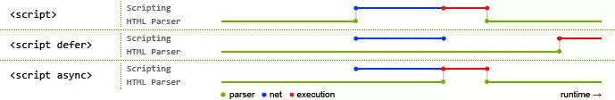
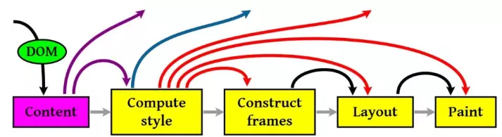
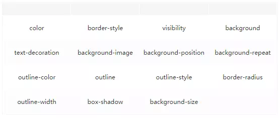

# 浏览器相关问题驱动

## 浏览器渲染问题

#### 浏览器如果渲染过程中遇到JS文件怎么处理？

	渲染过程中，如果遇到<script>就停止渲染，执行 JS 代码。因为浏览器有GUI渲染线程与JS引擎线程，为了防止渲染出现不可预期的结果，这两个线程是互斥的关系。

	JavaScript的加载、解析与执行会阻塞DOM的构建，也就是说，在构建DOM时，HTML解析器若遇到了JavaScript，那么它会暂停构建DOM，将控制权移交给JavaScript引擎，等JavaScript引擎运行完毕，浏览器再从中断的地方恢复DOM构建。

> 也就是说，如果我们想首屏渲染的越快，就越不应该在首屏就加载 JS 文件，这也是都建议将 script 标签放在 body 标签底部的原因。当然在当下，并不是说 script 标签必须放在底部，因为我们可以给 script 标签添加 `defer` 或者 `async` 属性

#### js会影响DOM的构建？

	JS文件不只是阻塞DOM的构建，它会导致CSSOM也阻塞DOM的构建。

	原本DOM和CSSOM的构建是互不影响，井水不犯河水，但是一旦引入了JavaScript，CSSOM也开始阻塞DOM的构建，只有CSSOM构建完毕后，DOM再恢复DOM构建。

**原因**

	这是因为JavaScript不只是可以改DOM，它还可以更改样式，也就是它可以更改CSSOM。因为不完整的CSSOM是无法使用的，如果JavaScript想访问CSSOM并更改它，那么在执行JavaScript时，必须要能拿到完整的CSSOM。所以就导致了一个现象，如果浏览器尚未完成CSSOM的下载和构建，而我们却想在此时运行脚本，那么浏览器将延迟脚本执行和DOM构建，直至其完成CSSOM的下载和构建。也就是说，在这种情况下，浏览器会先下载和构建CSSOM，然后再执行JavaScript，最后在继续构建DOM。

#### async和defer的作用是什么？有什么区别?

**对比下 defer 和 async 属性的区别**



> 蓝色线代表JavaScript加载；红色线代表JavaScript执行；绿色线代表 HTML 解析

* 情况1

	没有 defer 或 async，浏览器会立即加载并执行指定的脚本，也就是说不等待后续载入的文档元素，读到就加载并执行。

```html
<script src="script.js"></script>
```

* 情况2：(异步下载)

	async 属性表示异步执行引入的 JavaScript，与 defer 的区别在于，如果已经加载好，就会开始执行——无论此刻是 HTML 解析阶段还是 DOMContentLoaded 触发之后。需要注意的是，这种方式加载的 JavaScript 依然会阻塞 load 事件。
	
	换句话说，async-script 可能在 DOMContentLoaded 触发之前或之后执行，但一定在 load 触发之前执行。

```html
<script async src="script.js"></script>
```

* 情况3：(延迟执行)

	defer 属性表示延迟执行引入的 JavaScript，即这段 JavaScript 加载时 HTML 并未停止解析，这两个过程是并行的。整个 document 解析完毕且 defer-script 也加载完成之后（这两件事情的顺序无关），会执行所有由 defer-script 加载的 JavaScript 代码，然后触发 DOMContentLoaded 事件。

```html
<script defer src="script.js"></script>
```

> `defer` 与相比`普通 script`，有两点区别：载入 JavaScript 文件时不阻塞 HTML 的解析，执行阶段被放到 HTML 标签解析完成之后。 在加载多个JS脚本的时候，async是无顺序的加载，而defer是有顺序的加载。

#### 为什么操作 DOM 慢？

	把 DOM 和 JavaScript 各自想象成一个岛屿，它们之间用收费桥梁连接。——《高性能 JavaScript》

> JS 是很快的，在 JS 中修改 DOM 对象也是很快的。在JS的世界里，一切是简单的、迅速的。但 DOM 操作并非 JS 一个人的独舞，而是两个模块之间的协作。

	因为 DOM 是属于渲染引擎中的东西，而 JS 又是 JS 引擎中的东西。当我们用 JS 去操作 DOM 时，本质上是 JS 引擎和渲染引擎之间进行了"跨界交流"。这个"跨界交流"的实现并不简单，它依赖了桥接接口作为"桥梁"


	过"桥"要收费——这个开销本身就是不可忽略的。我们每操作一次 DOM（不管是为了修改还是仅仅为了访问其值），都要过一次"桥"。过"桥"的次数一多，就会产生比较明显的性能问题。因此"减少 DOM 操作"的建议，并非空穴来风。

#### 你真的了解回流和重绘吗？

###### 渲染流程的步骤基本

	1. 计算CSS样式 
	2. 构建Render Tree 
	3. Layout – 定位坐标和大小 
	4. 正式开画



> 注意：上图流程中有很多连接线，这表示了Javascript动态修改了DOM属性或是CSS属性会导致重新Layout，但有些改变不会重新Layout，就是上图中那些指空的箭头，比如修改后的CSS rule没有被匹配到元素。

###### 两个重要概念

	一个是Repaint（重绘），一个是Reflow（回流）

* 重绘：当我们对 DOM 的修改导致了样式的变化、却并未影响其几何属性（比如修改了颜色或背景色）时，浏览器不需重新计算元素的几何属性、直接为该元素绘制新的样式（跳过了上图所示的回流环节）。

* 回流：当我们对 DOM 的修改引发了 DOM 几何尺寸的变化（比如修改元素的宽、高或隐藏元素等）时，浏览器需要重新计算元素的几何属性（其他元素的几何属性和位置也会因此受到影响），然后再将计算的结果绘制出来。这个过程就是回流（也叫重排）

> 我们知道，当网页生成的时候，至少会渲染一次。在用户访问的过程中，还会不断重新渲染。重新渲染会重复回流+重绘或者只有重绘。
`回流必定会发生重绘，重绘不一定会引发回流`。重绘和回流会在我们设置节点样式时频繁出现，同时也会很大程度上影响性能。回流所需的成本比重绘高的多，改变父节点里的子节点很可能会导致父节点的一系列回流。

###### 常见引起回流属性和方法

	任何会改变元素几何信息(元素的位置和尺寸大小)的操作，都会触发回流

* 添加或者删除可见的DOM元素；

* 元素尺寸改变——边距、填充、边框、宽度和高度

* 内容变化，比如用户在input框中输入文字

* 浏览器窗口尺寸改变——resize事件发生时

* 计算 offsetWidth 和 offsetHeight 属性

* 设置 style 属性的值

###### 常见引起重绘属性和方法



###### 如何减少回流、重绘？

* 使用 transform 替代 top

* 使用 visibility 替换 display: none ，因为前者只会引起重绘，后者会引发回流（改变了布局）

* 不要把节点的属性值放在一个循环里当成循环里的变量。

```js
for(let i = 0; i < 1000; i++) {
    // 获取 offsetTop 会导致回流，因为需要去获取正确的值
    console.log(document.querySelector('.test').style.offsetTop)
}
```

* 不要使用 table 布局，可能很小的一个小改动会造成整个 table 的重新布局

* 动画实现的速度的选择，动画速度越快，回流次数越多，也可以选择使用 requestAnimationFrame

* CSS 选择符从右往左匹配查找，避免节点层级过多

* 将频繁重绘或者回流的节点设置为图层，图层能够阻止该节点的渲染行为影响别的节点。比如对于 video 标签来说，浏览器会自动将该节点变为图层。


## 参考

> [参考：浪里行舟-你不知道的浏览器页面渲染机制](https://juejin.im/post/5ca0c0abe51d4553a942c17d)


