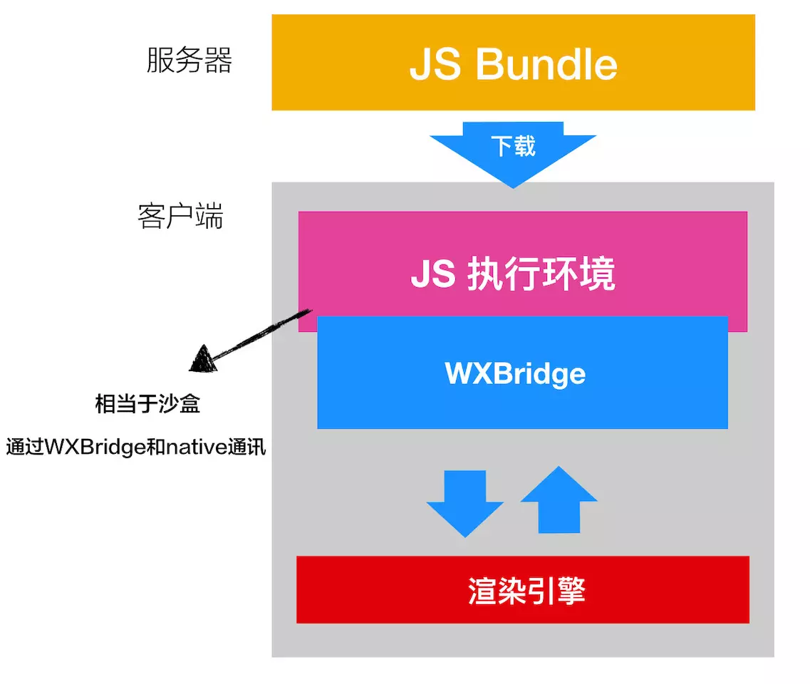
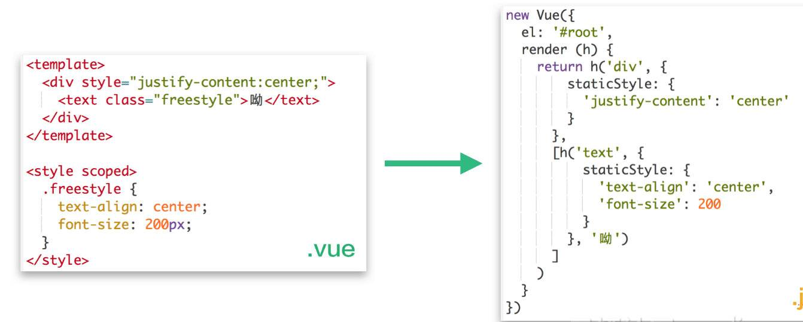
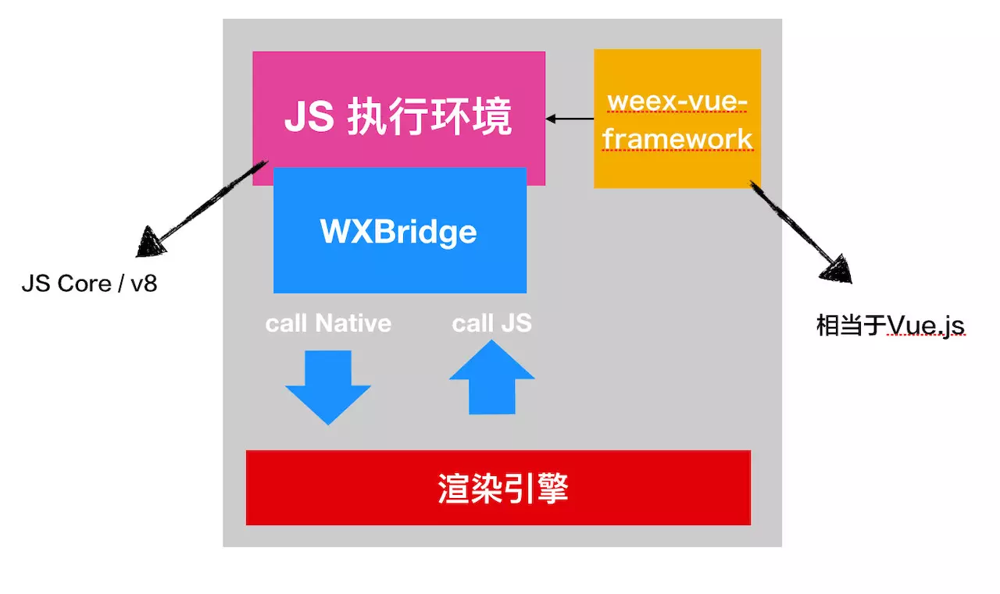
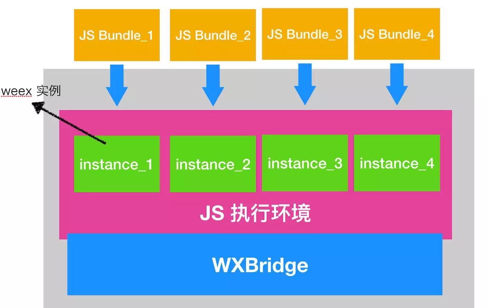
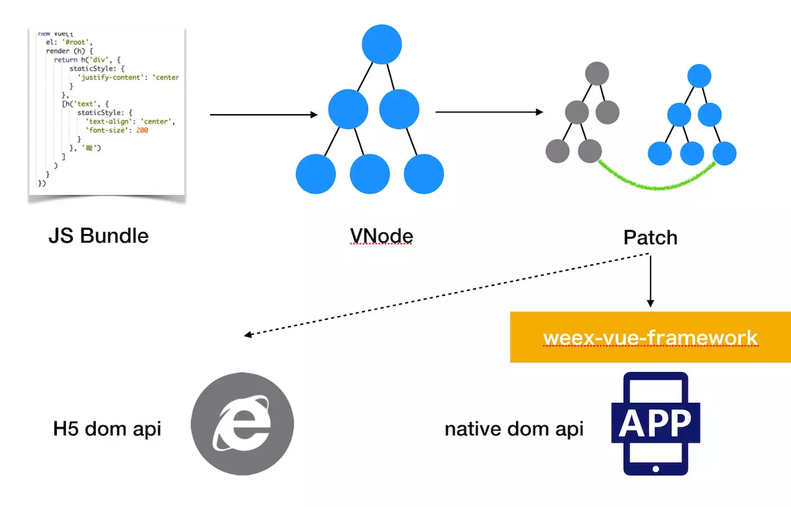
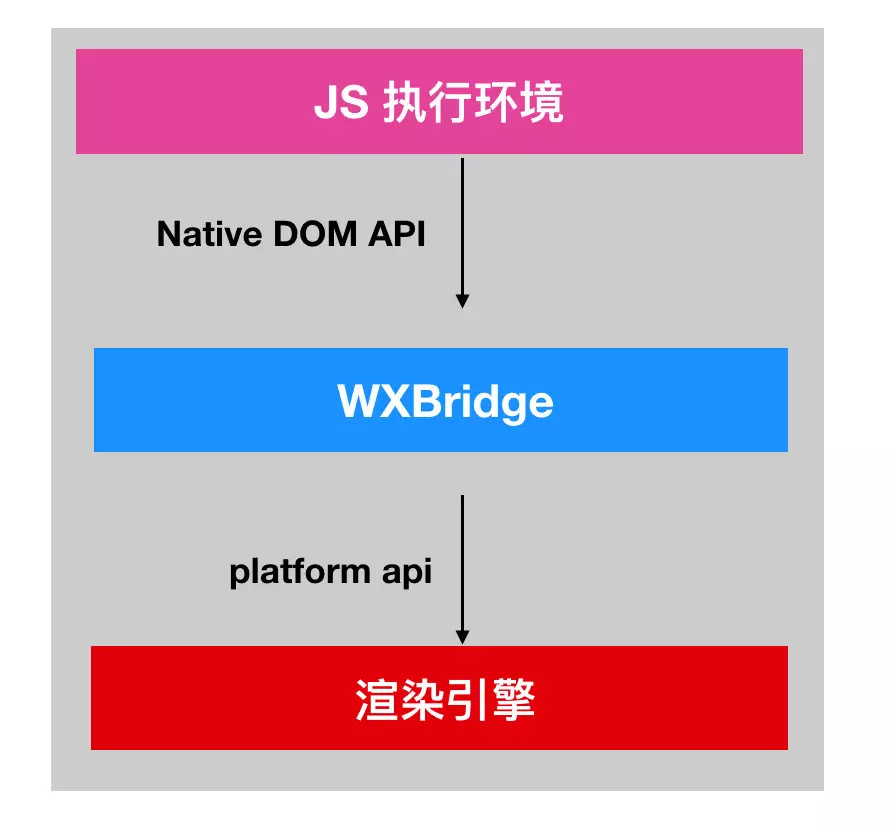
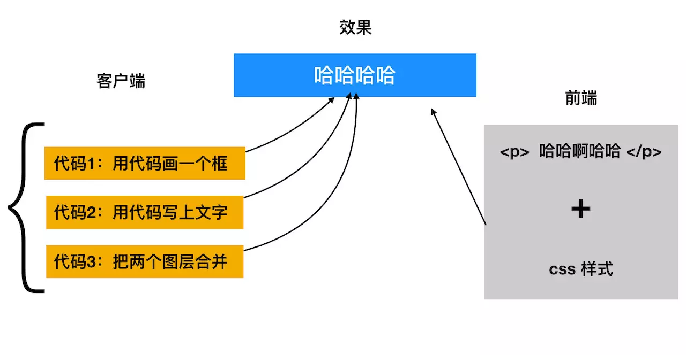

# 深入浅出Weex核心原理

## 前言

	从前，如果我们打算实现某个需求，通常需要三种程序员（IOS, 安卓，前端）写三份代码。这就带来了非常大的开发成本，所以业界也一直在探索跨平台方案——从最早的H5, Hybrid 到现在的weex, React Native。这些方案的本质目的都是，一套代码，多端运行

#### H5和Hybrid的发展

	早期H5和Hybrid方案的本质是：利用客户端App的内置浏览器（也就是`webView`）功能，通过开发前端的H5页面满足跨平台需求

> 该方案提升开发效率，同时也满足了跨端的需求。但有一个问题就是，`前端H5的性能和客户端的性能相差甚远`

#### weex的发展

	于是后来, 业界继续探索可以媲美原生体验app的方案，比如说WEEX，当然，还有react Native 和 Flutter等

> WEEX依旧采取前端H5页面进行开发，同时app在终端的运行体验不输native app。即可以保证快速响应需求，又可以保证用户体验

**那么WEEX是如何实现的？**

	本质来说，WEEX是用客户端Native的能力，去做了部分浏览器（webView）的工作

> 在2016年2月， WeexSDK 发布了v0.10.0版本，在这个版本里面，集成了`v2版本的Vue`。

**为啥是Vue 2.x 版本呢？**

	Vue 2.x加入了 Virtual-DOM 和预编译器的设计，使得该框架在运行时能够脱离 HTML 和 CSS 解析，只依赖 JavaScript；同时 Virtual-DOM 也使得 Vue 2.x 渲染成原生 UI 成为了可能。

## weex 原理探究

#### weex 整体架构



###### 分析weex的大致工作流程

1. 前端开发可以写熟悉vue语法的单文件，然后打包成出来一份dist —— JS Bundle，然后部署到服务器上

2. 客户端打开某一个页面，通过网络下载JS Bundle，然后在客户端本地执行该JS Bundle

3. 客户端提供了JS的执行引擎(JSCore)用于执行远程加载到JS Bundle

4. JS执行引擎执行JS Bundle，和浏览器的过程类似，JS Bundle 的代码被执行，生成VNode 树进行patch，找出最小操作DOM节点的操作，把对DOM节点的操作转变为Native DOM API, 调用WXBridge 进行通信

5. WXBridge将渲染指令分发到native（Android、iOS）渲染引擎，由native渲染引擎完成最终的页面渲染

> 看完上述整体流程后，可以大致理解为何WEEX可以达到媲美原生的体验，因为其页面渲染并不是像H5方案一样使用浏览器的渲染能力，而是原生渲染，所以本质上渲染出来的页面就是一个native页面

###### 具体流程分析

**第一步：生成 JS bundle**

	JS bundle 是前端写好代码后打包出来的dist

> 前端同学在.vue 的单文件中，写`<template>`，`<style>`和`<script>`标签，然后把这些标签转换为JS Bundle用于部署在服务端，之后客户端会去请求这些JS Bundle

*转换示例*

	比如说，下图中左边是vue源代码，右边是打包出来到JS Bundle



	右边其实就是Vue打包生成的render 函数

!> 问题是：当客户端获取到如上图右侧的js bundle后，如何进行加载、渲染以及后续的相关逻辑执行？

**第二步：WEEX SDK初始化**

	weex在真正打开一个页面之前，会先做一些准备的初始化工作，这一点有一点像微信小程序

> 在初始化阶段，WEEX SDK 会初始化几样东西

	1. 初始化js的执行环境——`js Core` 或者是 `v8`
	2. 加载`weex-vue-framework` 的代码
	3. 初始化`WXBridge`



1. js的执行环境

	在初始化阶段, WEEX SDK 会准备好一个js的执行环境。因为我们是要在客户端跑js 代码的，所以需要一个js执行环境，这个执行环境类似于浏览器的v8 引擎， 在IOS 上，则是客户端自带的 js core

> 这个js执行环境，可以看成是一个在客户端上的沙盒，或者是一个虚拟机

!> 为了提升性能，js 执行环境只用在初始化的时候初始化一次，之后每个页面都无须再初始化了。也就是说不管客户端打开多少个weex页面，多个页面的 JS 都是跑在同一个js执行环境中的

2. weex-vue-framework 框架

?> weex-vue-framework 框架 是什么呢？

	我们可以把 weex-vue-framework 框架当成被改造的Vue.js。语法和内部机制都是一样的，只不过Vue.js最终创建的是 DOM 元素，而weex-vue-framework则是向原生端发送渲染指令，最终渲染生成的是原生组件

	同时，Weex为了提高Native的极致性能，做了很多优化的工作。前端优化性能时，会把业务代码和 vue.js 这类的依赖包分开打包，一个份是业务代码，一份是打包的框架依赖

> weex 把`weex-vue-framework`这类框架依赖`内置`到了`SDK`中，客户端访问Weex页面时，只会`网络请求JS Bundle`。由于JSFramework在本地，所以就减少了JS Bundle的体积，每个JS Bundle都可以减少一部分体积，从而提升了性能

3. WXBridge 通信

	WXBridge 是 weex 实现的一种 js 和 客户端通信的机制

> js 执行环境和客户端是隔离的，为了和外界客户端的世界通信，需要有一个通信的桥梁。weex 实现了 WXBridge, 主要通过 `callJS` 和 `callNative` 两个核心的方法，实现 js 代码和客户端代码`双向通信`

!> 在完成了上面的初始化之后，weex已经做好了准备，只等着下载 JS bundle 就可开始渲染页面了 😄

**第三步：创建 weex 实例**

	实际上当WEEX SDK获取到JS Bundle后，第一时间并不是立马渲染页面，而是先创建WEEX的实例

> 每一个JS bundle对应一个实例，同时每一个实例都有一个instance id

上文中说过，由于所有的js bundle都是放入到同一个JS执行引擎中执行，那么当js执行引擎通过WXBridge将相关渲染指令传出的时候，需要通过`instance id`才能知道该指定要传递给哪个weex实例

* 在创建实例完成后，接下来才是真正将js bundle交给js执行引擎执行



**第四步：执行 JS bundle**

	在实例创建完成后，接下来就是执行JS bundle 了。
	JS bundle 的结果是生成`Virtual DOM` ，然后去patch 新旧 VNode 树，根据`diff 算法`找出最佳的DOM操作，唯一和浏览器不同的是，调用的是 `Native app api` ，而不是浏览器里面对DOM节点增删改查的操作



*其中*

* VNode

	bundle.js会执行new Vue（）创建一个vue组件，并通过其render函数创建VNode节点，即virtual dom节点

例如：

```js
{
  tag: 'div',
  data: {
    staticStyle: { justifyContent: 'center' }
  },
  children: [{
    tag: 'text',
    data: {
      staticClass: 'freestyle'
    },
    context: {
      $options: {
        style: {
          freestyle: {
            textAlign: 'center',
            fontSize: 200
          }
        }
      }
    },
    children: [{
      tag: '',
      text: 'Hello World!'
    }]
  }]
}
```

* patch

	生成了VNode之后，接下来需要将VNode同步到真实的Dom之上，该过程在Vue.js中被称为patch，patch会比较新旧VNode之间的差异，最小化操作集。最后再将Virtual Dom整体更新到真实Dom之上

!> 在执行 patch 之前的过程都是 Web 和 Weex 通用的，后面的流程就不一样了，因为客户端没有对 DOM 增删改查的API，所以这些更新的操作，需要经过`weex-vue-framework`的处理，统统映射为客户端的`Native DOM API`


**第五步：发送渲染指令**

	weex终端的执行引擎在执行到Native DOM API后，WXBridge将Native DOM API转化为Platform API

> `Platform API` 是 `Weex SDK` 中原生模块提供的,不是 js 中方法，也不是浏览器中的接口，是 Weex 封装的一系列方法



> 注意：<a href="#知识笔记/大前端/移动端/Weex/深入浅出Weex核心原理?id=客户端和前端h5是不同的">客户端和前端h5是不同的</a>

**第六步 渲染引擎**

	原生渲染器接收上层传来的渲染指令，并且逐步将其渲染成原生组件，这样，我们在js中的<div>, <p> 标签，就一一对应到了客户端的原生标签

> 这个过程不是分阶段一个一个执行的，而是可以实现“流式”渲染的，有可能第一个<div>的原生组件还没渲染好，<text>的渲染指令又发过来了。当一个页面特别大时，能看到一块一块的内容逐渐渲染出来的过

## 客户端和前端h5是不同的



* 对于前端实现来说，写一个类似上面的框内带文字的效果非常简单

	只需要 html + css 就可以实现

```html
<div class="text">哈哈哈哈</div>
```

```css
.text {
    // css 样式
}
```

* 然而对于客户端的同学，则需要写非常多的代码来实现

	* 用逻辑代码写一个框（样式，大小，位置……）
	* 用逻辑代码写一行文字（样式，大小，位置……）
	* 用逻辑代码把两个合起来

!> 所以，weex 会把上面一些系列复杂的代码封装好一个个现成的方法

## 总结

* 简单来说，WEEX放弃了传统的Webview，而是搭建了一个native化的浏览器，因为用native的方式实现了一个浏览器的大部分核心组成成分

    * JS 执行引擎
    * 渲染引擎
    * DOM树管理
    * 网络请求，持久层存储
    * ...

* 另外为了保证整个SDK的运行效率，SDK维护了三个线程

	* bridge线程：完成js到native之间的通信
	* dom线程：完成dom结构的构建
	* 渲染线程：完成UI渲染，也就是UI线

> 参考：[深入浅出 Weex 核心原理](https://juejin.im/post/5d14619bf265da1b6c5f8747?utm_source=gold_browser_extension&tdsourcetag=s_pctim_aiomsg) | [认识移动端跨平台开发](知识笔记/大前端/移动端/认识移动端跨平台开发.md)
