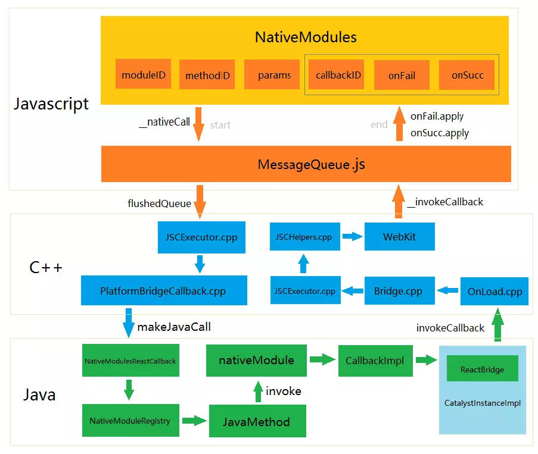

# 移动端跨平台开发

	 跨平台一直是老生常谈的话题，cordova、ionic、react-native、weex、kotlin-native、flutter等跨平台框架的百花齐放，颇有一股推倒原生开发者的势头。

## 前言：初识跨平台开发

#### 为什么我们需要跨平台开发？

	本质上，跨平台开发是为了增加代码复用，减少开发者对多个平台差异适配的工作量，降低开发成本，提高业务专注的同时，提供比web更好的体验。
	
	通俗了说就是：省钱、偷懒。

#### 超完整跨平台开源项目

|类型|链接|
|:---:|:---:|
|react-native|https://github.com/CarGuo/GSYGithubApp|
|weex|https://github.com/CarGuo/GSYGithubAppWeex|
|Flutter|https://github.com/CarGuo/GSYGithubAppFlutter|

## 原理与特性

	目前移动端跨平台开发中，大致归纳为以下几种情况

* react native、weex均使用JavaScript作为编程语言，目前JavaScript在跨平台开发中，可谓占据半壁江山，大有“一统天下”的趋势。

* kotlin-native开始支持 iOS 和 Web 开发，（kotlin已经成为android的一级语言）也想尝试“一统天下”。

* flutter是Google跨平台移动UI框架，Dart作为谷歌的亲儿子，毫无疑问Dart成为flutter的编程语言，如下图，作为巨头新生儿，在flutter官网也可以看出，flutter同样“心怀天下”。

#### React Native

	Facebook 出品，JavaScript语言，JSCore引擎，React设计模式，原生渲染

###### 理念架构

	“Learn once, write anywhere” ，代表着 Facebook对 react native 的定义：学习 react ，同时掌握 web 与 app 两种开发技能。 react native  用了 react 的设计模式，但UI渲染、动画效果、网络请求等均由原生端实现。开发者编写的js代码，通过 react native 的中间层转化为原生控件和操作，比ionic等跨平台应用，大大提高了的用户体验。

> 总结起来其实就是利用 JS 来调用 Native 端的组件，从而实现相应的功能

* 如下图所示，react native 的跨平台是实现主要由三层构成，其中 C++ 实现的动态连结库(.so)，作为中间适配层桥接，实现了js端与原生端的双向通信交互。这里最主要是封装了 JavaScriptCore 执行js的解析，而 react native 运行在JavaScriptCore中，所以不存在浏览器兼容的问题。

> 其中在IOS上直接使用内置的`javascriptCore`， 在Android 则使用webkit.org官方开源的`jsc.so`。

###### 实现原理

	和前端开发不同，react native 所有的标签都不是真实控件，JS代码中所写控件的作用，类似 Map 中的 key 值。JS端通过这个 key 组合的 Dom ，最后Native端会解析这个 Dom ，得到对应的Native控件渲染，如 Android 中<view> 标签对应 ViewGroup 控件。

> [参考：移动端跨平台开发的深度解析](https://www.jianshu.com/p/7e0bd4708ba7)