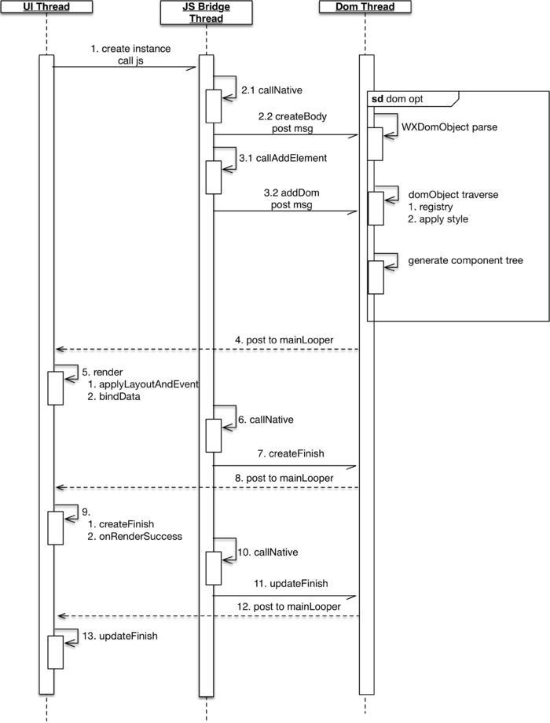
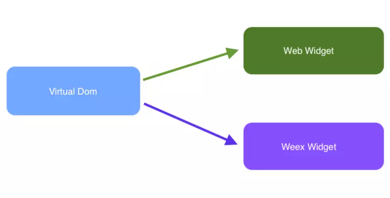
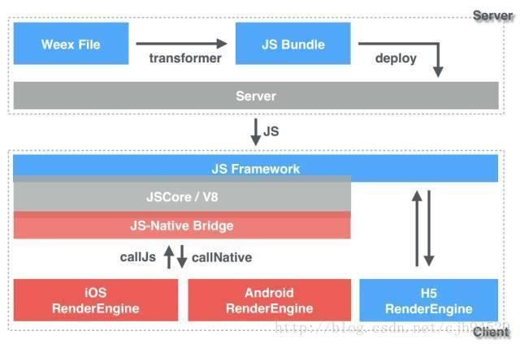
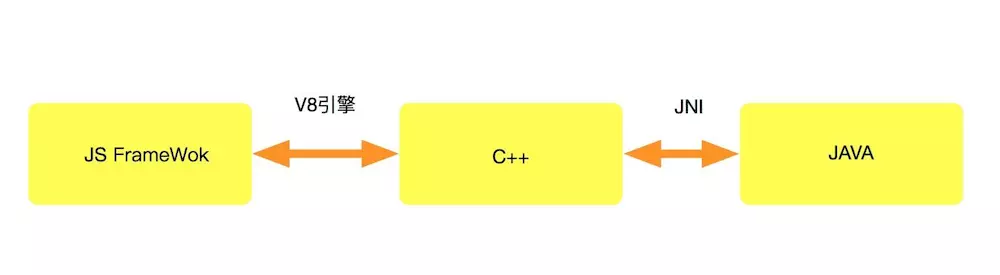
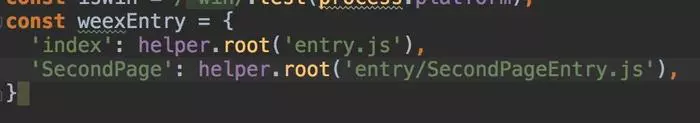
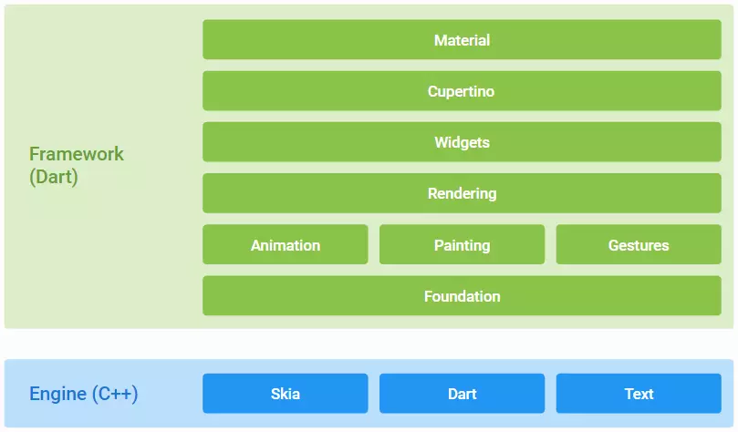
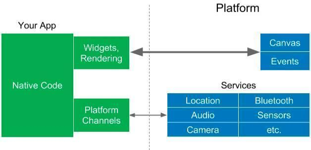

# 移动端跨平台开发

	 跨平台一直是老生常谈的话题，cordova、ionic、react-native、weex、kotlin-native、flutter等跨平台框架的百花齐放，颇有一股推倒原生开发者的势头。

## 前言：初识跨平台开发

#### 为什么我们需要跨平台开发？

	本质上，跨平台开发是为了增加代码复用，减少开发者对多个平台差异适配的工作量，降低开发成本，提高业务专注的同时，提供比web更好的体验。
	
	通俗了说就是：省钱、偷懒。

#### 超完整跨平台开源项目

|类型|链接|
|:---:|:---:|
|react-native|https://github.com/CarGuo/GSYGithubApp|
|weex|https://github.com/CarGuo/GSYGithubAppWeex|
|Flutter|https://github.com/CarGuo/GSYGithubAppFlutter|

## 原理与特性

	目前移动端跨平台开发中，大致归纳为以下几种情况

* react native、weex均使用JavaScript作为编程语言，目前JavaScript在跨平台开发中，可谓占据半壁江山，大有“一统天下”的趋势。

* kotlin-native开始支持 iOS 和 Web 开发，（kotlin已经成为android的一级语言）也想尝试“一统天下”。

* flutter是Google跨平台移动UI框架，Dart作为谷歌的亲儿子，毫无疑问Dart成为flutter的编程语言，如下图，作为巨头新生儿，在flutter官网也可以看出，flutter同样“心怀天下”。

#### React Native

	Facebook 出品，JavaScript语言，JSCore引擎，React设计模式，原生渲染

###### 理念架构

	“Learn once, write anywhere” ，代表着 Facebook对 react native 的定义：学习 react ，同时掌握 web 与 app 两种开发技能。 react native  用了 react 的设计模式，但UI渲染、动画效果、网络请求等均由原生端实现。开发者编写的JS代码，通过 react native 的中间层转化为原生控件和操作，比ionic等跨平台应用，大大提高了的用户体验。

> 总结起来其实就是利用 JS 来调用 Native 端的组件，从而实现相应的功能

* 如下图所示，react native 的跨平台是实现主要由三层构成，其中 C++ 实现的动态连结库(.so)，作为中间适配层桥接，实现了JS端与原生端的双向通信交互。这里最主要是封装了 JavaScriptCore 执行JS的解析，而 react native 运行在JavaScriptCore中，所以不存在浏览器兼容的问题。

> 其中在IOS上直接使用内置的`javascriptCore`， 在Android 则使用webkit.org官方开源的`JSc.so`。

###### 实现原理

	和前端开发不同，react native 所有的标签都不是真实控件，JS代码中所写控件的作用，类似 Map 中的 key 值。JS端通过这个 key 组合的 Dom ，最后Native端会解析这个 Dom ，得到对应的Native控件渲染，如 Android 中<view> 标签对应 ViewGroup 控件。

* 在 react native  中，JS端是运行在独立的线程中（称为JS Thread ）。JS Thread 作为单线程逻辑，不可能处理耗时的操作。那么如 fetch 、图片加载 、 数据持久化 等操作，在 Android 中实际对应的是 okhttp 、Fresco 、SharedPreferences等。而跨线程通信，也意味着 JS Thread 和原生之间交互与通讯是异步的。

* 可以看出，跨平台的关键在于C++层，开发人员大部分时候，只专注于JS 端的代码实现。 在原生端提供的各种 Native Module 模块（如网络请求，ViewGroup控件），和 JS 端提供的各种 JS Module（如JS EventEmiter模块），都会在C++实现的so中保存起来，双方的通讯通过C++中的保存的映射，最终实现两端的交互。通信的数据和指令，在中间层会被转为String字符串传输，双向的调用流程如下图。

*JS调用native*

*native调用JS*

###### 打包下载

	最终，JS代码会被打包成一个 bundle 文件，自动添加到 App 的资源目录下。react native 的打包脚本目录为/node_modules/react-native/local-cli，打包最后会通过 metro 模块压缩 bundle 文件。而bundle文件只会打包JS代码，自然不会包含图片等静态资源，所以打包后的静态资源，其实是被拷贝到对应的平台资源文件夹中。

* 其中图片等存在资源的映射规则，比如放在 react native 项目根目录下的 img/pic/logo.png 的资源，编译时，会被重命名后，根据大小 merged 到对应的是drawable目录下，修改名称为img_pic_logo.png。

* 打包Android和IOS，肯定需要相应的平台项目存在，在 react-native init 时创建的项目，就已经包含了 android 和 ios 的模版工程，打包完的工程会加载bundle文件，然后启动项目，如下图

#### WEEX

	Alibaba 出品，JavaScript语言，JS V8引擎，Vue设计模式，原生渲染

###### 理念架构

	“Write once, run everywhere”, weex的定义就像是：写个 vue 前端，顺便帮你编译成性能还不错的 apk 和 ipa（当然，现实有时很骨感）。基于 Vue 设计模式，支持 web、android、ios 三端，原生端同样通过中间层转化，将控件和操作转化为原生逻辑来提高用户体验。

**结构**

	在 weex 中，主要包括三大部分：JS Bridge、Render、Dom，分别对应WXBridgeManager、WXRenderManager、WXDomManager，三部分通过WXSDKManager统一管理。其中 JS Bridge 和 Dom 都运行在独立的 HandlerThread 中，而 Render 运行在 UI 线程。

> JS Bridge 主要用来和 JS 端实现进行双向通信，比如把 JS 端的 dom 结构传递给 Dom 线程。Dom 主要是用于负责 dom 的解析、映射、添加等等的操作，最后通知UI线程更新。而 Render 负责在UI线程中对 dom 实现渲染。

###### 实现原理

	和 react native一样，weex 所有的标签也不是真实控件，JS 代码中所生成存的 dom，最后都是由 Native 端解析，再得到对应的Native控件渲染，如 Android 中 <text> 标签对应 WXTextView 控件。

* weex 中文件默认为 .vue ，而 vue  文件是被无法直接运行的，所以 vue 会被编译成 .JS 格式的文件，Weex SDK会负责加载渲染这个JS文件。Weex可以做到跨三端的原理在于：在开发过程中，代码模式、编译过程、模板组件、数据绑定、生命周期等上层语法是一致的。不同的是在 JS Framework 层的最后，web 平台和 Native 平台，对 Virtual DOM 执行的解析方法是有区别的。

	在 JS Framework 层的最后，web 平台和 Native 平台根据平台的不同将 Virtual DOM 解析成对应的模式

> 实际上，在 Native 中对 bundle 文件的加载大致经历以下阶段

1. weex 接收到 JS 文件以后，JS Framework 根据文件为 Vue 模式，会调用weex-vue-framework 中提供的 createInstance方法创建实例。(也可能是Rax模式)

2. createInstance 中会执行 JS Entry 代码里 new Vue() 创建一个组件，通过其 render 函数创建出 Virtual DOM 节点

3. 由JS V8 引擎上解析 Virtual DOM ，得到 JSON 数据发送至 Dom 线，这里输出 JSON 也是方便跨端的数据传输

4. Dom 线程解析 JSON 数据，得到对应的 WxDomObject，然后创建对应的WxComponent 提交 Render

5. Render在原生端最终处理处理渲染任务，并回调里JS方法

> 得益于上层的统一性，只是通过 weex-vue-framework 判断是由Vue.js生成真实的 Dom ，还是通过 Native Api 渲染组件，weex 一定程度上，用JS实现了 vue 一统天下的效果

**过程分析**

* weex 在原生渲染 Render 时，在接收到渲染指令后，会逐步将数据渲染成原生组件。Render 通过解析渲染数据的描述，然后分发给不同的模块
   
   比如 控件渲染属于 dom 模块中，页面跳转属于navigator模块等。模块的渲染过程并非一个执行完，再执行另一个的流程，而是类似流式的过程。如上一个 <text> 的组件还没渲染好，下一个 <div\> 的渲染又发了过来。这样当一个组件的嵌套组件很多时，或者可以看到这个大组件内的UI，一个一个渲染出来的过程。

* weex 比起react native，主要是在JS V8的引擎上，多了 JS Framework 承当了重要的职责，使得上层具备统一性，可以支持跨三个平台。

> 总的来说它主要负责是：

	1. 管理Weex的生命周期；
	2. 解析JS Bundle，转为Virtual DOM，再通过所在平台不同的API方法，构建页面；
	3. 进行双向的数据交互和响应

###### 打包

	weex 作为 react-native 之后出现的跨平台实现方案，自然可以站在前人的肩膀上优化问题，比如：Bundle文件过大问题

* Bundle文件的大小，很大程度上影响了框架的性能，而 weex 选择将 JS Framework 集成到 WeexSDK 中，一定程度减少了JS Bundle的体积，使得 bundle 里面只保留业务代码

	打包时，weex 是通过 webpack 打包出 bundle 文件的。bundle 文件的打包和 entry.js 文件的配置数量有关，默认情况下之后一个 entry 文件，自然也就只有一个bundle文件

	在 weex 项目的 webpack.common.conf.js 中可以看到，其实打包也是区分了 webConfig 和 weexConfig 的不同打包方式。如下图，其中weexEntry 就是 weex 打包配置的地方，可以看到本来已经有 index 和 entry.js 存在了

#### Flutter

	Google 出品，Dart语言，Flutter Engine引擎，响应式设计模式，原生渲染

###### 实现机制和效果

	与 react native 和 weex 的通过 Javascript 开发不同，Flutter 的编程语言是Drat，（谷歌亲儿子，据说是因为 Drat 项目组就在 Flutter 隔壁而被选上(◐‿◑)）所以执行时并不需要 Javascript 引擎，但实际效果最终也通过原生渲染

* 如上图，Flutter 主要分为 `Framework` 和 `Engine`，我们基于Framework 开发App，运行在 Engine 上。Engine 是 Flutter 的独立虚拟机，由它适配和提供跨平台支持，目前猜测 Flutter 应用程序在 Android 上，是直接运行 Engine 上 所以在是不需要Dalvik虚拟机

* 如下图，得益于 Engine 层，Flutter 甚至不使用移动平台的原生控件， 而是使用自己  Engine 来绘制 Widget （Flutter的显示单元），而 Dart 代码都是通过 AOT 编译为平台的原生代码，所以 Flutter 可以 直接与平台通信，不需要JS引擎的桥接。同时 Flutter 唯一要求系统提供的是 canvas，以实现UI的绘制

* 在Flutter中，大多数东西都是widget，而widget是不可变的，仅支持一帧，并且在每一帧上不会直接更新，要更新而必须使用Widget的状态。无状态和有状态 widget 的核心特性是相同的，每一帧它们都会重新构建，有一个State对象，它可以跨帧存储状态数据并恢复它。

> Flutter 上 Android 自带了 Skia，Skia是一个 2D的绘图引擎库，跨平台，所以可以被嵌入到 Flutter的 iOS SDK中，也使得 Flutter Android SDK要比 iOS SDK小很多

## 对比

|类型|React Native|Weex|Flutter|
|:---:|:---:|:---:|:---:|
|平台实现|JavaScript|JavaScript|无桥接，原生编码|
|引擎|JSCore|JS V8|Flutter engine|
|核心语言|React|Vue|Dart|
|Apk大小 (Release)|7.6M|10.6M|8.1M|
|bundle文件大小|默认单一、较大|较小、多页面可多文件|不需要|
|上手难度|稍高|容易|一般|
|框架程度|较重|较轻|重|
|特点(不局限)|适合开发整体App|适合单页面|适合开发整体App|
|社区|丰富，Facebook重点维护|有点残念，托管apache|刚刚出道小鲜肉，拥护者众多|
|支持|Android、IOS|Android、IOS、Web|Android、IOS(似乎并不止)|

#### 大小

	上面Apk大小是通过 react-native init、weex create 和 flutter 创建出的工程后，直接不添加任何代码，打包出来的 release 签名 apk 大小。从下图可以看出，其中大比例都是在so库

#### 社群

* react native 作为 Facebook 主力开源项目之一，至今已有各类丰富的第三方库，甚至如 realm、lottie  等开源项目也有 react native 相关的版本，社群实际无需质疑。当然，因为并完全正统开发平台，第三库的健壮性和兼容性有时候总是良莠不齐。

* weex 其实有种生错在国内的感觉。其实 weex 的设计和理念都很优秀，性能也不错，但是对比 react native 的第三方支持，就显得有点后妈养的。2016年开源至今，社区和各类文档都显得有点疲弱，作为跨平台开发人员，大多时候肯定不会希望，需要频繁的自己增加原生功能支持，因为这样的工作一多，反而会与跨平台开发的理念背道而驰，带来开发成本被维护难度增加。

* Flutter目前还处理beta阶段，但是谷歌的号召力一直很可观，这一点无需质疑

#### 性能

	理论上 flutter 的性能应该是最好的，但是目前实际体验中，却并没有感受出来太大的差距，和 react native（0.5.0之后）、weex 在性能上个人体验差异不是很大。当然，这里并没有实测渲染的毫秒时间和帧率数据

#### 其他区别

* Weex的多页面实现问题

	weex 在 native 端是不支持 <keep-alive\> 的，这一点和 react-native 不同在与，如果在 native 需要实现页面跳转，使用 `vue-router` 将会惨不忍睹：返回后页面不做特别处理时，是会空白一片。参考官方`Demo playground`，native 端 的采用 `weex.requireModule('navigator')` 跳转 Activity 是才正确实现。

	同时，weex中 navigator 跳转的设计，也导致了多页面的页面间通讯的差异。weex在多页面下的数据通讯，是通过url实现的，比如`file://assets/dist/SecondPage.js?params=0`，而vuex和vue-router在跨页面是无法共用的；而 react native 在跨 Actvity 使用时，因为是同一个bundle文件，只要 manager 相同，那么 router 和 store 时可以照样使用的，数据通信方式也和当个 Actvity 没区别。

* 项目模板

	weex 和 react native 模板代码模式也不同。weex 的模板是从 cordova 模式修改过来的，根据platform需求，用命令添加固定模块，而在 `.gitignore` 对 platforms 文件夹是忽略跟踪。 react native 在项目创建时模版就存在了，特别是添加第三方插件原生端支持时，会直接修改模板代码，git代码中也会添加跟踪修改

## 未来趋势

#### React Native

*  `“Airbnb 宣布放弃使用 React Native，回归使用原生技术”` : Airbnb 作为 react native 平台上最大的支持者之一，其开源的lottie 同样是支持原生和 react native。

	Airbnb 在宣布放弃的文中，也对 react native 的表示了很大量的肯定，而使得他们放弃的理由，其实主要还是集中于项目庞大之后的维护困难，第三方库的良莠不齐，兼容上需要耗费更多的精力导致放弃。

> ps： `Lottie库`是`Airbnb`出的一个能够帮助解析AE导出的包含动画信息的json文件。这很好的解决了一个矛盾，设计师可以更专注的设计出各种炫酷的动画效果，而开发只需要将其加入支持即可

!>  `Facebook 正在重构 React Native，将重写大量底层`。在经历了开源协议风波后，可以看出 Facebook 对于 react native 还是很看重的， 这些底层重构优化的地方，主要集中于：

1. 首先，`改变线程模型`。UI 更新不再需要在三个不同的线程上执行，而是可以在任意线程上同步调用 JavaScript 进行优先更新，同时将低优先级工作推出主线程，以便保持对 UI 的响应。

2. 其次，`将异步渲染功能引入 React Native 中`，允许执行多个渲染并简化异步数据处理。

3. 最后，`简化桥接，让它更快、更轻量`。原生和 JavaScript 之间的直接调用效率更高，并且可以更轻松地构建调试工具，如跨语言堆栈跟踪。

#### Weex

> `还没有死！`阿里公开Weex技术架构，还开源了一大波组件。 2018年初的新闻可以看出，weex 的遭遇有点类似曾经的 Duddo（Dubbo因为内部竞争被阿里一度放弃维护），这波诈尸后 weex `被托管到了Apache`，而github的 `weexteam` 如今也还保持着更新，希望后续能有多好的发展，拭目以待吧。

#### Flutter

	Flutter 是 Google 跨平台移动UI框架，Dart作为谷歌的亲儿子在 Flutter 中使用，并且谷歌新操作系统 Fuchsia 支持 Dart，使用 Flutter 作为操作UI框架。这些集合到一起难免让你怀疑 Android 是否要被谷歌抛弃的想法。

或者如今先 Android 等平台上推广 Flutter 与 Dart，就是为了以后跟好的过渡到新系统上，毕竟开发者是操作系统的生命源泉之一。而 Java 与 JVM 或许可以被谷歌完全抛开。当然，目前看起来 `Flutter` 貌似还缺少一些语法糖，嵌套下来的代码有点不忍直视，或者到正式版之后，我们更能感受出它的美丽吧。

> 参考学习：[恋猫月亮-移动端跨平台开发的深度解析](https://www.jianshu.com/p/7e0bd4708ba7) | [恋猫月亮-GSY 开源 Flutter 系列一周年](https://www.jianshu.com/p/2a013e27e525) | [Flutter 与 React Native 深入对比分析](https://juejin.im/post/5d0bac156fb9a07ec56e7f15) | [Flutter完整开发实战详解](https://juejin.im/user/582aca2ba22b9d006b59ae68/posts)
