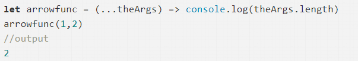

# JavaScript面试题型收集

## JavaScript基础

#### js异步任务

1. setTimeout和setInterval

2. DOM事件

3. Promise

4. process.nextTick

5. fs.readFile

6. http.get

7. 异步函数：如果在函数返回的时候，调用者还不能够得到预期结果，而是需要在将来通过一定的手段得到，那么这个函数就是异步的。

> 注：任务队列又分为macro-task（宏任务）与micro-task（微任务），在ES5标准中，它们被分别称为task与job。

* 宏任务

	I/O
	setTimeout
	setInterval
	setImmdiate
	requestAnimationFrame

* 微任务

	process.nextTick
	Promise
	Promise.then
	MutationObserver

* 宏任务和微任务的执行顺序

	一次事件循环中，先执行宏任务队列里的一个任务，再把微任务队列里的所有任务执行完毕，再去宏任务队列取下一个宏任务执行。

> 注：在当前的微任务没有执行完成时，是不会执行下一个宏任务的。

#### setTimeout的机制

* setTimeout()函数：通过设置某个函数指定多少毫秒后执行。返回一个整数，表示定时器timer的编号，可以用来取消该定时器。
	(setTimeout 和 setInterval)运行机制：将指定代码移除本次执行
		等到下一轮 Event Loop 时，再检查是否到了指定时间。如果到了，就执行对应的代码；如果不到，就等到再下一轮 Event Loop 时重新判断。
	这意味着，setTimeout指定的代码，必须等到本次执行的所有同步代码都执行完，才会执行。

* 示例1

```js
console.log(1);
setTimeout(function () {
	console.log(2);
}, 0);
console.log(3);
```

*分析*

	打印顺序：1 3 2
	setTimeout()函数是异步执行的，必须等同级同步代码执行完毕才执行

* 示例2

```js
console.log('A'); setTimeout(function () { console.log('B'); }, 0); while (1) {}
```

*分析*

	这段代码中存在死循环的同步代码，所以输出结果只有：A
	setTimeout中的代码不会被执行

> 注：建议先注释掉while循环代码块的代码，执行后强制删除进程，不然会造成“假死”。

> [假死参考](https://www.cnblogs.com/zhangweizhong/p/3854025.html)：当一段JS脚本长时间占用着cpu 时间时，就会挂起浏览器的GUI更新，而后面的事件响应也被排在队列中得不到处理，从而造成了浏览器被锁定进入假死状态。

#### `const`和`let`的区别，可以改变const定义对象某个属性吗

###### 相同点

1. 块级作用域

	都只有在所在的块级作用域生效
	块级作用域解决的问题：
		内层变量可能覆盖外层变量
		用来计数的循环变量泄露为全局变量

2. 不存在变量提升

	定义时是什么作用域就是什么作用域，不允许提前使用（在IDE中提前使用会编译错误）
	> 注：目的为了减少运行时错误，防止在变量声明前就使用这个变量，从而导致意料之外的行为。

3. let、const声明的全局变量不会挂在顶层对象下面
	
	浏览器环境顶层对象是: window
	node环境顶层对象是: global
	var声明的全局变量会挂在顶层对象下面，而let、const不会挂在顶层对象下面。

4. 不可重复声明

5. 暂时性死区

	只要一进入当前作用域，所要使用的变量就已经存在了，但是不可获取，只有等到声明变量的那一行代码出现，才可以获取和使用该变量
	> 注：目的是为了减少运行时错误，防止在变量声明前就使用这个变量，从而导致意料之外的行为。

###### const表示常量

1. 可以定义变量的值或对象的引用不可被修改

2. 因为const的值不可改变，所以必须声明时初始化

3. 可以改变const定义对象某个属性吗？是可以的

	如果const保存的是对象，只能保证这个对象不被整体修改，但是因为对象存的是引用（指针），只是保证了对象的指针不被修改，但值是可用被改变的

###### let表示变量

属于严格模式的var，存在严格的作用域，属于定义临时变量，出了作用域之后就会被销毁
可以修改值和类型，除了作用域，没有限制

###### var特色

1. 存在变量提升

	即可先使用后声明，这样导致变量提升，可能污染全局变量

2. 会挂在顶层对象下面

3. 可重复声明

4. 不存在死区，任何时候都可以使用，当然未初始化前是undefined

#### let命令的暂时性死区

	在块级作用域中，使用let之前便使用该变量会出现死区，即使在此块之前已经初始化过同名变量，但是一旦此作用域存在let声明，便会被锁定，不受外界影响
	所以在使用let声明变量之前使用该变量是会报错的，因为该变量是不可用的，属于暂时性死区（temporal dead zone，简称TDZ）

**这样会导致一些问题**

	任何对该变量的提前操作都是不被允许的

**目的**

	防止在变量声明前就使用这个变量，从而导致意料之外的行为。

#### 箭头函数，箭头函数的特点

**优点**

1. 简化代码
2. 使之this作用域与外部一致

**特点**

	依旧是更简化的代码语法
	不绑定this、arguments

**不绑定this**

	箭头函数不绑定this，就是直接使用所在同一域的作用域this

**不绑定arguments**

	在箭头函数中输出arguments.length，是is not defined，不存在

> 但是可以使用剩余参数来代替



**不能使用箭头函数的地方**

1. 不能作为对象的方法（最好不要，其实语法是允许的）

	在对象中使用箭头函数很容易出现与设想不一致的答案

2. 不能作为构造函数

	因为this作用域的问题，语法不允许

3. 定义原型方法

	如果原型方法使用箭头函数，会直接导致this作用域指向window全局对象

> 注：不要用箭头函数作为对象的方法，这样会导致箭头函数作用域是全局对象。[参考](https://segmentfault.com/a/1190000009410939)

#### js的this理解， 如何改变this的指向

* js的this是指向当前的作用域对象，也就是上下文对象

	可以使用this使用上下文的属性和方法

* 使用call和apply方法可以改变this指向

**示例**

```js
function fruits() {}
fruits.prototype = {
	color: "red",
	say: function() {
		console.log("My color is " + this.color);
	}
}
banana = {
	color: "yellow"
}
apple.say.call(banana);     //My color is yellow
apple.say.apply(banana);    //My color is yellow
```

**分析**

	可以看出 call 和 apply 是为了动态改变 this 而出现的，当一个 object 没有某个方法（本栗子中banana没有say方法），但是其他的有（本栗子中apple有say方法），我们可以借助call或apply用其它对象的方法来操作。

**区别**

	apply、call 二者而言，作用完全一样，只是接受参数的方式不太一样。

*示例*

```js
var func = function(arg1, arg2) {
};
func.call(this, arg1, arg2);
func.apply(this, [arg1, arg2])
```

*用法*

1. 数组push

```js
var array1 = [12 , "foo" , {name "Joe"} , -2458];
var array2 = ["Doe" , 555 , 100];
Array.prototype.push.apply(array1, array2);
/* array1 值为 [12 , “foo” , {name “Joe”} , -2458 , “Doe” , 555 , 100] */ 
```

2. maxNumber

```js
var  numbers = [5, 458 , 120 , -215 ];
var maxInNumbers = Math.max.apply(Math, numbers),   //458
maxInNumbers = Math.max.call(Math,5, 458 , 120 , -215); //458
```

> 注：number 本身没有 max 方法，但是 Math 有，我们就可以借助 call 或者 apply 使用其方法。

3. 验证是否是数组（前提是toString()方法没有被重写过） 

```js
function isArray(obj){
	return Object.prototype.toString.call(obj) === '[object Array]' ;
}
```

4. 类（伪）数组使用数组方法

```js
var domNodes = Array.prototype.slice.call(document.getElementsByTagName("*"));
```

> bind类似apply和call，可以改变函数内的this指向


## JavaScript高级


## JavaScript规范

#### ES6


